Lab 1. Tableau Introduction
===========================

This lab introduces the foundational principles of Tableau. We\'ll
go through a series of examples that will introduce you to the basics of
connecting to data, exploring and analyzing data visually, and finally
putting it all together in a fully interactive dashboard. These concepts
will be developed far more extensively in subsequent labs. However,
*don\'t skip this lab*, as it introduces key terminology
and concepts, including the following:

-   Connecting to data
-   Foundations for building visualizations
-   Creating bar charts
-   Creating line charts
-   Creating geographic visualizations
-   Using Show Me
-   Bringing everything together in a dashboard

### Install Tableau Desktop

Go to following URL and Download Tableau after filling the form:
`https://www.tableau.com/products/desktop/download`

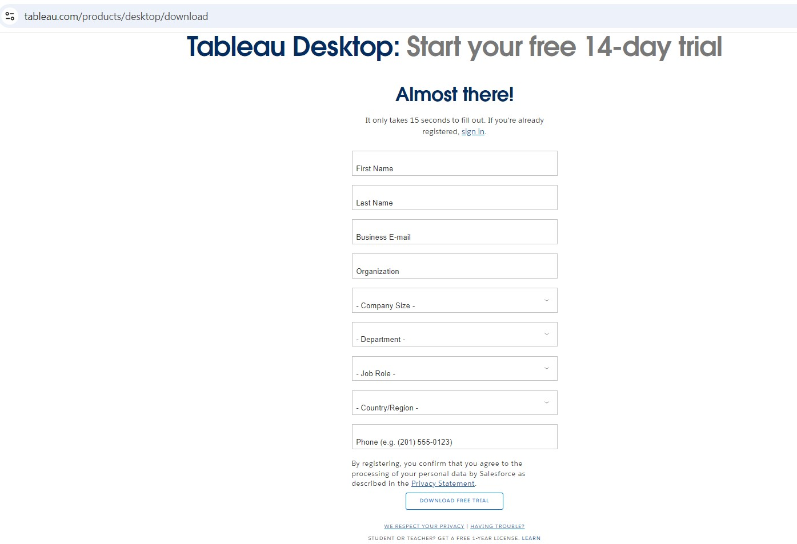

Let\'s begin by looking at how you can connect Tableau to your data.

**Connecting to data**

In this lab, we\'ll connect to a text file derived from one of the
sample datasets that ships with Tableau:
`Superstore.csv`. **Superstore** is a fictional
retail chain that sells various products to
customers across the United States and the file contains a record for
every line item of every order with details on the customer, location,
item, sales amount, and revenue.

**Note:**

Please use the supplied `Superstore.csv` data
file instead of the Tableau sample data, as there are differences that
will change the results.

The `Chapter 1` workbooks, included with the code
files bundle, already have connections to the file; however, for this
example, we\'ll walk through the steps of creating a connection in a new
workbook:

1.  Open Tableau. You should see the home screen with a list of
    connection options on the left and, if applicable, thumbnail
    previews of recently edited workbooks in the center, along with
    sample workbooks at the bottom.
2.  Under **Connect** and **To a File**, click on **Text File**.
3.  In the **Open** dialog box, navigate to the
    `tableau-fundamentals\Lab 01` directory and
    select the `Superstore.csv` file.

You will now see the data connection screen, which allows you to
visually create connections to data sources. We\'ll examine the features
of this screen in detail in the *Connecting to data* section of *Lab
2*, *Connecting to Data in Tableau*. For now, Tableau has already added
and given a preview of the file for the connection:

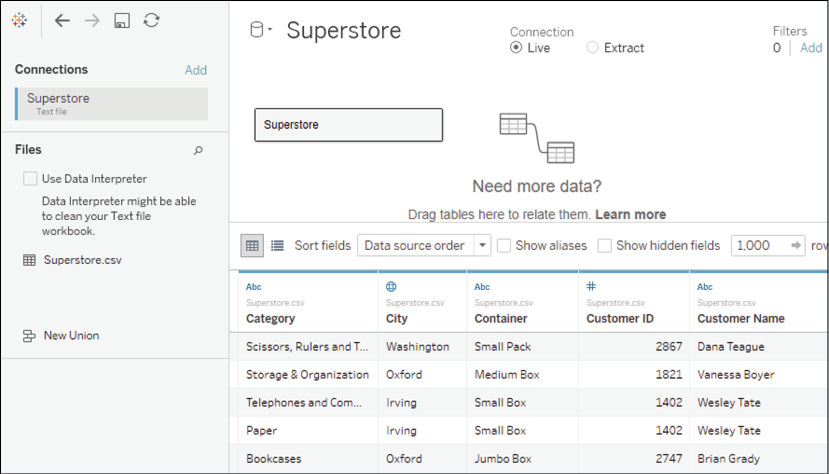

Figure 1.1: The data connection screen allows you to build a connection
to your data

For this connection, no other configuration is
required, so simply click on the **Sheet 1** tab at the bottom to start
visualizing the data! You should now see the main work area within
Tableau, which looks like this:

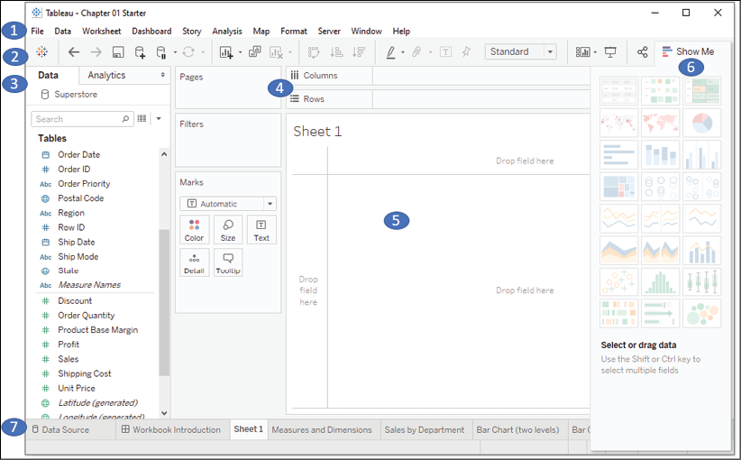

Figure 1.2: Elements of Tableau\'s primary interface, numbered with
descriptions below

We\'ll refer to elements of the interface
throughout the course using specific terminology, so take a moment to
familiarize yourself with the terms used for various components numbered
in the preceding screenshot:

1.  The **menu** contains various menu items for performing a wide range
    of functions.
2.  The **toolbar** allows common functions such as undo, redo, save,
    add a data source, and so on.
3.  The **Data** pane is active when the **Data** tab is selected and
    lists all tables and fields of the selected data source. The
    **Analytics** pane is active when the **Analytics** tab is selected
    and gives options for supplementing visualizations with visual
    analytics.
4.  Various shelves such as **Pages**, **Columns**, **Rows**, and
    **Filters** serve as areas to drag and drop fields from the data
    pane. The **Marks** card contains additional shelves such as
    **Color**, **Size**, **Text**, **Detail**, and **Tooltip**. Tableau
    will visualize data based on the fields you drop onto the shelves.
    **Note:**

    Data fields in the **Data** pane are available to add to a view.
    Fields that have been dropped onto a shelf are called *in the view*
    or *active fields* because they play an active
    role in the way Tableau draws the visualization.
    
5.  The **canvas** or **view** is where Tableau 
    will draw the data visualization. In addition
    to dropping fields on shelves, you may also
    drop fields directly on to the view. A **title** is
    located at the top of the canvas. By default,
    the title displays the name of the sheet, but it can be edited or
    hidden.
6.  **Show Me** is a feature that allows you to quickly iterate through
    various types of visualizations based on data fields of interest.
    We\'ll look at **Show Me** toward the end of the lab.
7.  The tabs at the bottom of the window give you options for editing
    the data source, as well as navigating between and adding any number
    of sheets, dashboards, or stories. Often, any tab (whether it is a
    sheet, a dashboard, or a story) is referred to 
    generically as a **sheet**.

**Tip:**

A Tableau workbook is a collection of data
sources, sheets, dashboards, and stories. All of this is saved as a
single Tableau workbook file (`.twb` or
`.twbx`). A workbook is organized into a
collection of tabs of various types:

-   A sheet is a single data visualization, such as a bar chart or a
    line graph. Since sheet is also a generic term for any tab, we\'ll
    often refer to a sheet as a **view** because it is a single view of
    the data.
-   A **dashboard** is a presentation of any
    number of related views and other elements (such as text or images)
    arranged together as a cohesive whole to communicate a message to an
    audience. Dashboards are often designed to be interactive.
-   A **story** is a collection of dashboards or
    single views that have been arranged to communicate a narrative from
    the data. Stories may also be interactive.

Along the bottom of the screen, you\'ll notice a few other items. As you
work, a **status bar** at the bottom left will
display important information and details about
the view, selections, and the user. Various controls at the bottom right
allow you to navigate between sheets, dashboards, and stories, as well
as to view the tabs with **Show Filmstrip** or switch to a sheet sorter
showing an interactive thumbnail of all sheets in the workbook.

Now that you have connected to the data in the
text file, we\'ll explore some examples that lay the foundation for data
visualization and then move on to building some foundational
visualization types. To prepare for this, please do the following:

1.  From the menu, select **File** \| **Exit**.
2.  When prompted to save changes, select **No**.
3.  From the `tableau-fundamentals\Lab 01`
    directory, open the file
    `Chapter 01 Starter.twbx.` This file contains
    a connection to the `Superstore` data file
    and is designed to help you walk through the examples in this
    lab.

**Note:**

The files for each lab include a `Starter`
workbook that allows you to work through the examples given in this
book. If, at any time, you\'d like to see the completed examples, open
the `Complete` workbook for the lab.

Having made a connection to the data, you are ready to start visualizing
and analyzing it. As you begin to do so, you will take on the role of an
analyst at the retail chain. You\'ll ask questions of the data, build
visualizations to answer those questions, and ultimately design a
dashboard to share the results. Let\'s start by laying some foundations
for understanding how Tableau visualizes data.

Foundations for building visualizations

When you first connect to a data source such as
the `Superstore` file, Tableau will display the
data connection and the fields in the **Data** pane. Fields can be
dragged from the data pane onto the canvas area or onto various shelves
such as **Rows**, **Columns**, **Color**, or **Size**. As we\'ll see,
the placement of the fields will result in different encodings of the
data based on the type of field.

Measures and dimensions 
-----------------------

The fields from the data source are visible in the **Data** pane and
are divided into
**Measures** and **Dimensions**. In older versions
of Tableau, these are separate sections in the **Data** pane. In newer
versions, each table will have **Measures** and **Dimensions** separated
by a line:

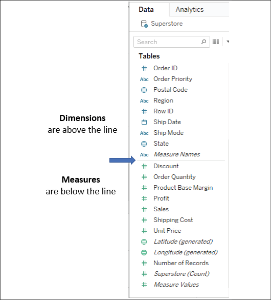

Figure 1.3: Each table (this data source only has one) has dimensions
listed above the line and measures listed below the line

The difference between **Measures** and **Dimensions** is a fundamental
concept to understand when using Tableau:

-   **Measures** are values that are aggregated. For example, they are
    summed, averaged, counted, or the result is
    the minimum or maximum value.
-   **Dimensions** are values that determine the
    level of detail at which measures are aggregated. You can think of
    them as slicing the measures or creating groups into which the
    measures fit. The combination of dimensions used in the view defines
    the view\'s basic level of detail.

As an example (which you can view in the
`Chapter 01 Starter` workbook on the **Measures
and Dimensions** sheet), consider a view created using the
`Region` and `Sales`
fields from the `Superstore` connection:

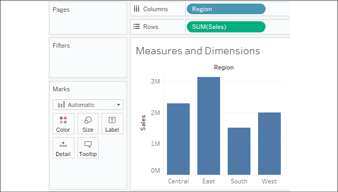

Figure 1.4: A bar chart demonstrating the use of Measures and Dimensions

The `Sales` field is used as a
measure in this view. Specifically, it is
being aggregated as a sum. When you use a field as
a measure in the view, the type aggregation (for example,
`SUM`, `MIN`,
`MAX`, and `AVG`) will be
shown on the active field. Note that, in the preceding example, the
active field on **Rows** clearly indicates the sum aggregation
of `Sales`: `SUM(Sales)`.

The `Region` field is a dimension with one of
four values for each record of data: **Central**, **East**, **South**,
or **West**. When the field is used as a dimension
in the view, it slices the measure. So, instead of
an overall sum of sales, the preceding view shows
the sum of sales for each region.

Discrete and continuous fields 
------------------------------

Another important distinction to make with fields is whether a field is
being used as **discrete** or **continuous.** Whether a field
is discrete or continuous determines how Tableau
visualizes it based on where it is used in the view*.* Tableau will give
a visual indication of the default value for a
field (the color of the icon in the **Data** pane) and how it is being
used in the view (the color of the active field on a shelf). Discrete
fields, such as `Region` in the previous example,
are blue. Continuous fields, such as `Sales`, are
green.

### Discrete fields 

Discrete (blue) fields have values that are shown
as distinct and separate from one another.
Discrete values can be reordered and still make sense. For example, you
could easily rearrange the values of `Region` to
be `East`, `South`,
`West`, and `Central`,
instead of the default order in *Figure 1.4*.

When a discrete field is used on the **Rows** or **Columns** shelves,
the field defines headers. Here, the discrete field
`Region` defines the column headers:

Figure 1.5: The discrete field on Columns defines column headers

Here, it defines the row headers:

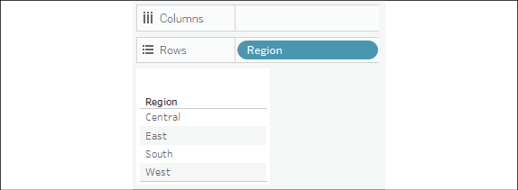

Figure 1.6: The discrete field on Rows defines row headers

When used for **Color**, a discrete field defines
a discrete color palette in which each color aligns with a distinct
value of the field:

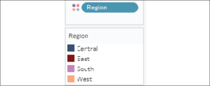

Figure 1.7: The discrete field on Color defines a discrete color palette

### Continuous fields 

Continuous (green) fields have values that flow
from first to last as a continuum. Numeric and date fields are often
(though, not always) used as continuous fields in 
the view. The values of these fields have an order that it would make
little sense to change.

When used on **Rows** or **Columns**, a continuous field defines an
axis:

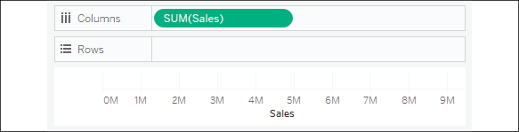

Figure 1.8: The continuous field on Columns (or Rows) defines an axis

When used for **color**, a continuous field defines a gradient:

Figure 1.9: The continuous field on Color defines a gradient color
palette

It is very important to note that continuous and discrete are different
concepts from measure and dimension. While most dimensions are discrete
by default, and most measures are continuous by default, it is possible
to use any measure as a discrete field and some dimensions as continuous
fields in the view, as shown here:

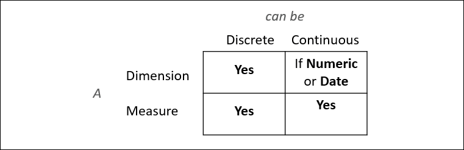

Figure 1.10: Measures and Dimensions can be discrete or continuous

**Note:**

To change the default of a field, right-click on the field in the
**Data** pane and select **Convert to Discrete** or **Convert to
Continuous**.

To change how a field is used in the view, right-click on the field in
the view and select **Discrete** or **Continuous**. Alternatively, you
can drag and drop the fields between **Dimensions** and **Measures** in
the **Data** pane.

In general, you can think of the differences between the types of fields
as follows:

-   Choosing between a dimension and measure tells Tableau *how to slice
    or aggregate* the data.
-   Choosing between discrete and continuous tells Tableau *how to
    display* the data with a header or an axis and defines individual
    colors or a gradient.

As you work through the examples in this book, pay attention to the
fields you are using to create the visualizations, whether they are
dimensions or measures, and whether they are discrete or continuous.
Experiment with changing fields in the
view from continuous to discrete, and vice versa,
to gain an understanding of the differences in the visualization. We\'ll
put this understanding into practice as we turn our attention to
visualizing data.

Visualizing data

A new connection to a data source is an invitation to explore and
discover! At times, you may come to the data with very well-defined
questions and a strong sense of what you expect to find. Other times,
you will come to the data with general questions and very little idea of
what you will find. The visual analytics
capabilities of Tableau empower you to rapidly and iteratively explore
the data, ask new questions, and make new discoveries.

The following visualization examples cover a few of the most
foundational visualization types. As you work through the examples, keep
in mind that the goal is not simply to learn how to create a specific
chart. Rather, the examples are designed to help you think through the
process of asking questions of the data and getting answers through
iterations of visualization. Tableau is designed to make that process
intuitive, rapid, and transparent.

**Note:**

Something that is far more important than memorizing the steps to create
a specific chart type is understanding how and why to use Tableau to
create a chart and being able to adjust your visualization to gain new
insights as you ask new questions.

Bar charts 
----------

**Bar charts** visually represent data in a way
that makes the comparison of values across different categories easy.
The length of the bar is the primary means by
which you will visually understand the data. You may also incorporate
color, size, stacking, and order to communicate additional attributes
and values.

Creating bar charts in Tableau is very easy. Simply drag and drop the
measure you want to see on to either the **Rows** or **Columns** shelf
and the dimension that defines the categories on to the opposing
**Rows** or **Columns** shelf.

As an analyst for **Superstore**, you are ready to begin a discovery
process focused on sales (especially the dollar value of sales). As you
follow the examples, work your way through the sheets in the
`Chapter 01 Starter` workbook. The
`Chapter 01 Complete` workbook contains the
complete examples so that you can compare your results at any time:

1.  Click on the **Sales by Department** tab to view that sheet.

2.  Drag and drop the `Sales` field from
    **Measures** in the **Data** pane on to the **Columns** shelf. You
    now have a bar chart with a single bar representing the sum of sales
    for all of the data in the data source.

3.  Drag and drop the `Department` field from
    **Dimensions** in the **Data** pane to the **Rows** shelf. This
    slices the data to give you three bars, each having a length that
    corresponds to the sum of sales for each department:

    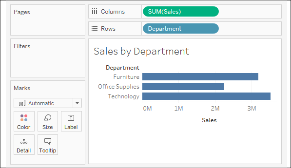

    Figure 1.11: The view Sales by Department should look like this when
    you have completed the preceding steps

You now have a horizontal bar chart. This makes
comparing the sales between the departments easy. The **type** drop-down
menu on the **Marks** card is set to **Automatic** and indicates that
Tableau has determined that bars are the best visualization given the
fields you have placed in the view. As a dimension,
`Department` slices the data. Being discrete, it
defines row headers for each department in the data. As a measure, the
`Sales` field is aggregated. Being continuous, it
defines an axis. The mark type of bar causes individual bars for each
department to be drawn from `0` to the value of
the sum of sales for that department.

**Note:**

Typically, Tableau draws a mark (such as a bar, a circle, or a square)
for every combination of dimensional values in the view. In this simple
case, Tableau is drawing a single bar mark for each dimensional value
(`Furniture`,
`Office Supplies`, and
`Technology`) of
`Department`. The type of mark is indicated and
can be changed in the drop-down menu on the **Marks** card. The number
of marks drawn in the view can be observed on the lower-left status bar.

Tableau draws different marks in different ways; for example, bars are
drawn from 0 (or the end of the previous bar, if stacked) along the
axis. Circles and other shapes are drawn at locations defined by the
value(s) of the field that is defining the axis. Take a moment to
experiment with selecting different mark types
from the drop-down menu on the **Marks** card. A solid grasp of how
Tableau draws different mark types will help you to master the tool.

### Iterations of bar charts for deeper analysis 

Using the preceding bar chart, you can easily see that the
**Technology** department has more total sales than either the
**Furniture** or **Office Supplies** departments. What if you want to
further understand sales amounts for departments
across various regions? Follow these two steps:

1.  Navigate to the **Bar Chart (two levels)** sheet, where you will
    find an initial view that is identical to the one you created
    earlier.
2.  Drag the `Region` field from **Dimensions**
    in the **Data** pane to the **Rows** shelf and drop it to the left
    of the `Department` field already in view.

You should now have a view that looks like this:

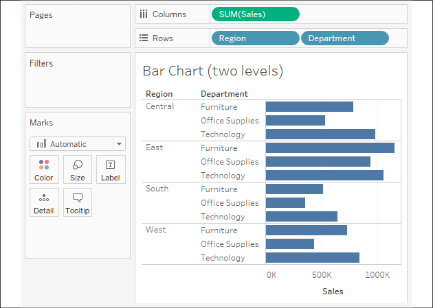

Figure 1.12: The view Bar Chart (two levels) should look like this when
you have completed the preceding steps

You still have a horizontal bar chart, but now you\'ve introduced
`Region` as another dimension that changes the
level of detail in the view and further slices the aggregate of the sum
of sales. By placing `Region` before
`Department`, you can easily compare the sales of
each department within a given region.

Now you are starting to make some discoveries. For example, the
**Technology** department has the most sales in every region, except in
the **East**, where **Furniture** had higher sales. **Office Supplies**
never has the highest sales in any region.

Consider an alternate view, using the same fields arranged
differently:

1.  Navigate to the **Bar Chart (stacked)** sheet, where you will find a
    view that is identical to the original bar chart.

2.  Drag the `Region` field from the **Rows**
    shelf and drop it on to the **Color** shelf:

    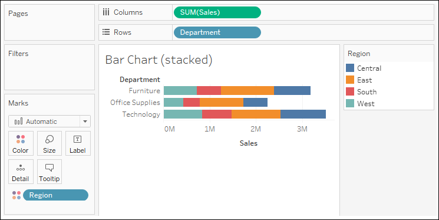

    Figure 1.13: The view Bar Chart (stacked) should look like this

Instead of a **side-by-side bar chart**, you now have a **stacked bar
chart**. Each segment of the bar is color-coded by the
`Region` field. Additionally, a color legend has
been added to the workspace. You haven\'t changed
the level of detail in the view, so sales are
still summed for every combination of `Region`
and `Department`:

**Note:**

The **view level of detail** is a key concept when 
working with Tableau. In most basic visualizations, the combination of
values of all dimensions in the view defines the lowest level of detail
for that view. All measures will be aggregated or sliced by the lowest
level of detail. In the case of most simple views, the number of marks
(indicated in the lower-left status bar) corresponds to the number of
unique combinations of dimensional values. That is, there will be one
mark for each combination of dimension values.

-   If `Department` is the only field used as a
    dimension, you will have a view at the department level of detail,
    and all measures in the view will be aggregated per department.
-   If `Region` is the only field used as a
    dimension, you will have a view at the region level of detail, and
    all measures in the view will be aggregated per region.
-   If you use both `Department` and
    `Region` as dimensions in the view, you will
    have a view at the level of department and region. All measures will
    be aggregated per unique combination of department and region, and
    there will be one mark for each combination of department and
    region.

Stacked bars can be useful when you want to understand part-to-whole
relationships. It is now easier to see what portion of the total sales
of each department is made in each region. However, it is very difficult
to compare sales for most of the regions across departments. For
example, can you easily tell which department had the highest sales in
the **East** region? It is difficult because, with the exception of the
**West** region, every segment of the bar has a different starting
place.

Now take some time to experiment with the bar
chart to see what variations you can create:

1.  Navigate to the **Bar Chart (experimentation)** sheet.

2.  Try dragging the `Region` field from
    **Color** to the other various shelves on the **Marks** card, such
    as **Size**, **Label**, and **Detail**. Observe that in each case
    the bars remain stacked but are redrawn based on the visual encoding
    defined by the `Region` field.

3.  Use the **Swap** button on the toolbar to swap fields on **Rows**
    and **Columns**. This allows you to very easily change from a
    horizontal bar chart to a vertical bar chart (and vice versa):

    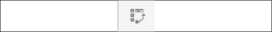

    Figure 1.14: Swap Rows and Columns button

4.  Drag and drop `Sales` from the **Measures**
    section of the **Data** pane on top of the
    `Region` field on the **Marks** card to
    replace it. Drag the `Sales` field to
    **Color** if necessary, and notice how the color legend is a
    gradient for the continuous field.

5.  Experiment further by dragging and dropping other fields on to
    various shelves. Note the behavior of Tableau for each action you
    take.

6.  From the **File** menu, select **Save**.

**Note:**

If your OS, machine, or Tableau stops unexpectedly, then the
**Autosave** feature should protect your work. The next time you open
Tableau, you will be prompted to recover any previously open workbooks
that had not been manually saved. You should still develop a habit of
saving your work early and often, though, and maintaining appropriate
backups.

As you continue to explore various iterations, you\'ll gain confidence
with the flexibility available to visualize your data.

Line charts 
-----------

**Line charts** connect related marks in a visualization to show
movement or a relationship between those connected marks. The
position of the marks and the lines that connect
them are the primary means of communicating the data. Additionally, you
can use size and color to communicate additional
information.

The most common kind of line chart is a **time series**. A time series
shows the movement of values
over time. Creating one in Tableau requires only a date and a measure.

Continue your analysis of Superstore sales using the
`Chapter 01 Starter` workbook you just saved:

1.  Navigate to the **Sales over time** sheet.

2.  Drag the `Sales` field from **Measures** to
    **Rows**. This gives you a single, vertical bar representing the sum
    of all sales in the data source.

3.  To turn this into a time series, you must introduce a date. Drag the
    `Order Date` field from **Dimensions** in the
    **Data** pane on the left and drop it into **Columns**. Tableau has
    a built-in date hierarchy, and the default level of
    `Year` has given you a line chart connecting
    four years. Notice that you can clearly see an increase in sales
    year after year:

    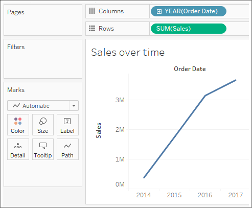

    Figure 1.15: An interim step in creating the final line chart; this
    shows the sum of sales by year

4.  Use the drop-down menu on the
    `YEAR(Order Date)` field on **Columns** (or
    right-click on the field) and switch the date field to use
    **Quarter**. You may notice that **Quarter**
    is listed twice in the drop-down menu. We\'ll explore the various
    options for date parts, values, and hierarchies in the *Visualizing
    Dates and Times* section of *Lab 3*, *Moving Beyond Basic
    Visualizations*. For now, select the second option:

    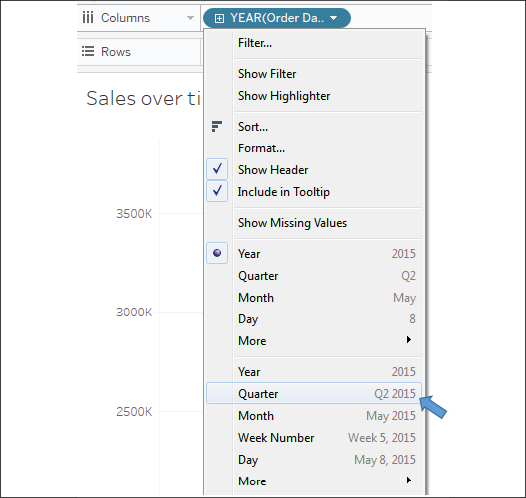

    Figure 1.16: Select the second Quarter option in the drop-down menu.

Notice that the cyclical pattern is
quite evident when looking at sales by quarter:

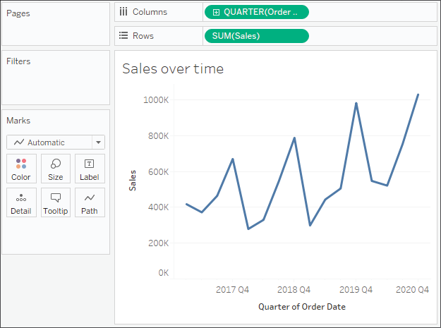

Figure 1.17: Your final view shows sales over each quarter for the last
several years.

Let\'s consider some variations of line charts
that allow you to ask and answer even deeper
questions.

### Iterations of line charts for deeper analysis 

Right now, you are looking at the overall sales
over time. Let\'s do some analysis at a slightly deeper level:

1.  Navigate to the **Sales over time (overlapping lines)** sheet, where
    you will find a view that is identical to the one you just created.

2.  Drag the `Region` field from **Dimensions**
    to **Color**. Now you have a line per region, with each line a
    different color, and a legend indicating which color is used for
    which region. As with the bars, adding a dimension to **color**
    splits the marks. However, unlike the bars, where the segments were
    stacked, the lines are not stacked. Instead, the lines are drawn at
    the exact value for the sum of sales for each region and quarter.
    This allows easy and accurate comparison. It is interesting to note
    that the cyclical pattern can be observed for each region:

    

    Figure 1.18: This line chart shows sum of sales by quarter with
    different colored lines for each region

With only four regions, it\'s relatively easy to
keep the lines separate. But what about dimensions
that have even more distinct values? Let\'s consider that case in the
following example:

1.  Navigate to the **Sales over time (multiple rows)** sheet, where you
    will find a view that is identical to the one
    you just created.

2.  Drag the `Category` field from **Dimensions**
    and drop it directly on top of the `Region`
    field currently on the **Marks** card. This replaces the
    `Region` field with
    `Category`. You now have 17 overlapping
    lines. Often, you\'ll want to avoid more than two or three
    overlapping lines. But you might also consider using color or size
    to showcase an important line in the context
    of the others. Also, note that clicking on an item in the **Color**
    legend will highlight the associated line in the view. Highlighting
    is an effective way to pick out a single item and compare it to all
    the others.

3.  Drag the `Category` field from **Color** on
    the **Marks** card and drop it into **Rows**. You now have a line
    chart for each category. Now you have a way of comparing each
    product over time without an overwhelming overlap, and you can still
    compare trends and patterns over time. This is the start of a
    spark-lines visualization that will be developed more fully in
    *Lab 10*, *Advanced Visualizations*:

    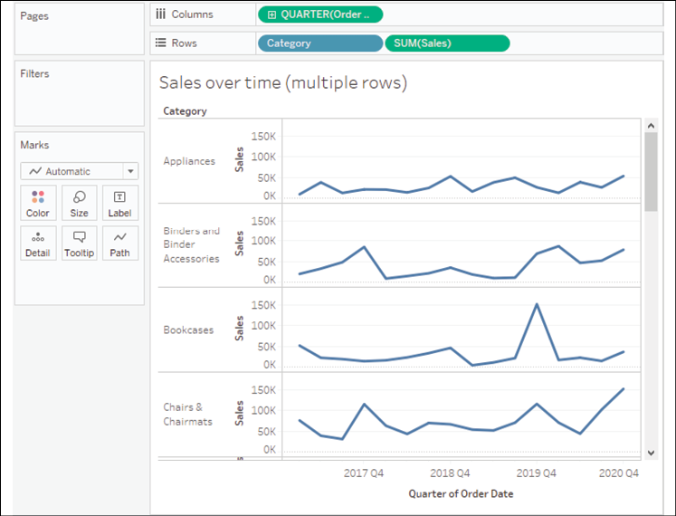

    Figure 1.19: Your final view should be a series of line charts for
    each Category

    The variations in lines for each `Category`
    allow you to notice variations in the trends,
    extremes, and the rate of change.

Geographic visualizations 
-------------------------

In Tableau, the built-in geographic database
recognizes geographic roles for fields such as
`Country`, `State`,
`City`, `Airport`,
`Congressional District`, or
`Zip Code`. Even if your data does not contain
latitude and longitude values, you can simply use geographic fields to
plot locations on a map. If your data does contain latitude and
longitude fields, you may use those instead of the generated values.

**Tip:**

Tableau will automatically assign geographic roles to some fields based
on a field name and a sampling of values in the data. You can assign or
reassign geographic roles to any field by right-clicking on the field in
the **Data** pane and using the **Geographic Role** option. This is also
a good way to see what built-in geographic roles are available.

Geographic visualization is incredibly valuable 
when you need to understand where things happen and whether there are
any spatial relationships within the data. Tableau offers
several types of geographic visualization:

-   Filled maps
-   Symbol maps
-   Density maps

Additionally, Tableau can read spatial files and geometries from some
databases and render spatial objects, polygons, and more. We\'ll take a
look at these and other geospatial capabilities in *Lab 12*,
*Exploring Mapping and Advanced Geospatial Features.* For now, we\'ll
consider some foundational principles for geographic visualization.

### Filled maps 

Filled maps fill areas such as countries, states,
or ZIP codes to show a location. The color that fills the area can be
used to communicate measures such as average sales
or population as well as dimensions such as region. These maps are also
called **choropleth maps**.

Let\'s say you want to understand sales for Superstore and see whether
there are any patterns geographically.

**Note:**

Note: If your regional settings are not US, you may need to use the
**Edit Locations** option to set the country to the **United States**.

You might take an approach like the following:

1.  Navigate to the **Sales by State** sheet.

2.  Double-click on the `State` field in the
    **Data** pane. Tableau automatically creates a geographic
    visualization using the
    `Latitude (generated)`,
    `Longitude (generated)`, and
    `State` fields.

3.  Drag the `Sales` field from the **Data** pane
    and drop it on the **Color** shelf on the **Marks** card. Based on
    the fields and shelves you\'ve used, Tableau has switched the
    automatic mark type to **Map**:

    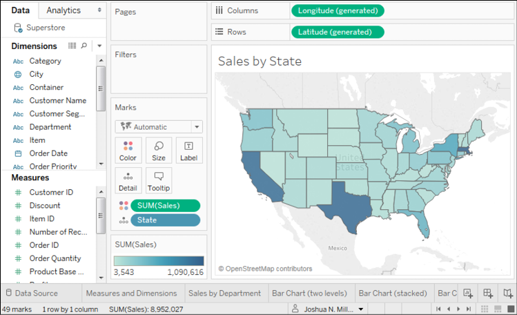

    Figure 1.20: A filled map showing the sum of sales per state

The filled map fills each state with a single 
color to indicate the relative sum of sales for
that state. The color legend, now visible in the view, gives the range
of values and indicates that the state with the least sales had a total
of **3,543** and the state with the most sales had a total of
**1,090,616**.

When you look at the number of marks displayed in the bottom status bar,
you\'ll see that it is **49**. Careful examination reveals that the
marks consist of the lower 48 states and Washington DC; Hawaii and
Alaska are not shown. Tableau will only draw a geographic mark, such as
a filled state, if it exists in the data and is not excluded by
a filter.

### Symbol maps 

With symbol maps, marks on the map are not drawn
as filled regions; rather, marks are shapes or symbols placed at
specific geographic locations. The size, color,
and shape may also be used to encode additional
dimensions and measures.

Continue your analysis of Superstore sales by following these steps:

1.  Navigate to the **Sales by Postal Code** sheet.
2.  Double-click on `Postal Code` under
    **Dimensions**. Tableau automatically adds
    `Postal Code` to the **Detail** of the
    **Marks** card and `Longitude (generated)`
    and `Latitude (generated)` to **Columns** and
    **Rows**. The mark type is set to a circle by default, and a single
    circle is drawn for each postal code at the correct latitude and
    longitude.
3.  Drag `Sales` from **Measures** to the
    **Size** shelf on the **Marks** card. This causes each circle to be
    sized according to the sum of sales for that postal code.
4.  Drag `Profit` from **Measures** to the
    **Color** shelf on the **Marks** card. This encodes the mark color
    to correspond to the sum of profit. You can now see the geographic
    location of profit and sales at the same time. This is useful
    because you will see some locations with high sales and low profit,
    which may require some action.

The final view should look like this, after making some fine-tuned
adjustments to the size and color:

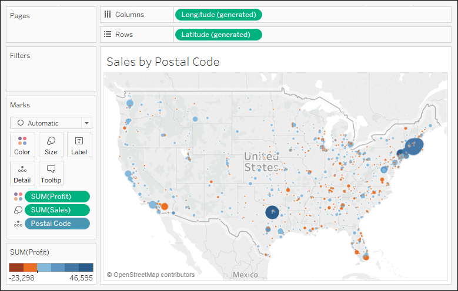

Figure 1.21: A symbol map showing the sum of profit (encoded with color)
and the sum of sales (encoded with size) per Postal Code

Sometimes, you\'ll want to adjust the marks on a
symbol map to make them more visible. Some options include the
following:

-   If the marks are overlapping, click on the **Color** shelf and set
    the transparency to somewhere between **50%** and **75%**.
    Additionally, add a dark border. This makes the marks stand out, and
    you can often better discern any overlapping marks.
-   If marks are too small, click on the **Size** shelf and adjust the
    slider. You may also double-click on the **size** legend and edit
    the details of how Tableau assigns size.
-   If the marks are too faint, double-click on the **Color** legend and
    edit the details of how Tableau assigns color. This is especially
    useful when you are using a continuous field that
    defines a color gradient.

A combination of tweaking the size and using **Stepped Color** and **Use
Full Color Range**, as shown here, produced the 
result for this example:

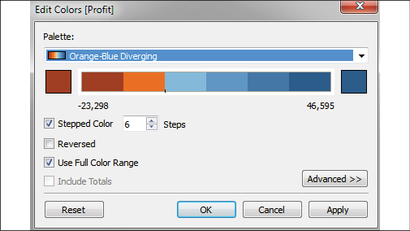

Figure 1.22: The Edit Colors dialog includes options for changing the
number of steps, reversing, using the full color range, including
totals, and advanced options for adjusting the range and center point

Unlike filled maps, symbol maps allow you to use size to visually encode
aspects of the data. Symbol maps also allow greater precision. In fact,
if you have latitude and longitude in your data, you can very precisely
plot marks at a street address-level of detail. This type of
visualization also allows you to map locations that do not have clearly
defined boundaries.

Sometimes, when you manually select **Map** in the **Marks** card
drop-down menu, you will get an error message indicating that filled
maps are not supported at the level of detail in the view. In those
cases, Tableau is rendering a geographic location that does not have
built-in shapes.

### Density maps 

Density maps show the spread and concentration of
values within a geographic area. Instead of
individual points or symbols, the marks blend together, showing greater
intensity in areas with a high concentration. You can control the
**Color**, **Size**, and **Intensity**.

Let\'s say you want to understand the geographic concentration of
orders. You might create a density map using the following steps:

1.  Navigate to the **Density of Orders** sheet.

2.  Double-click on the `Postal Code` field in
    the **Data** pane. Just as before, Tableau automatically creates a
    symbol map geographic visualization using the
    `Latitude (generated)`,
    `Longitude (generated)`, and
    `State` fields.

3.  Using the drop-down menu on the **Marks** card, change the mark type
    to **Density**. The individual circles now blend together showing
    concentrations:

    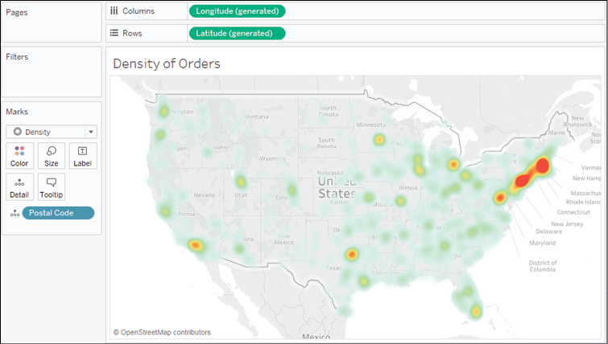

    Figure 1.23: A density map showing concentration by Postal Code

Try experimenting with the **Color** and **Size** options. Clicking on
**Color**, for example, reveals some options specific to the **Density**
mark type:

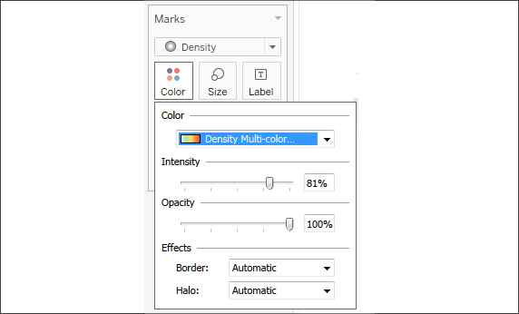

Figure 1.24: Options for adjusting the Color, Intensity, Opacity, and
Effects for Density marks

Several color palettes are available that work
well for density marks (the default ones work well with light color
backgrounds, but there are others designed to work with dark color
backgrounds). The **Intensity** slider allows you to determine how
intensely the marks should be drawn based on concentrations. The
**Opacity** slider lets you decide how transparent the marks should be.

Using Show Me 
-------------

**Show Me** is a powerful component of Tableau
that arranges selected and active fields into the
places required for the selected visualization type. The **Show Me**
toolbar displays small thumbnail images of different types of
visualizations, allowing you to create visualizations with a single
click. Based on the fields you select in the **Data** pane and the
fields that are already in view, **Show Me** will enable possible
visualizations and highlight a recommended visualization.

Explore the features of **Show Me** by following 
these steps:

1.  Navigate to the **Show Me** sheet.

2.  If the **Show Me** pane is not expanded, click on the **Show Me**
    button in the upper right of the toolbar to expand the pane.

3.  Press and hold the *Ctrl* key while clicking on the
    `Postal Code`,
    `State`, and `Profit`
    fields in the **Data** pane to select each of those fields. With
    those fields highlighted, **Show Me** should look like this:

    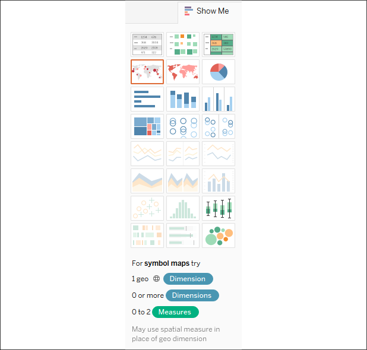

    Figure 1.25: The Show Me interface

Notice that the **Show Me** window has enabled
certain visualization types such as **text tables**, **heat maps**,
**symbol maps**, **filled maps**, and **bar charts**. These are the
visualizations that are possible given the fields already in the view,
in addition to any selected in the **Data** pane. Show Me highlights the
recommended visualization for the selected fields and gives a
description of what fields are required as you hover over each
visualization type. Symbol maps, for example, require one geographic
dimension and 0 to 2 measures.

Other visualizations are grayed out, such as **lines**, **area charts**,
and **histograms**. Show Me will not create these visualization types
with the fields that are currently in the view and are selected in the
**Data** pane. Hover over the grayed out line charts option in Show Me.
It indicates that line charts require one or more
measures (which you have selected) but also require a date field (which
you have not selected).

**Tip:**

Tableau will draw line charts with fields other than dates. Show Me
gives you options for what is typically considered good practice for
visualizations. However, there may be times when you know that a line
chart would represent your data better. Understanding how Tableau
renders visualizations based on fields and shelves instead of always
relying on Show Me will give you much greater flexibility in your
visualizations and will allow you to rearrange things when Show Me
doesn\'t give you the exact results you want. At the same time, you will
need to cultivate an awareness of good visualization practices.

Experiment with Show Me by clicking on various
visualization types, looking for insights into the data that may be more
or less obvious based on the visualization type. **Circle views** and
**box-and-whisker plots** show the distribution of postal codes for each
state. Bar charts easily expose several postal codes with negative
profit.

Now that you have become familiar with creating individual views of the
data, let\'s turn our attention to putting it all together in a dashboard.

The dashboard interface 
-----------------------

When you create a new dashboard, the interface 
will be slightly different than it is when designing a single view.
We\'ll start designing your first dashboard after a brief look at the
interface. You might navigate to the **Superstore Sales** sheet and take
a quick look at it yourself.

The dashboard window consists of several key components. Techniques for
using these objects will be detailed in *Lab 8*, *Telling a Data
Story with Dashboards.* For now, focus on gaining some familiarity with
the options that are available. One thing you\'ll notice is that the
left sidebar has been replaced with dashboard-specific content:

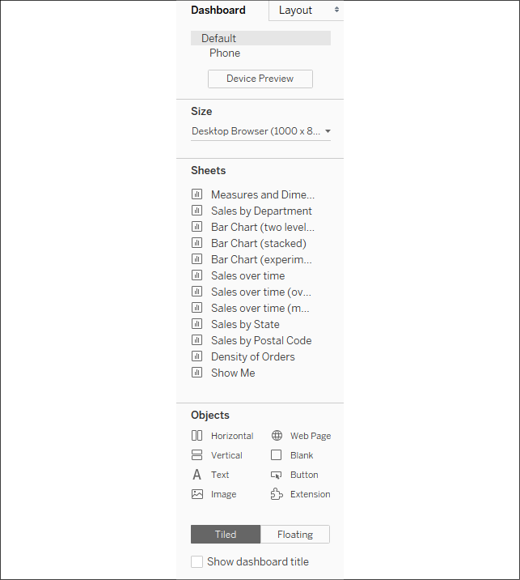

Figure 1.26: The sidebar for dashboards

The left sidebar contains two tabs:

-   A **Dashboard** tab, for sizing options and adding sheets and
    objects to the dashboard.
-   A **Layout** tab, for adjusting the layout of various objects on the
    dashboard.

The **Dashboard** pane contains options for previewing based on the
target device along with several sections:

-   A **Size** section, for dashboard sizing options.
-   A **Sheets** section, containing all sheets (views) available to
    place on the dashboard.
-   An **Objects** section with additional objects that can be added to
    the dashboard.

You can add sheets and objects to a dashboard by
dragging and dropping. As you drag the view, a light-gray shading will
indicate the location of the sheet in the dashboard once it is dropped.
You can also double-click on any sheet and it will be added
automatically.

In addition to adding sheets, the following objects may be added to the
dashboard:

-   **Horizontal** and **Vertical** layout containers will give you
    finer control over the layout.
-   **Text** allows you to add text labels and titles.
-   An **Image** and even embedded **Web Page** content can be added.
-   A **Blank** object allows you to preserve blank space in a
    dashboard, or it can serve as a placeholder until additional content
    is designed.
-   A **Navigation** object allows the user to navigate between
    dashboards.
-   An **Export** button allows end users to export the dashboard as a
    PowerPoint, PDF, or image.
-   An **Extension** gives you the ability to add controls and objects
    that you or a third party have developed for interacting with the
    dashboard and providing extended functionality.

Using the toggle, you can select whether new objects will be added as
**Tiled** or **Floating**. **Tiled** objects will snap into a tiled
layout next to other tiled objects or within layout containers.
**Floating** objects will float on top of the dashboard in successive
layers.

When a worksheet is first added to a dashboard, any legends, filters, or
parameters that were visible in the worksheet view will be added to the
dashboard. If you wish to add them at a later point, select the sheet in
the dashboard and click on the little drop-down caret on the upper-right
side. Nearly every object has the drop-down caret, providing many
options for fine-tuning the appearance of the object and controlling
behavior.

Take note of the various controls that become visible for selected
objects on the dashboard:

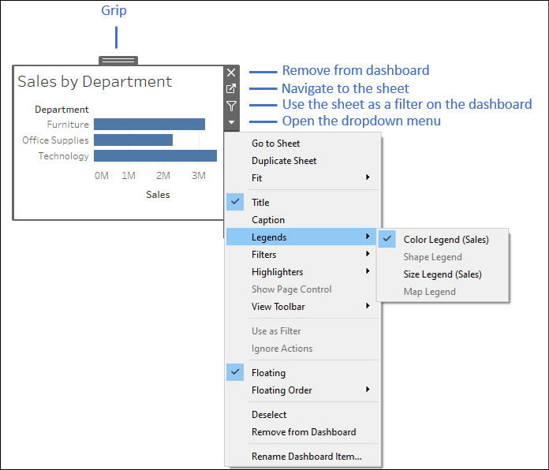

Figure 1.27: Various controls and UI elements become visible when
selecting an object on a dashboard

You can resize an object on the dashboard using
the border. The **Grip**, labelled in *Figure 1.27*, allows you to move
the object once it has been placed. We\'ll consider other options as we
go.

Building your dashboard 
-----------------------

With an overview of the interface, you are now
ready to build a dashboard by following these steps:

1.  Navigate to the **Superstore Sales** sheet. You should see a blank
    dashboard.

2.  Successively double-click on each of the following sheets listed in
    the **Dashboard** section on the left: **Sales by Department**,
    **Sales over time**, and **Sales by Postal Code**. Notice that
    double-clicking on the object adds it to the layout of the
    dashboard.

3.  Add a title to the dashboard by checking **Show Dashboard title** at
    the lower left of the sidebar.

4.  Select the **Sales by Department** sheet in the dashboard and click
    on the drop-down arrow to show the menu.

5.  Select **Fit** \| **Entire View**. The **Fit** options describe how
    the visualization should fill any available space.
    **Tip:**

    Be careful when using various fit options. If you are using a
    dashboard with a size that has not been fixed, or if your view
    dynamically changes the number of items displayed based on
    interactivity, then what might have once looked good might not fit
    the view nearly as well.
    

6.  Select the **Sales** size legend by clicking on it. Use the **X**
    option to remove the legend from the dashboard:

    

    Figure 1.28: Select the legend by clicking on it, then click the X
    to remove it from the dashboard

7.  Select the **Profit** color legend by clicking on it. Use the
    **Grip** to drag it and drop it under the map.

8.  For each view (**Sales by Department**, **Sales by Postal Code**,
    and **Sales over time**), select the view by clicking on an empty
    area in the view. Then, click on the **Use as Filter** option to
    make that view an interactive filter for the dashboard:

    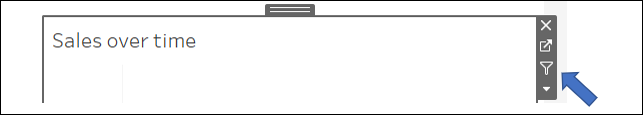

    Figure 1.29: Click on the Use as Filter button to use a view as a
    filter in a dashboard

    Your dashboard should look like this:

    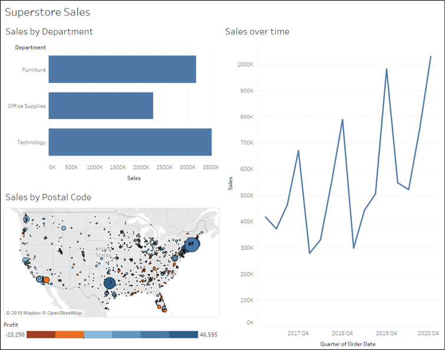

    Figure 1.30: The final dashboard consisting of three views

1.  Take a moment to interact with your dashboard.
    Click on various marks, such as the bars, states, and points of the
    line. Notice that each selection filters the rest of the dashboard.
    Clicking on a selected mark will deselect it and clear the filter.
    Also, notice that selecting marks in multiple views causes filters
    to work together. For example, selecting the bar for **Furniture**
    in **Sales by Department** and the **2019 Q4** in **Sales over
    time** allows you to see all the ZIP codes that had furniture sales
    in the fourth quarter of 2019.

Congratulations! You have now created a dashboard that allows you to carry out interactive analysis!

Summary

Tableau\'s visual environment allows a rapid and iterative process of
exploring and analyzing data visually. You\'ve taken your first steps
toward understanding how to use the platform. You connected to data and
then explored and analyzed the data using some key visualization types
such as bar charts, line charts, and geographic visualizations. Along
the way, you focused on learning the techniques and understanding key
concepts such as the difference between measures and dimensions, and
discrete and continuous fields. Finally, you put all of the pieces
together to create a fully functional dashboard that allows an end user
to understand your analysis and make discoveries of their own.

In the next lab, we\'ll explore how Tableau works with data. You
will be exposed to fundamental concepts and practical examples of how to
connect to various data sources. Combined with the key concepts you just
learned about building visualizations, you will be well equipped to move
on to more advanced visualizations, deeper analysis, and telling fully
interactive data stories.
