Advanced Visualizations
=======================


In this lab, we\'ll consider the following topics:

-   Advanced visualizations -- when and why to use them
-   Slope charts and bump charts
-   Waterfall charts
-   Step lines and jump lines
-   Spark lines
-   Dumbbell charts
-   Unit/symbol charts
-   Marimekko charts
-   Animated visualizations


#### Advanced visualizations – when and why to use them


Each of the visualizations in this lab is created using the supplied
`Superstore` data. Instead of providing
step-by-step instructions, we\'ll point out specific advanced techniques
used to create each chart type. The goal is not to memorize steps but to
understand how to creatively leverage Tableau\'s features.

You can find completed examples in the
`Chapter 10 Complete` workbook, or test your
growing Tableau skills by building everything from scratch using the
`Chapter 10 Starter` workbook.

Let\'s start our journey into advanced visualizations with slope and
bump charts.


#### Slope charts and bump charts


A **slope chart** shows a change of values from
one period or status to another. For example, here is a slope chart
demonstrating the change in sales rank for each state in the **South**
region from **2016** to **2017**:

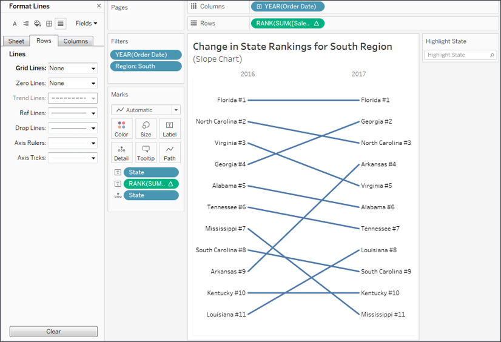

Figure 10.1: A slope chart is useful to compare the change of rank or
absolute values from one period or status to another

Here are some features and techniques used to
create the preceding slope chart:

-   The table calculation **Rank(SUM(Sales))** is computed by (addressed
    by) **State**, meaning that each state is ranked within the
    partition of a single year.
-   **Grid Lines** and **Zero Lines** for **Rows** have been set to
    **None**.
-   The axis has been reversed (right-click the axis and select
    **Edit**, then check the option to reverse). This allows rank
    **\#1** to appear at the top and lower ranks to appear in descending
    order.
-   The axis has been hidden (right-click the axis and uncheck **Show
    Header**).
-   Labels have been edited (by clicking on **Label**) to show on both
    ends of the line, to center vertically, and to position the rank
    number next to the state name.
-   The year column headers have been moved from the bottom of the view
    to the top (from the top menu, select **Analysis \| Table Layout \|
    Advanced** and uncheck the option to show the innermost level at the
    bottom).
-   A **data highlighter** has been added (using
    the dropdown on the `State` field in the
    view, select **Show Highlighter**) to give the end user the ability
    to highlight one or more states.

**Note:**

Data highlighters give the user the ability to highlight marks in a view
by selecting values from the drop-down list or by typing (any match on
any part of a value will highlight the mark; so, for example, typing
`Carolina` would highlight **North Carolina** and
**South Carolina** in the preceding view). Data highlighters can be
shown for any field you use as discrete (blue) in the view and will
function across multiple views in a dashboard as long as that same field
is used in those views.


Slope charts can use absolute values (for example, the actual values of
**Sales**) or relative values (for example, the rank of **Sales**, as
shown in this example). If you were to show more than two years to
observe the change in rankings over multiple periods of time, the
resulting visualization might be called a **Bump Chart** and
look like this:

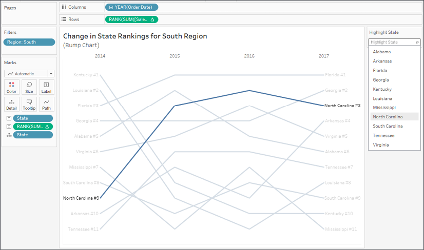

Figure 10.2: This bump chart shows the change in rank for each state
over time and makes use of a highlighter

Slope charts are very useful when comparing ranks before and after or
from one state to another. Bump charts extend this concept across more
than two periods. Consider using either of these two charts when you
want to understand the relative change in rank and make comparisons
against that change.

Next, we\'ll consider a chart that helps us understand the build-up of
parts to the whole.


#### Waterfall charts


A **waterfall chart** is useful when you want to show how parts
successively build up to a whole. In the following
screenshot, for example, a waterfall chart shows how profit builds up to
a grand total across **Departments** and **Categories** of products.
Sometimes profit is negative, so at that point, the waterfall chart
takes a dip, while positive values build up toward the total:

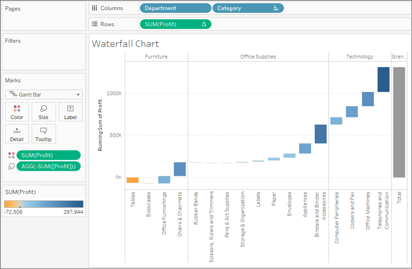

Figure 10.3: This waterfall chart shows how each Category adds (or
subtracts) profit to build toward the total

Here are the features and techniques used to build the chart:

-   The **SUM(Profit)** field on **Rows** is a **Running Total** table
    calculation (created using a **Quick Table Calculation** from the
    drop-down menu) and is computed across the table.
-   **Row Grand Totals** have been added to the view (dragged and
    dropped from the **Analytics** pane).
-   The mark type is set to **Gantt Bar** and an ad hoc calculation is
    used with code: **SUM(Profit)** for the size. This may seem a bit
    odd at first, but it causes the Gantt Bars to be drawn from the
    actual value and filled down when profit is positive or filled up
    when profit is negative.
-   **Category** has been sorted by the sum of
    their profit in ascending order so that the waterfall chart builds
    slowly (or negatively) from left to right within each
    **Department**. You might want to experiment with the sort options
    to discover the impact on the presentation.

Waterfall charts will help you demonstrate a build-up or progression
toward a total or whole value. Let\'s next consider step lines and jump
lines to show discrete changes over time.


#### Step lines and jump lines


With a mark type of **Line**, click the **Path** shelf and you\'ll see
three options for **Line Type**:

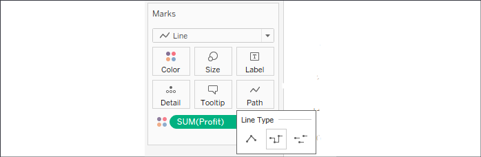

Figure 10.4: Change the type of Line by clicking Path on the Marks card

The three options are:

1.  **Linear**: Use angled lines to emphasize
    movement or transition between values. This is the default and every
    example of a line chart in this book so far has made use of this
    line type.
2.  **Step lines**: Remain connected but emphasize
    discrete steps of change. This is useful when you want to
    communicate that there is no transition between values or that the
    transition is a discrete step in value. For example, you might want
    to show the number of generators running over time. The change from
    7 to 8 is a discrete change that might be best represented by a step
    line.
3.  **Jump lines** are not connected; and when a
    value changes a new line starts. Jump lines are useful when you want
    to show values that indicate a certain state that may exist for a
    given period of time before jumping to another state. For example,
    you might wish to show the daily occupancy rate of a hotel over
    time. A jump line might help emphasize that each day is a new value.

In the following example, we\'ve taken the build-up of profit that was
previously demonstrated with a **waterfall chart** and used step lines
to show each successive step of profit:

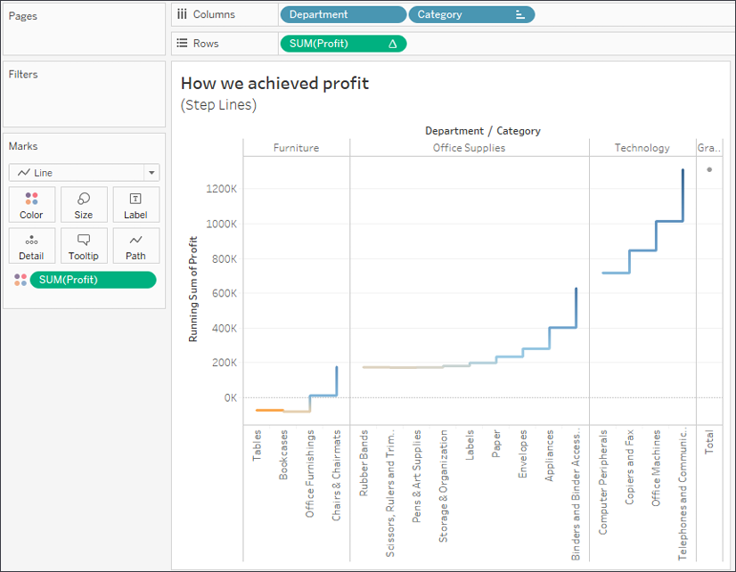

Figure 10.5: A step line chart emphasizes an abrupt change or discrete
difference

Experiment with switching line types to see the visual impact and what
each communicates about the data.


#### Sparklines

**Sparklines** are visualizations that use
multiple small line graphs that are designed to be read and compared
quickly. The goal of sparklines is to give a visualization that can be
understood at a glance. You aren\'t trying to communicate exact values,
but rather give the audience the ability to quickly understand trends,
movements, and patterns.

Among various uses of this type of visualization, you may have seen
sparklines used in financial publications to compare the movement of
stock prices. Recall, that in Lab 1, we
considered the initial start of a **Sparklines** visualization as we
looked at iterations of line charts. Here is a far more developed
example:

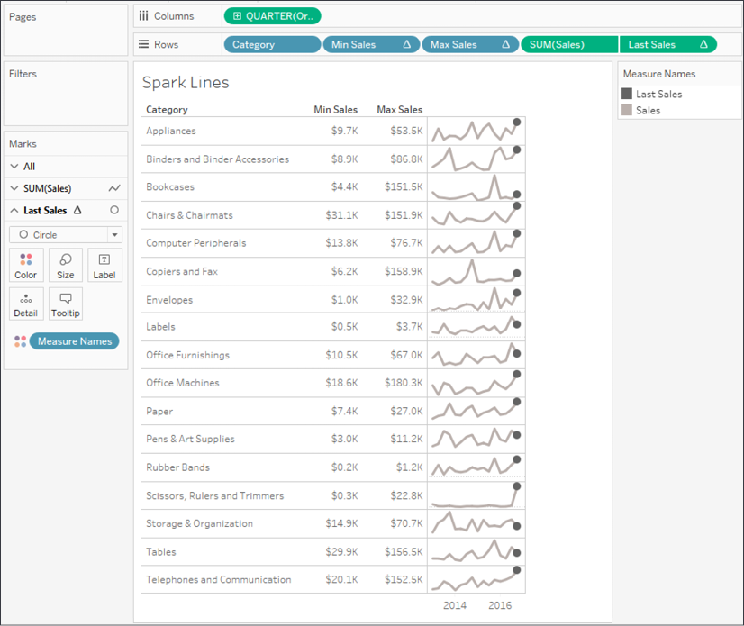

Figure 10.6: Spark Lines give you a quick glance at the \"shape\" of
change over time across multiple categories

You can build a chart like this by following these
steps:

1.  Start with a simple view of **SUM(Sales)** by **Quarter** of **Order
    Date** (as a date value) with **Category** on **Rows**.
2.  Create two calculated fields to show the minimum and maximum
    quarterly sales values for each category. **Min Sales** has the code
    `WINDOW_MIN(SUM(Sales))` and **Max Sales**
    has the code `WINDOW_MAX(SUM(Sales))`. Add
    both to **Rows** as discrete (blue) fields.
3.  Place the calculation **Last Sales** with the code
    `IF LAST() == 0 THEN SUM([Sales]) END` on
    **Rows** and uses a synchronized dual axis with a circle mark type
    to emphasize the final value of sales for each timeline.
4.  Edit the axis for **SUM(Sales)** to have independent axis ranges for
    each row or column and hide the axes. This allows the line movement
    to be emphasized. Remember: the goal is not to show the exact
    values, but to allow your audience to see the patterns and movement.
5.  Hide grid lines for **Rows**.
6.  Resize the view (compress the view
    horizontally and set to **Fit Height**). This allows the sparklines
    to fit into a small space, facilitating the quick understanding of
    patterns and movement.

Sparklines can be used with all kinds of time series to reveal overall
big-picture trends and behaviors at a glance.


#### Dumbbell charts


A **dumbbell chart** is a variation of the circle
plot that compares two values for each slice of data, emphasizing the
distance between the two values.

Here, for example, is a chart showing the **Difference in Profit between
East and West** regions for each **Category** of products:

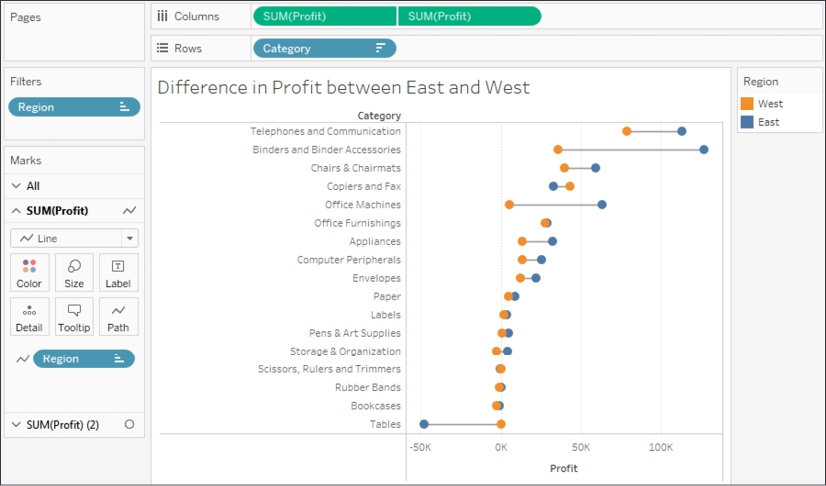

Figure 10.7: A dumbbell chart emphasizes the distance/difference between
two values

This chart was built using the following features and techniques:

-   A synchronized dual axis of **SUM(Profit)** has been used with one
    set to mark the type of **Circle** and the other set to **Line**.
-   **Category** has been sorted by **Profit** descending (the sort sums
    profit for East and West).
-   **Region** has been placed on the **Path** shelf for the line to
    tell Tableau to draw a line between the two **Regions**.
    **Note:**

    The **Path** shelf is available for **Line** and **Polygon** mark
    types. When you place a field on the **Path** shelf, it tells
    Tableau the order to connect the points (following the sort order of
    the field placed on **Path**). Paths are often used with geographic
    visualizations to connect origins and destinations on routes but can
    be used with other visualization types. Tableau draws a single line
    between two values (in this case East and West).


-   **Region** is placed on **Color** for the circle mark type.

Dumbbell charts are great at highlighting the
disparity between values. Let\'s next consider how we can use
unit/symbol charts to drive responses.


#### Unit/symbol charts


A **unit chart** can be used to show individual
items, often using shapes or symbols to represent each individual. These
charts can elicit a powerful emotional response because the
representations of the data are less abstract and more easily identified
as something real. For example, here is a chart showing how many
customers had late shipments for each **Region**:


Figure 10.8: Each image represents a real person and is less abstract
than circles or squares

The view was created with the following
techniques:

-   The view is filtered where **Late Shipping** is **True**. **Late
    Shipping** is a calculated field that determines if it took more
    than `14` days to ship an order. The code is
    as follows:
    ```
    DATEDIFF('day', [Order Date], [Ship Date]) > 14 
    ```


-   **Region** has been sorted by the distinct count of **Customer ID**
    in descending order.

-   **Customer ID** has been placed on **Detail** so that there is a
    mark for each distinct customer.

-   The mark type has been changed to **Shape** and the shape has been
    changed to the included person shape in the **Gender** shape
    palette. To change shapes, click the **Shape** shelf and select the
    desired shape(s), as shown in the following screenshot:

    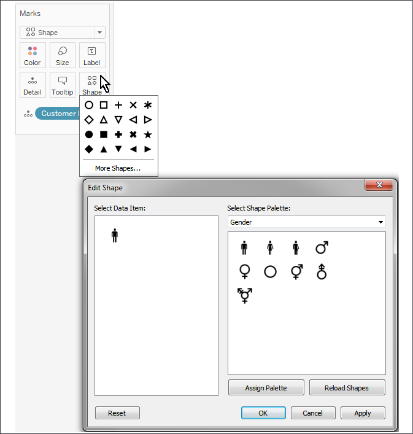

    Figure 10.9: You can assign shapes to dimensional values using the
    Shape shelf

The preceding unit chart might elicit more of a
response from regional managers than a standard bar chart when they are
gently reminded that poor customer service impacts real people. Granted,
the shapes are still abstract, but more closely represent an actual
person. You could also consider labeling the mark with the customer name
or using other techniques to further engage your audience.

**Tip:**

Remember that normally in Tableau, a mark is drawn for each distinct
intersection of dimensional values. So, it is rather difficult to draw,
for example, `10` individual shapes for a single
row of data that simply contains the value `10`
for a field. This means that you will need to consider the shape of your
data and include enough rows to draw the units you wish to represent.


Concrete shapes, in any type of visualization, can
also dramatically reduce the amount of time it takes to comprehend the
data. Contrast the amount of effort required to identify the departments
in these two scatterplots:

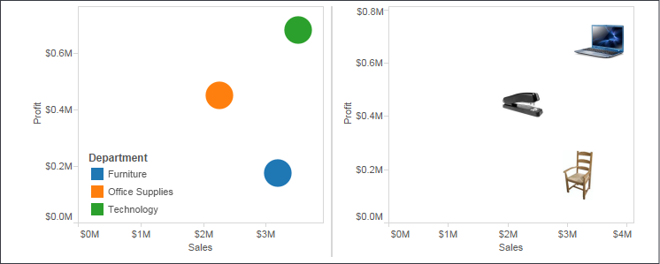

Figure 10.10: Notice the difference in \"cognitive load\" between the
left chart and the right

Once you know the meaning of a shape, you no longer have to reference a
legend. Placing a discrete field on the **Shape** shelf allows you to
assign shapes to individual values of the field.

**Note:**

Shapes are images located in the
`My Tableau Repository\Shapes` directory. You can
include your own custom shapes in subfolders of that directory by adding
folders and image files.


#### Marimekko charts


A **Marimekko chart** (sometimes alternately
called a **Mekko chart**) is similar to a
vertically stacked bar chart, but additionally
uses varying widths of bars to communicate additional information about
the data. Here, for example, is a **Marimekko chart** showing the
breakdown of sales by region and department.

The width of the bars communicates the total **Sales for** **Region**,
while the height of each segment gives you the percentage of sales for
the **Department** within the **Region**:

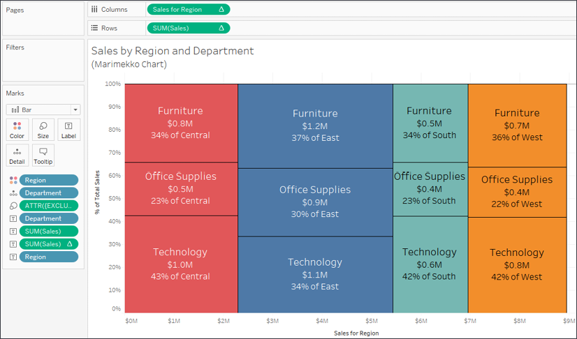


Creating Marimekko charts in Tableau leverages the
ability to fix the width of bars according to the axis\' units.

**Note:**

Clicking the **Size** shelf when a continuous (green) field is on
**Columns** (thus defining a horizontal axis) and the mark type is set
to **Bar** reveals options for a fixed size. You can manually enter a
**Size** and **Alignment** or drop a field on the **Size** shelf to vary
the width of the bars.


Here are the steps required to create this kind of visualization:

1.  The mark type has been specifically set to **Bar**.
2.  **Region** and **Department** have been placed on **Color** and
    **Detail**, respectively. They are the only dimensions in the view,
    so they define the view\'s **level of detail**.
3.  **Sales** has been placed on **Rows** and a **Percent of Total**
    quick table calculation applied. The **Compute Using** (addressing)
    has been set to **Department** so that we get the percentage of
    sales for each department within the partition of the **Region**.
4.  The calculated field **Sales for Region** calculates the *x* axis
    location for the right-side position of each bar. The code is as
    follows:
    ```
    IF FIRST() = 0 
        THEN MIN({EXCLUDE [Department] : SUM(Sales)}) 
    ELSEIF LOOKUP(MIN([Region]), -1) <> MIN([Region]) 
        THEN PREVIOUS_VALUE(0) + MIN({EXCLUDE [Department] : SUM(Sales)}) 
    ELSE 
        PREVIOUS_VALUE(0) 
    END
    ```


While this code may seem daunting at first, it follows a logical
progression. Specifically, if this is the first bar segment, we\'ll want
to know the sum of **Sales** for the entire region (which is why we
exclude **Department** with an inline level of detail calculation). When
the calculation moves to a new **Region**, we\'ll need to add the
previous **Region** total to the new **Region** total. Otherwise, the
calculation is for another segment in the same **Region**, so the
regional total is the same as the previous segment. Notice again, the
**Compute Using** option has been set to **Department** to enable the
logical progression to work as expected.

Finally, a few additional adjustments were made to
the view:

-   The field on **Size** is an ad hoc level of detail calculation with
    the code
    `{EXCLUDE [Department] : SUM(Sales)}`. As we
    mentioned earlier, this excludes **Department** and allows us to get
    the sum of sales at a **Region** level. This means that each bar is
    sized according to the total sales for the given **Region**.
-   Clicking on the **Size** shelf gives the option to set the alignment
    of the bars to Right. Since the preceding calculation gave the right
    position of the bar, we need to make certain the bars are drawn from
    that starting point.
-   Various fields, such as **SUM(Sales)** as an absolute value and
    percentage, have been copied to the **Label** shelf so that each bar
    segment more clearly communicates meaning to the viewer.

**Tip:**

To add labels to each **Region** column, you might consider creating a
second view and placing both on a dashboard. Alternately, you might use
annotations.


In addition to allowing you to create Marimekko charts, the ability to
control the size of bars in axis units opens all kinds of possibilities
for creating additional visualizations, such as complex cascade charts
or stepped area charts. The techniques are like those used here. You may
also leverage the sizing feature with **continuous bins** (use the
drop-down menu to change a bin field in the view to continuous
from discrete).

**Note:**

For a more comprehensive discussion of Marimekko
charts, along with approaches that work with sparse data, see Jonathan
Drummey\'s blog post at
[[https://www.tableau.com/about/blog/2016/8/how-build-marimekko-chart-tableau-58153]](https://www.tableau.com/about/blog/2016/8/how-build-marimekko-chart-tableau-58153).


#### Animated visualizations


Previous versions of Tableau allowed rudimentary
animation using the **Pages** shelf with playback controls. Tableau
2020.1 introduced true **Mark Animation**, which
means marks smoothly transition when you apply
filters, sorting, or page changes. Consider leveraging animation to
extend your analytical potential in a couple of ways:

1.  Turn it on while exploring and analyzing your data. This allows you
    to gain analytical insights you might otherwise miss, such as seeing
    how far and in which direction marks in a scatterplot move as a
    filter changes.
2.  Use it strategically to enhance the data story. Animation can be
    used to capture interest, draw attention to important elements, or
    build suspense toward a conclusion.

We\'ll consider both approaches to animation in the following examples.

Enhancing analysis with animation
---------------------------------

Consider the following bar chart, which shows the
correlation of **Sales** and **Profit** for each
**Department**:

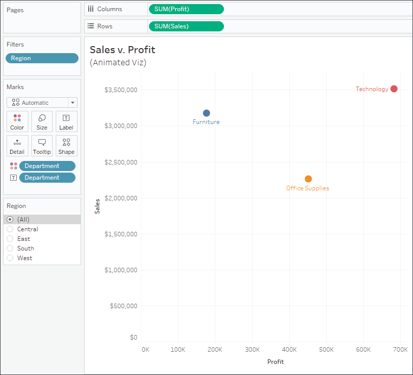

Figure 10.12: Sales and profit per Department

Notice the **Region** filter. Change the filter
selection a few times in the `Chapter 10`
workbook. You\'ll observe the standard behavior that occurs without
animations: the circle marks are immediately
redrawn at the new location determined by the filter. This works well,
but there is a bit of a disconnect between filter settings. As you
switch between regions, notice the mental difficulty in keeping track of
where a mark was versus where it is with the new selection. Did one
region\'s mark increase in profit? Did it decrease in sales?

Now, turn on animations for the view. To do this, use the menu to select
**Format** \| **Animations...** The **Animations** format pane will show
on the left. Use it to turn **Animation** on for the **Selected Sheet**:

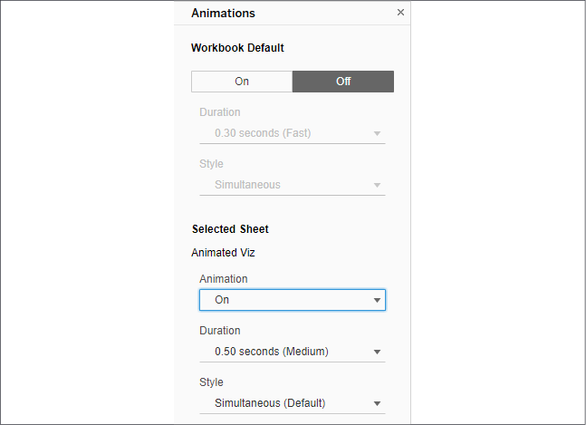

Figure 10.13: The Animations format pane gives various options for
workbook and individual sheet animation settings

Experiment with various duration settings and
change the filter value. Notice how much easier it
is to see the change in sales and profit from region to region. This
gives you the ability to notice changes more easily. You\'ll start to
gain insight, even without spending a lot of cognitive effort, into the
magnitude and direction of change. Animations provide a path to this
analytical insight.

Enhancing data storytelling with animation
------------------------------------------

Beyond providing analytical insight as you perform
your data discovery and analysis, you can also
leverage animation to more effectively drive interest and highlight
decision points, opportunities, or risks in your data stories. As an
example, consider this view in the `Chapter 10`
workbook:

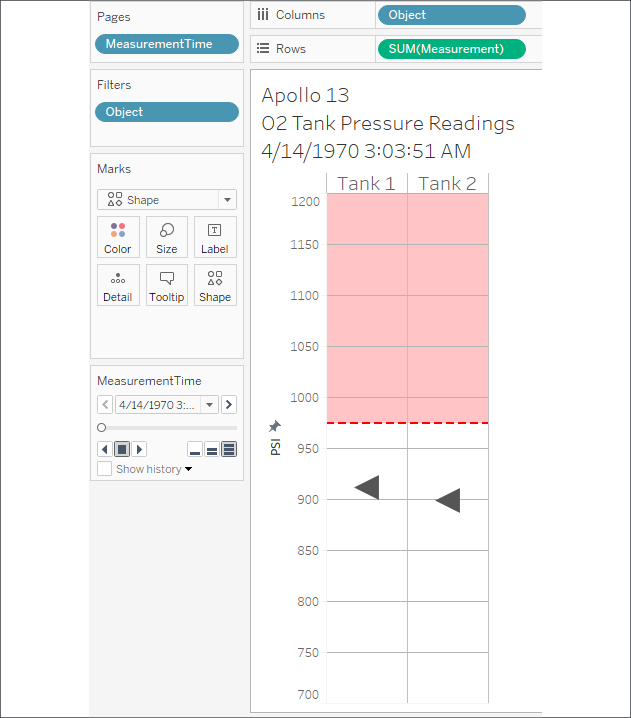

Figure 10.14: O2 Tank 1 and 2 pressure readings over time during the
Apollo 13 mission

The view tells a part of the story of Apollo 13
and the disaster that crippled the spacecraft. It
does this by making use of both the **Pages** shelf as well as smooth
animation. Experiment with the animation speed and playback controls in
the `Chapter 10` workbook. Consider how animation
can be used to heighten awareness, drive interest, or even create
suspense.

**Tip:**

When you use multiple views on a dashboard, each having the same
combination of fields on the **Pages** shelf, you can synchronize the
playback controls (using the caret drop-down menu on the playback
controls) to create a fully animated dashboard.


Animations can be shared with other users of
Tableau Desktop and are displayed on Tableau
Server, Tableau Online, and Tableau Public.

#### Summary


We\'ve covered a wide variety of advanced visualization types in this
lab! We\'ve considered slope and bump charts that show changes in
rank or value, step and jump lines that show discretely changing values,
and unit charts that help materialize abstract concepts.

There is no way to cover every possible visualization type. Instead, the
idea has been to demonstrate some of what can be accomplished and spark
new ideas and creativity. As you experiment and iterate through new ways
of looking at data, you\'ll become more confident in how to best
communicate the stories contained in the data. Next, we\'ll return
briefly to the topic of dashboards to see how some advanced techniques
can make them truly dynamic.
