Dynamic Dashboards
==================

We\'ve looked at dashboards previously, in *Chapter 8*, *Telling a Data
Story with Dashboards*, and considered how to make them interactive
using a variety of actions. Now we\'ll expand on that concept to
consider how to create truly dynamic dashboards---dashboards where
objects can be shown and hidden. This enables you to do all kinds of
amazing things, such as allow the user to select which type of
visualization to see or to dynamically hide or show controls that are
relevant or desired.

We\'ll consider the following types of dynamic interactivity:

-   Show/Hide buttons
-   Sheet swapping
-   Automatically showing and hiding controls

Let\'s start by considering how to show and hide content on dashboards
using the Show/Hide buttons.

#### Show/Hide buttons

The Show/Hide buttons allow you to show and hide
layout containers (and everything in them!). You\'ll find a couple of
examples in the `Chapter 11 Complete` workbook.
The` Chapter 11 Starter` workbook has the
dashboards, but not the Show/Hide buttons or containers. The images used
in the second example are also in the
`Chapter 11` directory.

To use the Show/Hide buttons, add a layout container to a dashboard as a
**floating object** and then use the dropdown to select **Add Show/Hide
Button**, as shown here in *Figure 11.1*:

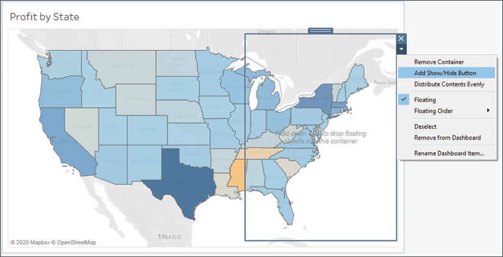

Figure 11.1: A dashboard with a single Map view and a floating layout
container

On this dashboard, we\'ve added a vertical layout
container floating over the map. When we select **Add Show/Hide
Button**, Tableau adds a small button to the dashboard:

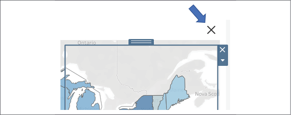

Figure 11.2: The Show/Hide button for the layout container

Each Show/Hide button can be applied to any single floating layout
container on the dashboard.

**Tip:**

Use the **Rename Dashboard Item...** option on the layout container
dropdown to make it easy to identify which layout container is the
target of a Show/Hide button.

You may edit the button\'s appearance and actions
using the button\'s dropdown to select **Edit Button\...**:

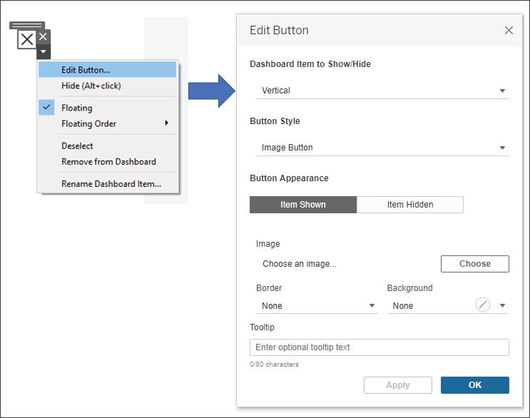

Figure 11.3: Selecting Edit Button... reveals many options for altering
the button\'s behavior and appearance

In the resulting dialog box, you\'ll have options for selecting which
layout container to show or hide, the style of the button (image or
text), and which images or text to show when the container is shown or
hidden.

In this example, the Show/Hide button uses the default **Image Button**
style (as seen in *Figure 11.3*) and the layout container has been
filled with a couple of filters and the map\'s legend.

**Tip:**

You may include any dashboard objects in a container, including filters,
legends, parameter and set controls, and even other views!

Additionally, the container has been given a border and a
semi-transparent background so that the map is slightly visible beneath
the container. This was accomplished by selecting the container
and then using the **Layout** tab of the
**Dashboard** pane, as shown here:

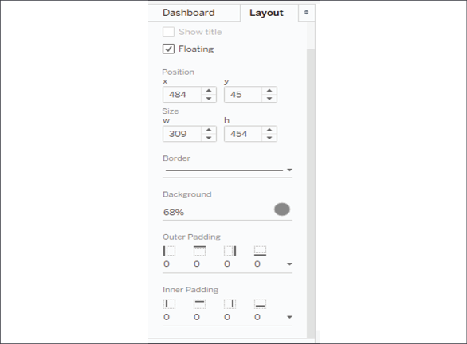

Figure 11.4: Use the Layout pane to adjust options for any selected
dashboard object

The end result, demonstrated in the `Chapter 11`
workbook, is a dashboard with a Show/Hide button
that makes it clear to the user that additional
options can be shown or hidden:

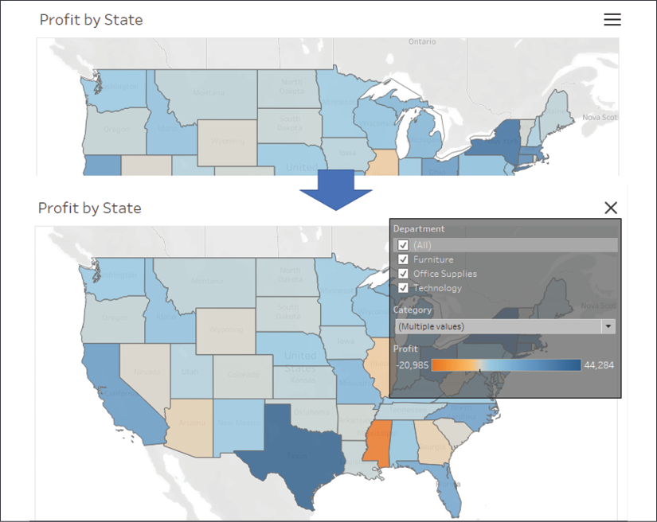

Figure 11.5: Here you can see the layout container\'s hidden and shown
states along with the changing image of the button

**Tip:**

Use *Alt* + *Click* while in **Design Mode** to trigger the button
action, or switch to **Presentation Mode** where a single click will
trigger the button.

Show/Hide buttons give you a lot of flexibility in your dashboard
design, from optimizing space to simplifying the display, to removing
filters and other clutter from printed output.

Consider another example in the
`Chapter 11 Complete` workbook that illustrates
the possibility of showing and hiding instructions:

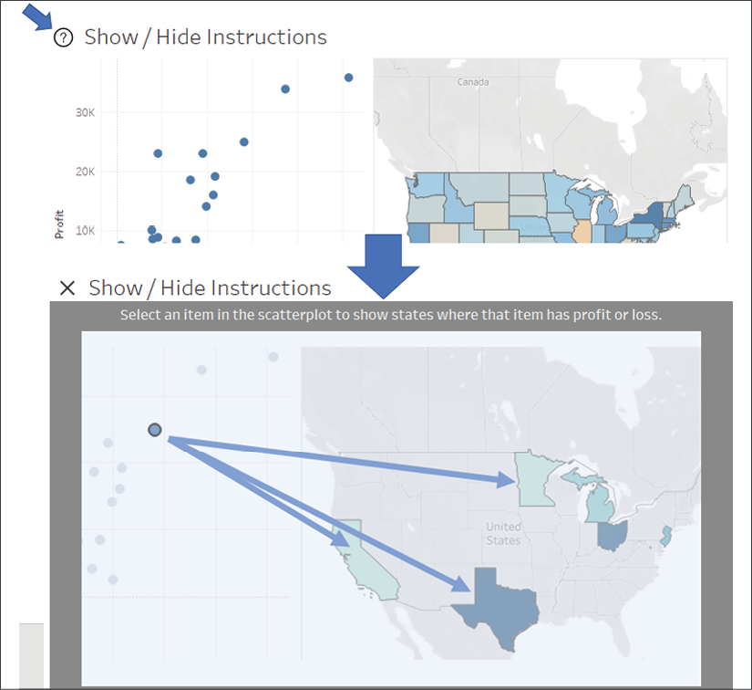

Figure 11.6: Clicking the question mark button reveals instructions for
how to use the dashboard

In this case, the default button image has been
replaced with a question mark icon. This is accomplished by editing the
image as illustrated in *Figure 11.3* and changing the image
(`questionmark.png` is included in the
`Chapter 11` directory.)

When the user clicks the button, a floating container appears over the
top of the entire dashboard. It includes text as well as an annotated
image to instruct the user on how to use the dashboard. In this simple
example, it might be overkill to supply instructions in this way, when a
simple text label would suffice.

However, as you build more complex dashboards or have detailed analyses
that require explanation, this is a great way to give users additional
instructions and detail that would otherwise clutter a dashboard.

**Tip:**

Consider also using Show/Hide buttons to allow user interactivity that
you do not want to include in PDFs or printed pages of the dashboards.
Filters and parameters are incredibly useful, but you don\'t always want
them to show up in a polished output.

Let\'s move on to consider another method of
dynamically showing, hiding, and even swapping out content on a
dashboard.

#### Sheet swapping

**Sheet swapping**, sometimes also called **sheet
selection**, is a technique in which views are
dynamically shown and hidden on a dashboard, often with the appearance
of swapping one view for another. The dynamic hiding and showing of
views on a dashboard has an even broader application. When combined with
floating objects and layout containers, this technique allows you to
create rich and dynamic dashboards.

Let\'s start with some fundamental principles of sheet swapping.

Basic principles of sheet swapping
----------------------------------

The basic principles are relatively simple. A view
on a dashboard collapses when the following occur:

-   At least one field is on rows or columns
-   It is in a horizontal or vertical **layout container**
-   It does not have a fixed height or width and the layout container is
    not set to distribute items equally
-   A combination of filters or hiding prevents any marks from being
    rendered

Additionally, titles and captions do not collapse with the view.
However, these can be hidden so that the view collapses entirely.

Next, we\'ll explore an example of how sheet swapping can be used in
practice.

Using sheet swapping to change views on a dashboard
---------------------------------------------------

Let\'s consider a simple example with a view
showing **Profit by Department and Category** with a **Department**
quick filter. The dashboard has been formatted (from the menu, select
**Format** \| **Dashboard**) with gray shading to help us see the
effect:

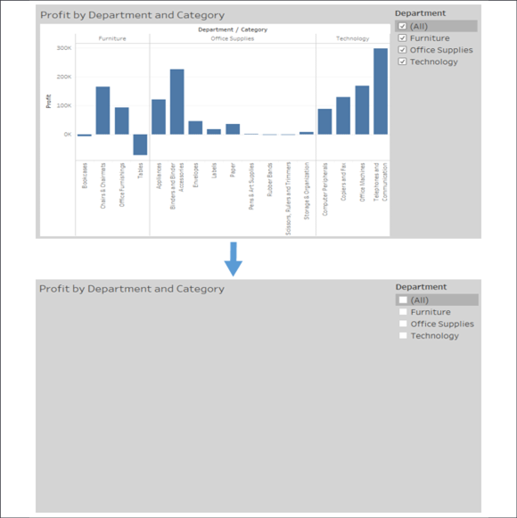

Figure 11.7: A demonstration of hiding a sheet in a dashboard

Observe how filtering out all departments results in the view
collapsing. The title remains, but it could have been hidden.

In order to swap two different sheets, we simply take advantage of the
collapsing behavior along with the properties of layout containers.
We\'ll start by creating two different views filtered through a
parameter and a calculated field. The parameter will allow
us to determine which sheet is shown. Perform the
following steps:

1.  Create an integer parameter named
    `Show Sheet` with a list of **String** values
    set to **Bar Chart** and **Map**:

    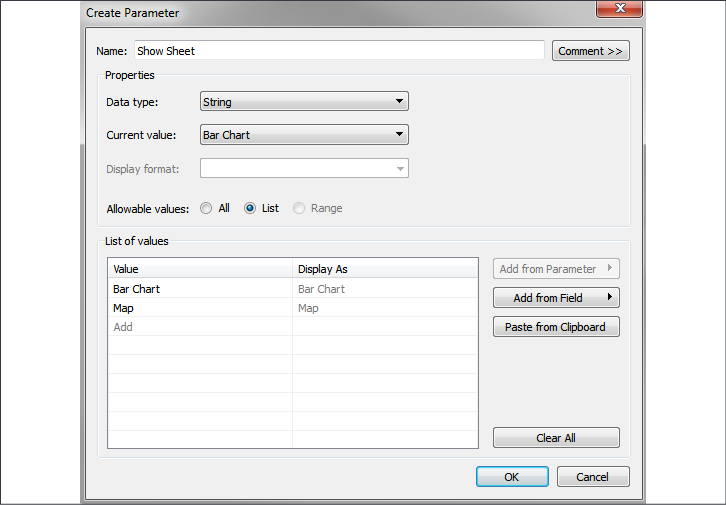

    Figure 11.8: Creating a parameter to control which sheet is shown

2.  Since we want to filter based on the parameter selection and the
    parameters cannot be directly added to the **Filters** shelf,
    instead we\'ll create a calculated field named
    `Show Sheet Filter` to return the selected
    value of the parameter. The code is simply
    `[Show Sheet]`, which is the parameter name,
    which returns the current value of the parameter.

3.  Create a new sheet named **Bar Chart**, similar to the **Profit by
    Department and Category** view shown in *Figure 11.7*.

4.  Show the parameter control (right-click the parameter in the data
    window and select **Show Parameter Control**). Make sure the **Bar
    Chart** option is selected.

5.  Add the `Show Sheet Filter` field to the
    **Filters** shelf and check **Bar Chart** to keep that value.

6.  Create another sheet named **Map** that shows
    a filled map of states by profit:

    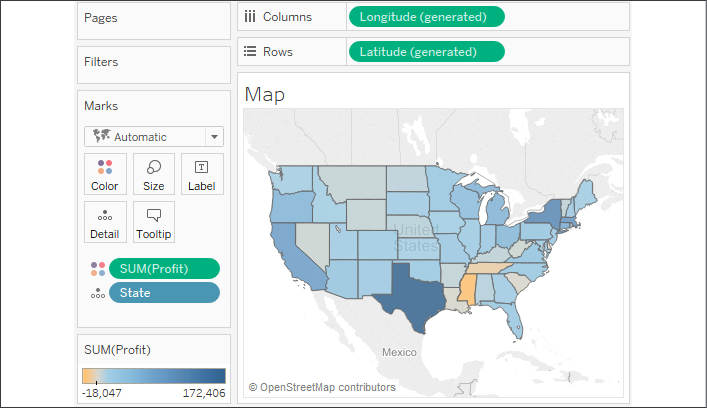

    Figure 11.9: The Map view

7.  Show the parameter on this view and change the selection to **Map**.
    Remember that parameter selections are universal to the worksheet.
    If you were to switch back to the **Bar Chart** view, it should no
    longer be showing any data because of the filter.

8.  Add the `Show Sheet Filter` field to the
    **Filters** shelf and check **Map** as the value to keep.

9.  Create a new dashboard named **Sheet Swap**.

10. Add a **Horizontal** layout container to the dashboard from the
    objects in the left window:

    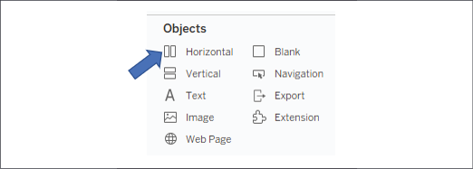

    Figure 11.10: Insert a Horizontal layout container

    **Note:**

    A **Vertical** layout container would work just as well in this
    case. The key is that a layout container will allow each view inside
    to expand to fill the container when the view is set to fit the
    entire view, or fit the width (for horizontal containers), or fit
    the height (for vertical containers). When one view collapses, the
    visible view will expand to fill the rest of the container.

11. Add each sheet to the layout container in the
    dashboard. The parameter control should be added automatically since
    it was visible in each view.

12. Using the drop-down menu on the **Bar Chart** view, ensure the view
    is set to fill the container (**Fit** \| **Entire View**). You
    won\'t have to set the fill for the map because map visualizations
    automatically fill the container.

13. Hide the title for each view (right-click the title and select
    **Hide Title**).

You now have a dashboard where changing the parameter results in one
view or the other being shown. When **Map** is selected, the filter
results in no data for the bar chart, so it collapses and the map fills
the container:

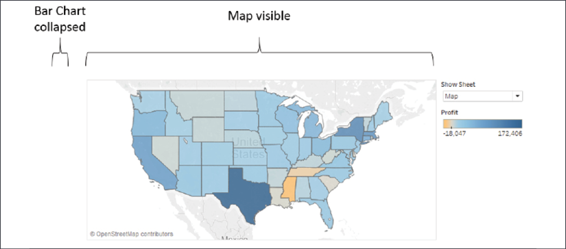

Figure 11.11: Map is visible while Bar Chart is collapsed

Alternately, when **Bar Chart** is selected, the map collapses due to
the filter and the bar chart fills the container:

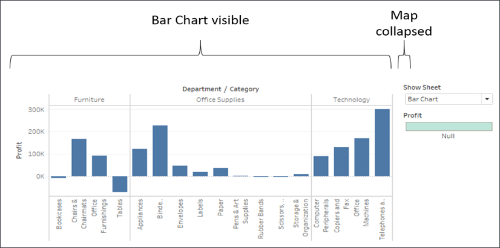

Figure 11.12: Bar Chart is visible while Map is collapsed

**Tip:**

The key to collapsing a view is to have a filter or set of filters
that ensures no rows of data are shown. You do not have to use
a parameter to control the filtering. You could use a regular filter
or action filter to accomplish the same effect. This opens up all kinds
of possibilities for dynamic behavior in dashboards.

Sheet swapping can lead to amazing effects on your dashboard. From
allowing the user to select a type of visualization, to swapping out a
view that works well for a small set of data, to a view that summarizes
at a higher level for a larger set, consider using sheet swapping for a
dynamic experience.

**Tip:**

In some cases, you might consider an alternative to sheet swapping, such
as using a navigation button to navigate between
different versions of the dashboard rather than trying to swap content
in the same dashboard.

Sheet swapping allows you to swap views in a dashboard. What if the
change in views makes certain legends, filters, or parameters no longer
applicable and you wish to hide them? Let\'s consider some
possibilities.

#### Automatically showing and hiding other controls

Views will collapse when all data is filtered
out. However, other controls, such as quick filters, parameters, images,
legends, and textboxes, will not collapse. You could use a Show/Hide
button as we previously discussed, but often you\'ll want to show or
hide these controls automatically as filters change, without forcing the
user to take additional action.

Consider the simple example in the previous section. The color legend,
which was automatically added to the dashboard by Tableau, applies to
the map. But when the bar chart is shown, the legend is no longer
applicable.

Fortunately, we can extend the technique we used in the previous section
to expand a view to push items we want to show out from under a floating
object and then collapse the view to allow the items we want to hide to
return to a position under the floating object.

Let\'s extend the earlier sheet swapping example to see how to show and
hide the color legend:

1.  Create a new sheet named **Show/Hide Legend**. This view is only
    used to show and hide the color legend.

2.  Create an ad hoc calculation by double-clicking on **Rows** and type
    `MIN(1)`. We must have a field on rows or
    columns for the view to collapse, so we\'ll use this field to give
    us a single axis for **Rows** and a single axis for **Columns**
    without any other headers.

3.  Duplicate the ad hoc calculation on **Columns**. You should now have
    a simple scatterplot with one mark.

4.  As this is a helper sheet and not anything we want the user to see,
    we don\'t want it to show any marks or lines. Format the view using
    **Format** \| **Lines** to remove **Grid Lines** from **Rows** and
    **Columns**, along with **Axis Rulers**. Additionally, hide the axes
    (right-click each axis or field and uncheck **Show Headers**). Also,
    set the color to full transparency to hide the mark.

5.  We will want this view to show when the map option is selected, so
    show the parameter control and ensure it is set to **Map**, and then
    add the **Show Sheet Filter** to filters and
    check **Map**:

    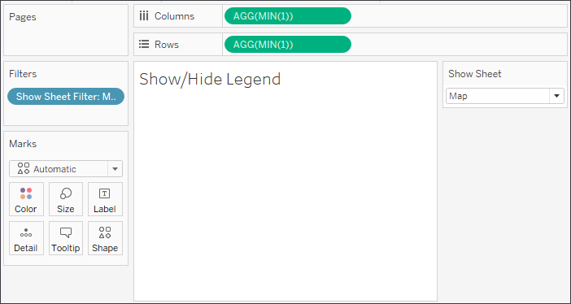

    Figure 11.13: The Show/Hide Legend sheet with the Show Sheet Filter
    applied

6.  On the **Sheet Swap** dashboard, add the **Show/Hide Legend** sheet
    to the layout container between the **Show Sheet** parameter
    dropdown and the color legend. Hide the title for the **Show/Hide
    Legend** sheet.

7.  Ensure that **Map** is selected. The color legend should be pushed
    all the way to the bottom.

8.  Add a layout container as a floating object. In terms of size and
    position, it should completely cover the area where the color legend
    used to be. It should cover the title of the **Show/Hide Legend**
    sheet but not the parameter dropdown.

    **Tip:**

    Objects and sheets can be added as floating objects by holding
    *Shift* while dragging, setting the **New Objects** option to
    **Floating**, or by using the drop-down menu on the object. You may
    also change the default behavior for new objects from tiled to
    floating in the **Dashboard** pane.

1.  The layout container is transparent by default, but we want it to
    hide what is underneath. Format it using the drop-down menu and add
    white shading so it is indistinguishable from the background.

At this point, you have a dynamic dashboard in which the legend is shown
when the map is shown and it is applicable, and
hidden when the bar chart is visible. When **Map** is selected, the
**Show/Hide Legend** sheet is shown and pushes the legend to the bottom
of the **Layout Container**:

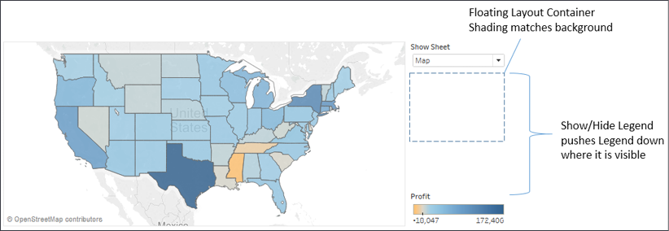

Figure 11.14: The Show/Hide Legend pushes the legend down past the
floating object

When **Bar Chart** is selected, the **Show/Hide Legend** sheet collapses
and the legend, which is no longer applicable to the view, falls
under/hides behind the **Floating Layout Container**:

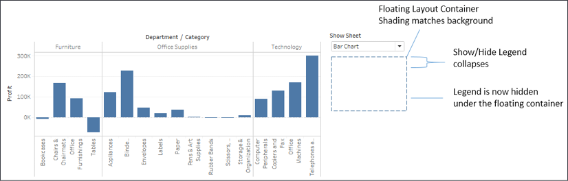

Figure 11.15: The Show/Hide Legend collapses, causing the legend to move
under the floating object

There is no limit to how many variations of this technique you can use
on a dashboard. You can have as many layers as
you\'d like. You can even use combinations of these techniques to push
views and objects on and off the dashboard. The possibilities for
creating a richly interactive user experience are incredible.

#### Summary

Creating truly dynamic dashboards give you incredible flexibility in
your dashboard design. Show/Hide buttons give the end user the option to
show or hide content on the dashboard. Sheet-swapping techniques allow
you to swap out which views are shown and also automatically show or
hide controls or other content.

The techniques covered in this lab will enable you to accomplish all
sorts of amazing interactivity, from hiding and showing controls,
instructions, and explanations of business rules and analysis to
allowing users to determine visualization types and swap views in and
out.

Next, we\'ll turn our attention to exploring a certain kind of data
using some advanced techniques: geospatial data!
