Lab 12. Exploring Mapping and Advanced Geospatial Features
==================================================


In this lab, we\'ll cover the following topics:

-   Overview of Tableau maps
-   Rendering maps with Tableau
-   Using geospatial data
-   Leveraging spatial functions
-   Creating custom territories
-   Tableau mapping: tips and tricks
-   Plotting data on background images


#### Overview of Tableau maps

Tableau contains an internal geographic database
that allows it to recognize common geographic elements and render a mark
at a specific latitude and longitude on a map. In many cases, such as
with a country or state, Tableau also contains internal shapefiles that
allow it to render the mark as a complex vector shape in the proper
location. Tableau also leverages your specific geospatial data, such as
latitude and longitude, shapefiles, and spatial objects. We\'ll consider
some of those possibilities throughout this
lab. For now, we\'ll walk through some of the basics of how Tableau
renders maps and some of the customizations and options available.


#### Rendering maps with Tableau


Consider the following screenshot (the
`Basic Map` example in the
`Chapter 12` workbook), with certain elements
numbered for reference:

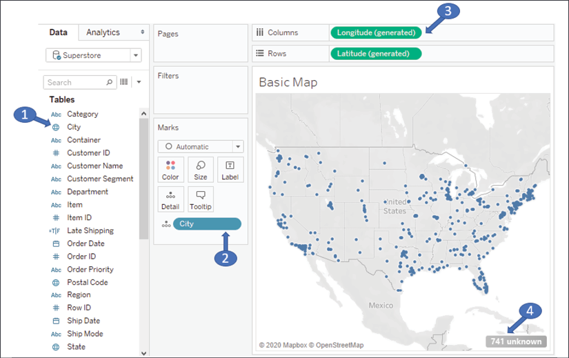

Figure 12.1: A basic geospatial rendering in Tableau

The numbers indicate some of the important aspects of Tableau\'s ability
to render maps:

1.  A geographic field in the data is indicated with a globe icon.
    Fields that Tableau recognizes will have this icon by default. You
    may assign a geographic role to any field by using the menu and
    selecting **Geographic Role**.
2.  The geographic field in the view (in this case, on **Detail**) is
    required to render the map.
3.  If Tableau is able to match the geographic field with its internal
    database, the **Latitude (generated)** and **Longitude (generated)**
    fields placed on **Rows** and **Columns** along with the geographic
    field(s) on the **Marks** card will render a map.
4.  Values that are not matched with Tableau\'s geographic database will
    result in an indicator that alerts you to the fact that there are
    unknown values.

**Note:**

You may right-click the unknown indicator to hide it, or click it for
the following options:

-   To edit locations (manually match location values to known values or
    latitude/longitude)
-   Filter out unknown locations
-   Plot at the default location (latitude and longitude of 0,
    a location that is sometimes humorously referred to as Null Island,
    located just off the west coast of Africa)


Tableau renders marks on the map similar to the
way it would on a scatterplot (in fact, you might think of a map as a
kind of scatterplot that employs some complex geometric transformations
to project latitude and longitude). This means you can render circles,
dots, and custom shapes on the map.

Under the marks, the map itself is a vector image retrieved from an
online map service. We\'ll consider the details and how to customize the
map layers and options next.

Customizing map layers
----------------------

The map itself---the land and water, terrain,
topography, streets, country and state borders, and more---are all part
of a vector image that is retrieved from an online map service (an
offline option is available).

Marks are then rendered on top of that image. You already know how to
use data, calculations, and parameters to adjust how marks are rendered,
but Tableau gives you a lot of control over how maps are rendered.

Use the menu to explore various options by selecting **Map** \|
**Background Maps**. Here, for example, is a **Dark Map**:

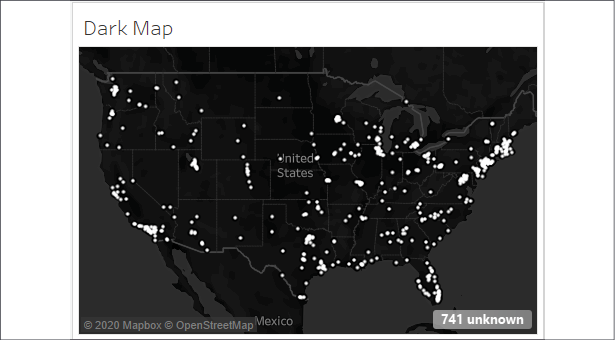

Figure 12.2: Dark Map is one of many options for map backgrounds

This map contains the exact same marks as the previous screenshot. It
simply uses a different background. Other options
include **Light**, **Streets**, **Satellite**, and more.

**Tip:**

If you will be using Tableau in an environment where the internet is not
available (or publishing to a Tableau server that lacks an internet
connection), select the **Offline** option. However, be aware that the
offline version does not contain the detail or zoom levels available in
the online options.


Additional layer options can be found by selecting **Map** \| **Map
Layers** from the menu. This opens a **Map Layers** pane that looks like
this:

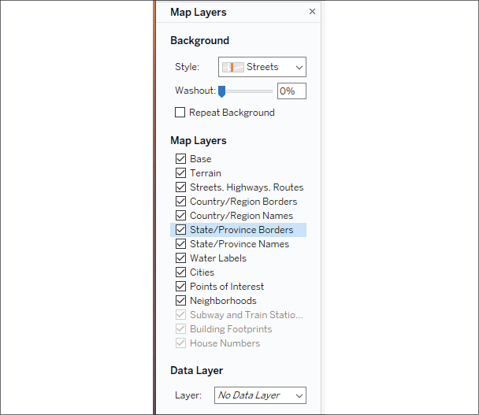

Figure 12.3: The Map Layers pane

The **Map Layers** pane gives you options for selecting a background,
setting washout, selecting features to display,
and setting a **Data Layer**. Various options may be disabled depending
on the zoom level (for example, **Building Footprints** is not enabled
unless you zoom in close enough on the map). **Data Layer** allows you
to apply a filled map to the background based on various demographics.
These demographics only appear as part of the image and are not
interactive and the data is not exposed to either user interaction or
calculation.

You may also use the menu options **Map** \| **Background Maps** \|
**Manage Maps** to change which map service is used, allowing you to
specify your own WMS server, a third party, or to use **Mapbox** maps.
This allows you to customize the background layers of your map
visualizations in any way you\'d like.

**Note:**

The details of these capabilities are outside the scope of this book,
however, you\'ll find excellent documentation from Tableau at
[[https://help.tableau.com/current/pro/desktop/en-us/maps\_mapsources\_wms.htm]](https://help.tableau.com/current/pro/desktop/en-us/maps_mapsources_wms.htm).


Customizing map options
-----------------------

Additionally, you can customize the map options
available to end users. Notice the controls that appear when you hover
over the map:

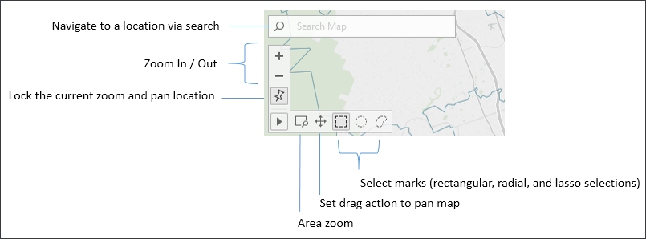

Figure 12.4 : Available controls when customizing a map

These controls allow you to search map, zoom in and out, pin the map to
the current location, and use various types of selections.

**Tip:**

You can also use keyboard and mouse combinations to navigate the map.
Use *Ctrl* + Mouse wheel or *Shift* + *Ctrl* + Mouse Click to zoom.
Click and hold or *Shift* + Click to pan.


Additional options will appear when you select **Map \| Map Options**
from the top menu:


Figure 12.5: Map Options

These options give you the ability to set what map actions are allowed
for the end user and whether to show a scale. Additionally, you can set
the units displayed for the scale and **radial selections**. The
options are **Automatic** (based on system
configuration), **Metric** (meters and kilometers), and **U.S.** (feet
and miles).

There are quite a few other geospatial capabilities packed into Tableau
and we\'ll uncover some of them as we next explore how to leverage
geospatial data.


#### Using geospatial data


We\'ve seen that with any data source, Tableau
supplies **Latitude (generated)** and **Longitude (generated)** fields
based on any fields it matches with its internal geographic database.
Fields such as country, state, zip code, MSA, and congressional district
are contained in Tableau\'s internal geography. As Tableau continues to
add geographic capabilities, you\'ll want to consult the documentation
to determine specifics on what the internal database contains.

However, you can also leverage specific geospatial data in your
visualizations. We\'ll consider ways to use data that enable geospatial
visualizations, including the following:

-   Including `Latitude` and
    `Longitude` as values in your data.
-   Importing a `.csv` file containing
    definitions of `Latitude` and
    `Longitude` into Tableau\'s database.
-   Leveraging Tableau\'s ability to connect to various spatial files or
    databases that natively support spatial objects.

We\'ll explore each of these options in the following section and then
look at how to extend the data even further with
geospatial functions in the next.

Including latitude and longitude in your data
---------------------------------------------

Including latitude and longitude in your data
gives you a lot of flexibility in your visualizations (and
calculations). For example, while Tableau has built-in geocoding for
countries, states, and zip codes, it does not provide geocoding at an
address level. Supplying latitude or longitude in your data gives you
the ability to precisely position marks on the map.

You\'ll find the following example in the
`Chapter 12` workbook using the
`Real Estate` data source:

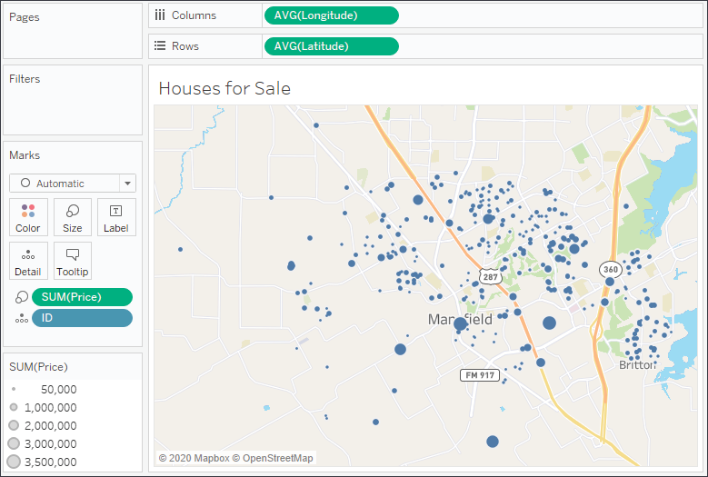

Figure 12.6: A map of houses for sale, sized by price

Here, each individual house could be mapped with a precise location and
sized according to price. In order to help the viewer visually, the
**Streets** background has been applied.

**Tip:**

There are many free and commercial utilities that allow you to
**geocode** addresses. That is, given an address, these tools will add
latitude and longitude.


If you are not able to add the fields directly to your data source, you
might consider using cross-database joins or data blending. Another
alternative is to import latitude and longitude
definitions directly into Tableau. We\'ll
consider this option next.

Importing definitions into Tableau\'s geographic database
---------------------------------------------------------

In order to import from the menu, select **Map**
\| **Geocoding** \| **Import Custom Geocoding\...**. The import dialog
contains a link to documentation describing the option in further
detail:

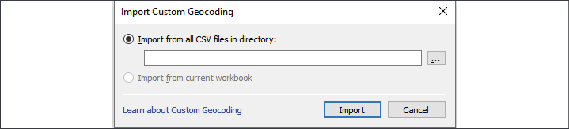

Figure 12.7: The Import Custom Geocoding dialog box

By importing a set of definitions, you can either:

-   Add new geographic types
-   Extend Tableau\'s built-in geographic types

Latitude and longitude define a single point. At times, you\'ll need to
render shapes and lines with more geospatial complexity. For that,
you\'ll want to consider some of the geospatial functions and spatial
object support, which we\'ll look at next.

Leveraging spatial objects
--------------------------

Spatial objects define geographic areas that can
be as simple as a point and as complex as
multi-sided polygons. This allows you to render everything from custom
trade areas to rivers, roads, and historic boundaries of counties and
countries. Spatial objects can be stored in spatial files and are
supported by some relational databases as well.

Tableau supports numerous spatial file formats, such as
`ESRI`, `MapInfo`,
`KML`, `GeoJSON`, and
`TopoJSON`. Additionally, you may connect
directly to `ESRI` databases as well as
relational databases with geospatial support, such as
`ESRI` or SQL Server. If you create an extract,
the spatial objects will be included in the extract.

Many applications, such as `Alteryx`,
`Google Earth`, and
`ArcGIS`, can be used to generate spatial files.
Spatial files are also readily available for download from numerous
organizations. This gives you a lot of
flexibility when it comes to geospatial analysis.

Here, for example, is a map of US railroads:

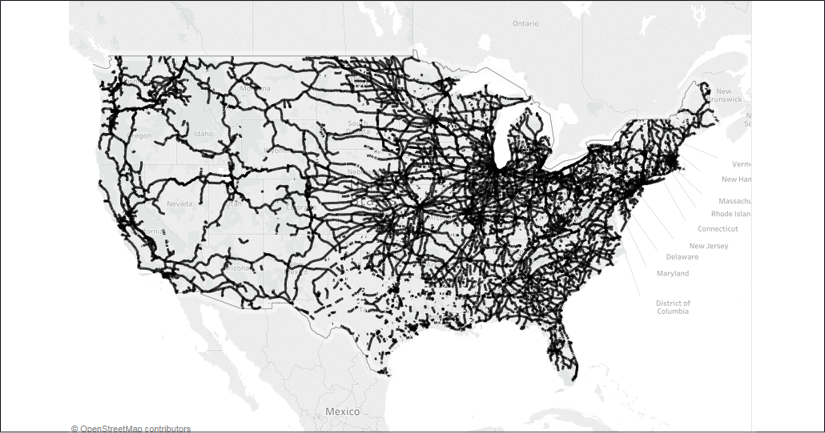

Figure 12.8: Map of US railroads

To replicate this example, download the shapefile from the United
States\' Census Bureau here:
[[https://catalog.data.gov/dataset/tiger-line-shapefile-2015-nation-u-s-rails-national-shapefile]](https://catalog.data.gov/dataset/tiger-line-shapefile-2015-nation-u-s-rails-national-shapefile).

Once you have downloaded and unzipped the files, connect to the
`tl_2015_us_rails.shp` file. In the preview,
you\'ll see records of data with ID fields and railway names. The
**Geometry** field is the spatial object that defines the linear shape
of the railroad segment:

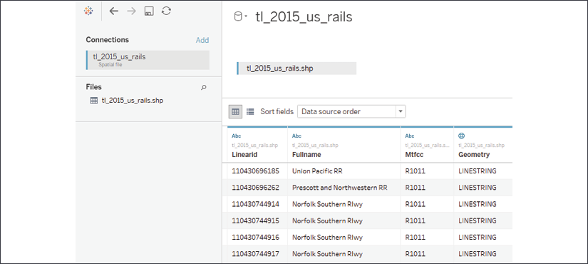

Figure 12.9: Map of US railroads preview

On a blank sheet, simply double-click the **Geometry** field. Tableau
will include the geographic collection in the detail and introduce
automatically generated latitude and longitude fields
to complete the rendering. Experiment with
including the ID field in the detail and with
filtering based on **Fullname**.

**Tip:**

Consider using cross-database joins to supplement existing data with
custom spatial data. Additionally, Tableau supports spatial joins, which
allow you to bring together data that is only related spatially, even if
no other relationships exist.


Next, we\'ll take a look at leveraging some spatial functions and even a
spatial join or two to extend your analytics.


#### Leveraging spatial functions


Tableau continues to add native support for
spatial functions. At the time of writing, Tableau supports the
following functions:

-   `Makeline()` returns a line spatial object
    given two points.
-   `Makepoint()` returns a point spatial object
    given two coordinates.
-   `Distance()` returns the distance between two
    points in the desired units of measurement.
-   `Buffer()` creates a circle around a point
    with a radius of the given distance. You may specify the units of
    measurement.

We\'ll explore a few of these functions using the
`Hospital and Patients` dataset in the
`Chapter 12 `workbook. The dataset reimagines the
real estate data as a hospital surrounded by patients,
indicated in the following view by the difference
in **Shape**, **Size**, and **Color**:

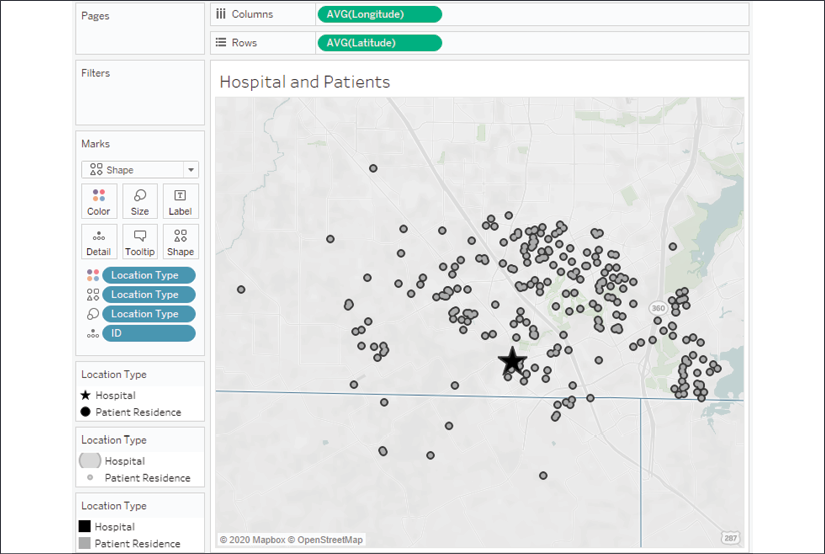

Figure 12.10: A hospital (represented by the star) surrounded by
patients

There are numerous analytical questions we might ask. Let\'s focus on
these:

-   How far is each patient from the hospital?
-   How many patients fall within a given radius?
-   Which patients are outside the radius?

To start answering these questions, we\'ll create some calculated fields
that give us the building blocks. In order to use multiple points in the
same calculation, the latitude and longitude of the
hospital will need to be included with each
patient record. One way to achieve this is by using a couple of
`FIXED` **Level of Detail** (**LOD**) expressions
to return the values to each row.

We\'ll create a calculation called
`Hospital Latitude` with the following code:

``` 
{FIXED : MIN(IF [Location Type] == "Hospital" THEN [Latitude] END)}
```


And a corresponding calculation called
`Hospital Longitude` with the following code:

``` 
{FIXED : MIN(IF [Location Type] == "Hospital" THEN [Longitude] END)}
```


In each case, the latitude and longitude for the
hospital is determined with the
`IF`/`THEN` logic and
returned as a row-level result by the `FIXED` LOD
expression. This gives us the building blocks for a couple of additional
calculations. We\'ll next consider a couple of examples, contained in
the `Chapter 12` workbook.

MAKELINE() and MAKEPOINT()
--------------------------

As we consider these two functions, we\'ll create
a calculated field to draw a line between
the hospital and each
patient. We\'ll name our calculation `Line` and
write this code:

``` 
MAKELINE(
    MAKEPOINT([Hospital Latitude], [Hospital Longitude]),
    MAKEPOINT([Latitude], [Longitude])
)
```


`MAKELINE()` requires two points, which can be
created using the `MAKEPOINT()` function. That
function requires a latitude and longitude. The first point is for
the hospital and the second is the latitude and longitude for the
patient.

**Note:**

As the function returns a spatial object, you\'ll notice the field has a
geography icon:


Figure 12.11: Geography icon added to Line field


On a new visualization, if you were to double-click the **Line** field,
you\'d immediately get a geographic visualization because that field
defines a geospatial object. You\'ll notice the **COLLECT(Line)** field
on **Detail**, and Tableau\'s **Longitude (generated)** and **Latitude
(generated)** on **Columns** and **Rows**. The geospatial collection is
drawn as a single object unless you split it apart by adding dimensions
to the view.

In this case, each ID defines a separate line, so
adding it to **Detail** on the **Marks** card
splits the geospatial object
into separate lines:

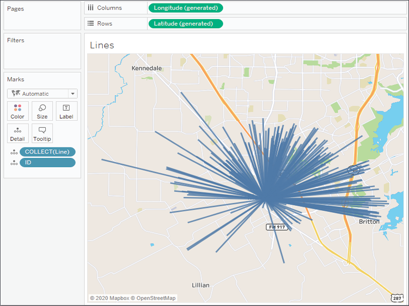

Figure 12.12: Each line originates at the hospital and is drawn to a
patient

What if we wanted to know the distance covered by each line? We\'ll
consider that next in an expanded example.

DISTANCE()
----------

Distance can be a very important concept as we
analyze our data. Knowing how far apart two
geospatial points are can give us a lot of insight. The calculation
itself is very similar to `MAKELINE()` and we
might create a calculated field named
`Distance to the Hospital` with the following
code:

``` 
DISTANCE(
    MAKEPOINT([Hospital Latitude], [Hospital Longitude]),
    MAKEPOINT([Latitude], [Longitude]),
    'mi'
)
```


Similar to the `MAKELINE()` calculation, the
`DISTANCE()` function requires a couple of
points, but it also requires a unit of measurement. Here, we\'ve
specified miles using the argument `'mi'`, but we
could have alternately used `'km'` to specify
kilometers.

We can place this calculation on **Tooltip** to see the distance covered
by each line:

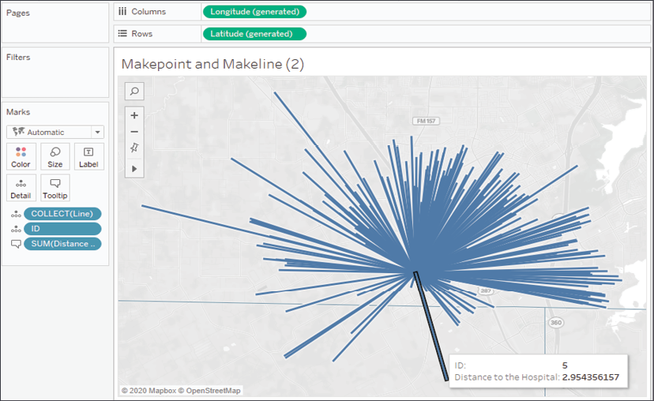

Figure 12.13: The tooltip now displays the distance from the hospital to
the patient

This simple example could be greatly extended. Right now, we can tell
that patient ID **5** is **2.954...** miles away from the hospital when
we hover over the line. We could improve the display by rounding down
the distance to `2` decimal places or looking up
the patient\'s name. We could greatly increase the analytical usefulness
by using the distance as a filter (to analyze
patients that are over or under a certain threshold of distance) or
using distance as a correlating factor in more
complex analysis.

We can accomplish some of this visually with
`Buffer()`, which we\'ll explore next!

BUFFER()
--------

Buffer is similar to `DISTANCE()`, but the
reverse. Rather than calculating a distance between two
points, the `BUFFER()`
function allows you to specify a point, a
distance, and a unit of measurement to draw a circle with a radius of
the specified distance around the point.

For example, you might want to visualize which patients fall within a
3-mile radius of the hospital. To do that, we\'ll create a calculated
field named `Hospital Radius`, with the following
code:

``` 
IF [Location Type] == "Hospital"
THEN BUFFER(MAKEPOINT([Latitude], [Longitude]), 3, 'mi')
END
```


This code first checks to make sure to perform the calculation only for
the hospital record. The `BUFFER()` calculation
itself uses the latitude and longitude to make a point and then
specifies a 3-mile radius.

In order to visualize the radius along with the individual marks for
each patient, we\'ll create a **dual-axis map**. A dual-axis map
copies either the latitude or longitude fields on
rows or columns and then uses the separate sections of the **Marks**
card to render different geospatial objects. Here, for example, we\'ll
plot the points for patients as circles and the radius using the
**Automatic** mark type:

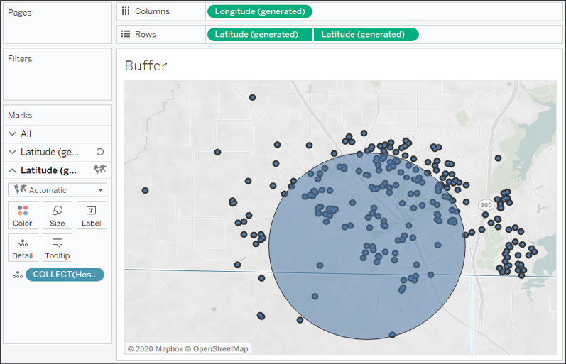

Figure 12.14: Patients who fall within a 3-mile radius of the hospital

Notice that we\'ve used the generated **Latitude** and **Longitude**
fields. These serve as placeholders for Tableau to visualize any spatial
objects. On the first section of the **Marks** card,
we include the **Latitude** and **Longitude**
fields from the data. On the second, we included
the **Hospital Radius** field. In both cases, the generated fields allow
Tableau to use the geographic or spatial objects on the **Marks** card
to define the visualization.

We\'ve barely scratched the surface of what\'s possible with spatial
functions. For example, you could parameterize the radius value to allow
the end user to change the distance dynamically. You could use
`MAKEPOINT()` and
`BUFFER()` calculations as join calculations in
your data source to bring together spatially related data. With this
data, for example, you could **intersect join** the hospital record on
`BUFFER()` to the patient records on
`MAKEPOINT()` to specifically work with a dataset
that includes or excludes patients within a certain radius. This greatly
increases your analytic capabilities.

With a good understanding of the geospatial functions available, let\'s
shift our focus just a bit to discuss another topic of interest:
creating custom territories.


#### Creating custom territories

**Custom territories** are geographic areas or regions that you create
(or that the data defines) as opposed to those
that are built in (such as country or area code). Tableau
gives you two options for creating custom
territories: **ad hoc custom territories** and **field-defined custom
territories**. We\'ll explore these next.

Ad hoc custom territories
-------------------------

You can create custom territories in an ad hoc
way by selecting and grouping marks on a map.
Simply select one or more marks, hover over one, and then use the
**Group** icon. Alternately, right-click one of the marks to find the
option. You can create custom territories by grouping by any dimension
if you have latitude and longitude in the data or any geographic
dimension if you are using Tableau\'s generated latitude and longitude.

Here, we\'ll consider an example using zip code:

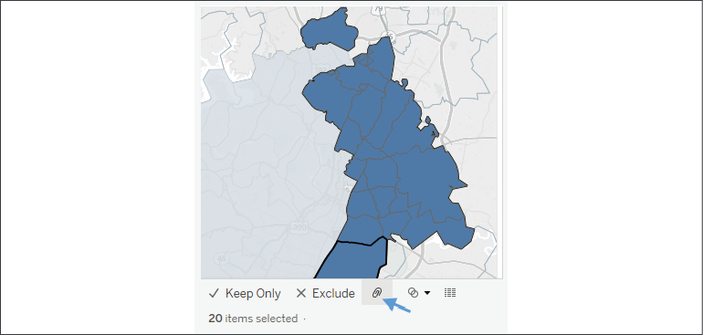

Figure 12.15: After selecting the filled regions to group as a new
territory, use the paperclip icon to create the group

You\'ll notice that Tableau creates a new field,
`Zip Code (group)`, in this example. The new
field has a paperclip and globe icon in the data pane, indicating it is
a group and a geographic field:


Figure 12.16: A group and geographic field

Tableau automatically includes the group field on **Color**.

You may continue to select and group marks until
you have all the custom territories you\'d like.
With zip code still part of the view level of detail, you will have a
mark for each zip code (and any measure will be sliced by zip code).
However, when you remove zip code from the view, leaving only the
`Zip Code (group)` field, Tableau will draw the
marks based on the new group:

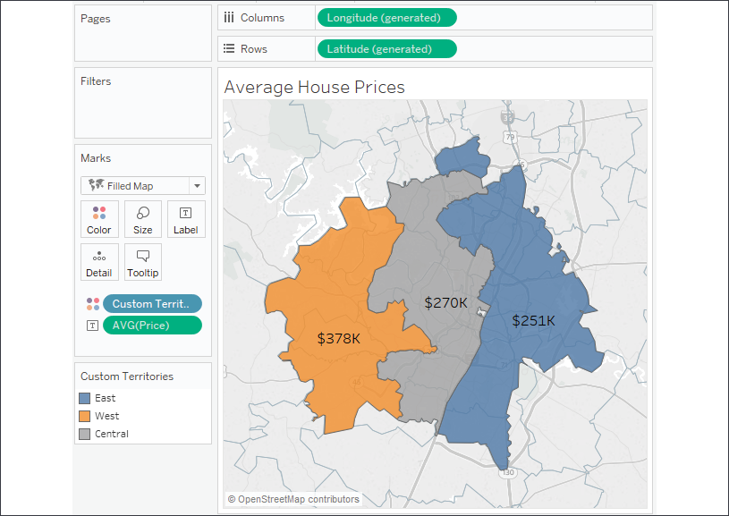

Figure 12.17: Grouping by Custom Territories

Here, the group field has been renamed
`Custom Territories` and
the group names have been aliased as `East`,
`West`, and `Central`. We
can see the average price of houses in each of the custom territories.

The details of these capabilities are outside the scope of this book,
however, you\'ll find excellent documentation from Tableau at
[[https://help.tableau.com/current/pro/desktop/en-us/maps\_mapsources\_wms.htm]](https://help.tableau.com/current/pro/desktop/en-us/maps_mapsources_wms.htm).

**Note:**

With a filled map, Tableau will connect all contiguous areas and still
include disconnected areas as part of selections and highlighting. With
a symbol map, Tableau will draw the mark in the geographic center of all
grouped areas.


Sometimes the data itself defines the territories. In that case, we
won\'t need to manually create the territories.
Instead, we\'ll use the technique described next.

Field-defined custom territories
--------------------------------

Sometimes your data includes the definition of
custom territories. For example, let\'s say your
data had a field named **Region** that already grouped zip codes into
various regions. That is, every zip code was contained in only one
region. You might not want to take the time to select marks and group
them manually.

Instead, you can tell Tableau the relationship already exists in the
data. In this example, you\'d use the drop-down menu of the **Region**
field in the data pane and select **Geographic Role** \| **Create
From\...** \| **Zip Code**. **Region** is now a geographic field that
defines custom territories:

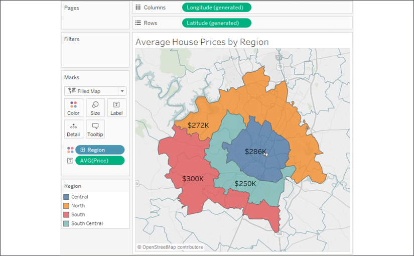

Figure 12.18: The custom regions here are defined by the Region field in
the data

In this case, the regions have been defined by the **Region** field in
the data. If the regions are redefined at a later date, Tableau will
display the new regions (as long as the data is updated). Using
field-defined custom regions gives us confidence that we won\'t need to
manually update the definitions.

**Tip:**

Use ad hoc custom territories to perform quick analysis, but consider
field-defined custom territories for long-term solutions because you can
then redefine the territories in the
data without manually editing any groups in the
Tableau data source.


#### Tableau mapping – tips and tricks

There are a few other tips to consider when
working with geographic visualizations:

Use the top menu to select **Map** \| **Map Layers** for numerous
options for what layers of background to show as part of the map.

-   Other options for zooming include using the mouse wheel,
    double-clicking, *Shift* + *Alt* + click, and *Shift* + *Alt* +
    *Ctrl* + click.

-   You can click and hold for a few seconds to switch to pan mode.

-   You can show or hide the zoom controls and/or map search by
    right-clicking the map and selecting the appropriate option.

-   Zoom controls can be shown on any visualization type that uses an
    axis.

-   The pushpin on the zoom controls alternately returns the map to the
    best fit of visible data or locks the current zoom and location.

-   You can create a **dual-axis map** by duplicating (*Ctrl* +
    drag/drop) either the **Longitude** on **Columns** or **Latitude**
    on **Rows** and then using the field\'s drop-down menu to select
    **Dual Axis**. You can use this technique to combine multiple mark
    types on a single map:

    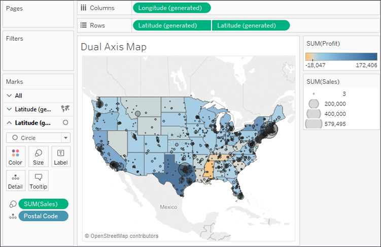

    Figure 12.19: Dual Axis Map showing Profit at a state level and
    Sales at a Postal Code level

    You can use dual axes to display various
    levels of detail or to use different mark types. In this case, both
    are accomplished. The map leverages the dual axis to show **Profit**
    at a state level with a filled map and **Sales** at a **Postal
    Code** level with a circle:

    -   When using filled maps, consider setting **Washout** to **100%**
        in the **Map Layers** window for clean-looking maps. However,
        only filled shapes will show, so any missing states (or
        counties, countries, or others) will not be drawn:

        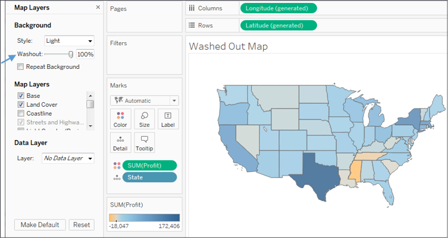

        Figure 12.20: Washed Out Map

    ```{=html}
    <!-- -->
    ```
    -   You can change the source of the
        background map image tiles using the menu and selecting **Map**
        \| **Background Maps**. This allows you to choose between
        **None**, **Offline** (which is useful when you don\'t have an
        internet connection but is limited in the detail that can be
        shown), or **Tableau** (the default).
    -   Additionally, from the same menu option, you can specify **Map
        Services\...** to use a `WMS server` or
        `Mapbox`.

Next, we\'ll conclude this lab by exploring how plotting your data
onto background images can further enhance data visualization and
presentation.


#### Plotting data on background images


Background images allow you to plot data on top
of any image. Consider the possibilities! You
could plot ticket sales by seat on an image of a stadium, room occupancy
on the floor plan of an office building, the number of errors per piece
of equipment on a network diagram, or meteor impacts on the surface of
the moon.

In this example, we\'ll plot the number of patients per month in various
rooms in a hospital. We\'ll use two images of floorplans for the ground
floor and the second floor of the hospital. The data source is located
in the `Chapter 12` directory and is named
`Hospital.xlsx`. It consists of two tabs: one for
patient counts and another for room locations based on the x/y
coordinates mapped to the images. We\'ll shortly consider how that
works. You can view the completed example in the
`Chapter 12`
`Complete.twbx` workbook or start from scratch
using `Chapter 12`
`Starter.twbx`.

To specify a background image, use the top menu to select **Map** \|
**Background Images** and then click the data source to which the image
applies -- in this example,
`Patient Activity (Hospital)`. On the
**Background Images** screen, you can add one or more images.

Here, we\'ll start with
`Hospital - Ground Floor.png`, located
in the `Chapter 12`
directory:

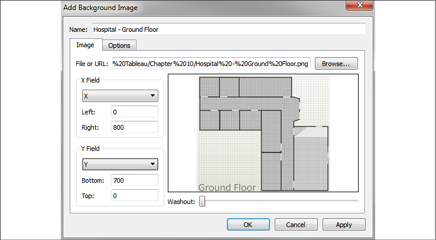

Figure 12.21: Add Background Image pane

You\'ll notice that we mapped the fields **X** and **Y** (from the
**Locations** tab) and specified **Right** at **800** and **Bottom** at
**700**. This is based on the size of the image in pixels.

**Tip:**

You don\'t have to use pixels, but most of the time it makes it far
easier to map the locations for the data. In this case, we have a tab of
an Excel file with the locations already mapped to the **x** and **y**
coordinates on the image (in pixels). With cross-database joins, you can
create a simple text or Excel file containing mappings for your images
and join them to an existing data source. You can map points manually
(using a graphics application) or use one of many free online tools that
allow you to quickly map coordinates on images.


We\'ll only want to show this blueprint for the ground floor, so
switching to the **Options** tab, we\'ll ensure that the condition is
set based on the data. We\'ll also make sure to check **Always Show
Entire Image**:

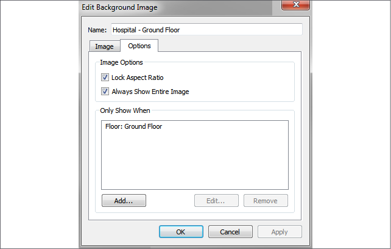

Figure 12.22: Edit Background Image pane

Next, repeating the preceding steps, we\'ll add
the second image
(`Hospital - 2nd Floor.png`) to the data source,
ensuring it only shows for `2nd Floor`.

Once we have the images defined and mapped, we\'re ready to build a
visualization. The basic idea is to build a scatterplot using the **X**
and **Y** fields for axes. But we have to ensure that **X** and **Y**
are not summed because if they are added together for multiple records,
then we no longer have a correct mapping to pixel locations. There are a
couple of options:

-   Use **X** and **Y** as continuous dimensions.
-   Use `MIN`, `MAX`, or
    `AVG` instead of
    `SUM`, and ensure that **Location** is used
    to define the view level of detail.
-   Additionally, images are measured from 0 at the top to **Y** at the
    bottom, but scatterplots start with 0 at the bottom and values
    increase upward. So, initially, you may see your background images
    appear upside-down. To get around this, we\'ll edit the *y* axis
    (right-click and select **Edit Axis**) and check the option for
    **Reversed**.

We also need to ensure that the **Floor** field is used in the view.
This is necessary to tell Tableau which image should be
displayed. At this point, we should be able to
get a visualization like this:

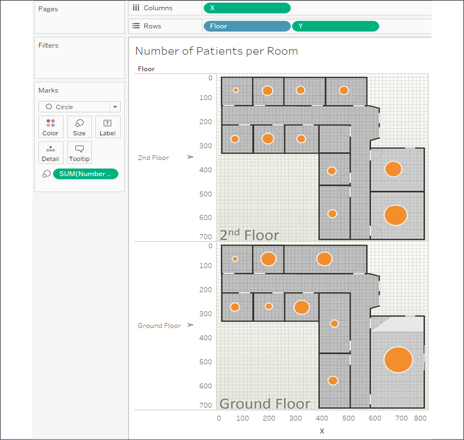

Figure 12.23: Plotting the number of patients per room on a floorplan
image

Here, we\'ve plotted circles with the size based on the number of
patients in each room. We could clean up and modify the visualization in
various ways:

-   Hide the *x* and *y* axes (right-click the axis and uncheck **Show
    Header**)
-   Hide the header for **Floor**, as the image already includes the
    label
-   Add **Floor** to the **Filter** shelf so that the end user can
    choose to see one floor at a time

The ability to plot marks on background images opens a world of
possibilities for communicating complex topics. Consider how you might
show the number of hardware errors on a diagram
of a computer network, the number of
missed jump shots on a basketball court, or the
distance between people in an office building. All of this, and more, is
possible!


### Summary

We\'ve covered a lot of ground in this lab! The basics of
visualizing maps are straightforward, but there is a lot of power and
possibility behind the scenes. From using your own geospatial data to
leveraging geospatial objects and functions, you have a lot of
analytical options. Creating custom territories and plotting data on
background images expand your possibilities even further.

Next, we\'ll turn our attention to a brand new feature of Tableau
2020.2: Data Model! And we\'ll explore the difference between data model
relationships, joins, blends, and see how all of them can be used to
perform all kinds of valuable analysis!
