Understanding the Tableau Data Model, Joins, and Blends
=======================================================

In this lab, we\'ll cover the following topics:

-   Explanation of the sample data used in this lab
-   Exploring the Tableau data model
-   Using joins
-   Using blends
-   When to use a data model, joins, or blends

We\'ll start by understanding the sample dataset included in the
workbook for this lab. This is so that you have a good foundation of
knowledge before working through the examples.

#### Explanation of the sample data used in this lab

For this lab, we\'ll use a sample dataset of patient visits to the
hospital. The data itself is contained in the Excel file
`Hospital Visits.xlsx` in the
`Learning Tableau\Chapter 13` directory. The tabs
of the Excel file represent tables of data, just as you might find in
any relational database as multiple files, or simply as literal tabs in
an Excel file! The relationship between those tables is illustrated
here:

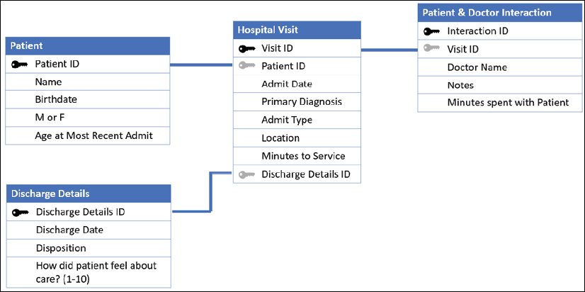

Figure 13.1: The four tabs of the Excel file illustrated as four tables
with relationships

Excel does not explicitly define the relationships, but they are shown
here as they might exist in a relational database using foreign key
lookups. Here is a brief explanation of the tables and their
relationships:

-   **Hospital Visit**: This is the primary table that records the
    admission and diagnosis of a single patient on a single visit to the
    hospital. It contains attributes, such as **Admit Type** and
    **Location**, and a measure of **Minutes to Service**.
-   **Patient**: This table contains additional information for a single
    patient, such as their **Name** and **Birthdate**, and a measure of
    their **Age at Most Recent Admit**.
-   **Discharge Details**: This table gives additional information for
    the discharge of a patient, such as the **Discharge Date** and the
    **Disposition** (the condition under which they were discharged and
    where they went after being discharged). It also contains a measure
    **How did the patient feel about care? (1-10)** that ranks the
    patient\'s feelings about the level of care, with 1 being the lowest
    and 10 being the highest.
-   **Patient & Doctor Interaction**: This table defines the interaction
    between a patient and a doctor during the visit. It includes the
    **Doctor Name**, **Notes**, and measures how long the doctor spent
    with the patient (**Minutes spent with Patient**).

The tables relate to each other in different ways. Here are some
details:

-   **Hospital Visit** to **Patient**: Each visit has a single patient,
    so **Hospital Visit** will always have a **Patient ID** field that
    points to a single record in the **Patient** table. We will also
    find additional patients in the **Patient** table who do not have
    recorded visits. Perhaps they are historical records from a legacy
    system or the patient\'s interaction with the hospital occurred in a
    manner other than a visit.
-   **Hospital Visit** to **Discharge Details**: Each visit may have a
    single discharge, but some patients may still be in the hospital. In
    a well-designed data structure, we should be able to count on a
    record in the **Discharge Details** table that indicates \"still in
    the hospital.\" In our Excel data, however, there may or may not be
    a **Discharge Details ID**, meaning there won\'t always be
    a matching **Discharge Details** record for every **Hospital
    Visit**.
-   **Patient & Doctor Interaction** to **Hospital Visit**: Throughout
    the patient\'s visit, there may be one or more doctors who interact
    with a patient. It\'s also possible that no doctor records any
    interaction. So, we\'ll sometimes find multiple records in the
    **Patient & Doctor Interaction** that reference a single **Visit
    ID**, sometimes only a single record, and sometimes no records at
    all for a visit that exists in the **Hospital Visit** table.

With a solid grasp of the sample data source, let\'s turn our attention
to how we might build a data model in Tableau.

#### Exploring the Tableau data model

You\'ll find the data model as a new feature in
Tableau 2020.2 and later. Every data source will use the data model.
Data sources created in previous versions will be updated to the data
model but will be contained in a single object, so, functionally, they
will work in the same way as the previous version.

Previous versions of Tableau allow you to leverage joining tables and
blending data sources together, and we\'ll consider those options at the
end of this lab. For now, we\'ll look at creating a
data model and understanding the paradigm.

Creating a data model
---------------------

We\'ve briefly looked at the **Data Source**
screen in *Chapter 2*, *Connecting to Data in Tableau*. Now, we\'ll take
a deeper look at the concepts behind the interface. Feel free to follow
along with the following example in the
`Chapter 13 Starter.twb` workbook, or examine the
end results in `Chapter 13 Complete.twbx`.

We\'ll start by creating a connection to the
`Hospital Visits.xlsx` file in the
`Chapter 13` directory. The **Data Source**
screen will look like this upon first connecting to the file:

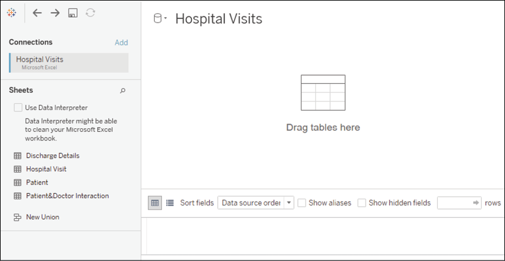

Figure 13.2: The Data Source screen lists the tabs in the Excel workbook
and invites you to start a data model

We\'ll build the data model by dragging and dropping tables onto the
canvas. We\'ll add all four tables. Tableau will suggest relationships
for each new table added based on any matching field names and types.
For our tables, we\'ll accept the default settings because the
`ID` fields that indicate the correct
relationship are identically named and typed.

The first table added is the root and forms the start of the data model.
In this example, the order in which you add the tables won\'t matter,
though you may notice a slightly different display depending on which
table you start with. In the following screenshot, we\'ve started with
**Hospital Visit** (which is the primary table and, therefore, makes
sense to be the root table) and then added all of
the other tables:

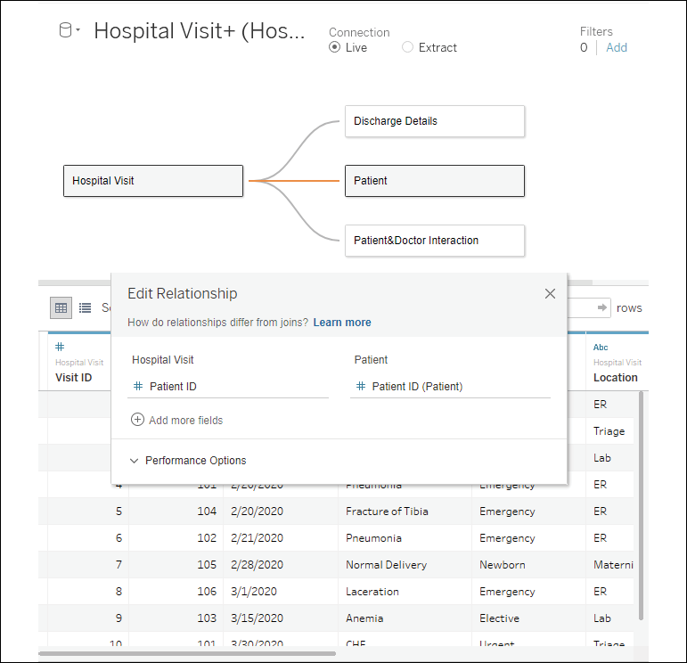

Figure 13.3: All tables have been added to the data model

You\'ll notice the **Edit Relationship** dialog box is open for the
relationship between **Hospital Visit** and **Patient**. Tableau
automatically created our relationships because the ID fields had the
same name and type between both tables. If necessary, you could manually
edit the relationships to change which fields define the relationship.

**Note:**

A **relationship** simply defines which fields connect the tables
together. It does not define exactly how the tables relate to each
other. We\'ll discuss the concepts of join types (for example, left join
or inner join) later on in this lab, but relationships are not
restricted to a certain join type. Instead, Tableau will use the
appropriate kind of join as well as the correct aggregations depending
on which fields you use in your view. For the most part, you won\'t have
to think about what Tableau is doing behind the scenes, but we\'ll
examine some unique behaviors in the next section.

The ability to write calculations to define relationships is not
available in 2020.2, but is a feature in 2020.3.

Also, notice the **Performance Options**
drop-down menu in the relationship editor, as shown here:

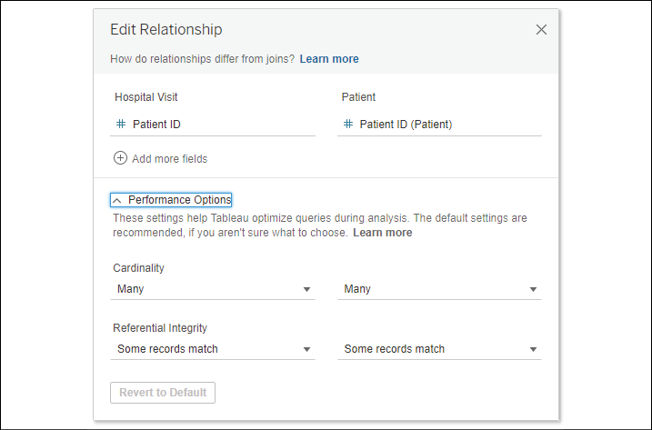

Figure 13.4: The Edit Relationship dialog box includes options to
improve performance

These performance options allow Tableau to generate more efficient
queries if the nature of the relationship is known. If you do not know
the exact nature of the relationship, it is best to leave the options in
their default settings as an incorrect setting can lead to incorrect
results.

There are two basic concepts covered by the performance options:

-   **Cardinality**: This term indicates how many records in one table
    could potentially relate to the records of another table. For
    example, we know that one visit matches to only one patient.
    However, we also know that many doctors could potentially interact
    with a patient during one visit.
-   **Referential Integrity**: This term indicates whether we expect all
    records to find a match or whether some records could potentially be
    unmatched. For example, we know (from the
    preceding description) that there are patients in the **Patient**
    table that will not have a match in the **Hospital Visit** table. We
    also know that some patients will not have discharge records as they
    are still in the hospital.

If Tableau is able to determine constraints from a relational database,
those constraints will be used. Otherwise, Tableau will set the defaults
to **Many** and **Some records match**. For the examples in this
lab, we do know the precise nature of the relationships (they are
described in the previous section), but we\'ll accept the performance
defaults as the dataset is small enough that there won\'t be any
perceptible performance gain in modifying them.

With our initial data model created, let\'s take a moment to explore the
two layers of the data model paradigm.

Layers of the data model
------------------------

A data model consists of two layers:

-   The **logical layer**: A semantic layer made
    up of logical tables or objects that are related. Each logical table
    might be made up of one or more physical tables.
-   The **physical layer**: A layer made up of
    the physical tables that come from the underlying data source. These
    tables may be joined or unioned together with conventional joins or
    unions or created from custom SQL statements.

Consider the following screenshot of a canvas containing our four
tables:

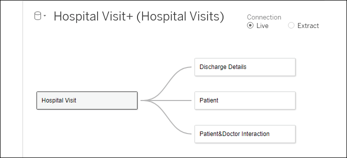

Figure 13.5: The logical layer of the data model

This initial canvas defines the **logical
tables** of the data model. A logical table is a collection of data that
defines a single structure or object that relates to other logical
structures of data. Double-click on the **Hospital Visit** table on the
canvas, and you\'ll see another layer beneath the logical layer:

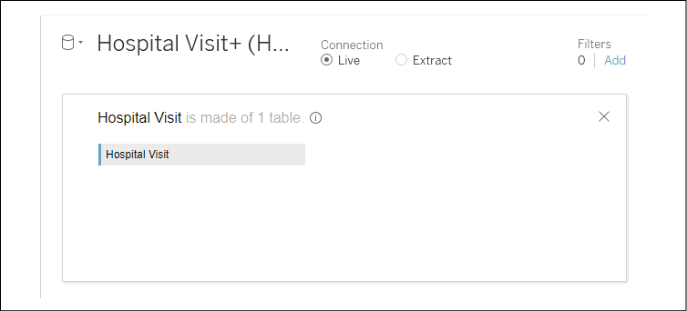

Figure 13.6: The physical layer of the physical tables that make up
Hospital Visit

This is the physical layer for the logical **Hospital Visit** table.
This physical layer is made up of physical tables of data---potentially
unioned or joined together. In this case, we are informed that
**Hospital Visit is made of 1 table**. So, in this case, the logical
layer of **Hospital Visit** is identical to the physical layer
underneath. In the *Using joins* section of this lab, we\'ll explore
examples of how we might extend the complexity of the physical layer
with multiple tables while still treating the collection of tables as a
single object.

Go ahead and close the physical layer of
**Hospital Visit** with the **X** icon in the upper-right corner. Then
navigate to the **Analysis** tab of the workbook for this lab, and
we\'ll explore how the data model works in practice.

Using the data model
--------------------

For the most part, working with the data model
will be relatively intuitive. If you\'ve worked with previous Tableau
versions, you\'ll notice some slight interface changes, and there are a
few data model behaviors you should learn to expect. Once you are
comfortable with them, your analysis will exceed expectations!

### The new data pane interface

One thing you may notice is the difference in the
**Data** pane, which will look something like this:

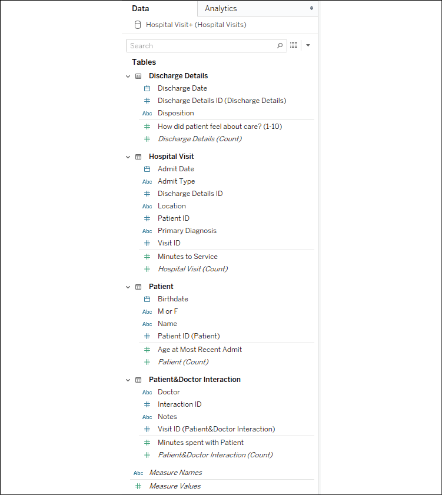

Figure 13.7: The Data pane is organized by logical tables and shows a
separation of dimensions and measures per table

You\'ll notice that the **Data** pane is organized by logical tables,
with fields belonging to each table. Measures and
dimensions are separated by a thin line rather than appearing in
different sections as they did previously. This makes it easier to find
the fields relevant to your analysis and also helps you to understand
the expected behavior of the data model. Also different from previous
versions is that each logical table has its own
`number of records` field that is named using the
convention **Table Name (Count)**. You\'ll find the calculations you can
add along with **Measure Names**/**Measure Values** at the bottom of the
list of fields.

Following this overview of some of the UI
changes, let\'s look at some behaviors you can expect from the data
model.

### Data model behaviors

In the **Analysis** tab of the
`Starter` workbook, experiment with creating
different visualizations. Especially note dimensions, what values are
shown, and how measures are aggregated. We\'ll walk through a few
examples to illustrate (which you can replicate in the
`Starter` workbook or examine in the
`Complete` workbook).

First, notice that dragging **Name** from the **Patient** table to
**Rows** reveals 10 patients. It turns out that not all of these
patients have hospital visits, but when we use one or more dimensions
from the same logical table, we see the full domain of values in
Tableau. That is, we see all the patients, whether or not they had
visited the hospital. We can verify how many visits each patient had by
adding the **Hospital Visit (Count)** field, resulting in the following
view:

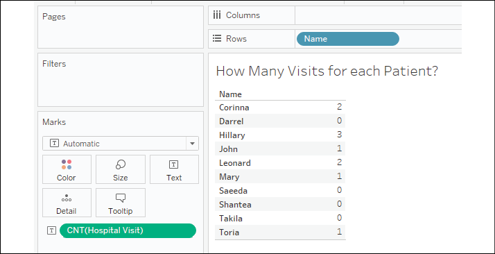

Figure 13.8: All patients are shown, even those with 0 visits

But if we add **Primary Diagnosis** to the table, notice that only 6 out
of the 10 patients are shown:

Figure 13.9: Only patients with visits are shown; most patients had a
single visit with a given diagnosis, but one came in twice with the same
diagnosis

This highlights another behavior: when you
include dimensions from two or more tables, only matching values are
shown. In essence, when you add **Name** and **Primary Diagnosis**,
Tableau is showing you patients who exist in both the **Patient** and
**Hospital Visit** tables. This is great if you want to focus on only
patients who had visited the hospital.

But what if you truly want to see all patients and a diagnosis where
applicable? To accomplish that, simply add a measure from the table of
the field where you want to see the full domain. In this case, we could
add either the **Age at Most Recent Admit** or **Patient (Count)**
measures, as both come from the **Patient** table. Doing so results in
the following view:

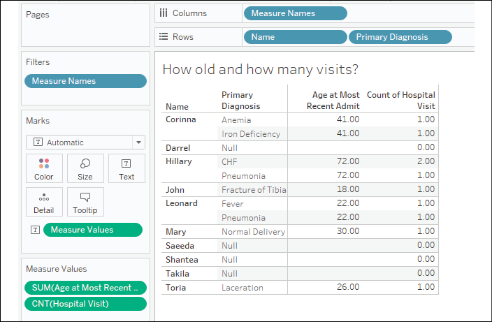

Figure 13.10: All patients are once again shown

Even though the **Age at Most Recent Admit** value is
`NULL` for patients who have never been admitted,
simply adding the measure to the view instructs
Tableau to show all patients. This demonstrates a third behavior:
including a measure from the same table as a dimension will force
Tableau to show the full domain of values for that dimension.

Another basic principle of data model behavior is also displayed here.
Notice that **Age at Most Recent Admit** is shown for each patient and
each diagnosis. However, Tableau does not incorrectly duplicate the
value in totals or subtotals. If you were to add subtotals for each
patient in the **Age at Most Recent Admit** and **Count of Hospital
Visit** columns, as has been done in the following view, you\'ll see
that Tableau has the correct values:

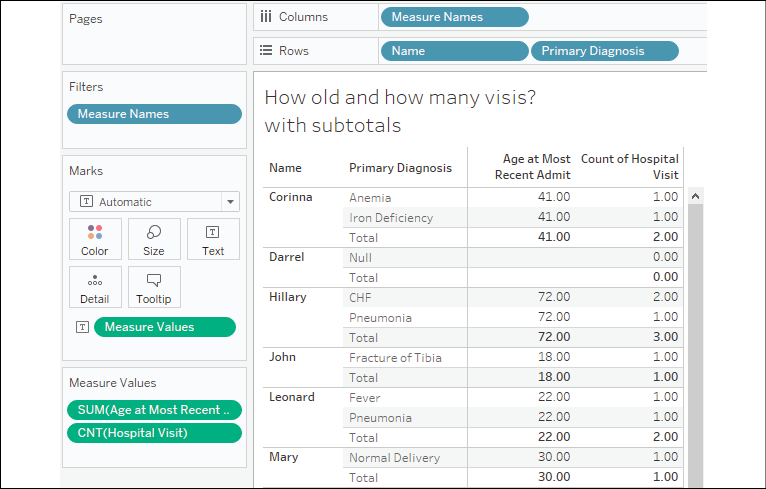

Figure 13.11: Tableau calculates the subtotals correctly, even though
traditional join behavior would have duplicated the values

This final behavior of the data model can be
stated as: aggregates are calculated at the level of detail defined by
the logical table of the measure. This is similar
to how you might use a **Level of Detail** (**LOD**) expression to avoid
a LOD duplication, but you didn\'t have to write the expression or break
your flow of thought to solve the problem. The Tableau data model did
the hard work for you!

Take some additional time to build out views and visualizations with the
data model you\'ve created. And review the following behaviors so you
know what to expect and how to control the analysis you want to perform:

-   When you use one or more dimensions from the same logical table,
    you\'ll see the full domain of values in Tableau
-   When you include dimensions from two or more logical tables, only
    matching values are shown
-   Including a measure from the same logical table as a dimension will
    force Tableau to show the full domain of values for that dimension
    (even when the previous behavior was in effect)
-   Aggregates are calculated at the level of detail defined by the
    logical table of the measure

With just a bit of practice, you\'ll find that the behaviors feel
natural, and you\'ll especially appreciate
Tableau performing aggregations at the correct
level of detail.

**Tip:**

When you first create a new data model, it is helpful to run through a
couple of quick checks similar to the preceding examples. That will help
you gain familiarity with the data model as well as help you validate
that the relationships are working as you expect.

We\'ll now turn our focus to learn how to relate data in the physical
layer using joins.

#### Using joins

A **join** at the physical level is a row-by-row
matching of the data between tables. We\'ll look at some different types
of joins and then consider how to leverage them in the physical layer of
a data model.

Types of joins
--------------

In the physical layer, you may specify the
following types of joins:

-   **Inner**: Only records that match the join
    condition from both the table on the left and the table on the right
    will be kept. In the following example, only three matching rows are
    kept in the results:

    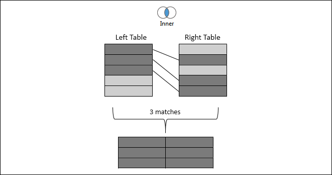

    Figure 13.12: Inner join

-   **Left**: All records from the table on the
    left will be kept. Matching records from the table on the right will
    have values in the resulting table, while unmatched records will
    contain `NULL` values for all fields from the
    table on the right. In the following example, the five rows from the
    left table are kept, with `NULL` results for
    any values in the right table that were not matched:

    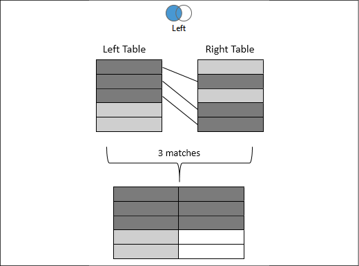

    Figure 13.13: Left join

-   **Right**: All records from the table on the right will be kept.
    Matching records from the table on the left
    will result in values, while unmatched records will contain
    `NULL` values for all fields from the table
    on the left. Not every data source supports a right join. If it is
    not supported, the option will be disabled. In the following
    example, the five rows from the right table are kept, with
    `NULL` results for any values from the left
    table that were not matched:

    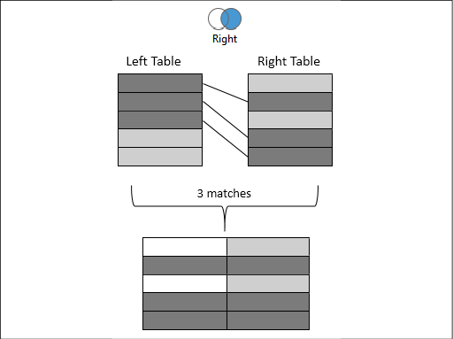

    Figure 13.14: Right join

-   **Full Outer**: All records from tables on both sides will be kept.
    Matching records will have values from the
    left and the right. Unmatched records will have
    `NULL` values where either the left or the
    right matching record was not found. Not every data source supports
    a full outer join. If it is not supported, the option will be
    disabled. In the following example, all rows are kept from both
    sides with `NULL` values where matches were
    not found:

    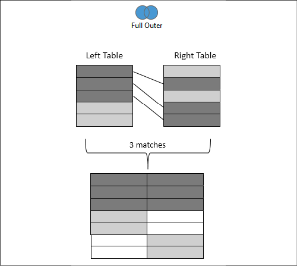

    Figure 13.15: Full Outer join

-   **Spatial**: This joins together records that
    match based on the **intersection** (overlap) of spatial objects (we
    discussed Tableau\'s spatial features in *Chapter 12*, *Exploring
    Mapping and Advanced Geospatial Features*). For example, a point
    based on the latitude and longitude might fall inside the complex
    shape defined by a shapefile. Records will be kept for any records
    where the spatial object in one table overlaps with the spatial
    object specified for the other:

    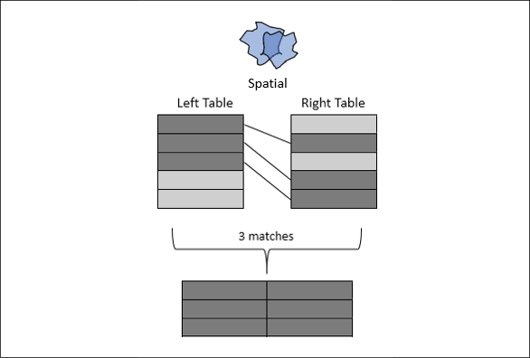

    Figure 13.16: Spatial join

When you select spatial objects from the left and
right tables, you\'ll need to specify **Intersects** as the operator
between the fields to accomplish a spatial join, as shown in *Figure 13.17*:

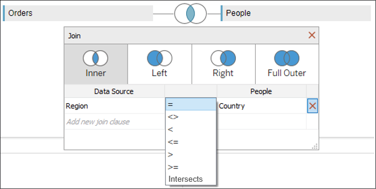

Figure 13.17: Assuming the two fields selected represent spatial
objects, the Intersects option will be available

With a solid understanding of join types, let\'s consider how to use
them in the physical layer of Tableau\'s data model.

Joining tables
--------------

Most databases have multiple tables of data that
are related in some way. Additionally, you are able to join together
tables of data across various data connections for many different data
sources.

For our examples here, let\'s once again consider the tables in the
hospital database, with a bit of simplification:

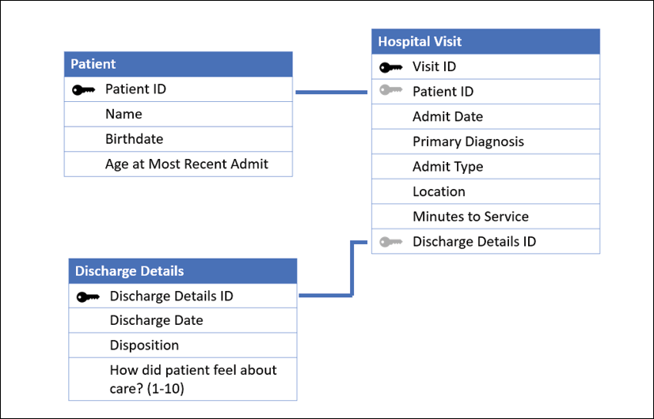

Figure 13.18: The primary Hospital Visit table with Patient and
Discharge Details as they might exist in a relational database

Let\'s consider how we might build a data source using some joins in the
physical layer. To follow along, create a new Excel data source in the
`Chapter 13 Starter.twbx` workbook that
references the `Hospital Visits (Joins).xlsx`
file in the `Chapter 13` directory. You may also
examine the connection in the
`Chapter 13 Complete.twbx` workbook.

Just as we did before, we\'ll start by dragging the **Hospital Visit**
table onto the data source canvas such that we have a **Hospital Visit**
object in the logical layer, like this:

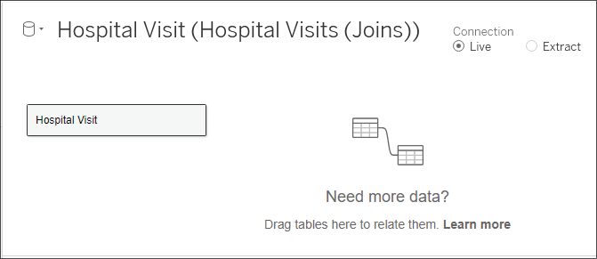

Figure 13.19: After dragging the table onto the canvas, the Hospital
Visit object is created in the logical layer

At this point, the logical layer object simply
contains a single physical table. But we\'ll extend that next.
Double-click on the **Hospital Visit** object to expand the physical
layer. It will look like this:

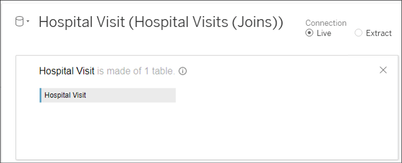

Figure 13.20: The physical layer, which currently consists of a single
physical table

You can extend the physical model by adding additional tables. We\'ll do
that here, by adding **Discharge Detail** and **Patient**. As we add
them, Tableau will prompt you with a dialog box to adjust the details of
the join. It will look like this:

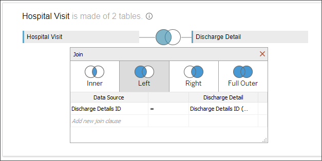

Figure 13.21: Joining Discharge Detail to Hospital Visit in the physical
layer

The **Join** dialog allows you to specify the join type (**Inner**,
**Left**, **Right**, or **Full Outer**) and to specify one
or more fields on which to join. Between the
fields, you may select which kind of operator joins the fields. The
default is equality (**=**; the fields must be equal), but you may also
select inequality (`<>`; the fields must not be
equal), less than (`<`), less than or equal to
(`<=`), greater than
(`>`), or greater than or equal to
(`>=`). The type of join and the field
relationships that define the join will determine how many records are
returned from the join. We\'ll take a look at the details in the next
section.

**Note:**

Typically, you\'ll want to start by dragging the primary table onto the
physical layer canvas. In this case, **Hospital Visit** contains keys to
join additional tables. Additional tables should be dragged and dropped
after the primary table.

For now, accept the fields that Tableau automatically detects as shared
between the tables (**Discharge Details ID** for **Discharge Details**
and **Patient ID** for **Patient**). Change the join to **Discharge
Details** to a left join. This means that all hospital visits will be
included, even if there has not yet been a discharge. Leave **Patient**
as an inner join. This will return only records that are shared between
the tables so that only patients with visits will be retained.

Ultimately, the physical layer for **Hospital Visit** will look like
this:

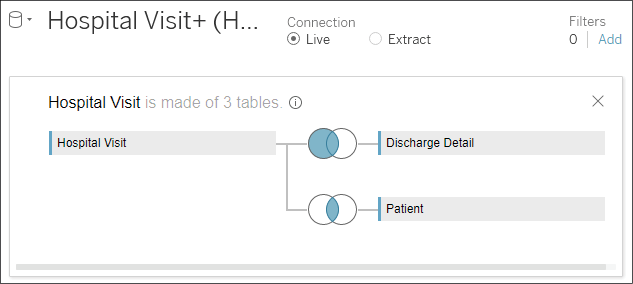

Figure 13.22: The physical layer is made up of three tables joined
together

When you close the physical layer, you\'ll once
again see the logical layer, which contains a single object: **Hospital
Visit**. That object now contains a join icon, indicating that it is
made up of joined physical tables. But it remains a single object in the
logical layer of the data model and looks like this:

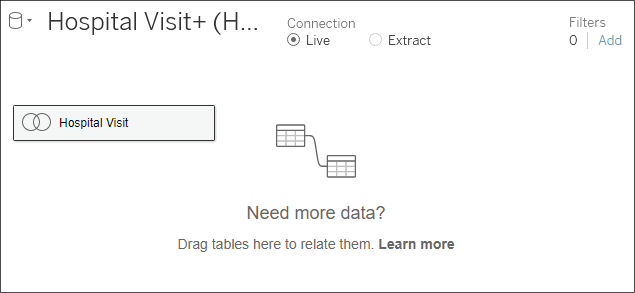

Figure 13.23: The logical layer contains a single object that is made up
of three physical tables

All the joins create what you might think of as one flat table, which
can be related together with other objects in the data model. Those
objects, in turn, might each be made up of a single physical table or
multiple physical tables joined together.

If you are following along with the example,
rename this data source **Hospital Visits (Joins)**. We\'ll leverage
this data source for one more example at the end of this lab. In the
meantime, let\'s consider a few additional details related to joins.

Other join considerations
-------------------------

We conclude this section with some further
possibilities to leverage joins, as well as a caution regarding a
potential problem that can arise from their use.

### Join calculations

In the previous example, we noted that Tableau
**joins** row-by-row based on fields in the data.
You may come across cases where you need to join based on values that
are not present in the data but can be derived from the existing data.
For example, imagine that there is a **Patient Profile** table that
would add significant value to your dataset. However, it lacks a
**Patient ID** and only has **First Name** and **Last Name** fields.

To join this to our **Patient** table, we can use a **join
calculation**. This is a calculation that exists only for the purpose of
joining tables together. To create a join calculation, use the drop-down
list of fields in the **Join** dialog box and select the final option,
**Create Join Calculation**:

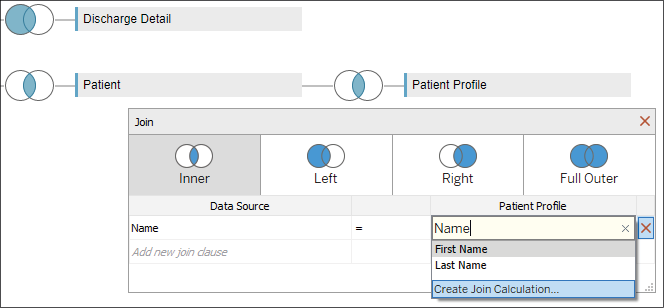

Figure 13.24: You can create a join calculation to aid in forming the
correct joins

Selecting this option allows you to write row-level calculations that
can be used in the join. For example, our join calculation might have
code like `[First Name] + " " + [Last Name]` to
return values that match with the **Name** field.

**Tip:**

Try to avoid joining on text fields, especially in larger datasets for
performance reasons. Joining on integers is far more efficient. Also, it
is entirely possible for two separate people to share first and last
names, so a real-world dataset that followed the structure in this
example would be subject to false matches and errors.

You may also leverage the geospatial functions
mentioned in *Chapter 12*, *Exploring Mapping and Advanced Geospatial
Features*, to create a spatial join between two
sources, even when one or both lack specific spatial objects on which to
join. For example, if you have `Latitude` and
`Longitude`, you might create a join calculation
with the code
`MAKEPOINT([Latitude], [Longitude])` to find the
intersection with another spatial object in another table.

Join calculations can also help when you are missing a field for a join.
What if the data you want to join is in another database or file
completely? In this scenario, we would consider cross-database joins.

### Cross-database joins

With Tableau, you have the ability to join (at the row level) across
multiple different data connections. Joining
across different data connections is referred to
as a **cross-database join**. For example, you can join SQL Server
tables with text files or Excel files, or join tables in one database
with tables in another, even if they are on a different server. This
opens up all kinds of possibilities for supplementing your data or
analyzing data from disparate sources.

Consider the hospital data. Though not part of the data included the
`Chapter 13` file set, it would not be uncommon
for billing data to be in a separate system from patient care data.
Let\'s say you had a file for patient billing that contained data you
wanted to include in your analysis of hospital visits. You would be able
to accomplish this by adding the text file as a data connection and then
joining it to the existing tables, as follows:

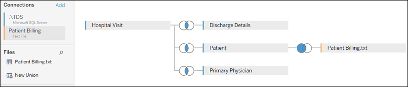

Figure 13.25: Joining tables or files based on separate data connections

You\'ll notice that the interface on the **Data Source** screen includes
an **Add** link that allows you to add data connections to a data
source. Clicking on each connection will allow you to
drag and drop tables from that connection into
the **Data Source** designer and specify the joins as you desire. Each
data connection will be color-coded so that you can immediately identify
the source of various tables in the designer.

You may also use multiple data sources in the logical layer.

Another consideration with joins is an unintentional error, which we\'ll
consider next.

### The unintentional duplication of data

Finally, we conclude with a warning about
joins---if you are not careful, you could potentially end up with a few
extra rows or many times the number of records than you were expecting.
Let\'s consider a theoretical example:

Let\'s say you have a `Visit` table like this:

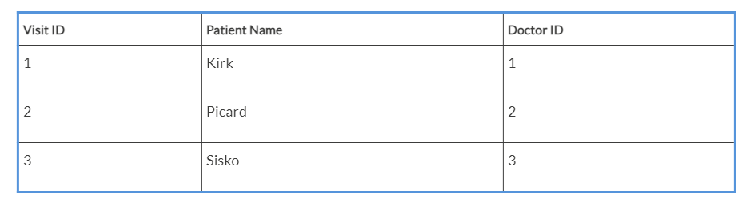

And a `Doctor` table like this:

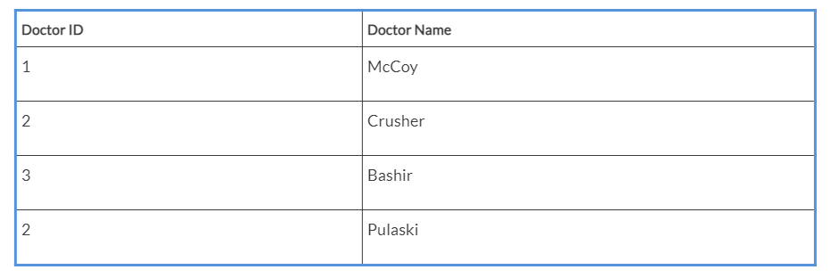

Notice that the value `2` for
`Doctor ID` occurs twice in the
`Doctor` table. Joining the table on equality
between the `Doctor ID` value will result in
duplicate records, regardless of which join type is used. Such a join
would result in the following dataset:

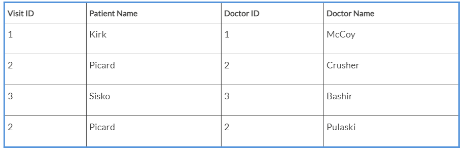

This will greatly impact your analysis. For example, if you were
counting the number of rows to determine how many
patient visits had occurred, you\'d overcount. There are times when you
may want to intentionally create duplicate records to aid in analysis;
however, often, this will appear as an unintentional error.

**Tip:**

In addition to the danger of unintentionally duplicating data and ending
up with extra rows, there\'s also the possibility of losing rows where
values you expected to match didn\'t match exactly. Get into the habit
of verifying the row count of any data sources where you use joins.

A solid understanding of joins will not only help you as you leverage
Tableau Desktop and Tableau Server, but it will also give you a solid
foundation when we look at Tableau Prep in *Chapter 15*, *Taming Data
with Tableau Prep*. For now, let\'s wrap up this lab with a brief
look at blends.

#### Using blends

**Data blending** allows you to use data from
multiple data sources in the same view. Often, these sources may be of
different types. For example, you can blend data from Oracle with data
from Excel. You can blend Google Analytics data with a spatial file.
Data blending also allows you to compare data at different levels of
detail. Let\'s consider the basics and a simple example.

Data blending is done at an aggregate level and involves different
queries sent to each data source, unlike joining, which is done at the
row level and (conceptually) involves a single query to a single data
source. A simple data blending process involves several steps, as shown
in the following diagram:

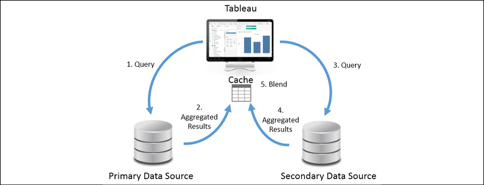

Figure 13.26: How Tableau accomplishes blending

We can see the following from the preceding
diagram:

1.  Tableau issues a query to the primary data source.
2.  The underlying data engine returns aggregate results.
3.  Tableau issues another query to the secondary data source. This
    query is filtered based on the set of values returned from the
    primary data source for dimensions that link the two data sources.
4.  The underlying data engine returns aggregate results from the
    secondary data source.
5.  The aggregated results from the primary data source and the
    aggregated results from the secondary data source are blended
    together in the cache.

It is important to note that data blending is different from joining.
Joins are accomplished in a single query and results are matched
row-by-row. Data blending occurs by issuing two separate queries and
then blending together the aggregate results.

There can only be one primary source, but there can be as many secondary
sources as you desire. *Steps 3* and *4* are repeated for each secondary
source. When all aggregated results have been returned, Tableau matches
the aggregated rows based on linking fields.

**Note:**

When you have more than one data source in a Tableau workbook, whichever
source you use first in a view becomes the primary source for that view.

Blending is view-specific. You can have one data source as the primary
in one view and the same data source as the secondary in another. Any
data source can be used in a blend, but OLAP cubes, such as in SQL
Server Analysis Services, must be used as the primary source.

In many ways, blending is similar to creating a data model with two or
more objects. In many cases, the data model will
give you exactly what you need without using blending. However, you have
a lot more flexibility with blending because you can change which fields
are related at a view level rather than at an object level.

**Linking fields** are dimensions that are used
to match data blended between primary and secondary data sources.
Linking fields define the level of detail for the secondary source.
Linking fields are automatically assigned if fields match by name and
type between data sources.

Otherwise, you can manually assign relationships between fields by
selecting, from the menu, **Data** \| **Edit Blend Relationships**, as
follows:

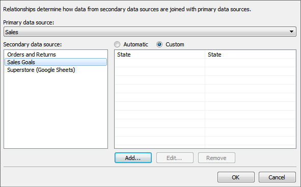

Figure 13.27: Defining blending relationships between data sources

The **Relationships** window will display the relationships recognized
between different data sources. You can switch from **Automatic** to
**Custom** to define your own linking fields.

Linking fields can be activated or deactivated to blend in a view.
Linking fields used in the view will usually be active by default, while
other fields will not. You can, however, change whether a linking field
is active or not by clicking on the link icon next to a linking field in
the data pane.

**Tip:**

Additionally, use the **Edit Data Relationships** screen to define the
fields that will be used for **cross-data source
filters**. When you use the drop-down menu of a
field on **Filters** in a view, and select **Apply to Worksheets** \|
**All Using Related Data Sources**, the filter works across data
sources.

Let\'s take this from the conceptual to the practical with an example.

A blending example
------------------

Let\'s look at a quick example of blending in
action. Let\'s say you have the following table representing the service
goals of various locations throughout the hospital when it comes to
serving patients:

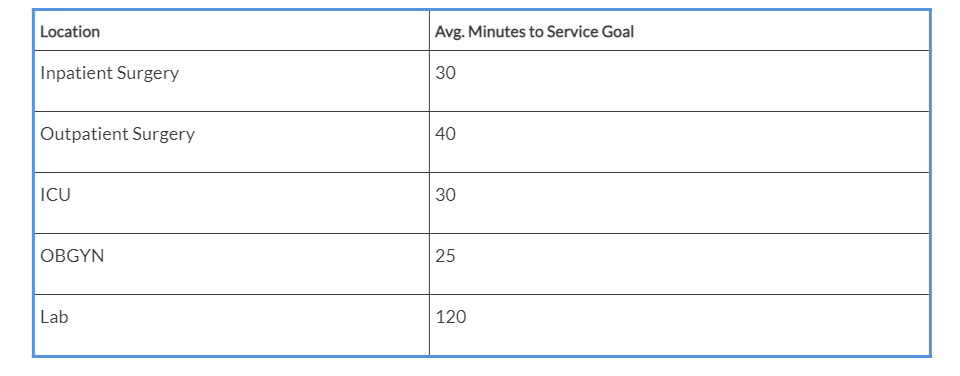

This data is contained in a simple text file, named
`Location Goals.txt`, in the
`Chapter 13` directory. Both the starter and
complete workbooks already contain a data source defined for the file.

We\'ll start by creating a simple bar chart from the **Hospital Visit
(Joins)** data source you created previously, showing the **Average
Minutes to Service by Location** like so:

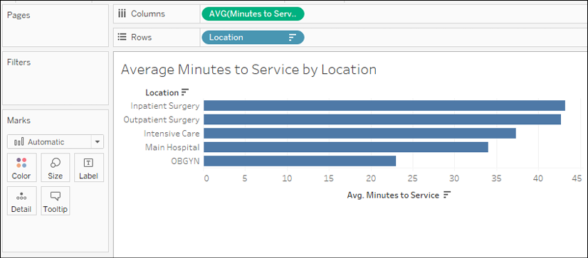

Figure 13.28: Average Minutes to Service by Location

Then, in the **Data** pane, we\'ll select the
**Location Goals** data source. Observe the **Data** pane shown here:

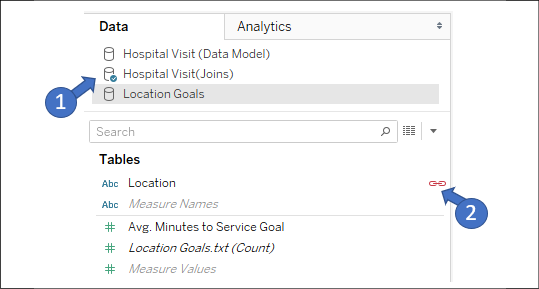

Figure 13.29: Hospital Visit (Joins) is shown as the Primary data source
and Location in the Location Goals data source is indicated as a linking
field

The blue checkmark on the **Hospital Visit (Joins)** data source
(numbered **1** in *Figure 13.29*) indicates that the data source is
primary. Tableau recognizes **Location** as a linking field and
indicates that it is active with a connected link icon (numbered **2**
in *Figure 13.29*). It is active because you have used **Location** from
the primary data source in the current view. If you had not, Tableau
would still show the link, but it would not be active by default. You
may click on the link icon to switch from active to inactive or vice
versa to control the level of detail at which aggregations are done in
the secondary source.

For now, click on **Avg. Minutes to Service Goal** in the data pane and
select **Bullet Graph** from **Show Me**, as
indicated here:

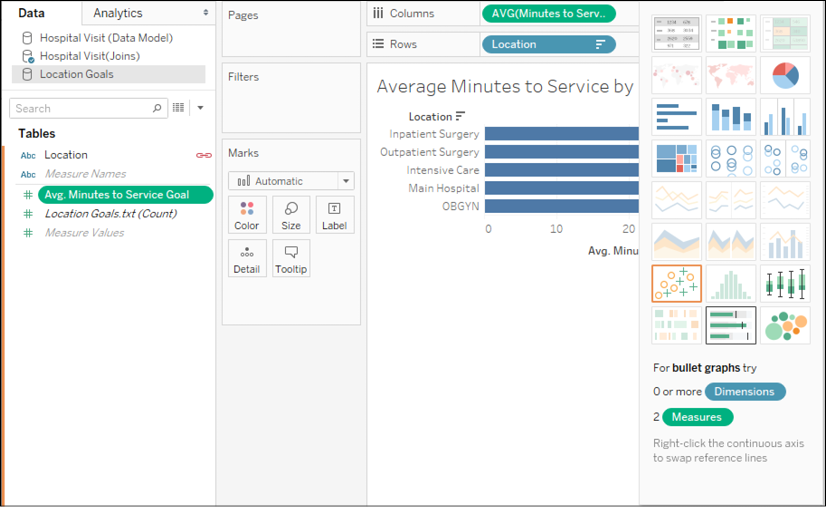

Figure 13.30: You may drag and drop fields from secondary sources into
the view or use Show Me

You may have to right-click on the **Avg. Minutes to Service** axis in
the view and select the **Swap Reference Line** fields to ensure the
goal is the reference line and the bar is the actual metric. Your view
should now look like this:

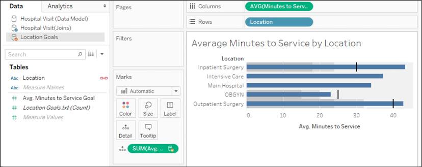

Figure 13.31: A view created from a primary source and a secondary
source

Notice that both the **Hospital Visits (Joins)** data source and the
**Location Goals** data source are used in this view. **Hospital Visit
(Joins)** is the primary data source (indicated by a
blue checkmark), while **Location Goals** is the
secondary source (indicated by the orange checkmark). The **Avg. Minutes
to Service Goal** field on **Detail** in the **Marks** card is secondary
and also indicated by an icon with an orange checkmark.

You may also notice that **Main Hospital** and **Intensive Care** do not
have goals indicated in the view. Recall that the primary data source is
used to determine the full list of values shown in the view. **Main
Hospital** is in the primary source but does not have a match in the
secondary source. It is shown in the view, but it does not have a
secondary source value.

**Intensive Care** also does not have a secondary value. This is because
the corresponding value in the secondary source is **ICU**. Values must
match exactly between the primary and secondary sources for a blend to
find matches. However, blends do also take into account aliases.

**Note:**

An **alias** is an alternate value for a dimension value that will be
used for display and data blending. Aliases for dimensions can be
changed by right-clicking on row headers or using the menu on the field
in the view or the data pane and selecting the **Aliases** option.

We can change the alias of a field by right-clicking on the row header
in the view and using the **Edit Alias...** option, as shown here:

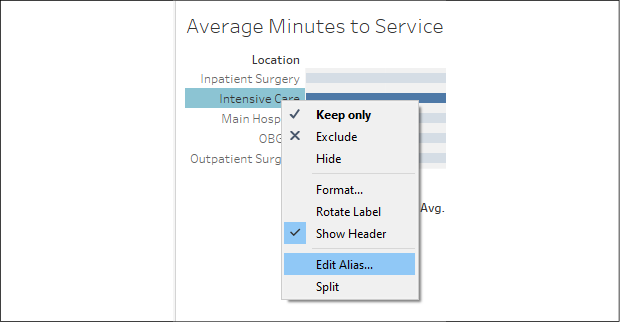

Figure 13.32: Using the Edit Alias\... option

If we change the alias to **ICU**, a match is
found in the secondary source and our view reflects the secondary value:

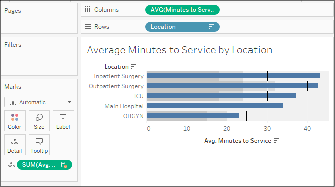

Figure 13.33: ICU now finds a match in the secondary source

A final value for **Location**, **Lab**, only occurs in the
`Location Goals.txt` source and is, therefore,
not shown in this view. If we were to create a new view and use
**Location Goals** as the primary source, it would show.

We\'ve covered quite a few options regarding how
to relate data in this lab. Let\'s just take a moment to consider
when to use these different techniques.

### Summary

You now have several techniques to turn to when you need to relate
tables of data together. The data model, a new feature in the latest
versions of Tableau, gives a new paradigm for relating logical tables of
data together. It introduces a few new behaviors when it comes to
showing the full and partial domains of dimensional values, but it also
greatly simplifies aggregations by taking into account the natural level
of detail for the aggregation. In the physical layer, you have the
option of joining together physical tables.

We covered the various types of joins and discussed possibilities for
using join calculations and cross-database joins for ultimate
flexibility. We briefly discussed how data blending works and saw a
practical example. Finally, you examined a broad outline of when to turn
to each approach. You now have a broad toolset to tackle data in
different tables or even in different databases or files.
