Structuring Messy Data to Work Well in Tableau
==============================================


In this lab, we\'ll focus on some principles for structuring data to
work well with Tableau, as well as some specific examples of how to
address common data issues. This lab will cover the following
topics:

-   Structuring data for Tableau
-   The four basic data transformations
-   Overview of advanced fixes for data problems

We\'ll start by discussing which data structures work well for Tableau.


#### Structuring data for Tableau


We\'ve already seen that
Tableau can connect to nearly any data source.
Whether it\'s a built-in direct connection, **Open Database
Connectivity** (**ODBC**), or the use of the
Tableau data extract API to generate an extract, no data is off limits.
However, there are certain structures that make data easier to work with
in Tableau.

There are two keys to ensure a good data structure that works well with
Tableau:

-   Every record of a source data connection should be at a meaningful
    level of detail
-   Every measure contained in the source should match the level of
    detail of the data source or possibly be at a higher level of
    detail, but it should never be at a lower level of detail

For example, let\'s say you have a table of test scores with one record
per classroom in a school. Within the record, you may have three
measures: the average GPA for the classroom, the number of students in
the class, and the average GPA of the school:

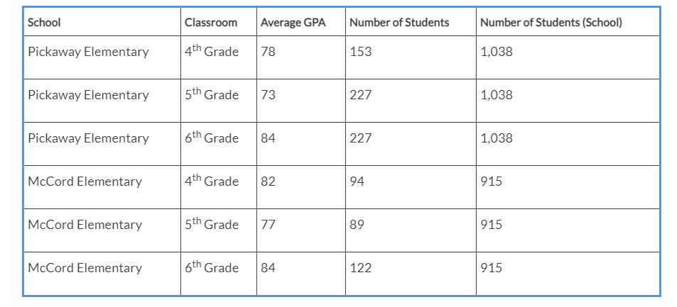

The first two measures (**Average GPA** and **Number of Students**) are
at the same level of detail as the individual record of data (per
classroom in the school). **Number of Students (School)** is at a higher
level of detail (per school). As long as you are aware of this, you can
do a careful analysis. However, you would have a data structure issue if
you tried to store each student\'s GPA in the class record. If the data
was structured in an attempt to store all of the students\' GPAs per
grade level (maybe with a column for each student or a single field
containing a comma-separated list of student scores), we\'d need to do
some work to make the data more usable in Tableau.

Understanding the level of detail of the source
(often referred to as **granularity**) is vital. Every time
you connect to a data source, the
very first question you should ask and answer is:
what does a single record represent? If, for example, you were to drag
and drop the `Number of Records` (or the
`Table (Count)` field in Tableau 2020.2 and
later) field into the view and observed 1,000 records, then you should
be able to complete the statement,
`I have 1,000 _____.` It could be 1,000 students,
1,000 test scores, or 1,000 schools. Having a good grasp of the
granularity of the data will help you to avoid poor analysis and allow
you to determine if you even have the data that\'s necessary for your
analysis.

**Tip:**

A quick way to find the level of detail of your data is to put the
`Number of Records` (or the
`Table (Count)` field in Tableau 2020.2 and
later) field on the **Text** shelf, and then try different dimensions on
the **Rows** shelf. When all of the rows display a 1, and the total
that\'s displayed in the lower-left status bar equals the number of
records in the data, then that dimension (or combination of dimensions)
uniquely identifies a record and defines the lowest level of detail of
your data.


With an understanding of the overarching principles regarding the
granularity of data, let\'s move on and understand certain data
structures that allow you to work seamlessly and efficiently in Tableau.
Sometimes, it may be preferable to restructure the data at the source
using tools such as `Alteryx` or Tableau Prep
Builder. However, at times, restructuring the source data isn\'t
possible or feasible. For example, you may not have write access to the
database or it may be a cloud-based data source that has a predefined
structure. We\'ll take a look at some options in Tableau for those
cases. For now, let\'s consider what kinds of data structures work well
with Tableau.

Well-structured data in Tableau
-------------------------------

The two keys to a good structure, which we
mentioned in the previous section, should result
in a data structure where a single measure is contained in a single
column. You may have multiple different measures, but any single measure
should almost never be divided into multiple columns. Often, the
difference is described as **wide data** versus **tall data**.

### Wide data

*Wide data is not typically a good structure for visual analysis in
Tableau*.

**Wide data** describes a structure in which a
measure in a single row is spread over multiple columns. This data is
often more **human-readable**. Wide data often results in fewer rows
with more columns.

Here is an example of what wide data looks like in a table of population
numbers:

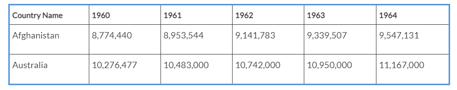

Notice that the level of detail for this table is a row for every
country. However, the single measure (population) is not stored in a
single column. This data is wide because it has a single measure
(population) that is being divided into multiple columns (a column for
each year). The wide table violates the second key to a good structure
since the measure is at a lower level of detail than the individual
record (per country per year, instead of just per country).

### Tall data

*Tall data is typically a good structure for visual analysis in
Tableau*.

**Tall data** describes a structure in which each
distinct measure in a row is contained in a single column. Tall data
often results in more rows and fewer columns.

Consider the following table, which represents the same data as earlier
but in a tall structure:

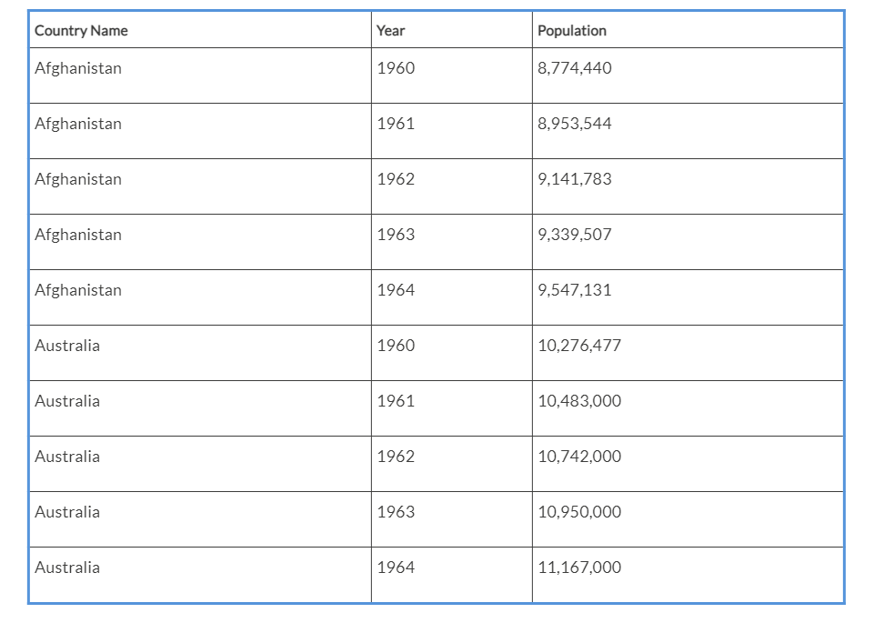


Now, we have more rows (a row for each year for each country).
Individual years are no longer separate columns and population
measurements are no longer spread across those columns. Instead, one
single column gives us a dimension of **Year** and another single column
gives us a measure of **Population**. The number of rows has increased,
while the number of columns has decreased. Now, the measure of
population is at the same level of detail as the
individual row, and so visual analysis in Tableau
will be much easier.

Let\'s take a look at the difference this makes in practice.

### Wide versus tall data in Tableau

You can easily see the difference
between wide and tall data in Tableau. Here is
what the **wide** **data** table looks like in the left **Data** window:

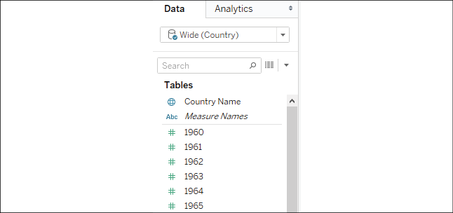

Figure 14.1: The wide data has a measure for every year

As we\'d expect, Tableau treats each column in the table as a separate
field. The wide structure of the data works against us. We end up with a
separate measure for each year. If you wanted to plot a line graph of
population per year, you would likely struggle. What dimension
represents the date? What single measure can you use for the population?

This isn\'t to say that you can\'t use wide data
in Tableau. For example, you might use **Measure
Names**/**Measure Values** to plot all the **Year** measures in a single
view, like this:

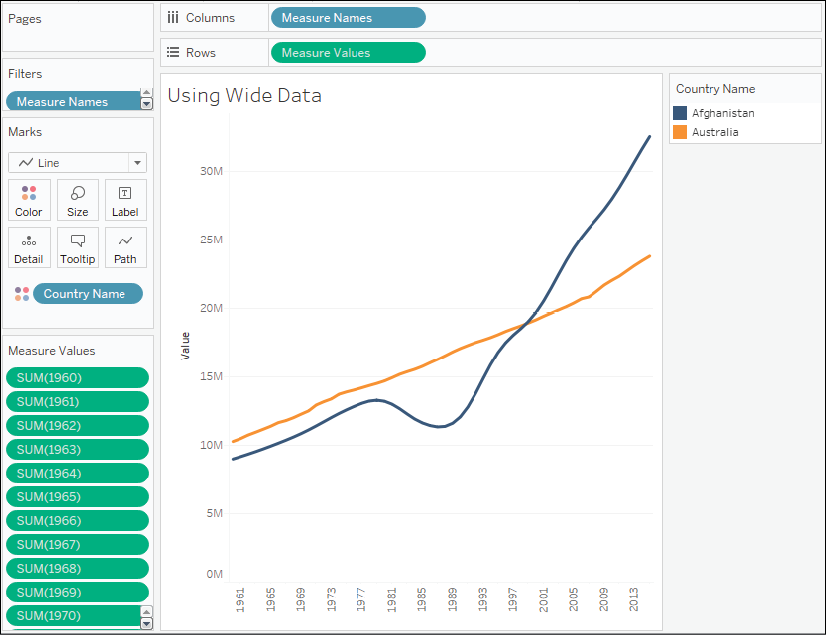

Figure 14.2: The wide data can still be used but in a complex and
limited way

You\'ll notice that every **Year** field has been placed in the
**Measure Values** shelf. The good news is that you can create
visualizations from poorly structured data like this. The bad news is
that views are often more difficult to create and certain advanced
features may not be available.

The following limitations apply to the view in *Figure 14.2* based on
the wide data structure:

-   Because Tableau doesn\'t have a date dimension or integer, you
    cannot use forecasting
-   Because Tableau doesn\'t have a date or continuous field in
    **Columns**, you cannot enable trend lines
-   Because each measure is a separate field, you cannot use quick table
    calculations (such as running total, percent difference, and others)
-   Determining things such as the average population across years will
    require a tedious custom calculation instead of simply changing the
    aggregation of a measure
-   You don\'t have an axis for the date (just a series of headers for
    the measure names), so you won\'t be able to add reference lines

In contrast, the **tall data** looks like this in
the **Data** pane:

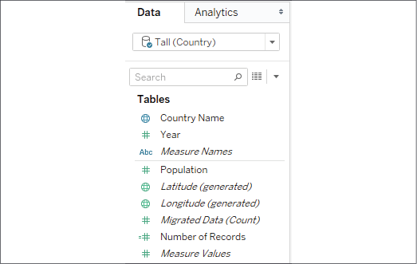

Figure 14.3: The tall data has a Year dimension and a single Population
measure

This data source is much easier to work with. There\'s only one measure
(**Population**) and a **Year** dimension to slice the measure. If you
want a line chart of the population by year, you can simply drag and
drop the **Population** and **Year** fields into **Columns** and
**Rows**. Forecasting, trend lines, clustering, averages, standard
deviations, and other advanced features will all work in the way you
expect them to.

You can see that the resulting
visualization is much easier to create in
Tableau, using only three active fields:

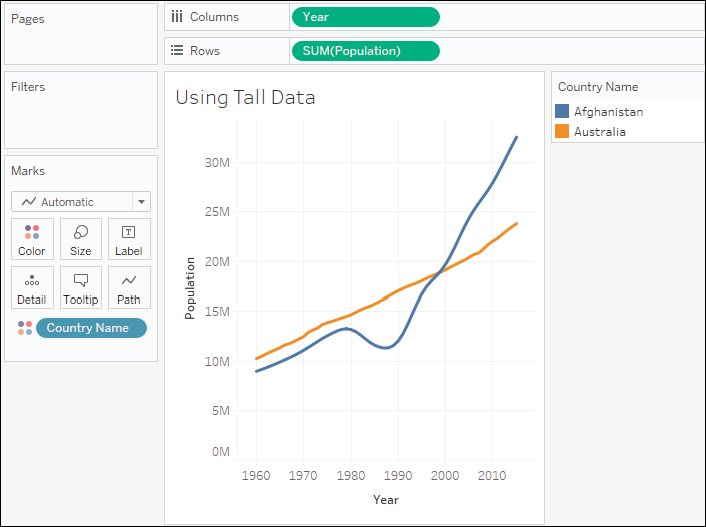

Figure 14.4: The view is much easier to create in Tableau with the tall
data

Next, we\'ll consider a few other good structures for data that should
work well with Tableau.

Star schemas (Data mart/Data warehouse)
---------------------------------------

Assuming they are well-designed, **star schema**
data models work very well with Tableau because they have well-defined
granularity, measures, and dimensions. Additionally, if they are
implemented well, they can be extremely efficient to query. This allows
for an ergonomic experience when using live connections in Tableau.

Star schemas are so named because they consist of a single fact table
surrounded by related dimension tables, thus forming a star pattern.
**Fact tables** contain measures at a meaningful
granularity, while **dimension tables** contain
attributes for various related entities. The following diagram
illustrates a simple star schema with a single fact table (**Hospital
Visit**) and three dimension tables (**Patient**, **Primary Physician**,
and **Discharge Details**):

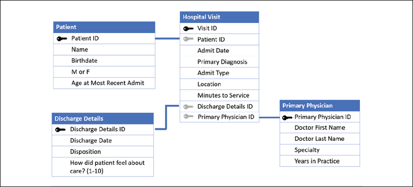

Figure 14.5: A simple star schema

Fact tables are joined to the related dimension
using what is often called a **surrogate key** or
**foreign key** that references a single
dimension record. The fact table defines the level of granularity and
contains measures. In this case, **Hospital Visit** has a granularity of
one record for each visit. In this simple example, each visit is for one
patient who saw one primary physician and was discharged. The **Hospital
Visit** table explicitly stores a measure of
`Visit Duration` and implicitly defines another
measure of `Number of Visits` (as the row count).

**Tip:**

Data modeling purists would point out that date values have been stored
in the fact table (and even some of the dimensions). They would,
instead, recommend having a date dimension table with extensive
attributes for each date and only a surrogate (foreign) key stored in
the fact table.

A date dimension can be very beneficial. However, Tableau\'s built-in
date hierarchy and extensive date options make storing a date in the
fact table, instead, a viable option. Consider using a date dimension if
you need specific attributes of dates that are not available in Tableau
(for example, which days are corporate holidays), have complex fiscal
years, or if you need to support legacy BI reporting tools.


A well-designed star schema allows the use of
**inner joins** since every surrogate key should reference
a single dimension record. In cases where
dimension values are not known or not applicable, special dimension
records are used. For example, a hospital visit that is not yet complete
(the patient is still in the hospital) may reference a special record in
the **Discharge Details** table marked as
`Not yet discharged`.

You\'ve already worked with a similar structure of data in the previous
lab, where you experienced the differences of relating tables in the
logical layer and the physical layer of the data model. 


Well-implemented star schemas are particularly
attractive for use in **live connections** because Tableau can improve
performance by implementing join culling. **Join culling** is
Tableau\'s elimination of unnecessary joins in
queries, since it sends them to the data source engine.

For example, if you were to place the
`Physician Name` on rows and the average of
`Visit Duration` on columns to get a bar chart of
average visit duration per physician, then joins to the **Treatment**
and **Patient** tables may not be needed. Tableau will eliminate
unnecessary joins as long as you are using a simple star schema with
joins that are only from the central fact table and have referential
integrity enabled in the source, or allow Tableau to assume referential
integrity. For tables joined in the physical layer, select the data
source connection from the data menu, or use the context menu from the
data source connection and choose **Assume Referential Integrity**. For
relationships in the logical layer of the data model, use
the performance options for referential integrity for each applicable
relationship.

Having considered some examples of good structures, let\'s turn our
attention to some basic transformations that will help us to transform a
poorly structured dataset to one with a good structure, which is easier
to work with in Tableau.


#### The four basic data transformations


In this section, we\'ll give you an overview of
some basic transformations that can fundamentally change the structure
of your data. We\'ll start with an overview and then look at some
practical examples.

Overview of transformations
---------------------------

In Tableau (and Tableau Prep), there are four basic
data transformations. The following definitions
broadly apply to most databases and data transformation tools, but there
are some details and terminology that are Tableau-specific:

-   **Pivots**: This indicates the transformation
    of columns to rows or rows to columns. The latter is possible in
    Tableau Prep only. The resulting dataset will be narrower and taller
    with fewer columns and more rows (columns to rows) or wider and
    shorter with more columns and fewer rows (rows to columns).
-   **Unions**: This indicates the appending of
    rows from one table of data to another, with the matching columns
    **aligned** together. The resulting data structure is a single table
    containing rows from all unioned tables and columns that match
    between the original tables, along with unmatched columns containing
    `NULL` values for tables that did not have
    them.
-   **Joins**: This indicates the row-by-row
    matching of two or more tables resulting in a data structure that
    includes columns from all tables. The number of rows is based on the
    type of join and how many matches are found.
-   **Aggregations**: This indicates the
    **rolling up** of a table to a higher level of detail such that
    there will be a row for each unique set of values for all dimensions
    used for grouping, along with other values that are aggregated (such
    as a sum, min, max, or other aggregation).

In order to fully understand these definitions, we\'ll turn to some
illustrations and practical examples.

Pivots (along with some simple data cleaning)
---------------------------------------------

The Excel workbook
`World Population Data.xlsx`, which is included
in the `Chapter 14` directory of the resources
that are included with this book, is typical of many Excel documents.
Here is what it looks like:

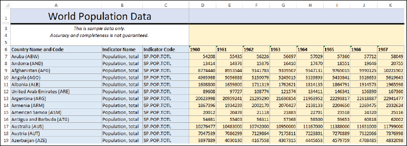

Figure 14.6: The World Population Data Excel file

Excel documents such as this are often more
human-readable but contain multiple issues when used for data analysis
in Tableau. The issues in this particular document include the
following:

-   Excessive headers (titles, notes, and formatting) that are not part
    of the data
-   Merged cells
-   Country name and code in a single column
-   Columns that are likely unnecessary (**Indicator Name** and
    **Indicator Code**)
-   The data is wide, that is, there is a column for each year, and the
    population measure is spread across these columns within a single
    record

When we initially connect to the Excel document in Tableau, the
connection screen will look similar to *Figure 14.7*, as follows:

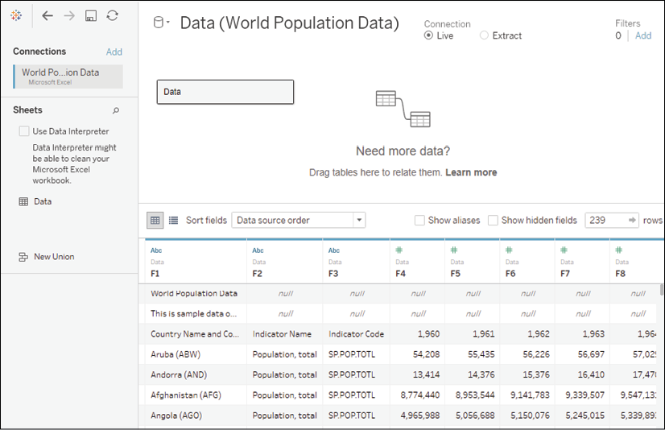

Figure 14.7: World Population Data.xlsx on Tableau\'s Data Source page

The data preview reveals some of the issues
resulting from the poor structure:

-   Since the column headers were not in the first Excel row, Tableau
    gave the defaults of **F1**, **F2**, and so on to each column
-   The title **World Population Data** and the note about sample data
    were interpreted as values in the **F1** column
-   The actual column headers are treated as a row of data (the third
    row)

Fortunately, these issues can be addressed in the connection window.
First, we can correct many of the excessive header issues by turning
on the **Tableau Data Interpreter**, a component
that specifically identifies and resolves common structural issues in
Excel or Google Sheets documents. When you check the **Use Data
Interpreter** option, the data preview reveals much better results:

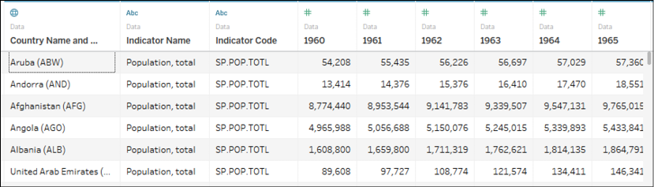

Figure 14.8: Tableau Data Interpreter fixes many of the common issues
found in Excel (and similar) data sources

**Tip:**

Clicking on the **Review the results\...** link that appears under the
checkbox will cause Tableau to generate a new Excel document that is
color-coded to indicate how the data interpreter parsed the Excel
document. Use this feature to verify that Tableau has correctly
interpreted the Excel document and retained the data you expected.


Observe the elimination of the excess headers and
the correct names of the columns. However, a few additional issues will
still need to be corrected.

First, we can hide the **Indicator Name** and **Indicator Code** columns
if we feel they are not useful for our analysis. Clicking on the
drop-down arrow on a column header reveals a menu of options.

Selecting **Hide** will remove the field from the connection and even
prevent it from being stored in extracts:

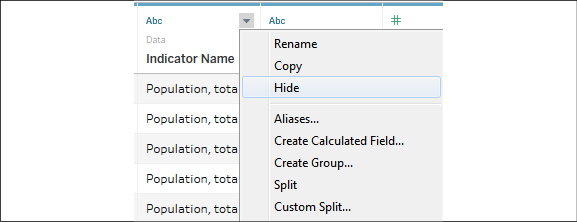

Figure 14.9: You can hide fields from the Data Source screen

Second, we can use the option on the same menu to split the **Country
Name and Code** column into two columns so that we can work with the
name and code separately. In this case, the **Split** option on the menu
works well and Tableau perfectly splits the data, even removing the
parentheses from around the code. In cases where the split option does
not initially work, try the **Custom Split\...** option. We\'ll also use
the **Rename** option to rename the split fields from
`Country Name and Code - Split 1` and
`Country Name and Code - Split 2` to **Country
Name** and **Country Code**, respectively. Then, we\'ll **Hide** the
original `Country Name and Code` field.

At this point, most of the data structure issues
have been remedied. However, you\'ll recognize that the data is in a
**wide** format. We have already seen the issues that we\'ll run into:

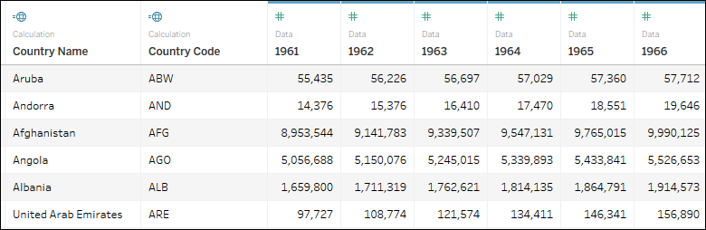

Figure 14.10: After some cleaning, the data is still in an undesirable
wide structure

Our final step is to **pivot** the year columns. This means that we\'ll
reshape the data in such a way that every country will have a row for
every year. Select all the year columns by clicking on the **1960**
column, scrolling to the far right, and holding *Shift* while clicking
on the **2013** column. Finally, use the drop-down menu on any one of
the year fields and select the **Pivot** option.

The result is two columns (**Pivot field names** and **Pivot field
values**) in place of all the year columns. Rename the two new columns
to **Year** and **Population**. Your dataset is now narrow and tall
instead of wide and short.

Finally, notice that the icon on the **Year** column is recognized by
Tableau as a text field. Clicking on the icon will allow you to change
the data type directly. In this case, selecting **Date** will result in
`NULL` values, but changing the data type to
**Number (whole)** will give you integer values that will work well in
most cases:

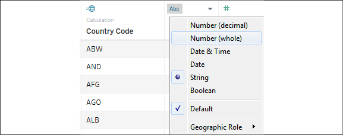

Figure 14.11: You can change the data types of the fields on the Data
Source page

**Tip:**

Alternatively, you could use the first drop-down menu in the
`Year` field and select **Create Calculated
Field\....** This would allow you to create a calculated field name
**Year (date)**, which parses the year string as a date with code such
as `DATE(DATEPARSE("yyyy", [Year]))`. This code
will parse the string and then convert it into a simple date without a
time. You can then hide the original **Year** field. You can hide any
field, even if it is used in calculations, as long as it isn\'t used in
a view. This leaves you with a very clean dataset.


The final cleaned, pivoted dataset is far easier
to work with in Tableau than the original:

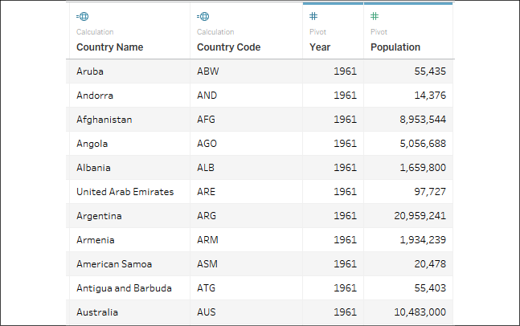

Figure 14.12: The cleaned and pivoted dataset

The data interpreter, cleaning options, and
ability to pivot data (columns to rows) in Tableau make working with
many datasets far easier. Next, we\'ll take a look at unions.

Unions
------

Often, you may have multiple individual files or
tables that, together, represent the entire set of data. For example,
you might have a process that creates a new monthly data dump as a new
text file in a certain directory. Or, you might have an Excel file where
data for each department is contained in a separate sheet.

A **union** is a concatenation of data tables that brings together rows
of each table into a single table. For example, consider the following
three tables of data:

**Originals**:

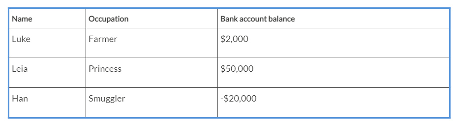

**Prequels**:

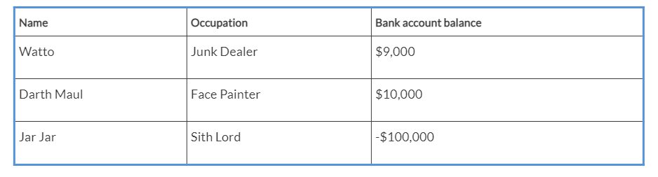

**Sequels**:

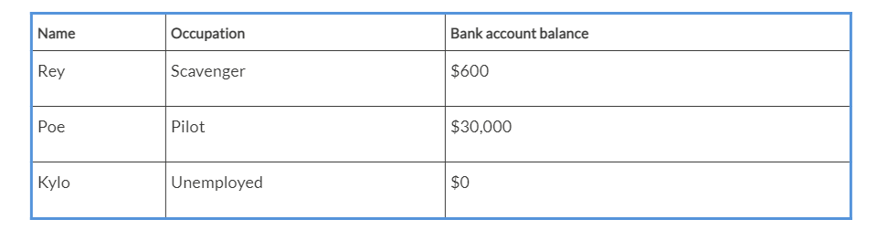

A union of these tables would give a single table
containing the rows of each individual table:

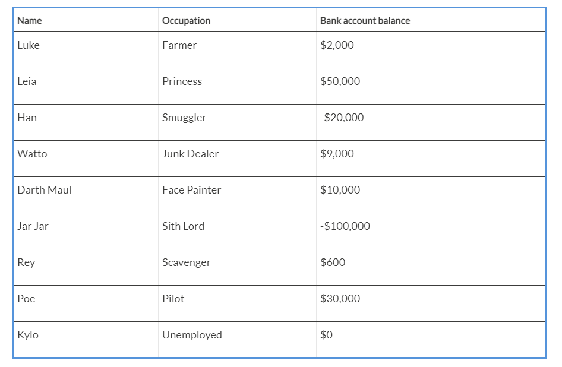

Tableau allows you to union together tables from
file-based data sources, including the following:

-   Text files (`.csv`,
    `.txt`, and other text file formats)
-   Sheets (tabs) within Excel documents
-   Subtables within an Excel sheet
-   Multiple Excel documents
-   Google Sheets
-   Relational database tables

**Tip:**

Use the **Data Interpreter** feature to find
subtables in Excel or Google Sheets. They will show up as additional
tables of data in the left sidebar.


To create a union in Tableau, follow these steps:

1.  Create a new data source from the menu, toolbar, or **Data Source**
    screen, starting with one of the files you wish to be part of the
    union. Then, drag any additional files into the **Drag table to
    union** drop zone just beneath the existing table on the canvas (in
    either the logical or physical layers; though, the union,
    technically, exists in the physical layer):

    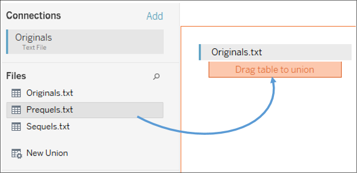

    Figure 14.13: You may create unions by dragging and dropping tables
    or files directly under existing tables on the canvas

2.  Once you\'ve created a union, you can use the drop-down menu on the
    table in the designer to configure options for the union.
    Alternatively, you can drag the **New Union** object from the left
    sidebar into the designer to replace the existing table. This will
    reveal options to create and configure the union:

    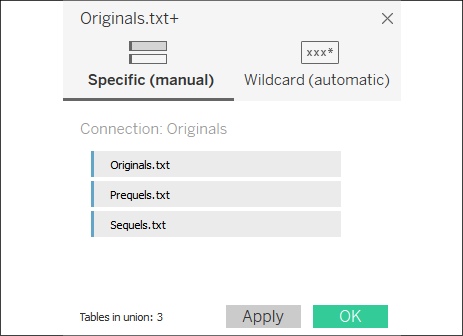

    Figure 14.14: You may edit unions with these options

    The **Specific (manual)** tab allows you to
    drag tables into and out of the union. The **Wildcard (automatic)**
    tab allows you to specify wildcards for filenames and sheets (for
    Excel and Google Sheets) that will automatically include files and
    sheets in the union based on a wildcard match.


    **Tip:**

    Use the **Wildcard (automatic)** feature if you anticipate
    additional files being added in the future. For example, if you have
    a specific directory where data files are dumped on a periodic
    basis, the wildcard feature will ensure that you don\'t have to
    manually edit the connection.


1.  Once you have defined the union, you may use the resulting data
    source to visualize the data. Additionally, a union table may be
    joined with other tables in the designer window, giving you a lot of
    flexibility in working with data.

When you create a union, Tableau will include one or more new fields in
your data source to help you to identify the file, sheet, and table
where the data originated. **Path** will contain the file path
(including the filename), **Sheet** will contain the sheet name (for
Excel or Google Sheets), and **Table Name** will contain the subtable or
text filename. You can use these fields to help you to identify data
issues and also to extend your dataset as needed.

For example, if you had a directory of monthly data dump files, named
`2020-01.txt`,
`2020-02.txt`,
`2020-03.txt`, and so on, but no actual date
field in the files, you could obtain the date using a calculated field
with code such as the following:

``` 
DATEPARSE('yyyy-MM', [Table Name] )
```


In a union, Tableau will match the columns
between tables by name. What happens when columns are not the same
between tables or files? If you were to write a query to a database, you
might expect a failed result as column names usually have to match
exactly. However, Tableau allows you to union together files or tables
with mismatched names.

**Tip:**

Columns that exist in one file/table but not in others will appear as
part of the union table, but values will be
`NULL` in files/tables where the column does not
exist. For example, if one of the files contained a column named **Job**
instead of **Occupation**, the final union table would contain a column
named **Job** and another named **Occupation**, with
`NULL` values where the column did not exist. You
can merge the mismatched columns by selecting the columns and using the
drop-down menu. This will coalesce (keep the first non-null of) the
values per row of data in a single new column:


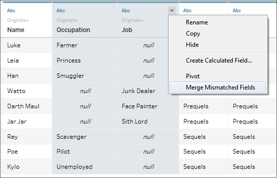

Figure 14.15: Use Merge Mismatched Fields to combine columns resulting
from a union where the field names didn\'t match (this mismatch is not
included in the example data)

You do not have to merge mismatched fields. At
times, there will not be corresponding matches in all files or tables
and that may be useful for your analysis.

Unions allow you to bring together multiple files or tables with
relatively the same structure and **stack** them together so that you
end up with all records from all tables/files. With pivots and unions
explored, we\'ve covered two of the four basic transformation types.
We\'ll continue with an example of how joins can be used to restructure
your data.

Joins
-----

You\'ll recall that the concept of joins and the
types of joins were previously discussed in Lab 13. While joins are quite useful
in bringing together tables in the same database or even disparate data
sources (data contained in different systems and formats), they can be
used to solve other data issues too, such as reshaping data to make it
easier to meet your objectives in Tableau.

**Note:**

You can work through the following example in the
`Chapter 14` workbook, but the server database
data source is simulated with a text file
(`Patient Visits.txt`).


Let\'s say you have a table in a server database (such as SQL Server or
Oracle) that contains one row per hospital patient and includes the
**Admit Date** and **Discharge Date** as separate columns for each
patient:

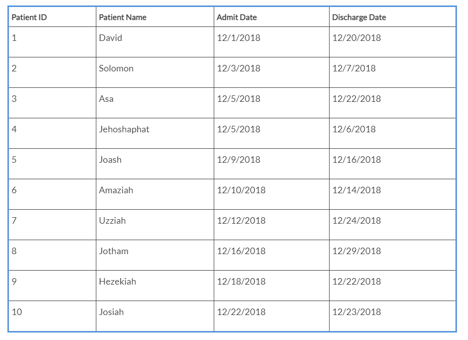

While this data structure works well for certain
kinds of analyses, you would find it difficult to use if you wanted to
visualize the number of patients in the hospital day by day for the
month of December.

For one, which date field do you use for the axis? Even if you pivoted
the table so that you had all of the dates in one field, you would find
that you have gaps in the data. **Sparse data**, that is, data in which
records do not exist for certain values, is quite common in certain
real-world data sources. Specifically, in this case, you have a single
record for each **Admit** or **Discharge** date, but no records for the
days in between.

Sometimes, it might be an option to restructure the data at the source,
but if the database is locked down, you may not have that option. You
could also use Tableau\'s ability to fill in gaps in the data (**data
densification**) to solve the problem. However, that solution could be
complex and, potentially, brittle or difficult to maintain.

An alternative is to use a join to create the rows for all dates. In
this case, we\'ll leverage a cross-database join to bring in another
source of data altogether. You might quickly create an Excel sheet with
a list of dates you want to see, like this:

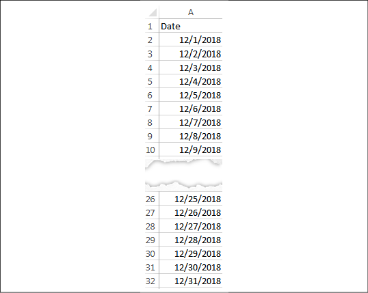

Figure 14.16: An Excel file containing only a comprehensive list of
dates

The Excel file includes a record for each date.
Our goal is to **cross join** (join every row
from one table with every row in another) the data between the database
table and the Excel table. With this accomplished, you will have a row
for every patient for every date.

**Tip:**

Joining every record in one dataset with every record in another dataset
creates what is called a **Cartesian product**.
The resulting dataset will have `N1 * N2` rows
(where `N1` is the number of rows in the first
dataset and `N2` is the number of rows in the
second). Take care in using this approach. It works well with smaller
datasets. As you work with larger datasets, the Cartesian product may
grow so large that this solution is untenable.


You\'ll often have specific fields in the various tables that will allow
you to join the data together. In this case, however, we don\'t have any
keys that define a join. The dates also do not give us a way to join all
the data in a way that gives us the structure we want. To achieve the
cross join, we\'ll use a join calculation. A **join calculation** allows
you to write a special calculated field specifically for use in joins.

In this case, we\'ll select **Create Join Calculation\...** for both
tables and enter the single, hard-coded value, that is,
`1`, for both the left and right sides:


Figure 14.17: As we\'ve seen, the join is created in the physical layer
of the data model

Since `1` in every row on
the left matches `1` in every row on the right,
we get every row matching every row---a true cross join.

**Tip:**

As an alternative, with many other server-based data sources, you can
use **Custom SQL** as a data source. On the **Data Source** screen, with
the **Patient Visits** table in the designer, you could use the top menu
to select **Data** \| **Convert to Custom SQL** to edit the SQL script
that Tableau uses for the source. Alternatively, you can write your own
custom SQL using the **New Custom SQL** object on the left sidebar.


The script in this alternative example has been modified to include
`1 AS Join` to create a field, called **Join**,
with a value of `1` for every row (though, if you
didn\'t do this in the script, you could simply use a join calculation).
Fields defined in Custom SQL can also be used in joins:

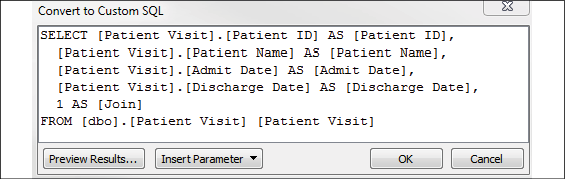

Figure 14.18: A sample script that could be used to create a value on
which to join

Based on the join calculation, our new cross-joined dataset contains a
record for every patient for every date, and we can now create a quick
calculation to see whether a patient should be counted
as part of the hospital population on any given
date. The calculated field, named **Patients in Hospital**, has the
following code:

``` 
IF [Admit Date] <= [Date] AND [Discharge Date] >= [Date] 
THEN 1 
ELSE 0 
END 
```


This allows us to easily visualize the flow of patients, and even
potentially perform advanced analytics based on averages, trends, and
even forecasting:

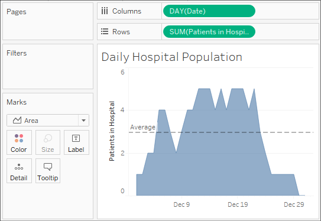

Figure 14.19: A visualization of the daily hospital population, made
easy with some data restructuring

Ultimately, for a long-term solution, you might want to consider
developing a server-based data source that gives the structure that\'s
needed for the desired analysis. However, a join here allowed us to
achieve the analysis without waiting on a long development cycle.

Having considered examples of pivots, unions, and joins, let\'s turn our
focus to an example of the final major transformation type: aggregation.

Aggregation
-----------

Remember that the two keys to a good data
structure are as follows:

-   Having a level of detail that is meaningful
-   Having measures that match the level of detail or that are possibly
    at higher levels of detail

Measures at lower levels tend to result in wide data and can make some
analysis difficult or even impossible. Measures at higher levels of
detail can, at times, be useful. As long as we are aware of how to
handle them correctly, we can avoid some pitfalls.

Consider, for example, the following data (included as
`Apartment Rent.xlsx` in the
`Chapter 14` directory), which gives us a single
record each month per apartment:

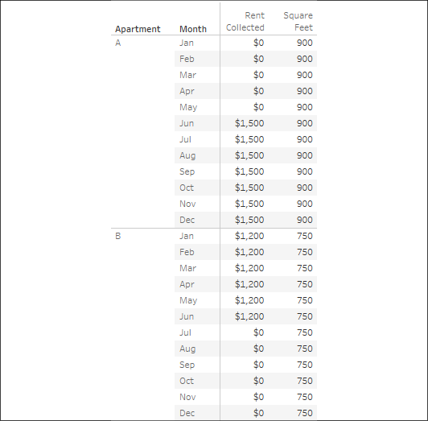

Figure 14.20: The Apartment Rent data, which is poorly structured
because the Square Feet measure is repeated for every month

The two measures are really at different levels
of detail:

-   **Rent Collected** matches the level of detail of the data where
    there is a record of how much rent was collected for each apartment
    for each month.
-   **Square Feet**, on the other hand, does not change month to month.
    Rather, it is at the higher level of detail, of **Apartment** only.

**Tip:**

Tableau\'s data model would make this data very easy to work with if it
was contained in two tables at the correct level of detail. If it was in
a relational database where we could use a custom SQL statement to
create a couple of tables at the right level of detail, we might
consider that approach. In the next lab, we\'ll consider how Tableau
Prep could be used to easily solve this problem. For now, work through
the details to gain some understanding of how to deal with aggregation
issues if you are faced with a similar poor structure (and you\'ll gain
an immense appreciation for what Tableau Prep and the Tableau data model
can do!).


The difference in levels of detail can be observed when we remove the
date from the view and look at everything at the **Apartment** level:

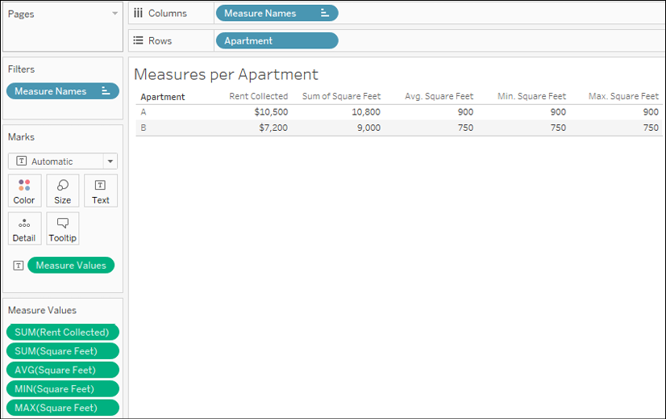

Figure 14.21: An illustration of how various aggregations might be right
or wrong depending on the level of detail

Notice that the **SUM(Rent Collected)** makes perfect sense. You can add
up the rent collected per month and get a
meaningful result per apartment. However, you cannot
`Sum` **Square Feet** and get a meaningful result
per apartment. Other aggregations, such as average, minimum, and
maximum, do give the right results per apartment.

However, imagine that you were asked to come up with the ratio of total
rent collected to square feet per apartment. You know it will be an
aggregate calculation because you have to sum the rent that\'s collected
prior to dividing. But which of the following is the correct
calculation?

-   `SUM([Rent Collected])/SUM([Square Feet])`
-   `SUM([Rent Collected])/AVG([Square Feet])`
-   `SUM([Rent Collected])/MIN([Square Feet])`
-   `SUM([Rent Collected])/MAX([Square Feet])`

The first one is obviously wrong. We\'ve already seen that square feet
should not be added each month. Any of the final three would be correct
if we ensure that **Apartment** continues to define the level of detail
of the view.

However, once we look at the view that has a different level of detail
(for example, the total for all apartments or the monthly total for
multiple apartments), the calculations don\'t work. To understand why,
consider what happens when we turn on the column grand totals (from the
menu, select **Analysis** \| **Totals** \| **Show Column Grand Totals**,
or drag and drop **Totals** from the **Analytics** tab):

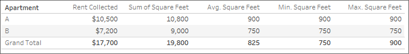

Figure 14.22: None of the aggregations work to give us a grand total

The problem here is that the **Grand Total** line is at the level of
detail of all apartments (for all months). What
we really want as the **Grand Total** of square
feet is `900 + 750 = 1,650`. However, here, the
sum of square feet is the addition of square feet for all apartments for
all months. The average won\'t work. The minimum finds the value **750**
as the smallest measure for all apartments in the data. Likewise, the
maximum picks **900** as the single largest value. Therefore, none of
the proposed calculations would work at any level of detail that does
not include the individual apartment.

**Tip:**

You can adjust how subtotals and grand totals are computed by clicking
on the individual value and using the drop-down menu to select how the
total is computed. Alternatively, right-click on the active measure
field and select **Total Using**. You can change how all measures are
totaled at once from the menu by selecting **Analysis** \| **Totals** \|
**Total All Using**. Using this **two-pass total**
technique could result in correct results in the
preceding view, but it would not universally solve the problem. For
example, if you wanted to show the price per square foot for each month,
you\'d have the same issue.


Fortunately, Tableau gives us the ability to work with different levels
of detail in a view. Using **Level of Detail** (**LOD**) calculations,
which we encountered in Lab 5, we can calculate the square feet per
apartment.

Here, we\'ll use a fixed LOD calculation to keep the level of detail
fixed at the apartment level. We\'ll create a calculated field, named
`Square Feet per Apartment`, with the following
code:

``` 
{ INCLUDE [Apartment] : MIN([Square Feet]) }
```


The curly braces surround a LOD calculation and the keyword
`INCLUDE` indicates that we want to include
`Apartment` as part of the level of detail for
the calculation, even if it is not included in the view level of detail.
`MIN` is used in the preceding code, but
`MAX` or `AVG` could have
been used as well because all give the same result per apartment.

As you can see, the calculation returns the correct result in the view
at the apartment level and at the grand total level, where Tableau
includes **Apartment** to find **900** (the minimum for **A**) and
**750** (the minimum for **B**) and then sums them to get **1,650**:

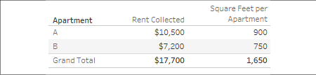

Figure 14.23: An LOD calculation gives us the correct result at all
levels of detail

Now, we can use the LOD calculated field in
another calculation to determine the desired results. We\'ll create a
calculated field, named
`Rent Collected per Square Foot`, with the
following code:

``` 
SUM([Rent Collected])/SUM([Square Feet per Apartment])
```


When that field is added to the view and formatted to show decimals, the
final outcome is correct:

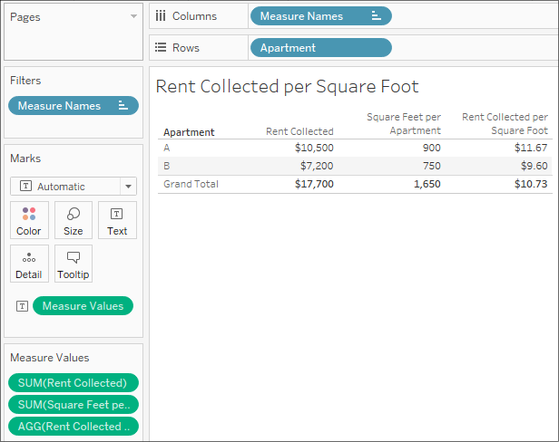

Figure 14.24: The LOD expression gives us the foundation for even more
complexity, such as calculating the rent per area

**Tip:**

Alternatively, instead of using `INCLUDE`, we
could have used a `FIXED` level of detail, which
is always performed at the level of detail of the dimension(s) following
the `FIXED` keywords, regardless of what level of
detail is defined in the view. This would have told Tableau to always
calculate the minimum square feet per apartment, regardless of what
dimensions define the view level of detail. While very useful, be aware
that the `FIXED` LOD calculations are calculated
for the entire context (either the entire dataset or the subset
defined by the **context filters**). Using them
without understanding this can yield unexpected results.


For now, we\'ve learned how to handle some aggregation issues; however,
in the next lab, we\'ll explore how we can truly transform the data
with aggregations to make problems like the previous exercise much
easier. In the meantime, let\'s consider some alternative fixes for data
problems.

### Overview of advanced fixes for data problems

In addition to the techniques that we mentioned
earlier in this lab, there are some additional possibilities to deal
with data structure issues. It is outside the scope of this book to
develop these concepts fully. However, with some familiarity of these
approaches, you can broaden your ability to deal with challenges as they
arise:

-   **Custom SQL**: It can be used in the data
    connection to resolve some data problems. Beyond giving a field for
    a cross-database join, as we saw earlier, custom SQL can be used to
    radically reshape the data that\'s retrieved from the source. Custom
    SQL is not an option for all data sources, but it is an option for
    many relational databases. Consider a custom SQL script that takes
    the wide table of country populations we mentioned earlier in this
    lab and restructures it into a tall table:

    ```
    SELECT [Country Name],[1960] AS Population, 1960 AS Year 
    FROM Countries 
     
    UNION ALL 
     
    SELECT [Country Name],[1961] AS Population, 1961 AS Year 
    FROM Countries 
     
    UNION ALL
     
    SELECT [Country Name],[1962] AS Population, 1962 AS Year 
    FROM Countries 
    ... 
    ... 
    ```


    And so on. It might be a little tedious to set up, but it will make
    the data much easier to work with in Tableau! However, many data
    sources using complex custom SQL will need to be extracted for
    performance reasons.

-   **Table calculations**: Table calculations
    can be used to solve a number of data
    challenges, from finding and eliminating duplicate records to
    working with multiple levels of detail. Since table calculations can
    work within partitions at higher levels of detail, you can use
    multiple table calculations and aggregate calculations together to
    mix levels of detail in a single view. A simple example of this is
    the **Percent of Total** table calculation, which compares an
    aggregate calculation at the level of detail in the view with a
    total at a higher level of detail.

-   **Data blending**: Data blending can be used to solve numerous data
    structure issues. Because you can define the
    linking fields that are used, you can control the level of detail of
    the blend.

-   **Data scaffolding**: Data scaffolding extends the concept of data
    blending. With this approach, you construct a
    scaffold of various dimensional values to use as a primary source
    and then blend them to one or more secondary sources. In this way,
    you can control the structure and granularity of the primary source
    while still being able to leverage data that\'s contained in the
    secondary sources.

-   **Data model**: Data blending
    is useful when you need to control the level
    of the relationship per view. If the relationship is better defined,
    the data model will give you incredible power to relate tables that
    are at different levels of detail and have confidence that
    aggregations will work correctly.

#### Summary


Up until this lab, we\'d looked at data that was, for the most part,
well-structured and easy to use. In this lab, we considered what
constitutes a good structure and ways to deal with poor data structures.
A good structure consists of data that has a meaningful level of detail
and that has measures that match that level of detail. When measures are
spread across multiple columns, we get data that is wide instead of
tall.

We also spent some time understanding the basic types of transformation:
pivots, unions, joins, and aggregations. Understanding these will be
fundamental to solving data structure issues.

You also got some practical experience in applying various techniques to
deal with data that has the wrong shape or has measures at the wrong
level of detail. Tableau gives us the power and flexibility to deal with
some of these structural issues, but it is far preferable to fix a data
structure at the source.

In the next lab, we\'ll take a brief pause from looking at Tableau
Desktop to consider Tableau Prep, another alternative to tackle
challenging data!
