Lab 15. Taming Data with Tableau Prep
=======================================


In this lab, we\'ll work through a couple of practical examples as
we explore the paradigm of Tableau Prep, understand the fundamental
transformations, and see many of the features and functions of Tableau
Prep.

We\'ll cover quite a few topics in this lab, including the
following:

-   Getting ready to explore Tableau Prep
-   Understanding the Tableau Prep Builder interface
-   Flowing with the fundamental paradigm
    -   Connecting to data
    -   Cleaning the data
    -   Calculations and aggregations in Tableau Prep
    -   Filtering data in Tableau Prep
    -   Transforming the data for analysis
-   Options for automating flows


In this lab, we\'ll use the term Tableau Prep broadly to speak of
the entire platform that Tableau has developed for data prep and
sometimes as shorthand for Tableau Prep Builder, the client application
that\'s used to connect to data, create data flows, and define output.
Where needed for clarity, we\'ll use these specific names:

-   **Tableau Prep Builder**: The client application that\'s used to
    design data flows, run them locally, and publish them
-   **Tableau Prep Conductor**: An add-on to Tableau Server that allows
    the scheduling and automation of published data flows

Let\'s start by understanding how to get started with Tableau Prep.


#### Getting ready to explore Tableau Prep


Tableau Prep Builder is available for Windows and
Mac. If you do not currently have Tableau Prep Builder installed on your
machine, please take a moment to download the
application from
[[https://www.tableau.com/products/prep/download]](https://www.tableau.com/products/prep/download).

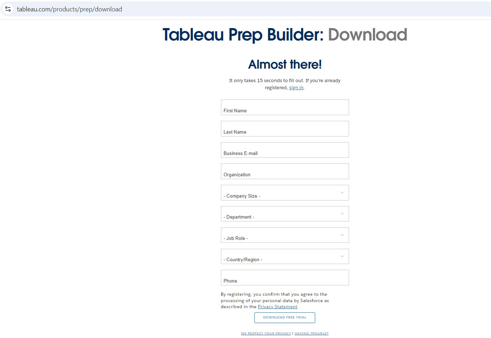

The examples in this lab use files located in the
`tableau-fundamentals\Lab 15` directory.
Specific instructions will guide you on when and how to use the various
files.

Once you\'ve downloaded and installed Tableau Prep Builder, you will be
able to launch the application. Once you do, you\'ll find a welcome
screen that we\'ll detail as we cover the interface in the next section.


#### Understanding the Tableau Prep Builder interface


You\'ll find a lot of similarities in the
interfaces of Tableau Prep Builder and Tableau Desktop. The home screen
of Tableau Prep Builder will look similar to this:

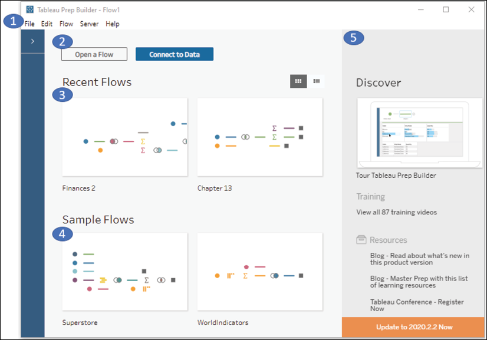

Figure 15.1: The Tableau Prep Builder welcome screen with numbering to
identify key components of the UI

The following components have been numbered in
*Figure 15.1*:

1.  The menu includes options for opening files, editing and running
    flows, signing into Tableau Server, and various **Help** functions.
    Also notice the **Connections** Pane to the left, immediately
    beneath the **File** menu. It is collapsed initially, but will
    contain a list of data connections as you create them.
2.  The two large buttons at the top give you the option to **Open a
    Flow**, which opens an existing Tableau Prep flow file, or **Connect
    to Data**, to start a new flow with an initial data connection.
    We\'ll define a flow in the next section. For now, think of a flow
    in terms of Tableau Prep\'s equivalent of a Tableau Desktop
    workbook.
3.  **Recent Flows** shows the Tableau Prep data flows that you have
    recently saved. You may click on one of these to open the flow and
    edit or run it. A toggle button on the right allows you to switch
    between thumbnails and a list.
4.  **Sample Flows** allows you to open some prebuilt examples.
5.  The **Discover** pane gives you options for training and resources
    as you learn more about Tableau Prep. A
    notification to upgrade will also appear if
    there is a newer version available.

Once you have opened or started a new flow, the home screen will be
replaced with a new interface, which will facilitate the designing and
running of flows:

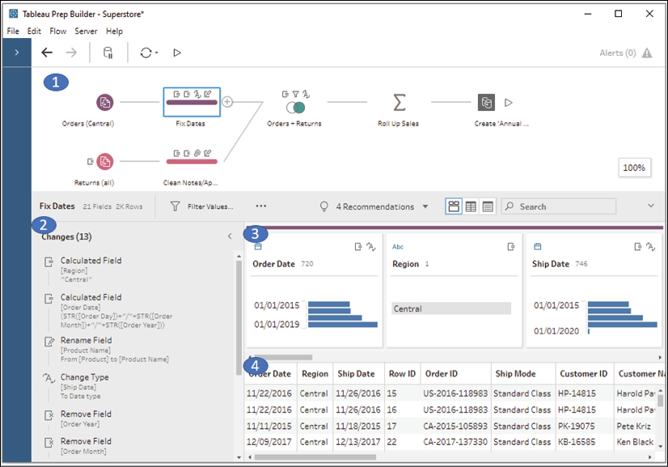

Figure 15.2: When designing a flow, you\'ll find an interface like this
one. The major components are numbered and described as follows

This interface consists of the following, which
are numbered in the preceding screenshot:

1.  The flow pane, where you will logically build the flow of data with
    steps that will do anything from cleaning to calculation, to
    transformation and reshaping. Selecting any single step will reveal
    the interface on the bottom half of the screen. This interface will
    vary slightly, depending on the type of step you have selected.
2.  The settings, or changes pane lists settings for the step and also a
    list of all changes that are made in the step, from calculations to
    renaming or removing fields, to changing data types or grouping
    values. You can click on individual changes to edit them or see how
    they alter the data.
3.  The profile pane gives you a profile of each field in the data as it
    exists for the selected step. You can see the type and distribution
    of values for each field. Clicking on a field will highlight the
    lineage in the flow pane and clicking one or more values of a field
    will highlight the related values of other fields.
4.  The data grid shows individual records of
    data as they exist in that step. Selecting a change in the changes
    grid will show the data based on changes up to and including the
    selected change. Selecting a value in the profile pane will filter
    the data grid to only show records containing that value. For
    example, selecting the first row of the
    `Order Date` field in the profile pane will
    filter the data grid to show only records represented by that bar.
    This allows you to explore the data, but doesn\'t alter the data
    until you perform a specific action that does result in a change.

You will also notice the toolbar that allows you to undo or redo
actions, refresh data, or run the flow. Additionally, there will be
other options or controls that appear based on the type of step or field
that\'s selected. We\'ll consider those details as we dive into the
paradigm of Tableau Prep, and a practical example later in the lab.


#### Flowing with the fundamental paradigm


The overall paradigm of Tableau Prep is a
hands-on, visual experience of discovering, cleaning, and shaping data
through a flow. A flow (sometimes also called a data flow) is a logical
series of steps and changes that are applied to data from input(s) to
output(s).

Here is an example of what a flow looks like in the flow pane of Tableau
Prep:

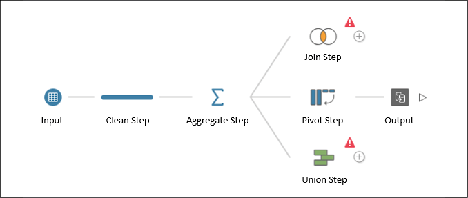

Figure 15.3: An example flow in Tableau Prep

Each of the individual components of the flow are
called steps, which are connected by lines that indicate the logical
flow of data from left to right. The lines are sometimes called
connectors or branches of the flow. Notice that the **Aggregate Step**
here has one line coming in from the left and three branches extending
to the right. Any step can have multiple output branches that represent
logical copies of the data at that point in the flow.

One important thing to notice is that four of the step types represent
the four major transformations of data we discussed in *Lab 14*,
*Structuring Messy Data to Work Well in Tableau*. The step types of
**Pivot**, **Union**, **Join**, and **Aggregate** exactly match those
transformations, while the **Clean Step** allows various other
operations involved in cleaning and calculating. You may wish to refresh
your memory on the basic transformations in the previous lab.

As we work through an example of a flow throughout this lab, we\'ll
examine each type of step more closely. For now, consider these
preliminary definitions of the primary steps in Tableau Prep:

-   **Input**: An input step starts the flow with
    data from a source such as a file, table, view, or custom SQL. It
    gives options for defining file delimiters, unions of multiple
    tables or files, and how much data to sample (for larger record
    sets).
-   **Clean Step**: A clean step allows you to
    perform a wide variety of functions on the data, including
    calculations, filtering, adjusting data types, removing and merging
    fields, grouping and cleaning, and much more.
-   **Aggregate Step**: An aggregate step allows
    you to aggregate values (for example, get
    `MIN`, `MAX`,
    `SUM`, `AVG`) at a
    level of detail you specify.
-   **Join Step**: A join step allows you to
    bring together two branches of the flow and match data row by row
    based on the fields you select and the type of join.
-   **Union Step**: A union step allows you to
    bring together two or more branches representing sets of data to be
    unioned together. You will have options for merging or removing
    mismatched fields.

    **Tip:**

    Both the **Union Step** and **Join Step** in this example have an
    error icon, indicating that something has not been configured
    correctly in the flow. Hovering over the icon gives a tooltip
    description of the error. In this case, the error is due to only
    having one input connection, while both the union and join require
    at least two inputs. Often, selecting a step with an error icon may
    reveal details about the error in the changes pane or elsewhere in
    the configuration steps.


-   **Pivot Step**: A pivot step allows you to
    transform columns of data into rows or rows of data into columns.
    You\'ll have options to select the type of pivot as well as the
    fields themselves. The term *transpose* is sometimes also used
    to describe this operation.
-   **Output**: The output step defines the
    ultimate destination for the cleaned and transformed data. This
    could be a text file (`.csv`), extract
    (`.hyper` or `.tde`),
    or published extracted data source to Tableau Server. The ability to
    output to a database has been announced, although is not available
    at the time of writing. You\'ll have options to select the type of
    output, along with the path and filename or Tableau Server and
    project.

**Tip:**

Right-clicking a step or connector reveals various options. You may also
drag and drop steps onto other steps to reveal options such as joining
or unioning the steps together. If you want to replace an early part of
the flow to swap out an input step, you can right-click the connector
and select **Remove**, and then drag the new input step over the desired
next step in the flow to add it as the new input.


In addition to using the term *flow* to refer to the steps and
connections that define the logical flow and transformation of the data,
we\'ll also use the term flow to refer to the file that Tableau Prep
uses to store the definition of the steps and changes of a flow. Tableau
Prep flow files have the `.tfl` (unpackaged flow)
or `.tflx` (packaged flow) extension.

The paradigm of Tableau Prep goes far beyond the
features and capabilities of any single step. As you build and modify
flows, you\'ll receive instant feedback so that you can see the impact
of each step and change. This makes it relatively easy (and fun!) to
iteratively discover your data and make the necessary changes.

**Note:**

When you are building flows, adding steps, making changes, and
interacting with data, you are in **design mode**. Tableau Prep uses a
combination of the Hyper engine\'s cache, along with direct queries of
the database, to provide near-instant feedback as you make changes. When
you run a flow, you are using **batch mode** or **execution mode**.
Tableau Prep will run optimized queries and operations that may be
slightly different than the queries that are run in design mode.


We\'ll consider an example in the remainder of this lab to aid in
our discussion of the Tableau Prep paradigm and highlight some important
features and considerations. The example will unfold organically, which
will allow us to see how Tableau Prep gives you incredible flexibility
to address data challenges as they arise and make changes as you
discover new aspects of your data.

We\'ll put you in the role of an analyst at your organization, with the
task of analyzing employee air travel. This will include ticket prices,
airlines, and even a bit of geospatial analysis of the trips themselves.
The data needs to be consolidated from multiple systems and will require
some cleaning and shaping to enable the analysis.

To follow along, open Tableau Prep Builder, which will start on the home
screen (there is not a starter flow for this lab). The sample data
is in the `Chapter 15 `directory, along with the
`Complete` flow if you want to check your work.
The `Complete (clean)` flow contains a sample of
how a flow might be self-documented---it will not match screenshots
precisely.

**Tip:**

When you open the `Complete` flow file, you\'ll
likely receive errors and warnings that input paths and output paths are
not valid. This is expected because your machine will almost certainly
have a different drive and directory structure than the one on which the
examples were prepared. You\'ll also run into this behavior when you
share flow files with others. To resolve the issues, simply work through
the connections in the **Connections** pane (expanded in *Figure 15.4*)
on the left to reconnect to the files and set output steps to
appropriate directories on your machine.


We\'ll start by connecting to some data!

Connecting to data
------------------

Connecting to data in Tableau Prep is very
similar to connecting to data in Tableau Desktop. From the home screen,
you may click either **Connect to Data** or the **+** button on the
expanded **Connections** pane:

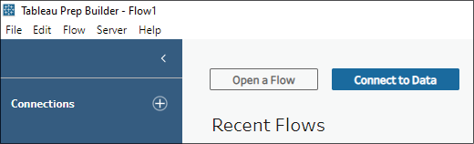

Figure 15.4: You can make a new data connection by clicking the + button
or the Connect to Data button

Either UI element will bring up a list of data source types to select.

**Tip:**

As with Tableau Desktop, for file-based data sources, you may drag the
file from **Windows Explorer** or **Finder** onto the Tableau Prep
window to quickly create a connection.


Tableau Prep supports dozens of file types and databases, and the list
continues to grow. You\'ll recognize many of the same types of
connection possibilities that exist in Tableau Desktop. However, at the
time of writing this book, Tableau Prep does not support all the
connections that are available in Tableau Desktop.

You may create as many connections as you like and the **Connections**
pane will list each connection separately with any associated files,
tables, views, and stored procedures, or other options that are
applicable to that data source. You will be able to use any combination
of data sources in the flow.

For now, let\'s start our example with the
following steps:

1.  Starting from the window shown in *Figure 15.4*, click **Connect to
    Data**.

2.  From the expanded list of possible connections that appears, select
    **Microsoft Excel**.

3.  You\'ll see a main table called **Employee Flights** and a sub-table
    named **Employee Flights Table 1**. Drag the **Employee Flights**
    table to the flow canvas. An input step will be created, giving you
    a preview of the data and other options. The input preview pane will
    initially look like this:

    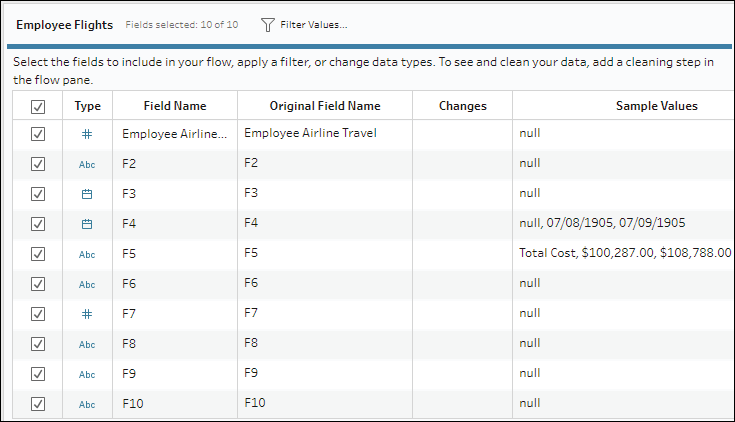

    Figure 15.5: The input preview allows you to select input fields to
    include in the flow, rename fields, and change data types

    The input step displays a grid of fields and
    options for those fields. You\'ll notice that many of the fields in
    the **Employee Flights** table are named
    `F2`, `F3`,
    `F4`, and so on. This is due to the format of
    the Excel file, which has merged cells and a summary sub-table.
    Continue the exercise with the following steps:

4.  Check the **Use Data Interpreter** option on the **Connections**
    pane and Tableau Prep will correctly parse the file as shown here:

    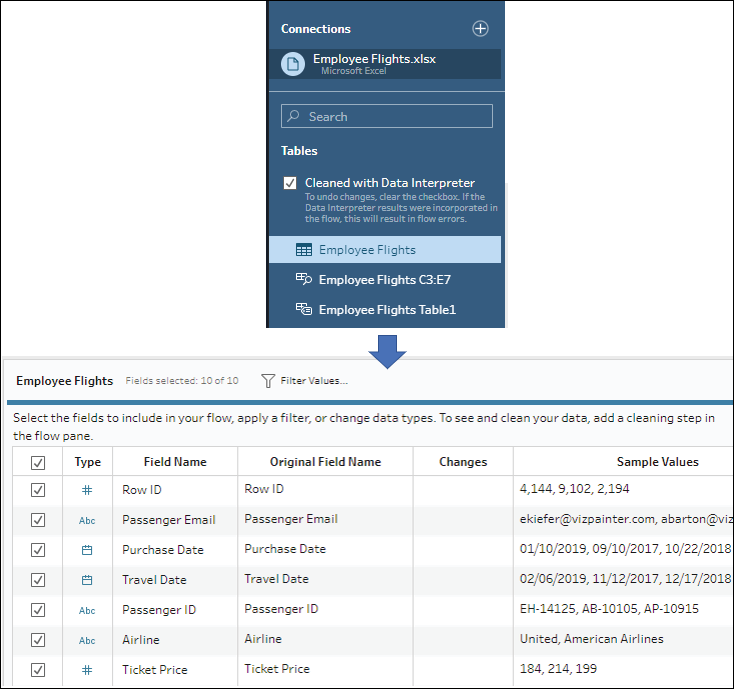

    Figure 15.6: The data interpreter parses the file to fix common
    issues such as merged cells, empty headers, and sub-total lines

    When you select an input step, Tableau Prep
    will display a grid of fields in the data. You may use the grid to
    uncheck any fields you do not wish to include, edit the **Type** of
    data by clicking the associated symbol (for example, change a string
    to a date), and edit the **Field Name** itself by double-clicking
    the field name value.

    **Note:**

    If Tableau Prep Builder detects that the data source contains a
    large number of records, it may turn on data
    sampling. **Data Sampling** uses a smaller subset of records for
    giving rapid feedback and profiling in design mode. However, it will
    use the full set of data when you run the entire flow in batch mode.
    You can control the data sampling options by clicking **Data
    Sample** on the input pane. While you can set the sample size for
    the source, subsequent steps, such as joins, that result in large
    numbers of records may turn on sampling that cannot be disabled.
    You\'ll receive an indicator of **Data Sampling** if it occurs
    anywhere in the flow.


5.  Now, we\'ll continue to explore the data and
    fix some issues along the way. Click the **+** button that appears
    when you hover over the **Employee Flights** input step. This allows
    you to extend the flow by adding additional step types. In this
    case, we\'ll add a **Clean Step**. This will extend the flow by
    adding a clean step called **Clean 1**:

    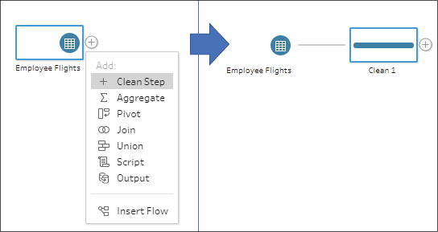

    Figure 15.7: Adding a step extends the flow. Here, adding a clean
    step adds Clean 1


1.  With the **Clean 1** step selected, take a moment to explore the
    data using the profile pane. Observe how selecting individual values
    for fields in the profile pane highlights portions of related values
    for other fields. This can give you great insight into your data,
    such as seeing the different price ranges based on
    `Ticket` `Type`:

    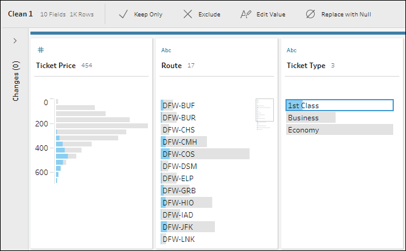

    Figure 15.8: Selecting a value for a field in the profile pane
    highlights which values (and what proportion of those values) relate
    to the selected value

Highlighting the bar segments across fields in
the profile pane, which results from selecting a field value, is called
brushing. You can also take action on selected values via the toolbar at
the top of the profile pane or by right-clicking a field value. These
actions include filtering, editing values, or replacing with
`NULL`. However, before making any changes or
cleaning any of the data, let\'s connect to some additional data.

It turns out that most of the airline ticket booking data is in one
database that\'s represented by the Excel file, but another airline\'s
booking data is stored in files that are periodically added to a
directory. These files are in the
`tableau-fundamentals\Lab 15\` directory. The
files are named with the convention
`Southwest YYYY.csv` (where
`YYYY` represents the
`year`).

We\'ll connect to all the existing files and ensure that we are prepared
for additional future files:

1.  Click the **+** icon on the **connections** pane to add a new
    connection to a **Text File**.

2.  Navigate to the
    `tableau-fundamentals\Lab 15\` directory and
    select any of the `Southwest YYYY.csv` files
    to start the connection. Looking at the **Input** settings, you
    should see that Tableau Prep correctly identifies the field
    separators, field names, and types:

    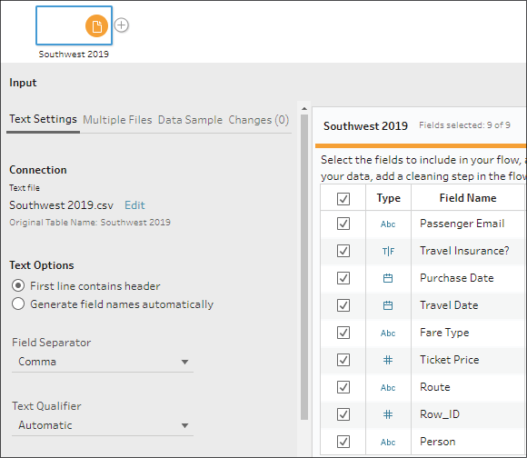

    Figure 15.9: A text file includes options for headers, field
    separators, text qualifiers, character sets, and more. Notice also
    the tabs such as Multiple Files and Data Sample giving other options
    for the text input

3.  In the **Input** pane, select the **Multiple
    Files** tab and switch from **Single table** to **Wildcard union**.
    Set **Matching Pattern** to `Southwest*` and
    click **Apply**. This tells Tableau Prep to union all of the text
    files in the directory that begin with
    `Southwest` together:

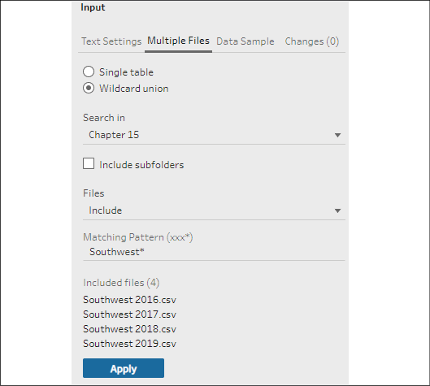

Figure 15.10: Using Matching Pattern tells Tableau Prep which files to
union together. That way, when Southwest 2020.txt and future files are
dropped into the directory, they will be automatically included

1.  Use the **+** icon on the **Southwest** input step in the flow pane
    to add a new clean step. This step will be named **Clean 2** by
    default. Once again, explore the data, but don\'t take any
    action until you\'ve brought the two sources
    together in the flow. You may notice a new field in the **Clean 2**
    step called **File Paths**, which indicates which file in the union
    is associated with each record.

With our input steps defined, let\'s move on to consider how to clean up
some of the data to get it ready for analysis.

Cleaning the data
-----------------

The process of building out the flow is quite
iterative, and you\'ll often make discoveries about the data that will
aid you in cleaning and transforming it. We\'ll break this example into
sections for the sake of reference, but don\'t let this detract from the
idea that building a flow should be a flow of thought. The example is
meant to be seamless!

We\'ll take a look at quite a few possibilities for prepping the data in
this section, including merging and grouping.
Let\'s start with seeing how to union together branches in the flow.

### Unioning, merging mismatched fields, and removing unnecessary fields

We know that we want to bring together the courseing data for all the
airlines, so we\'ll union together the two paths in the flow:

1.  Drag the **Clean 2** step onto the **Clean 1** step and drop it onto
    the **Union** box that appears. This will create a new **Union**
    step with input connections from both of the clean steps:

    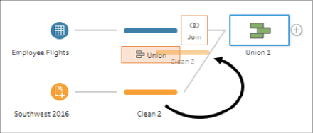

    Figure 15.11: Dragging one step onto another in the flow reveals
    options for bringing the datasets together in the flow. Here, for
    example, there are options for creating a Union or Join

2.  The **Union** pane that shows up when the
    **Union** step is selected will show you the mismatched fields,
    indicate the associated input, and give you options for removing or
    merging the fields. For example, `Fare`
    `Type` and `Ticket`
    `Type` are named differently between the
    Excel file and the text files, but in fact represent the same data.
    Hold down the *Ctrl* key and select both fields. Then, select
    **Merge Fields** from the toolbar at the top of the pane or from the
    right-click menu:

    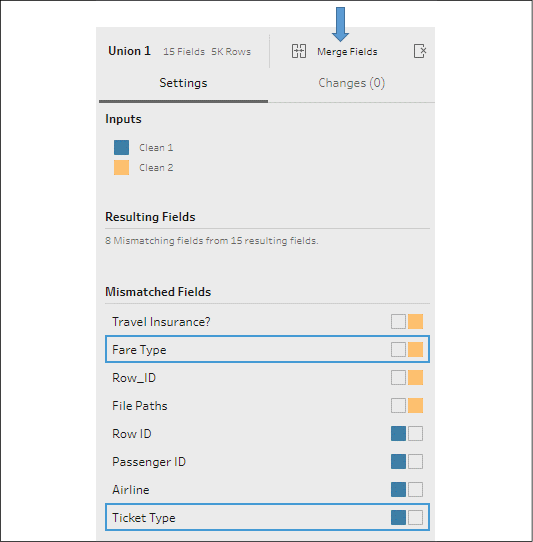

    Figure 15.12: When you select a single field, Tableau Prep will
    highlight fields that are potentially the same data. Selecting both
    reveals the Merge Fields option

3.  Also, merge `Row` `ID`
    and `Row_ID`.

4.  **File Paths** applies only to the
    `Southwest` files, which
    were unioned together in the **Input** step.
    While this auto-generated field can be very useful at times, it does
    not add anything to the data in this example. Select the field, then
    click the ellipses menu button and select **Remove Field**.

5.  Similarly, `Travel`
    `Insurance?` and
    `Passenger` `ID` apply
    to only one of the inputs and will be of little use in our analysis.
    Remove those fields as well.


1.  The single remaining mismatched field,
    `Airline`, is useful. Leave it for now and
    click the **+** icon on the **Union 1** step in the flow pane and
    extend the flow by selecting **Clean Step**. At
    this point, your flow should look like this:

    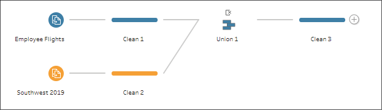

    Figure 15.13: Your flow should look similar to this. You may notice
    some variation in the exact location of steps or color (you can
    change a step\'s color by right-clicking a step)

**Tip:**

There is an icon above the **Union 1** step in the flow, indicating
changes that were made within this step. In this case, the changes are
the removal of several of the fields. Each step with changes will have
similar icons, which will reveal tooltip details when you hover over
them and also allow you to interact with the changes. You can see a
complete list of changes, edit them, reorder them, and remove them by
clicking the step and opening the changes pane. Depending on the step
type, this is available by either expanding it or selecting the changes
tab.


Next, we\'ll continue building the flow and consider some options for
grouping and cleaning.

### Grouping and cleaning

Now, we\'ll spend some time cleaning up the data
that came from both input sources. With the
**Clean 3** step selected, use the profile pane to examine the data and
continue our flow. The first two fields indicate some issues that need
to be addressed:

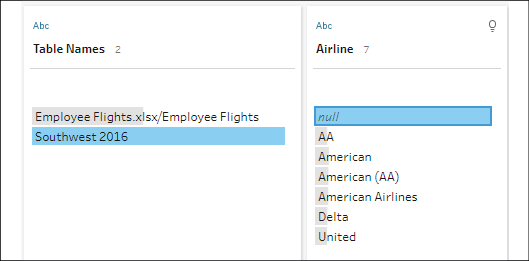

Figure 15.14: Every null value in the Airline field comes from the
Southwest files. Fortunately, in this case, the source of the data
indicates the airline

The `Table` `Names` field
was generated by Tableau Prep as part of **Union
1** to indicate the source of the records. The
`Airline` field came only from the Excel files
(you can confirm this by selecting it in the profile pane and observing
the highlighted path of the field in the flow pane). Click the **null**
value for `Airline` and observe the brushing:
this is proof that the `null` values in
`Airline` all come from the Southwest files since
those files did not contain a field to indicate the airline. We\'ll
address the `null` values and do some additional
cleanup:

1.  Double-click the **null** value and then type
    `Southwest` to replace
    `NULL` with the value you know represents the
    correct airline. Tableau Prep will indicate that a **Group** and
    **Replace** operation has occurred with a paperclip icon.

2.  We\'ll do an additional grouping to clean up the variations of
    **American**. Using the **Options** button on the
    `Airline` field, select **Group Values** \|
    **Pronunciation**:

    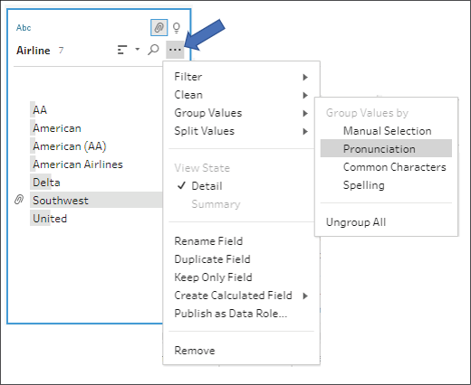

    Figure 15.15: The ellipses button on a field will reveal a plethora
    of options, from cleaning to filtering, to grouping, to creating
    calculations

    Nearly all the
    variations are grouped into the **American** value. Only **AA**
    remains.

3.  In the **Group Values by Pronunciation** pane that has appeared,
    select the **American Airlines** group and manually add **AA** by
    checking it in the list that appears to the right:

    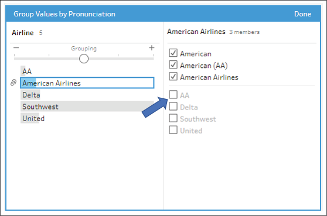

    Figure 15.16: When grouping by pronunciation, you\'ll notice a
    slider allowing you control over the sensitivity of the grouping.
    You can also manually adjust groupings by selecting a field

4.  Click **Done** on the **Group Values by
    Pronunciation** pane.

5.  Next, select the `Table`
    `Names` field, which
    is no longer needed. Using either the toolbar
    option, the menu from a right-click for the field, or the options
    button, select **Remove Field.**

6.  Some fields in the profile pane have a **Recommendations** icon
    (which resembles a lightbulb) in the upper-right corner. Click this
    icon on the `Passenger`
    `Email` field and then **Apply** the
    recommendation to assign a data role of **Email**:

    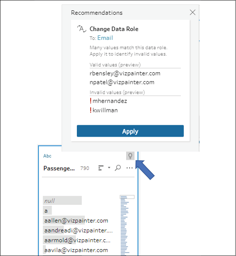

    Figure 15.17: Recommendations will show when Tableau Prep has
    suggestions for cleaning a field


    **Tip:**

    **Data Roles** allow you to quickly identify
    valid or invalid values according to what pattern or domain of
    values is expected. Once you have assigned a data role, you may
    receive additional recommendations to either filter or replace
    invalid values.


    After applying the recommendation, you\'ll
    see an indication in the profile pane for
    invalid values. As you continue following the example, we\'ll
    consider some options for quickly dealing with those invalid values.

7.  Click the **Recommendations** button on the
    `Passenger` `Email`
    field again. You\'ll see two new options presented. **Apply** the
    option to **Group** and **Replace** invalid values with
    `null`:

    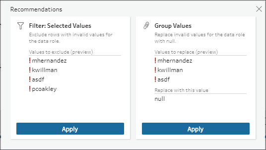

    Figure 15.18: Here, Tableau Prep suggests either filtering out
    records with invalid values or replacing the invalid values with
    null. In this case, we don\'t want to filter out the entire record,
    but the invalid values themselves are useless and are best
    represented by null

8.  Most of the remaining fields look fine,
    except for `Fare`
    `Type` (or possibly
    `Ticket` `Type`,
    depending on which name was kept when merging the fields
    previously). This field contains the values **1st Class** and
    **First Class**. Select both of these values
    by clicking each while holding down the *Ctrl* key and then
    **Group** them together with the **First Class** value. Two
    interface options for grouping the values are indicated here:

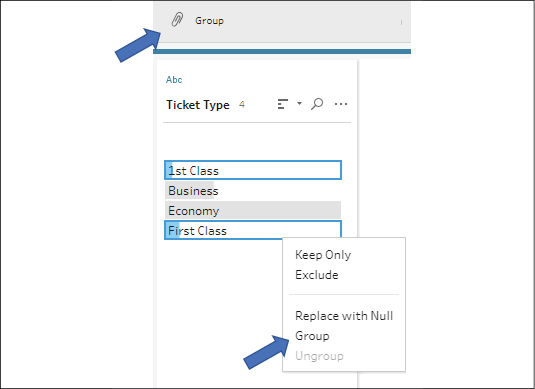

Figure 15.19: After selecting two or more values, you can group them
together with the toolbar option or the right-click menu

1.  At this point, we have a clean dataset that
    contains all our primary data. There\'s already a lot of analysis we
    could do. In fact, let\'s take a moment to
    preview the data. Right-click the **Clean 3** step and select
    **Preview in Tableau Desktop**:

    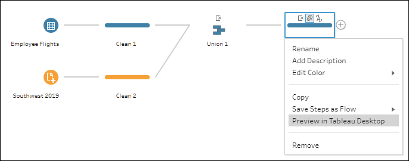

    Figure 15.20: You may preview the data represented by any step in
    Tableau Desktop by selecting the option from the right-click menu
    for that step

A new data connection will be made and opened in
Tableau Desktop. You can preview the data for any step in the flow. Take
a few moments to explore the data in Tableau
Desktop and then return to Tableau Prep. Now, we\'ll turn our attention
to extending the dataset with some calculations, supplemental data, and
a little restructuring.

Calculations and aggregations in Tableau Prep
---------------------------------------------

Let\'s look at how to create calculations and
some options for aggregations in Tableau Prep.

### Row-level calculations

Calculations in Tableau Prep follow a syntax
that\'s nearly identical to Tableau Desktop. However, you\'ll notice
that only row-level and `FIXED` level of detail
functions are available. This is because all calculations in Tableau
Prep will apply to the row level. Aggregations are performed using an
**Aggregate** **Step**, which we\'ll consider shortly.

Calculations and aggregations can greatly extend our analytic
capabilities. In our current example, there is an opportunity to analyze
the length of time between ticket purchase and actual travel. We may
also want to mark each record with an indicator of how frequently a
passenger travels overall. Let\'s dive into these calculations as we
continue our example with the following steps:

1.  We\'ll start with a calculation to determine the length of time
    between the purchasing of tickets and the day of travel. Select the
    **Clean 3** step and then click **Create Calculated Field**. Name
    the calculation **Days from Purchase to Travel** and enter
    `DATEDIFF('day', [Purchase Date], [Travel Date])`.

2.  Examine the results in the profile pane. The new field should look
    like this:

    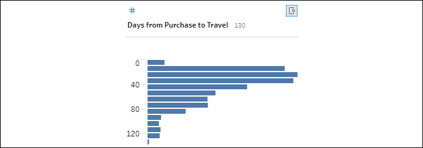

    Figure 15.21: The calculated field shows up in the profile pane

The default view here (as in many cases with
numeric fields) is a summary binned histogram. You can change the view
to see its details by selecting the ellipses button in the upper right
of the field and switching to **Detail**, which will show every value of
the field:

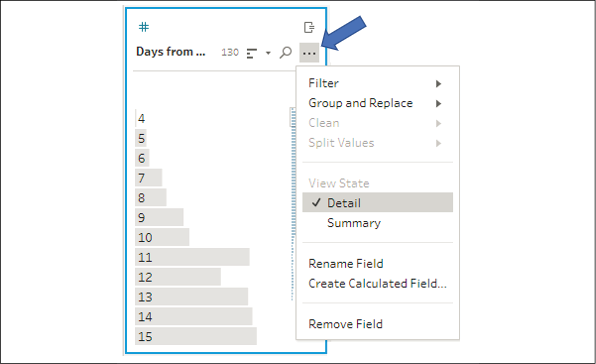

Figure 15.22: Numeric and date fields can be viewed in Summary or in
Detail

The shape of the data that\'s indicated by the
default summary histogram is close to what we might have expected with
most people purchasing tickets closer (but not immediately prior) to the
date of travel. There might be some opportunity for getting better deals
by purchasing farther in advance, so identifying this pattern (and then
exploring it more fully in Tableau Desktop) will be key for this kind of
analysis.

### Level of detail calculations

There are a few other types of analysis we may
wish to pursue. Let\'s consider how we might create segments of
passengers based on how often they travel.

We\'ll accomplish this using a `FIXED` **level of
detail** (**LOD**) expression. We could create the calculation from
scratch, matching the syntax we learned for Tableau Desktop to write the
calculation like this:

``` 
{FIXED [Person] : COUNTD([Row_ID])}
```


The preceding calculation would count the distinct rows per person.
Knowing that each row represents a trip, we could alternately use the
code `{FIXED [Person] : SUM(1)}`, which would
potentially be more performant, depending on the exact data source.

In this example, though, we\'ll leverage the interface to visually
create the calculation:

1.  Click the ellipses button on the `Person`
    field and select **Create Calculated Field** \| **Fixed LOD**:

    

    Figure 15.23: To create a Fixed LOD calculation, use the menu and
    select Create Calculated Field \| Fixed LOD

    Notice also the options to create **Custom Calculation** (to write
    code) and **Rank** (to compute rank for the selected field).

2.  This will bring up a **Fixed LOD** pane
    allowing us to configure the LOD expression. The **Group by** field
    is already set to `Person` (as we started the
    calculation from that field), but we\'ll need to configure **Compute
    using** to perform the distinct count of rows and rename the field
    as `Trips` `per`
    `Person`, as shown here:

    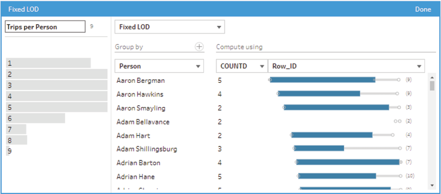

    Figure 15.24: The Fixed LOD pane allows you to configure the LOD
    expression visually and get instant visual feedback concerning
    results

3.  Click **Done** when you have finished
    configuring the **Fixed LOD**.

4.  We\'ll use the `Trips per Person` field to
    create segments of customers. We\'ll accomplish this with another
    calculated field, so click **Create Calculated Field...** to bring
    up the code editor. Name the field
    `Frequency Segment` and enter the following
    code:
    ```
    IF [Trips per Person] <= 2 THEN "Rarely"
    ELSEIF [Trips per Person] <= 5 THEN "Occasionally"
    ELSE "Frequently"
    END
    ```


The code uses the `Trips per Person` field in an
`If` `Then`
`Else` construction to create three segments. You
can visually see the correspondence between the fields in the preview
pane:

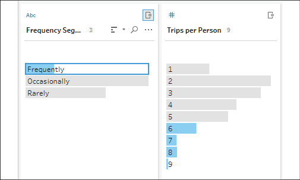

Figure 15.25: You can easily visualize how calculations relate to each
other and other fields using the Profile pane

The `Frequency` `Segment`
field can be used to accomplish all kinds of
useful analysis. For example, you might want to understand whether
frequent travelers typically get better ticket prices.

We\'ve seen row-level and FIXED LOD calculations, and noted the option
for **Rank**. Let\'s now turn our attention to aggregations.

### Aggregations

Aggregations in Tableau Prep are accomplished
using an aggregate step. We\'ll continue our flow with the idea that we
want to better understand our frequency of travel segment:

1.  Click the **+** symbol on **Clean 3** and add an **Aggregate** step.
    The new step will be named **Aggregate 1** by default:

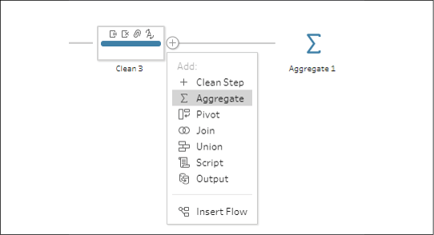

Figure 15.26: Adding an Aggregate step to the flow using the + symbol

1.  Double-click the text **Aggregate 1** under
    the new step. This allows you to edit the name. Change the name from
    **Aggregate 1** to **Frequency** **Segment**.


    **Tip:**

    Give steps meaningful names to self-document the flow. This will
    greatly help you and others when you return to edit the flow in the
    future. Additionally, when you are editing the name of a step, the
    **Add a description** text will appear below the name, as shown in
    *Figure 15.27*.

    

    Figure 15.27: When editing the name of a step, you may also add a
    more verbose description to help document the steps purpose


    Selecting the aggregate step reveals a pane
    with options for grouping and aggregating fields in the flow:

    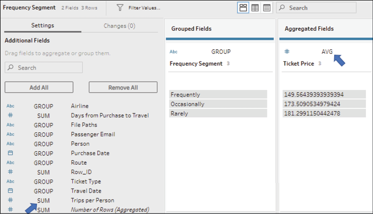

    Figure 15.28: Adding an Aggregate step to the flow using the +
    symbol

    You may drag and drop fields from the left to
    the **Grouped Fields** or **Aggregated Fields** sections and you may
    change the type of aggregation by clicking on the aggregation text
    (examples indicated by arrows in *Figure 15.28*:
    `SUM` next to `Trips`
    `per` `Person` or
    `AVG` above `Ticket`
    `Price`) and selecting a different
    aggregation from the resulting dropdown.

    In *Figure 15.28*, notice that we\'ve added **Frequency**
    **Segment** to the **GROUP** and `Ticket`
    `Price` to the **Aggregated Fields** as an
    `AVG`. Notice also the
    `Number` `of`
    `Rows` **(Aggregated)** that appears at the
    bottom of the list of fields on the left. This is a special field
    that\'s available in the aggregation step.


1.  Conclude the example by clicking the **+** icon that appears when
    you hover over the **Frequency Segment** aggregate step and adding
    an **Output** step:

    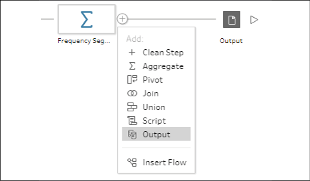

    Figure 15.29 Adding an Output step to the flow using the + symbol

2.  When you select the **Output** step, the **Output** pane shows
    options for saving the output and a preview
    of what the output will look like. In this case, we\'ve configured
    the output to save to a **Comma Separated Values (.csv)** file named
    **Frequency Segment**:

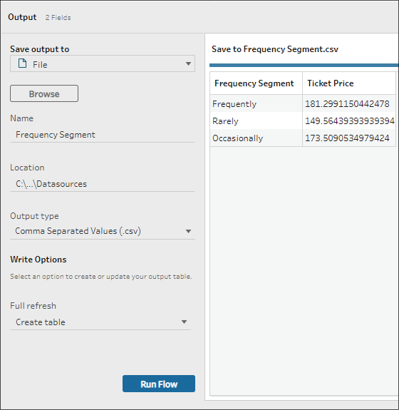

Figure 15.30: This output will contain exactly three rows of data

1.  The **Output** pane also gives options for
    setting the output type, performing a full refresh of the data, or
    appending to existing data, and running the flow.

We\'ll extend our flow in the next few sections to additionally output
detailed data. The detailed data as well as the output file of aggregate
data gives us some nice options for leveraging Tableau\'s Data Model in
Tableau Desktop to accomplish some complex analysis.

Let\'s continue by thinking about filtering data in Tableau Prep.

Filtering data in Tableau Prep
------------------------------

There are a couple of ways to filter
data in Tableau Prep:

-   Filter an input
-   Filter within the flow

Filtering an input can be efficient because the query that\'s sent to
the data source will return fewer records. To filter an input, select
the input step and then click the **Filter Values\...** button on the
input pane:

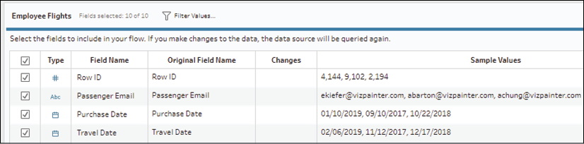

Figure 15.31: The Filter Values\... option allows you to filter values
on the input step. This could improve performance on large datasets or
relational databases

The **Add Filter** dialog that pops up allows you to write a calculation
with a `Boolean` (true/false) result. Only true
values will be retained.

Filtering may also be done within a clean step anywhere in the flow.
There are several ways to apply a filter:

-   Select one or more values for a given field and then use the **Keep
    Only** or **Exclude** options.
-   Use the **Option** button on a field to reveal multiple filter
    options based on the field type. For example, dates may be filtered
    by **Calculation...**, **Range of Dates**, **Relative Dates**, or
    **Null Values**:

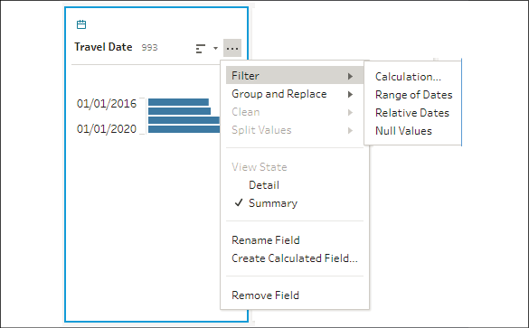

Figure 15.32: Filter options for a field include filtering by
Calculation, Range of Dates, and Relative Dates, and keeping or
excluding Null Values

-   Select a field and then **Filter Values**
    from the toolbar. Similar to the way filters
    work in the input pane, you will be prompted to write code that
    returns true for records you wish to keep. If, for example, you
    wanted to keep records for trips scheduled after January 1, 2016,
    you could write code such as the following:
    ```
    [Travel Date] > MAKEDATE(2016, 1, 1) 
    ```


While no filtering is required for the dataset in our example, you may
wish to experiment with various filtering techniques.

At this point, your flow should look something like this:

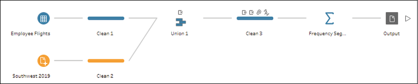

Figure 15.33: Your flow should look similar to this (exact placement and
colors of steps may vary)

Let\'s conclude the Tableau Prep flow with some final transformations to
make the data even easier to use in Tableau.

Transforming the data for analysis
----------------------------------

Let\'s create a new branch in the flow to work
once again with the detailed data. Click on the **Clean 3** step and
examine the preview pane. In particular, consider
the `Route` field:

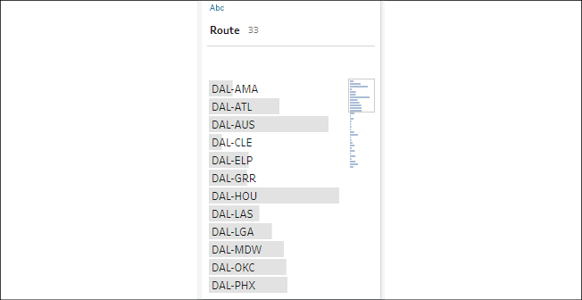

Figure 15.34: Route uses airport codes for origin and destination
separated by a dash

Tableau Desktop (and Server) contain built-in geocoding for airport
codes. But to accomplish our specific analysis goal (and open other
possibilities for geospatial functions in Tableau Desktop), we\'ll
supplement our data with our own geocoding. We\'ll also need to consider
the shape of the data. Origins and destinations will be most useful
split into separate fields, and if we want to connect them visually,
we\'ll also want to consider splitting them into separate rows (a row
for the origin and another row for the destination).

**Tip:**

There are quite a few possibilities for visualizing this data. For
example, we could keep origin and destination on the same row and use a
dual-axis map. If we want to connect origins with destinations with a
line, we could keep them in the same row of data and use Tableau\'s
`MAKELINE()` function. The example you\'ll follow
here will direct you to split the data into separate rows.


If you are following along, here are the steps
we\'ll take:

1.  Use the **+** button that appears when you hover over the **Clean
    3** step. Use that to add a new clean step, which will be
    automatically named **Clean 4**:

    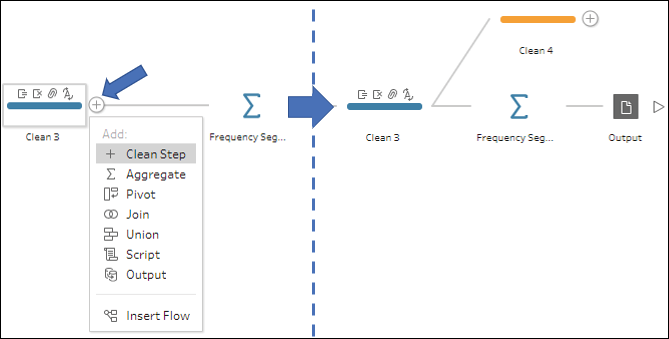

    Figure 15.35: Adding to a step that already has an output adds a new
    branch to the flow

2.  In the **Clean 4** step, use the ellipses button on the
    `Route` field and select **Split Values** \|
    **Automatic Split**:

    

    Figure 15.36: Split Values allows you to divide delimited strings
    into separate fields. Automatic Split attempts to determine the
    delimiter, while Custom Split... allows you greater options and
    flexibility

    You\'ll now see two new fields added to the
    step:

    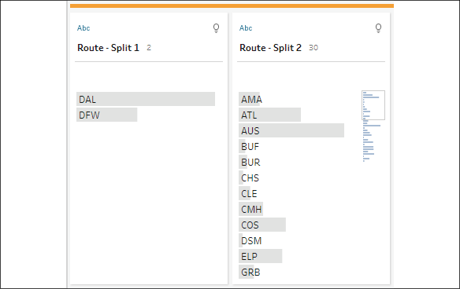

    Figure 15.37: The results of the split will be new fields in the
    flow

3.  **Route - Split 1** is the origin and
    **Route - Split 2** is the destination. Double-click the field name
    in the profile pane (or use the option from the ellipses button) to
    rename the fields to `Origin` and
    `Destination`.

4.  Locate the `US Airports.hyper` file in the
    `Chapter 15` directory. This file contains
    each `Airport` `Code`
    along with the `Airport`
    `Name` and `Latitude`
    and `Longitude`:

    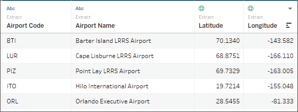

    Figure 15.38: The hyper extract contains the data we\'ll need to
    supplement the flow with our own geospatial data

5.  Make a connection to this file in Tableau
    Prep. You may choose to drag and drop the file onto the Tableau Prep
    canvas or use the **Add Connection** button from the interface.
    Tableau will automatically insert an input step named **Extract
    (Extract.Extract)**. Feel free to change the name of the input step
    to **Airport Codes**:

    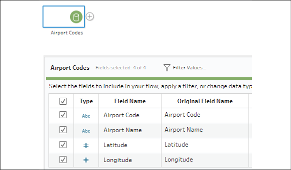

    Figure 15.39: The input pane for the Airport Codes file

6.  We\'ll want to join the **Airport Codes** into our flow to look up
    `Latitude` and
    `Longitude`, but before we do, we\'ll need to
    account for the fact that `Origin` and
    `Destination` in **Clean 4** are currently
    both on the same row of data. One option is to pivot the data. Use
    the **+** button on the **Clean 4** step to add a **Pivot** step:

    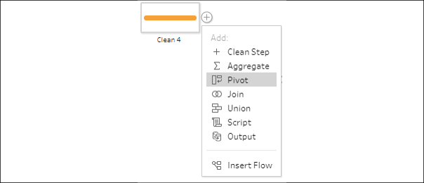

    Figure 15.40: Adding a Pivot step from Clean 4

7.  The pivot pane gives you options for
    transforming rows into columns or columns into rows. We\'ll keep the
    default option of **Columns to Rows**. Drag both the
    `Origin` and
    `Destination` fields into the **Pivot1
    Values** area of the pane:

    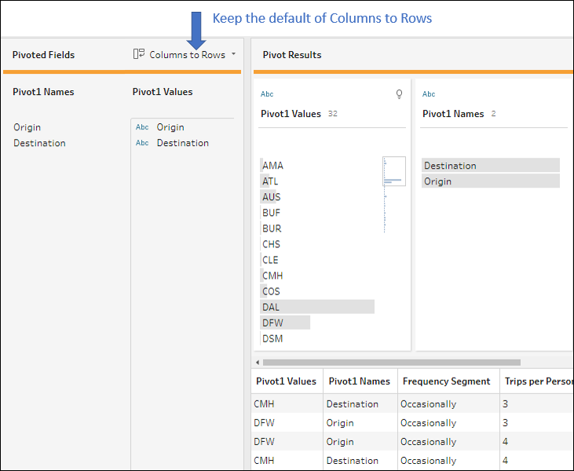

    Figure 15.41: Pivot1 Names keeps values from the original column
    names, while Pivot1 Values contains the actual values from Origin
    and Destination

8.  As a shortcut, instead of *steps 6* and *7*,
    you could have selected both the `Origin` and
    `Destination` fields in the **Clean 4** step,
    and selected **Pivot Columns to Rows**:

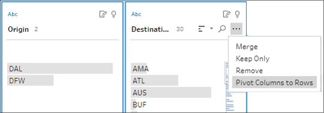

Figure 15.42: A shortcut for pivoting columns to rows

Continue with the following steps:

1.  Double-click the text for **Pivot1 Values**
    and rename the field `Airport Code`. This
    field will contain all the airport codes for both the origin and
    destination records.

2.  Double-click the text for **Pivot1 Names** and rename the field
    `Route Point`. This field will label each
    record as either an **Origin** or **Destination**.

    At this point, we have a dataset that contains a single record for
    each endpoint of the trip (either an origin or destination).


    **Tip:**

    Notice that the pivot resulted in duplicate data. What was once one
    row (origin and destination together) is now two rows. The record
    count has doubled, so we can no longer count the number of records
    to determine the number of trips. We also cannot
    `SUM` the cost of a ticket as it will double
    count the ticket. We\'ll need to use
    `MIN`/`MAX`/`AVG`
    or some kind of level of detail expression or filter to look at only
    origins or destinations. While many transformations allow us to
    accomplish certain goals, we have to be aware that they may
    introduce other complications.


    The only location information we currently have in our main flow is
    the airport code. However, we already made a connection to
    `Airports.hyper` and renamed the input step
    as **Airport** **Codes**.

3.  Locate the **Airport Codes** input step and drag it over the
    **Pivot** step. Drop it onto the **Join** area:

    

    Figure 15.43: Dragging Airport Codes to the Join area of the Pivot
    step

    After dropping the **Airport Codes** input
    step onto the **Join** area, a new join step will be created, named
    **Join 1**. Take a moment to examine the join pane:

    

    Figure 15.44: The join pane gives a lot of information and options
    for configuring the join and understanding the results. Important
    sections of the interface are numbered with descriptions below

You\'ll notice the following features in *Figure
15.44*:

1.  **Applied Join Clauses**: Here, you have the option to add
    conditions to the join clause, deciding which fields should be used
    as keys to define the join. You may add as many clauses as you need.
2.  **Join Type**: Here, you may define the type of join (inner, left,
    left inner, right, right inner, outer). Accomplish this by clicking
    sections of the Venn diagram.
3.  **Summary of Join Results**: The bar chart here indicates how many
    records come from each input of the flow and how many matched or did
    not match. You may click a bar segment to see filtered results in
    the data grid.
4.  **Join Clause Recommendations**: If applicable, Tableau Prep will
    display probable join clauses that you can add with a single click.
5.  **Join Clauses**: Here, Tableau Prep displays the fields used in the
    join clauses and the corresponding values. Any unmatched values will
    have a red font color. You may edit values by double-clicking them.
    This enables you to fix individual mismatched values as needed.

We do not need to configure anything in this example. The default of an
**Inner** join on the `Airport Code` fields works
well. We can confirm that all `9,158` records
from the **Pivot** step are kept. Only `32`
records from the **Airport Codes** hyper file are actual matches
(`1,301` records didn\'t match). That is not
concerning. It just means we had a lot of extra codes that could have
possibly supplemented our data but weren\'t actually needed. Now,
continuing from our previous example:

1.  From **Join 1**, add a final output step and configure it to output
    to a `.csv` file named
    `Airline Travel.csv`.


1.  Run the flow by using the run button at the
    top of the toolbar or by clicking the run button on the output step.

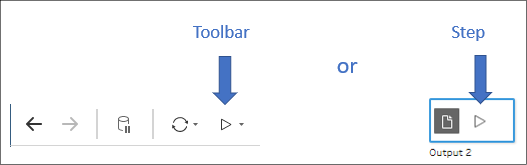

Figure 15.45: The toolbar allows you to run the flow for all outputs or
a single output, while the button on the output step will run the flow
only for that output

Your final flow will look something like this:

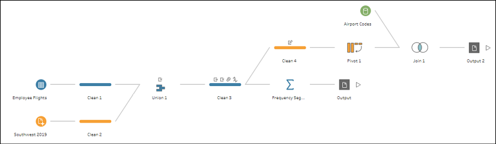

Figure 15.46: Your final flow will resemble this, but may be slightly
different in appearance

The `Chapter 15 Complete (clean).tfl` file is a
bit cleaned up with appropriate step labels and descriptions. As a good
practice, try to rename your steps and include descriptions so that your
flow is easier to understand. Here is how the cleaned version looks:

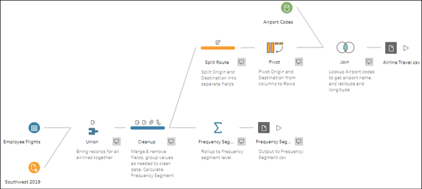

Figure 15.47: This flow is cleaned up and contains
\"self-documentation\"

Once the flow has been executed, open the
`Airline Travel.twb` workbook in the
`tableau-fundamentals\Lab 15` directory to see
how the data might be used and to explore it on your own:

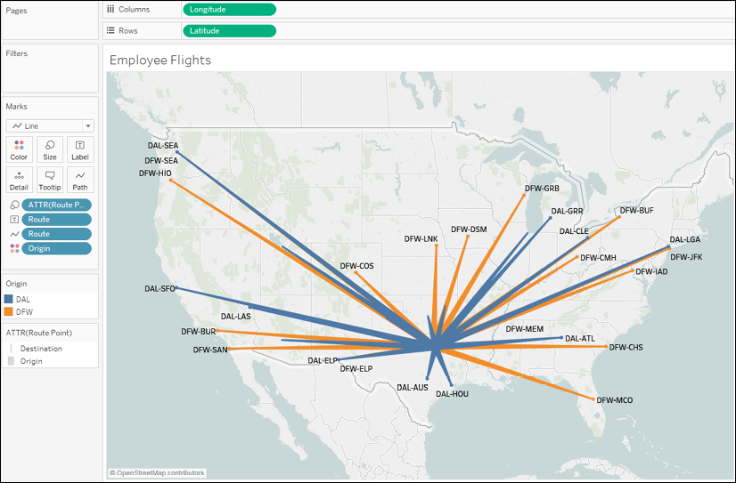

Figure 15.48: Exploring the data in the Airline Travel.twb workbook

**Tip:**

Unlike `.tde` or `.hyper`
files, `.csv` files may be written to, even if
they are open as a data source in Tableau Desktop. You will receive an
error if you run a flow that attempts to overwrite a
`.tde` or `.hyper` file
that is in use. Additionally, you may rearrange the field order for a
`.csv` file by dragging and dropping fields into
the profile pane of a clean step prior to the output.


With our example concluded, let\'s wrap up by considering some options
for automating Tableau Prep flows.


#### Options for automating flows


Tableau Prep Builder allows you to design and run
flows using the application. Sometimes, data cleansing and prepping will
be a one-time operation to support an ad hoc analysis. However, you will
often want to run a flow subsequently to capture new or changed data and
to cleanse and shape it according to the same pattern. In these cases,
you\'ll want to consider some options for automating the flow:

-   **Tableau Prep Builder** may be run via a
    command line. You may supply JSON files to define credentials for
    input or output data connections. This enables you to use scripting
    and scheduling utilities to run the flow without manually opening
    and running the Tableau Prep interface. Details on this option are
    available from Tableau Help:
    [[https://onlinehelp.tableau.com/current/prep/en-us/prep\_save\_share.htm\#refresh-output-files-from-the-command-line]](https://onlinehelp.tableau.com/current/prep/en-us/prep_save_share.htm#refresh-output-files-from-the-command-line).
-   **Tableau Prep Conductor**, an add-on to
    Tableau Server, gives you the ability to publish entire flows from
    Tableau Prep Builder to Tableau Server and then either run them on
    demand or on a custom schedule. It also provides monitoring and
    troubleshooting capabilities.


#### Summary


Tableau Prep\'s innovative paradigm of hands-on data cleansing and
shaping with instant feedback greatly extends the Tableau platform and
gives you incredible control over your data. In this lab, we
considered the overall interface and how it allows you to iteratively
and rapidly build out a logical flow to clean and shape data for the
desired analysis or visualization.

Through a detailed, yet practical, example that was woven throughout
this lab, we explored every major transformation in Tableau Prep,
from inputs to unions, joins, aggregates and pivots, to outputs. Along
the way, we also examined other transformations and capabilities,
including calculations, splits, merges, and the grouping of values. This
gives you a foundation for molding and shaping data in any way you need.

In the next lab, we\'ll conclude with some final thoughts on how you
can leverage Tableau\'s platform to share your analysis and data
stories!
