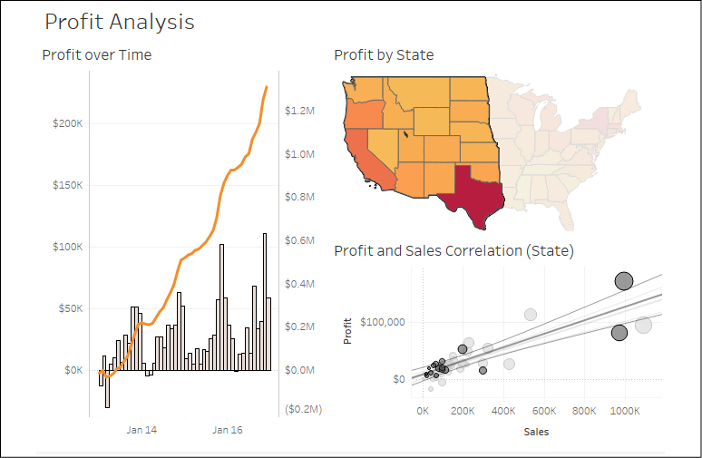
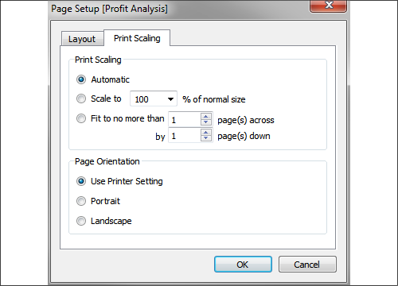
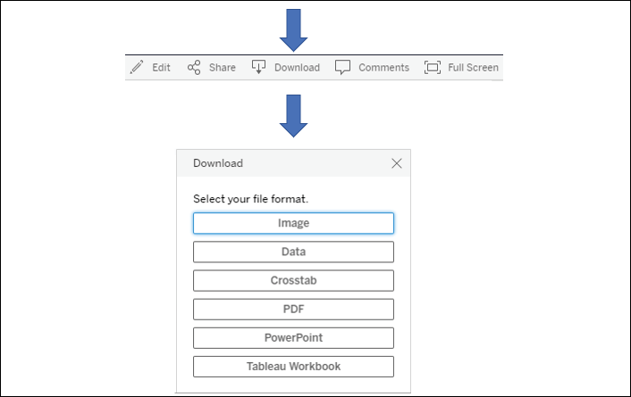
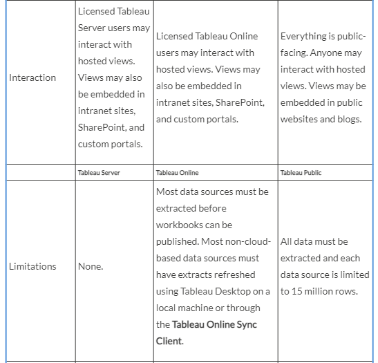
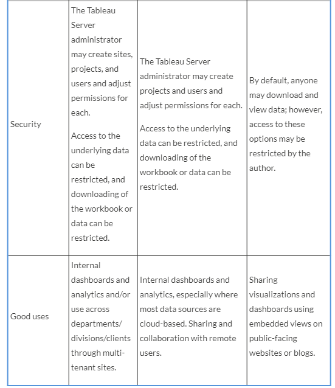
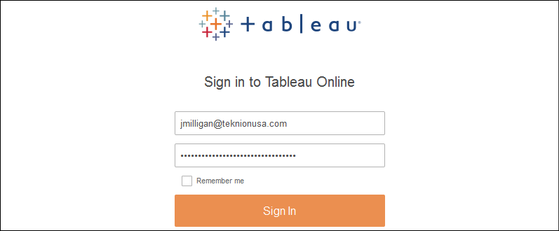
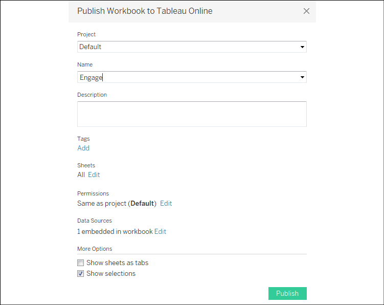
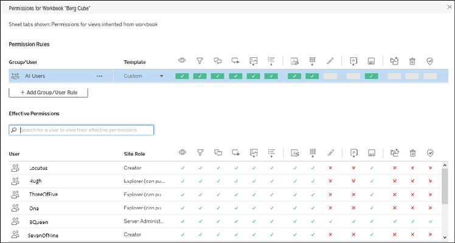
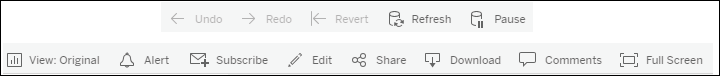

Sharing Your Data Story
=======================

In this lab, we\'ll look at the following topics:

-   Presenting, printing, and exporting
-   Sharing with users of Tableau Desktop and Tableau Reader
-   Sharing with users of Tableau Server, Tableau Online, and Tableau
    Public

There are no examples to follow in this lab, but it is highly
recommended to read through the material for a solid understanding of
the various options available for sharing your insights and discoveries.

Let\'s start with an overview of the presenting, printing and exporting
processes.

### Presenting, printing, and exporting

Presenting
----------

Tableau gives you multiple options for personally
presenting your data
story. You might walk your audience through a presentation of a single
dashboard or view, or you might create an entire presentation. While
there are multiple ways you might structure a presentation, consider the
following options:

-   Exporting to PowerPoint
-   Presentation mode

Tableau Desktop and Server allow you
to export directly to
**PowerPoint**. In Tableau Desktop, select **File** \| **Export as
PowerPoint\...**. After selecting a location and filename, Tableau will
generate a PowerPoint file (`.pptx`), converting
each tab in the Tableau workbook to a single slide in PowerPoint. Each
slide will contain a static image of the views and dashboards as they
exist at the time of the export. As each slide is simply a screenshot,
there will be no dynamic interactivity following the export.

If you prefer a more
dynamic presentation experience, consider using **Presentation mode**.
This mode shows you all dashboards and views in full screen mode. It
hides all toolbars, panes, and authoring objects. To activate
presentation mode, select **Window** from the top menu or press *F7* or
the option on the top toolbar. Press *F7* or the *Esc* key to exit
presentation mode. While in presentation mode, you may still interact
with dashboards and views using actions, highlighting, filtering, and
other options. This enriches the presentation and gives you the ability
to answer questions on the fly. When used with compelling dashboards and
stories, presentation mode makes for an effective way to personally walk
your audience through the data story.

**Tip:**

If you save a workbook by pressing [Ctrl] + [S] while in presentation mode, the workbook will be opened in
presentation mode by default.

Printing
--------

Tableau enables printing
for individual visualizations, dashboards, and stories. From the
**File** menu, you can select **Print** to send the currently active
sheet in the workbook to the printer or the **Print to PDF** option to
export to a PDF. Either option allows you to export the active sheet,
selected sheets, or the entire workbook to a PDF. To select multiple
sheets, hold the [Ctrl] key and click individual
tabs.

When printing, you also have the option to **Show Selections**. When
this option is checked, marks that have been interactively selected or
highlighted on a view or dashboard will be printed as selected.
Otherwise, marks will print as though no selections have been made. The
map in the following dashboard has marks for the western half of the
United States selected:

Figure 16.1: You can see states and circles that are selected in this
screenshot.You may optionally print views with selections

Here are some
considerations, tips, and
suggestions for printing:

-   If a dashboard is being designed for printing, select a predefined
    paper size as the fixed size for the dashboard or use a custom size
    that matches the same aspect ratio.
-   Use the **Page Setup** screen (available from the **File** menu) to
    define specific print options, such as what elements (legends,
    title, caption) will be included, the layout (including margins and
    centering), and how the view or dashboard should be scaled to match
    the paper size. The **Page Setup** options are specific to each
    view. Duplicating or copying a sheet will include any changes to the
    **Page Setup** settings:

    **Tip:**

    If you are designing multiple sheets or dashboards for printing,
    consider creating one as a template, setting up all the desired
    print settings, and then duplicating it for each new sheet.

Figure 16.2: The Page Setup dialog contains options for layout and print
scaling

-   Fields used on the
    **Pages** shelf will define page breaks in printing (for individual
    sheets, but not dashboards or stories). The number of pages defined
    by the **Pages** shelf is not necessarily equivalent to the number
    of printed pages. This is because a single page defined by the
    **Pages** shelf might require more than one printed page.
-   Each story point in a story will be printed on a new page.
-   Printing the entire workbook can be an effective way to generate a
    single PDF document for distribution. Each visible sheet will be
    included in the PDF in the order of the tabs, from left to right.
    You may hide sheets to prevent inclusion in the PDF or reorder
    sheets to adjust the order of the resultant document. Consider also
    creating dashboards with images and text for title pages, table of
    contents, page numbers, and commentary. You might experiment with
    complete workbooks from previous labs to see how various visual
    elements are retained or changed in the PDF conversion.
-   Avoid scrollbars in dashboards as they will print as scrollbars, and
    anything outside the visible window will not be printed.
-   You can also select multiple sheets in the workbook (hold the
    [Ctrl] key while clicking each tab) and
    then print only
    selected sheets.

    **Tip:**

    Sheets may be hidden if they are views that are used in one or more
    dashboards or tooltips, or if they are dashboards used in one or
    more stories. To hide a view, right-click the tab or thumbnail on
    the bottom strip or in the left-hand pane of the dashboard or story
    workspace and select **Hide Sheet**. To show a sheet, locate it in
    the left-hand pane of the dashboard or story workspace, right-click
    it, and uncheck **Hide Sheet.** You can also right-click a dashboard
    or story tab and hide or show all sheets used.

    If you don\'t see a **Hide Sheet** option, this means this sheet is
    not used in any dashboard and can be deleted.

In addition to printing or outputting to PDF, we can also export data
and images from views and dashboards. Let\'s see how!

Exporting
---------

Tableau also makes it easy
to export images of views, dashboards, and stories for use in documents,
documentation, and even books like this one! Images may be exported as
`.png`, `.emf`,
`.jpg`, or `.bmp`. You may
also copy an image to the clipboard to paste into other applications.
You may also export the data as a cross-tab (Excel), a
`.csv` file, or Microsoft Access database (on
PC).

To copy an image or export images or data, use the menu options for
**Worksheet**, **Dashboard**, or **Story**.

We\'ll consider using Tableau Server, Tableau Online, and Tableau Public
in detail shortly. For now, let\'s consider some of the exporting
features available on these platforms. When interacting with a view on
Tableau Server, Online, or Public, you will see a toolbar unless you
don\'t have the required permissions or the toolbar has been
specifically disabled by a Tableau Server administrator:

Figure 16.3: Exporting from the toolbar provides a similar experience
for Server, Online, and Public

The **Download** option
from the toolbar allows you to download an **Image**, **Data**,
**Crosstab** (Excel), **PDF**, **PowerPoint**, or the **Tableau
Workbook**. Images are exported in `.png` format
and render the dashboard in its current state. Exporting a
`.pdf` document will give the user many options,
including layout, scaling, and whether to print the current dashboard,
all sheets in the workbook, or all sheets in the current dashboard.

**Tip:**

Exporting data or a crosstab will export for the active view in the
dashboard; that is, if you click a view in the dashboard, it becomes
active and you can export the data or crosstab for that particular view.

Other options exist for exporting from Tableau Server:

-   Dashboards with **Export** buttons you may recall the **Export**
    button as one of the objects available to include on a dashboard.
    These can be configured to export the entire dashboard as a PDF,
    PowerPoint, or an image, and are a nice alternative to the toolbar
    option. This also allows for easy exporting from Tableau Desktop.
-   **Tabcmd** gives you
    the ability to export data, images, or documents in a wide variety
    of formats via the command line or scripts.
-   **REST API** gives you
    the ability to programmatically export data, images, or documents in
    a wide variety of formats.
-   You may append the extension to the URL of a view hosted on Tableau
    Server or Online to view or download in the format defined by the
    link. For example, appending `.pdf` so that
    the URL would be something like
    `https://tableauserver/#/views/Dashboard/View.pdf`
    would render the view as a PDF document in the browser.

Beyond sharing image or document exports, most often you\'ll want to
share fully interactive dashboards with others. Let\'s consider how you
might accomplish this.

#### Sharing with users of Tableau Desktop and Tableau Reader

You may share workbooks with other users of Tableau Desktop and Tableau
Reader. We\'ll consider the options and note some differences in the
following sections.

Sharing with Tableau Desktop users
----------------------------------

Sharing a workbook with
other Tableau Desktop users is fairly straightforward, but there are a
few things to consider.

One of the major considerations is whether you will be sharing a
packaged workbook (`.twbx`) or an unpackaged
workbook (`.twb`). Packaged workbooks are single
files that contain the workbook (`.twb`),
extracts (`.hyper`), file-based data sources that
have not been extracted (`.xls`,
`.xlsx`, `.txt`,
`.cub`, `.mdb`, and
others), custom images, and various other related files.

To share with users of Tableau Desktop, you have a variety of options:

-   You may share either a packaged (`.twbx`) or
    unpackaged (`.twb`) workbook by simply
    sharing the file with another user who has the same or a newer
    version of Tableau Desktop.

    **Tip:**

    Workbook files will be updated when saved in a newer version of
    Tableau Desktop. You may receive errors or warnings when you open
    the workbook in an older version of Tableau. You will be prompted
    about updates when you first open the workbook and again when you
    attempt to save it. You may optionally export a workbook as a
    previous version from the **File** menu.

-   If you share an unpackaged (`.twb`) workbook,
    then anyone else using it must be able to access any data sources,
    and any referenced images must be available to the user in the same
    directory where the original files were referenced. For example, if
    the workbook uses a live connection to an Excel
    (`.xlsx`) file on a network path and includes
    images on a dashboard located in `C:\Images`,
    then all users must be able to access the Excel file on the network
    path and have a local `C:\Images` directory
    with image files of the same name.

    **Tip:**

    Consider using a UNC (for example,
    `\\servername\directory\file.xlsx`) path for
    common files if you use this approach.

Similarly, if you share a
packaged workbook (`.twbx`) that uses live
connections, anyone using the workbook must be able to access the live
connection data source and have appropriate permissions.

Sharing with Tableau Reader users
---------------------------------

**Tableau Reader** is a
free application provided
by Tableau Software that allows users to interact with visualizations,
dashboards, and stories created in Tableau Desktop. Unlike Tableau
Desktop, it does not allow for the authoring of visualizations or
dashboards. However, all interactivity, such as filtering, drilldown,
actions, and highlighting, is available to the end user.

**Tip:**

Think of Tableau Reader as being similar to many PDF readers that allow
you to read and navigate the document, but do not allow for authoring or
saving changes.

To share with users of Tableau Reader, consider the following:

-   Reader will only open packaged (`.twbx`)
    workbooks.
-   The packaged workbook may not contain live connections to server or
    cloud-based data sources. Those connections must be extracted.

    **Tip:**

    Be certain to take into consideration security and confidentiality
    concerns when sharing packaged workbooks
    (`.twbx`). Since packaged workbooks most
    often contain the data, you must be certain that the data is not
    sensitive. Even if the data is not shown on any view or dashboard,
    if it is a part of an extract or file packaged with the workbook, it
    is still accessible.

Reader and Desktop are
good options but do require other users to have the application
installed. You might also consider using Tableau Server, Online, or
Public to share and collaborate with a wider audience.

#### Sharing with users of Tableau Server, Tableau Online, and Tableau Public

**Tableau Server**, **Tableau Online**, and **Tableau Public** are
all variations on the same
concept: hosting
visualizations and dashboards on a server and allowing users
to access them through a
web browser.

The following table provides some of the similarities and differences
between the products, but as details may change, please consult with a
Tableau representative prior to making any purchasing decisions:

Publishing to Tableau Public
----------------------------

You may open workbooks and
save to Tableau Public using either Tableau Desktop or the free Tableau
Public client application. Please keep the following points in mind:

-   In order to use Tableau Public, you will need to register an
    account.
-   With Tableau Desktop and the proper permissions, you may save and
    open workbooks to and from Tableau Public using the **Server** menu
    and by selecting options under Tableau Public.
-   With the free Tableau Public client, you may only save workbooks to
    and from the web.
    **Note:**

    With these options, be aware that anyone in the world can view what
    you publish.

-   Selecting the option to **Manage Workbooks** will open a browser so
    you can log in to your Tableau Public account and manage all your
    workbooks online.
-   Workbooks saved to Tableau Public may contain any number of data
    source connections, but they must all be extracted and must not
    contain more than 15 million rows of extracted data each.

Consider using Tableau Public when you want to share your data story
with the world!

Publishing to Tableau Server and Tableau Online
-----------------------------------------------

Publishing to Tableau
Server and Tableau Online is a similar experience. To publish to Tableau
Server or Tableau Online,
from the menu select **Server** \| **Publish Workbook**. If you are not
signed in to a server, you will be prompted to sign in:

Figure 16.4: The sign-in screen for Tableau Online

You must have a user
account with publish permissions for one or more projects. Enter the URL
or IP address of the Tableau Server or the Tableau Online URL, your
username, and password. Once signed in, you will be prompted to select a
site, if you have access to more than one. Finally, you will see the
publish screen:

Figure 16.5: Publishing to Tableau Online

You have multiple options
when you publish:

-   Select the **Project** to
    which you wish to
    publish and **Name** your workbook. If a workbook has already been
    published with the same name as the selected project, you will be
    prompted to overwrite it.

-   You may give the workbook a **Description** and use **Add Tags** to
    make searching for and finding your workbook easier.

-   You may also specify which **Sheets** to include in the published
    workbook. Any sheets you check will be included; any you uncheck
    will not.

-   You may edit user and group **Permissions** to define who has
    permission to view, interact with, and alter your workbook. By
    default, the project settings are used. Here is an example workbook
    with individual users and permissions:

    

    Figure 16.6: Tableau Server allows for a robust set of permissions.
    You can adjust individual and group permissions for viewing,
    filtering, commenting, editing, saving, and more

-   You may edit
    properties for data sources. The options are described in detail in
    the next section.
-   You also have the
    option to **Show Sheets as Tabs**. When checked, users on Tableau
    Server will be able to navigate between sheets using tabs similar to
    those shown at the bottom of Tableau Desktop. This option must be
    checked if you plan to have actions that navigate between views.
-   **Show Selections** indicates that you wish any active selections of
    marks to be retained in the published views.

Editing data sources gives you options for authentication and
scheduling:

-   For each data connection used in the workbook, you may determine how
    database connections are authenticated. The options will depend on
    the data source as well as the configuration of Tableau Server.
    Various options include embedding a password, impersonating a user,
    or prompting a Tableau Server user for credentials.
-   You may specify a schedule for Tableau Server to run refreshes of
    any data extracts.

Any live connections or extracted connections that will be refreshed on
the server must define connections that work from the server. This means
that all applicable database drivers must be installed on the server;
all network, internet connections, and ports required for accessing
database servers and cloud-based data must be open.

Additionally, any external files referenced by a workbook (for example,
image files and non-extracted file-based data sources) that were not
included when the workbook was published must be referenced using a
location that is accessible by Tableau Server (for example, a network
path with security settings allowing the Tableau Server process read
access).

Once dashboards and views have been published to Tableau Server, you and
other users with access will be able to interact with them. We\'ll
consider the details next.

Interacting with Tableau Server
-------------------------------

After a workbook is
published to Tableau Server, other users will be able to view and
interact with the visualizations and dashboards using a web browser.
Once logged in to Tableau Server, they will be able to browse content
for which they have appropriate permissions. These users will be able to
use any features built into the dashboards, such as quick filters,
parameters, actions, or drilldowns. Everything is rendered as
`HTML5`, so the only requirement for the user to
view and interact with views and dashboards is an
`HTML5`-compatible web browser.

**Tip:**

The **Tableau Mobile** app,
available for iOS and
Android devices, can enhance the experience for mobile users. Use
Tableau\'s device designer to target layouts for specific devices.

For the most part, interacting with a workbook on Server or Online is
very similar to interacting with a workbook in Tableau Desktop or
Reader. Quick filters, parameters, actions, and tooltips all look and
behave similarly.

You will find some additional features:

-   The side menu gives you various options related to managing and
    navigating Tableau Server.

-   Below that, you\'ll find a breadcrumb trail informing you which
    workbook and view you are currently viewing.

-   Beneath that, you\'ll find a toolbar that includes several features:

    

    Figure 16.7: The Tableau Server toolbar

-   **Undo** and **Redo** give you the ability to step backward and
    forward through interactions.
-   **Revert** gives you the ability to undo all changes and revert to
    the original dashboard.
-   **Refresh** reloads the dashboard and refreshes the data. However,
    this does not refresh any extracts of the data.
-   **Pause** allows you to pause refreshing of the dashboard based on
    actions, filter selections, or parameter value changes until you
    have made all the changes you wish.
-   **View** allows you to
    save the current state of the dashboard based on selections,
    filters, and parameter values so you can quickly return to it at a
    later point. You can also find your saved views here.
-   **Alert** allows you to set up a conditional alert. When a mark in a
    view reaches a threshold you define, you will receive an alert
    through email. For example, you might have a line chart of
    profitability and expect an alert on a day when you meet an
    organizational goal. Or you might set an alert to receive
    notification when the count of errors indicated in the data exceeds
    `0`.
-   **Subscribe** allows you to schedule periodic emails of a screenshot
    of the dashboard. Administrators may also subscribe other users. You
    might want to consider this option to distribute daily performance
    reports, sales updates, inventory counts, or any other information
    you want to push out!
-   **Edit** allows you to edit the dashboard. The interface is very
    similar to Tableau Desktop. The Tableau Administrator can enable or
    disable web editing per user or group and also control permissions
    for saving edited views.
-   **Share** gives you options for sharing the workbook. These options
    include a URL you can distribute to other licensed users, as well as
    code for embedding the dashboard in a web page.
-   The **Download** button allows you to download the data, images of
    the dashboard, the `.pdf`, or the workbook,
    as described earlier.
-   **Comments** give you the ability to collaborate with other Tableau
    Server users by making comments on the view and responding to the
    comments of others.
-   **Full Screen** allows
    you to view the
    dashboard or view in full screen mode.
-   **Metrics** (not shown in *Figure 16.7*) give you the ability to
    define key numbers or indicators that you wish to track.

Now that we\'ve explored some of Tableau Server\'s interactive
capabilities, let\'s consider some further distribution options with
Tableau Server and Tableau Online.

Additional distribution options using Tableau Server or Tableau Online
----------------------------------------------------------------------

Both Tableau Server and
Tableau Online provide several
other options for sharing
your views, dashboards, and data. Along with allowing users to log in to
Tableau Server, you might consider the following options:

-   Dashboards, views, and story points can be embedded in websites,
    portals, and SharePoint. Single-sign-on options exist to allow your
    website authentication to integrate seamlessly with Tableau Server.
-   Tableau Server allows users to subscribe to views and dashboards and
    schedule email delivery. The email will contain an up-to-date image
    of the view and a link to the dashboard on Tableau Server.
-   The **tabcmd** utility
    is provided with Tableau Server and may be installed on other
    machines. The utility provides the ability to automate many
    functions of Tableau Server, including export features, publishing,
    and user and security management. This opens up quite a few
    possibilities for automating delivery.
-   The **REST API** allows programmatic
    interaction with
    Tableau Server. This gives you a wide range of options for exporting
    data, images, and documents and distributing to users as well as
    access to usage statistics, users, permissions, and more!

All these options greatly extend the flexibility of distributing data
and visualizations to those in the organization who need them most!

### Summary

Tableau is an amazing platform for exploring, prepping, and cleaning
your data as you create useful and meaningful visualizations and
dashboards to understand and communicate key insights. Throughout this
book, we\'ve considered how to connect to data---whether file-based, in
an on-premises database, or in the cloud. You\'ve worked through
examples of exploring and prepping data to clean it and structure it for
analysis. We\'ve covered numerous types of visualization and how they
can uncover deep analytical insights. The four main types of
calculations were explored in depth, giving you the tools to extend the
data, analysis, and user interactivity. You\'ve built dashboards and
told stories with the data. In this lab, we considered how to share
the results of all your work with others.

You now have a solid foundation. At its core, the Tableau platform is
intuitive and easy to use. As you dive deeper, the simplicity becomes
increasingly beautiful. As you discover new ways to understand your
data, solve complex problems, ask new questions, and find new answers in
your datasets, your new Tableau skills will help you uncover, interpret,
and share new insights hidden in your data.
