Lab 2. Connecting to Data in Tableau 
=============================

Tableau offers the ability to connect to nearly any data source. It does
this with a unique paradigm that leverages the power and efficiency of
existing database engines or alternately extracts the data locally.
We\'ll look at joins, blends, unions.
In this lab, we\'ll focus on essential concepts of how Tableau
connects to and works with data. We\'ll cover the following topics:

-   The Tableau paradigm
-   Connecting to data
-   Managing data source metadata
-   Working with extracts instead of live connections
-   Filtering data

We\'ll start by gaining an understanding of the underlying paradigm of
how Tableau works with data.

### The Tableau paradigm

The unique and exciting experience of working with
data in Tableau is a result of **VizQL** (**Visual Query Language**).

In its simplest form, the Tableau paradigm of working with data looks
like the following diagram:

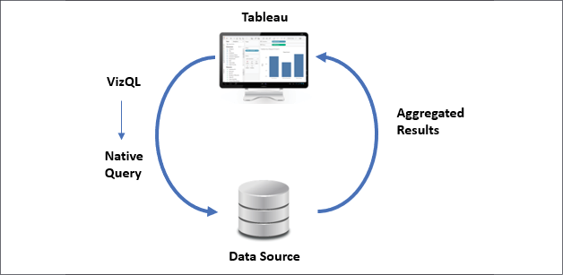

Let\'s look at how this paradigm works in a practical example.

A simple example 
----------------

Open the `Chapter 02 Starter.twbx` workbook
located in the `tableau-fundamentals\Lab 02`
directory and navigate to the `Tableau Paradigm`
sheet. That view was created by dropping the
**Region** dimension on **Columns** and the **Sales** measure on
**Rows**. Here is a screenshot:

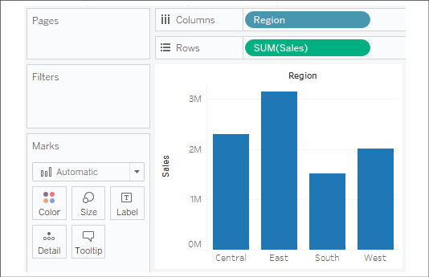

The view is defined by two fields. **Region** is the only dimension,
which means it defines the level of detail in the view and slices the
measure so that there will be a bar per region. **Sales** is used as a
measure aggregated by summing each sale within each region. (Notice also
that **Region** is discrete, resulting in column **headers** while
**Sales** is continuous, resulting in an **axis**.)

**Tip:**

You may use Tableau\'s built-in **Performance Recorder** to locate the queries that have been executed. From the top
menu, select **Help \| Settings and Performance \| Start Performance Recording**, then interact with a view, and finally, stop the recording
from the menu. Tableau will open a dashboard that will allow you to see
tasks, performance, and queries that were executed during the recording
session.

To see the aggregate data that Tableau used to draw the view, press
*Ctrl* + *A* to select all the bars, and then
right-click one of them and select **View Data**.

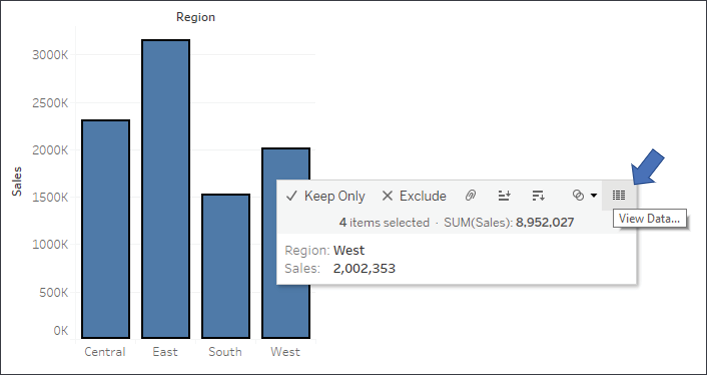

Figure 2.4: Use the View Data tooltip option to see a summary or
underlying data for a mark

This will reveal a **View Data** window:

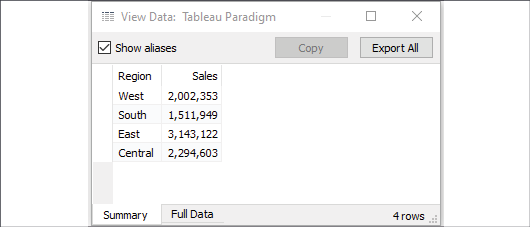

The **View Data** screen allows you to observe the data in the view. The
**Summary** tab displays the aggregate-level data
that was used to render the view. The **Sales** values here are the sum
of sales for each region. When you click the **Full Data** (previously
named **Underlying**) tab, Tableau will query the data source to
retrieve all the records that make up the aggregate records. In this
case, there are **9,426** underlying records, as indicated on the status
bar in the lower-right corner of the following screenshot:

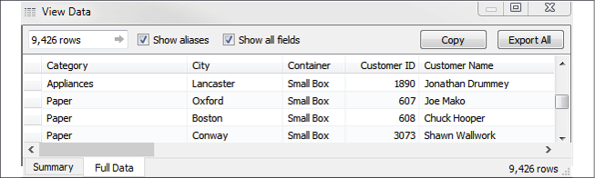

Figure 2.6: The Full Data tab reveals the row-level data in the database

Tableau did not need **9,426** records to draw the view and did not
request them from the data source until the **Full Data** data tab was
clicked.

Tableau will only query the data source when you make
changes requiring a new query or a view refresh.
Otherwise, it will use the aggregate results stored in a local cache, as
illustrated here:

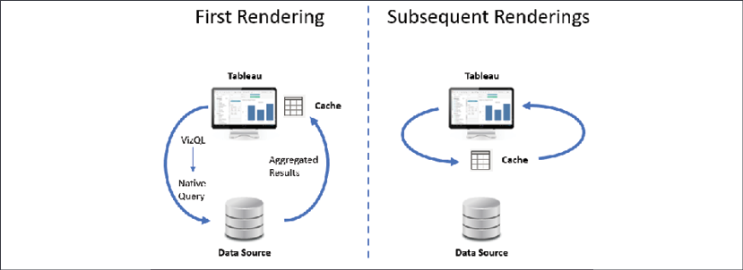

In the preceding example, the query with **Region** as a dimension and
the sum of **Sales** as a measure will only be issued once to the data
source. When the four rows of aggregated results are returned, they are
stored in the cache. After the initial rendering, if you were to move
**Region** to another visual encoding shelf, such as color, or **Sales**
to a different visual encoding shelf, such as size, then Tableau will
retrieve the aggregated rows from the cache and simply re-render the
view.

**Tip:**

You can force Tableau to bypass the cache and refresh the data from a
data source by pressing *F5* or selecting your data source from the
**Data** menu and selecting **Refresh**. Do this any time you want a
view to reflect the most recent changes in a live data source.

If you were to introduce new fields into the view
that did not have cached results, Tableau would send a new query to the
data source, retrieve the aggregated results, and add those results to
the cache.

### Connecting to data

There is virtually no limit to the data that Tableau can visualize!
Almost every new version of Tableau adds new
native connectors. Tableau continues to add native
connectors for cloud-based data. The **web data connector** allows you
to write a connector for any online data you wish to retrieve. The
**Tableau Hyper API** allows you to
programmatically read and write extracts of data, enabling you to access
data from any source and write it to a native Tableau format.
Additionally, for any database without a built-in connection, Tableau
gives you the ability to use a generic **ODBC**
connection.

You may have multiple data sources in the same workbook. Each source
will show up under the **Data** tab on the left sidebar.

Connecting to data in a file 
----------------------------

File-based data includes all sources of data where
the data is stored in a file.
In addition to those mentioned previously, you can connect to Tableau
files to import connections that you have saved in another Tableau
workbook (`.twb` or
`.twbx`). The connection will be imported, and
changes will only affect the current workbook.

Follow this example to see a connection to an Excel file:

1.  Navigate to the **Connect to Excel** sheet in the
    `Chapter 02 Starter.twbx` workbook.
2.  From the menu, select **Data \| New Data Source** and select
    **Microsoft Excel** from the list of possible connections.
3.  In the open dialogue, open the
    `Superstore.xlsx` file from the
    `tableau-fundamentals\Lab 02` directory.
    Tableau will open the **Data Source** screen. You should see the two
    sheets of the Excel document listed on the left.
4.  Double-click the **Orders** sheet and then the **Returns** sheet.
    Tableau will prompt you with an **Edit Relationship** dialog. We\'ll
    cover relationships in depth in *Lab 13*, *Understanding the
    Tableau Data Model, Joins, and Blends*. For now, accept the defaults
    by closing the dialog.

Your data source screen should look similar to the following screenshot:

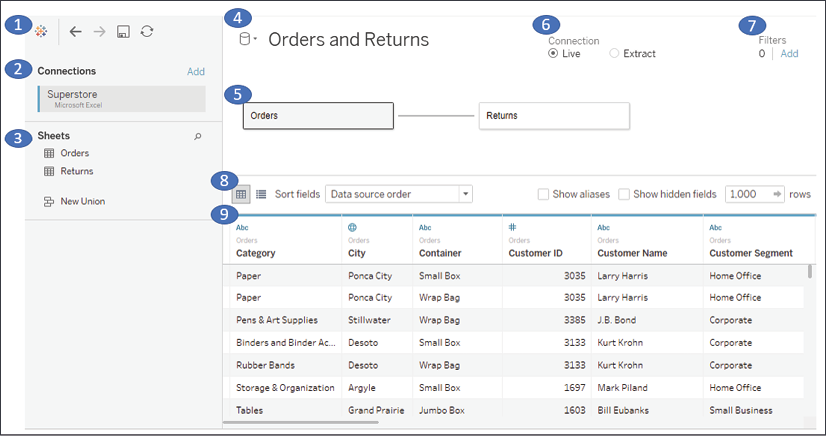

Figure 2.8: The data source screen with two objects (Orders and Returns)

Take some time to familiarize yourself with the **Data Source** screen
interface, which has the following features (numbered in the preceding
screenshot):

- Toolbar
- Connections
- Sheets (or Tables)
- Data Source Name
- Object / Data Model Canvas
- Live or Extract Options
- Data Source Filters
- Preview Pane Options
- Preview Pane/Metadata View

**Tip:**

Once you have created and configured your data source, you may click any
sheet to start using it.

Conclude this exercise with the following steps:

1.  Click the data source name to edit the text and rename the data
    source to `Orders and Returns`.

1.  Navigate to the **Connect to Excel** sheet and, using the
    `Orders and Returns` data source, create a
    time series showing **Returns (Count)** by
    **Return Reason**. Your view should look like the following
    screenshot:

    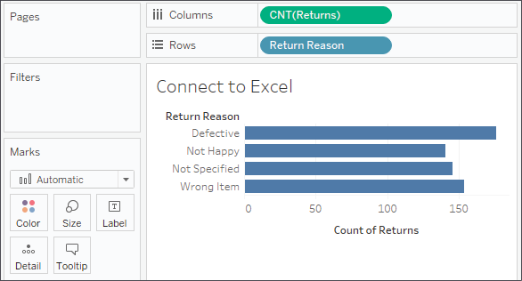

    Figure 2.9: The number of returns by return reason

If you need to edit the connection at any time, select **Data** from the
menu, locate your connection, and then select **Edit Data Source\...**.
Alternately, you may right-click any data source under the **Data** tab
on the left sidebar and select **Edit Data Source\...**, or click the
**Data Source** tab in the lower-left corner. You may access the data
source screen at any time by clicking the **Data Source** tab in the
lower-left corner of Tableau Desktop.

Using extracts 
--------------

Any data source that is using an extract will have
a distinctive icon that indicates the data has been pulled from an
original source into an extract, as shown in the following screenshot:

The first data connection in the preceding data pane is extracted, while
the second is not. After an extract has been created, you may choose to
use the extract or not. When you right-click a data source (or **Data**
from the menu and then the data source), you will see the following menu
options:

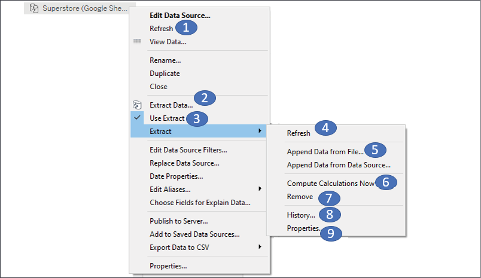

Figure 2.13: The context menu for a data connection in the Data pane
with Extract options numbered

Connecting to data in the cloud 
-------------------------------

Google Sheets allows users to create and maintain spreadsheets of data
online. Sheets may be shared and collaborated on by many different
users. Here, we\'ll walk through an example of connecting to a sheet
that is shared via a link.

To follow the example, you\'ll need a free Google account. With your
credentials, follow these steps:

1.  Click the **Add new data source** button on the toolbar, as shown
    here:

    

2.  Select **Google Sheets** from the list of possible data sources. You
    may use the search box to quickly narrow the
    list.

1.  On the next screen, sign in to your Google account and allow Tableau
    Desktop the appropriate permissions. You will then be presented with
    a list of all your Google Sheets, along with preview and search
    capabilities, as shown in the following screenshot:

    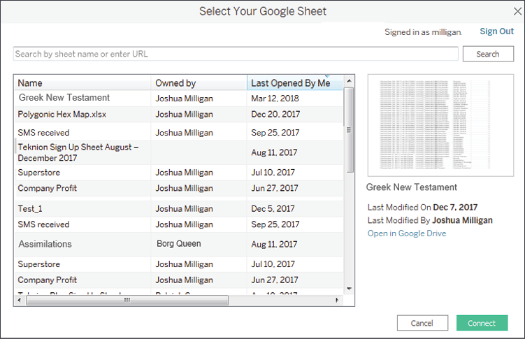

    Figure 2.15: You may select any Google Sheet you have permissions to
    view or you may enter the URL for a shared sheet

1.  Enter the following URL (for convenience, it
    is included in the `Chapter 02 Starter`
    workbook in the **Connect to Google Sheets** tab, and may be copied
    and pasted) into the search box and click the **Search** button:
    [[https://docs.google.com/spreadsheets/d/1BjFp6J0pq4fUnT2pVI1TSGcjBe1TbcWsciq-dq_kbVk/edit?usp=sharing]](https://docs.google.com/spreadsheets/d/1BjFp6J0pq4fUnT2pVI1TSGcjBe1TbcWsciq-dq_kbVk/edit?usp=sharing):

2.  Select the resulting `Superstore` sheet in
    the list and then click the **Connect** button. You should now see
    the **Data Source** screen.

3.  Click the **Data Source** name to rename it to
    `Superstore (Google Sheets)`:

    

    Figure 2.16: Renaming a Data Source

4.  For the purpose of this example, switch the
    connection option from **Live** to **Extract**. When connecting to
    your own Google Sheets data, you may choose either **Live** or
    **Extract**:

    

    Figure 2.17: Switch between Live and Extract, Edit extract options,
    and Add Filters

5.  Click the tab for the **Connect to Google Sheets** sheet. You will
    be prompted for a location to save the extract. Accept the default
    name and save it in the
    `Learning Tableau\Chapter 02` directory
    (selecting **Yes** to overwrite the existing file if needed). The
    data should be extracted within a few seconds.

1.  Create a filled map of **Profit** by **State**, with **Profit**
    defining the **Color** and **Label**:

    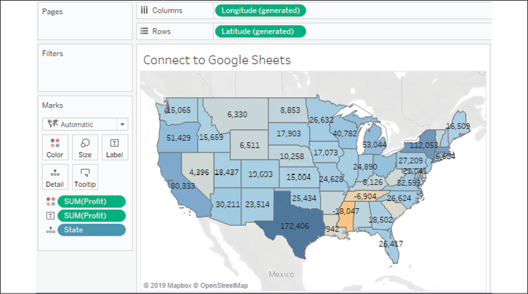

    Figure 2.18: The filled map demonstrates the ability to connect to a
    cloud-based data source

**Note:**

If your location is outside the United States, you may need to change
your regional settings for Tableau to properly show the states in the
map. Use the menu and select **File** \| **Workbook Locale** \| **More**
and select **English (United States)**.

Now that we\'ve seen a few specific examples of
connecting to data, let\'s consider some shortcuts and how to manage our
data sources.

Shortcuts for connecting to data 
--------------------------------

You can make certain connections very quickly.
These options will allow you to begin analyzing more quickly:

-   Paste data from the clipboard. If you have copied data in your
    system\'s clipboard from any source (for example, a spreadsheet, a
    table on a web page, or a text file), you can then paste the data
    directly into Tableau. This can be done using *Ctrl + V*, or **Data
    \| Paste Data** from the menu. The data will be stored as a file and
    you will be alerted to its location when you save the workbook.
-   Select **File \| Open** from the menu. This will allow you to open
    any data file that Tableau supports, such as text files, Excel
    files, Access files (not available on macOS), spatial files,
    statistical files, JSON, and even offline cube
    (`.cub`) files.
-   Drag and drop a file from Windows Explorer or
    Finder onto the Tableau workspace. Any valid file-based data source
    can be dropped onto the Tableau workspace or even the Tableau
    shortcut on your desktop or taskbar.
-   Duplicate an existing data source. You can duplicate an existing
    data source by right-clicking and selecting **Duplicate**.

These shortcuts provide a quick way for analyzing the data you need.
Let\'s turn our attention to managing the data sources.

### Managing data source metadata

Data sources in Tableau store information about
the connection(s). In addition to the connection itself (for example,
database server name, database, and/or filenames), the data source also
contains information about all the fields available (such as field name,
data type, default format, comments, and aliases). Often, this *data
about the data* is referred to as **metadata**.

Right-clicking a field in the data pane reveals a
menu of metadata options. Some of these options will be demonstrated in
a later exercise; others will be explained throughout the course. These
are some of the options available via right-clicking:

-   Renaming the field
-   Hiding the field
-   Changing aliases for values of a non-date dimension
-   Creating calculated fields, groups, sets, bins, or parameters
-   Splitting the field
-   Changing the default use of a date or numeric field to either
    discrete or continuous
-   Redefining the field as a dimension or a measure
-   Changing the data type of the field
-   Assigning a geographic role to the field
-   Changing defaults for how a field is displayed in a visualization,
    such as the default colors and shapes, number or date format, sort
    order (for dimensions), or type of aggregation (for measures)
-   Adding a default comment for a field (which will be shown as a
    tooltip when hovering over a field in the data pane, or shown as
    part of the description when **Describe\...** is selected from the
    menu)
-   Adding or removing the field from a hierarchy

**Tip:**

Metadata options that relate to the visual display of the field, such as
default sort order or default number format, define the overall default
for a field. However, you can override the defaults in any individual
view by right-clicking the active field on the shelf and selecting the
desired options.

To see how this works, use the filled map view of
`Profit` by `State` that
you created in the **Connect to Google Sheets** view. If you did not
create this view, you may use the **Orders and Returns** data source,
though the resulting view will be slightly different. With the filled
map in front of you, follow these steps:

1.  Right-click the **Profit** field in the data pane and select
    **Default Properties** \| **Number Format\...**. The resulting
    dialog gives you many options for numeric format.

2.  Set the number format to **Currency (Custom)** with
    `0` **Decimal places** and the **Display
    Units** in `Thousands (K)`. After clicking
    **OK**, you should notice that the labels on the map have updated to
    include currency notation:

    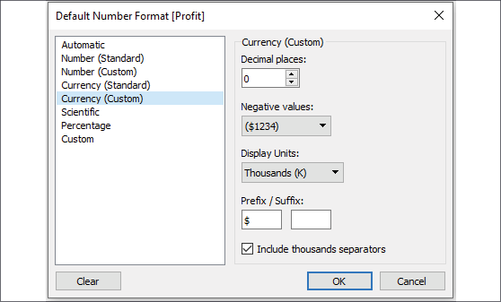

    Figure 2.19: Editing the default number format of a field

1.  Right-click the **Profit** field again and
    select **Default properties** \| **Color\...**. The resulting dialog
    gives you an option to select and customize the default color
    encoding of the **Profit** field. Experiment with various palettes
    and settings. Notice that every time you click the **Apply** button,
    the visualization updates.

**Tip:**

Diverging palettes (palettes that blend from one color to another) work
particularly well for fields such as **Profit**, which can have negative
and positive values. The default center of `0`
allows you to easily tell what values are positive or negative based on
the color shown.

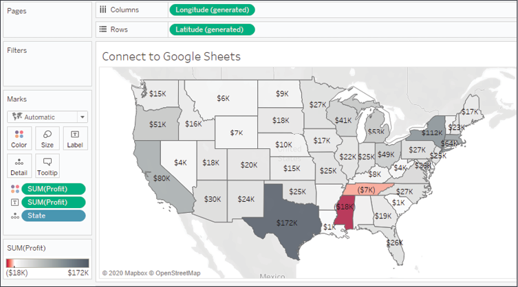

Figure 2.20: Customizing color

Because you have set the default format for the
field at the data-source level, any additional views you create using
**Profit** will include the default formatting you specified.

**Tip:**

Consider using color blind-safe colors in your visualizations. Orange
and blue are usually considered a color blind-safe alternative to red
and green. Tableau also includes a discrete color blind-safe palette.
Additionally, consider adjusting the intensity of the colors, using
labels, or different visualizations to make your visualizations more
accessible.

Creating extracts 
-----------------

Extracts can be created in multiple ways, as
follows:

-   Select **Extract** on the **Data Source** screen as follows. The
    **Edit\...** link will allow you to configure the extract:

    

    Figure 2.22: Select either Live or Extract for a connection and
    configure options for the extract by clicking Edit.

-   Select the data source from the **Data** menu, or right-click the
    data source on the data pane and select **Extract data**. You will
    be given a chance to set configuration options for the extract, as
    demonstrated in the following screenshot:

    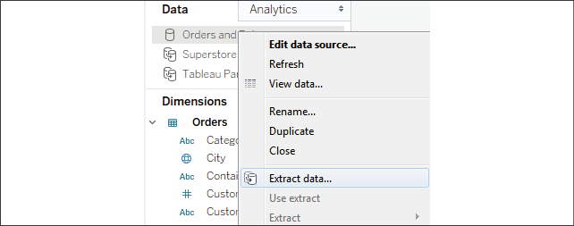

    Figure 2.23: The Extract data... option

-   Developers may create an extract using the Tableau Hyper API. This
    API allows you to use Python, Java, C++, or C\#/.NET to
    programmatically read and write Hyper extracts.

You\'ll have quite a few options for configuring
an extract. To edit these options, select **Extract** and then
**Edit...** on the **Data Source** screen or **Extract data...** from
the context menu of a connection in the **Data** pane. When you
configure an extract, you will be prompted to select certain options, as
shown here:

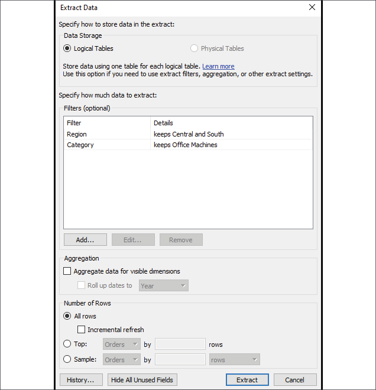

Figure 2.24: The Extract Data dialog gives quite a few options for how
to configure the extract

You have a great deal of control when configuring an extract. Here are
the various options, and the impact your choices will make on
performance and flexibility:

-   Depending on the data source and object model you\'ve created, you
    may select between **Logical Tables** and **Physical Tables**.
    We\'ll explore the details in *Lab 13*, *Understanding the
    Tableau Data Model, Joins, and Blends*.
-   You may optionally add extract **Filters**, which limit the extract
    to a subset of the original source. In this example only, records
    where **Region** is **Central** or **South** and where **Category**
    is **Office Machines** will be included in the extract.
-   You may aggregate an extract by checking the box. This means that
    data will be rolled up to the level of visible dimensions and,
    optionally, to a specified date level, such as year or month.
    **Note:**

    **Visible fields** are those that are shown in
    the data pane. You may hide a field from the Data Source screen or
    from the data pane by right-clicking a field and selecting **Hide**.
    This option will be disabled if the field is used in any view in the
    workbook. `Hidden` fields are not available
    to be used in a view. `Hidden` fields are not
    included in an extract as long as they are hidden prior to creating
    or optimizing the extract.
    

In the preceding example, if only the **Region**
and **Category** dimensions were visible, the resulting extract would
only contain two rows of data (one row for **Central** and another for
**South**). Additionally, any measures would be aggregated at the
**Region**/**Category** level and would be done with respect to the
**Extract** filters. For example, **Sales** would be rolled up to the
sum of sales in **Central**/**Office Machines** and **South**/**Office
Machines**. All measures are aggregated according to their default
aggregation.

You may adjust the number of rows in the extract by including all rows
or a sampling of the top *n* rows in the dataset. If you select all
rows, you can indicate an incremental refresh. If your source data
incrementally adds records, and you have a field such as an identity
column or date field that can be used reliably to identify new records
as they are added, then an incremental extract can allow you to add
those records to the extract without recreating the entire extract. In
the preceding example, any new rows where **Row ID** is higher than the
highest value of the previous extract refresh would be included in the
next incremental refresh.

**Tip:**

Incremental refreshes can be a great way to deal with large volumes of
data that grow over time. However, use incremental refreshes with care,
because the incremental refresh will only add new rows of data based on
the field you specify. You won\'t get changes to existing rows, nor will
rows be removed if they were deleted at the source. You will also miss
any new rows if the value for the incremental field is less than the
maximum value in the existing extract.

Now that we\'ve considered how to create and
configure extracts, let\'s turn our attention to using them.

Performance 
-----------

There are two types of
extracts in Tableau:

-   Tableau Data Extracts (`.tde` files): prior
    to Tableau 10.5, these were the only type of extract available.
-   Hyper (`.hyper` files) are available in
    Tableau 10.5 or later.

Depending on scale and volume, both `.hyper` and
`.tde` extracts may perform faster than most
traditional live database connections. For the most part, Tableau will
default to creating Hyper extracts. Unless you are using older versions
of Tableau, there is little reason to use the older
`.tde`. The incredible performance of Tableau
extracts is based on several factors, including the following:

-   Hyper extracts make use of a hybrid of OLTP and OLAP models and the
    engine determines the optimal query. Tableau Data Extracts are
    columnar and very efficient to query.
-   Extracts are structured so they can be loaded quickly into memory
    without additional processing and moved between memory and disk
    storage, so the size is not limited to the amount of RAM available,
    but RAM is efficiently used to boost performance.
-   Many calculated fields are materialized in the extract. The
    pre-calculated value stored in the extract can often be read faster
    than executing the calculation every time the query is executed.
    Hyper extracts extend this by potentially materializing many
    aggregations.

You may choose to use extracts to increase performance over traditional
databases. To maximize your performance gain, consider the following
actions:

-   Prior to creating the extract, hide unused fields. If you have
    created all desired visualizations, you can click the **Hide Unused Fields** button on the **Extract** dialog to hide all fields not
    used in any view or calculation.
-   If possible, use a subset of data from the original source. For
    example, if you have historical data for the last 10 years but only
    need the last two years for analysis, then filter the extract by the
    `Date` field.
-   Optimize an extract after creating or editing
    calculated fields or deleting or hiding fields.
-   Store extracts on solid-state drives.

Although performance is one major reason to consider using extracts,
there are other factors to consider, which we will do next.

Portability and security 
------------------------

Let\'s say that your data is hosted on a database server accessible only
from inside your office network. Normally, you\'d have to be onsite or
using a VPN to work with the data. Even cloud-based
data sources require an internet connection. With
an extract, you can take the data with you and work offline.

An extract file contains data extracted from the source. When you save a
workbook, you may save it as a Tableau workbook
(`.twb`) file or a Tableau Packaged Workbook
(`.twbx`) file. Let\'s consider the difference:

-   A Tableau workbook (`.twb`) contains
    definitions for all the connections, fields, visualizations, and
    dashboards, but does not contain any data or external files, such as
    images. A Tableau workbook can be edited in Tableau Desktop and
    published to Tableau Server.
-   A Tableau packaged workbook (`.twbx`)
    contains everything in a (`.twb`) file but
    also includes extracts and external files that are packaged together
    in a single file with the workbook. A packaged workbook using
    extracts can be opened with Tableau Desktop, Tableau Reader, and
    published to Tableau Public or Tableau Online.

**Tip:**

A packaged workbook file (`.twbx`) is really just
a compressed `.zip` file. If you rename the
extension from `.twbx` to
`.zip`, you can access the contents as you would
any other `.zip` file.

### Filtering data

Often, you will want to filter data in Tableau in
order to perform an analysis on a subset of data, narrow your focus, or
drill into details. Tableau offers multiple ways to filter data.

If you want to limit the scope of your analysis to a subset of data, you
can filter the data at the source using one of the following techniques:

-   **Data Source Filters** are applied before all
    other filters and are useful when you want to limit your analysis to
    a subset of data. These filters are applied before any other
    filters.
-   **Extract Filters** limit the data that is
    stored in an extract (`.tde` or
    `.hyper`). Data source filters are often
    converted into extract filters if they are present when you extract
    the data.
-   **Custom SQL Filters** can be accomplished
    using a live connection with custom SQL, which has a Tableau
    parameter in the `WHERE` clause. We\'ll
    examine parameters in *Lab 4*, *Starting an Adventure with
    Calculations and Parameters*.

Additionally, you can apply filters to one or more views using one of
the following techniques:

-   Drag and drop fields from the data pane to the **Filters** shelf.
-   Select one or more marks or headers in a view and then select **Keep Only** or **Exclude**, as shown here:

Figure 2.25: Based on the mark selection, you may Keep Only values that
match or Exclude such values.

-   Right-click any field in the data pane or in the view and select
    **Show Filter**. The filter will be shown as a control (examples
    include a drop-down list and checkbox) to allow the end user of the
    view or dashboard the ability to change the filter.
-   Use an action filter. We\'ll look more at filters and action filters
    in the context of dashboards.

Each of these options adds one or more fields to the **Filters** shelf
of a view. When you drop a field on the **Filters** shelf, you will be
prompted with options to define the filter. The filter
options will differ most noticeably based on
whether the field is discrete or continuous. Whether a field is filtered
as a dimension or as a measure will greatly impact how the filter is
applied and the results.

Filtering discrete (blue) fields 
--------------------------------

When you filter using a discrete field, you will
be given options for selecting individual values to keep or exclude. For
example, when you drop the discrete **Department** dimension onto the
**Filters** shelf, Tableau will give you the following options:

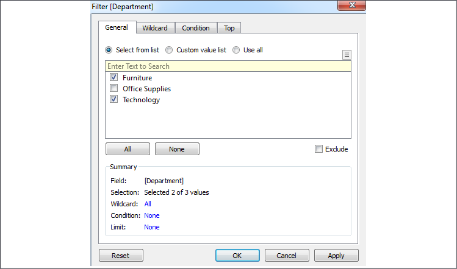

Figure 2.26: A filter for a discrete field will show options for
including or excluding individual values

The **Filter** options include **General**, **Wildcard**, **Condition**,
and **Top** tabs. Your filter can include options
from each tab. The **Summary** section on the
**General** tab will show all options selected:

-   The **General** tab allows you to select items from a list (you can
    use the custom list to add items manually if the dimension contains
    a large number of values that take a long time to load). You may use
    the **Exclude** option to exclude the selected items.
-   The **Wildcard** tab allows you to match string values that contain,
    start with, end with, or exactly match a given value.
-   The **Condition** tab allows you to specify conditions based on
    aggregations of other fields that meet conditions (for example, a
    condition to keep any **Department** where the sum of sales was
    greater than \$1,000,000). Additionally, you can write a custom
    calculation to form complex conditions. We\'ll cover calculations
    more in *Lab 4*, *Starting an Adventure with Calculations and
    Parameters*, and *Lab 6*, *Diving Deep with Table Calculations*.
-   The **Top** tab allows you to limit the filter to only the top or
    bottom items. For example, you might decide to keep only the top
    five items by the sum of sales.

**Tip:**

Discrete measures (except for calculated fields using table
calculations) cannot be added to the **Filters** shelf. If the field
holds a date or numeric value, you can convert it to a continuous field
before filtering. Other data types will require the creation of a
calculated field to convert values you wish to filter into continuous
numeric values.

Let\'s next consider how continuous filters are
filtered.

Filtering continuous (green) fields 
-----------------------------------

If you drop a continuous dimension onto the
**Filters** shelf, you\'ll get a different set of options. Often, you
will first be prompted as to how you want to filter the field,
as follows:

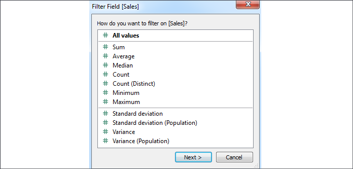

Figure 2.27: For numeric values, you\'ll often see options for
aggregating the value as part of the filter

The options here are divided into two major categories:

-   **All values**: The filter will be based on each individual value of
    the field, *row by row*. For example, an **All values** filter
    keeping only sales above \$100 will evaluate each record of
    underlying data and keep only individual sales above \$100.
-   **Aggregation**: The filter will be based on the aggregation
    specified (for example, **Sum**, **Average**, **Minimum**,
    **Maximum**, **Standard deviation**, and **Variance**) and the
    aggregation will be performed at the level of detail of the view.
    For example, a filter keeping only the sum of sales above \$100,000
    on a view at the level of category will keep only categories that
    had at least \$100,000 in total sales.

Once you\'ve made a selection (or if the selection
wasn\'t applicable for the field selected), you will be given another
interface for setting the actual filter, as follows:

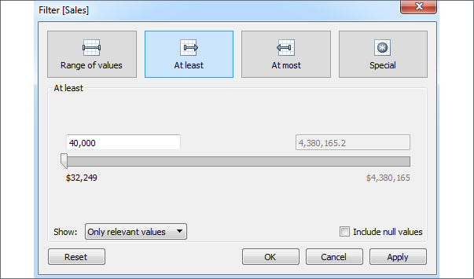

Figure 2.28: Filter options for Sales (as a SUM)

Here, you\'ll see options for filtering continuous values based on a
range with a start, end, or both. The **Special** tab gives options for
showing all values, `NULL` values, or
non-`NULL` values.

**Tip:**

From a user-interface perspective, the most dramatic difference in
filtering options comes from whether a field is discrete or continuous.
However, you should always think about whether you
are using the field as a **Dimension Filter** or a **Measure Filter** to
understand what kind of results you will get based
on the order of operations, which is discussed in the *Appendix*.

-   Dimension filters will filter *detail rows of data*. For example,
    filtering out the Central Region will eliminate all rows for that
    region. You will not see any states for that region and your
    aggregate results, such as `SUM(Sales)`, will
    not include any values from that region.
-   Measure filters will filter *aggregate rows of data* at the level of
    detail defined by the dimensions included in your view. For example,
    if you filtered to include only where
    `SUM(Sales)` was greater than \$100,000 and
    your view included `Region` and
    `Month`, then the resulting view would
    include only values where the `Region` had
    more than \$100,000 in sales for the given month.

Other than filtering discrete and continuous
fields, you\'ll also notice some different options for filtering dates,
which we\'ll consider next.

Filtering dates 
---------------

We\'ll take a look at the special way Tableau
handles dates in the *Visualizing dates and times* section of *Lab
3*, *Moving Beyond Basic Visualizations*. For now, consider the options
available when you drop an **Order Date** field onto the **Filters**
shelf, as follows:

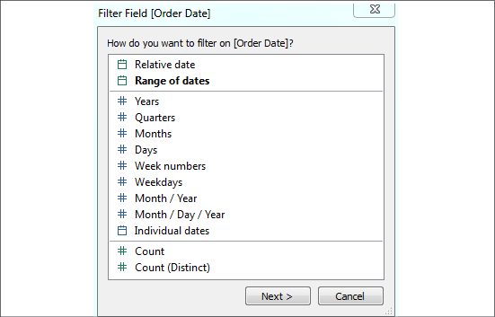

Figure 2.29: Initial filter options for a date field

The options here include the following:

-   **Relative date**: This option allows you to filter a date based on
    a specific date (for example, keeping the last three weeks from
    today, or the last six months from January 1).
-   **Range of dates**: This option allows you to filter a date based on
    a range with a starting date, ending date, or both.
-   **Date Part**: This option allows you to filter based on discrete
    parts of dates, such as **Years**, **Months**, **Days**, or
    combinations of parts, such as **Month/Year**. Based on your
    selection, you will have various options for filtering and have the
    option of defaulting to the latest value in the data.
-   **Individual dates**: This option allows you to filter based on each
    individual value of the date field in the data.
-   **Count** or **Count (Distinct)**: This option allows you to filter
    based on the count, or distinct count, of date values in the data.

Depending on your selection, you will be given additional options for
filtering.

Other filtering options 
-----------------------

You will also want to be aware of the following
options when it comes to filtering:

-   You may display a filter control for nearly any field by
    right-clicking it and selecting **Show Filter**. The type of control
    depends on the type of field, whether it is discrete or continuous,
    and may be customized by using the little drop-down arrow at the
    upper-right of the filter control.
-   **Filters** may be added to the **context**. Context is described in
    detail in the *Appendix* and we\'ll see why it\'s important in
    various examples throughout the course. For now, just note the option.
    This option is available via the drop-down menu on the filter
    control or the field on the **Filters** shelf.
-   **Filters** may be set to show all values in the database, all
    values in the context, all values in a hierarchy, or only values
    that are relevant based on other filters. These options are
    available via the drop-down menu on the **Filter** control or the
    field on the **Filters** shelf.
-   When using Tableau Server, you may define user filters that allow
    you to provide row-level security by filtering based on user
    credentials.
-   By default, any field placed on the **Filters** shelf defines a
    filter that is specific to the current view. However, you may
    specify the scope by using the menu for the field on the **Filters**
    shelf. Select **Apply to** and choose one of the following options:
    -   **All related data sources**: All data sources will be filtered
        by the value(s) specified. The relationships of fields are the
        same as blending (that is, the default by name and type match,
        or customized through the **Data \| Edit Relationships\...**
        menu option). All views using any of the related data sources
        will be affected by the filter. This
        option is sometimes referred to as **cross-data source
        filtering**.
    -   **Current data source**: The data source for that field will be
        filtered. Any views using that data source will be affected by
        the filter.
    -   **Selected worksheets**: Any worksheets selected that use the
        data source of the field will be affected by the filter.
    -   **Current worksheet**: Only the current view will be affected by
        the filter.

We\'ll see plenty of practical examples of filtering data throughout the
book, many of which will make use of some of these options.

### Summary
 
This lab covered key concepts of how Tableau works with data.
Although you will not usually be concerned with what queries Tableau
generates to query underlying data engines, having a solid understanding
of Tableau\'s paradigm will greatly aid you as you analyze data.

We looked at multiple examples of different connections to different
data sources, considered the benefits and potential drawbacks of using
data extracts, considered how to manage metadata, and considered options
for filtering data.
