Lab 3. Moving Beyond Basic Visualizations 
==================================


In this lab, visualizations will fall under the following major
categories:

-   Comparison
-   Dates and times
-   Relating parts of the data to the whole
-   Distributions
-   Multiple axes

You may have noticed the lack of a spatial location or geographic
category in the preceding list. Mapping was introduced in *Lab 1*,
*Taking Off with Tableau*, and we\'ll get to some advanced geographic
capabilities in *Lab 12*, *Exploring Mapping and Advanced Geospatial
Features*.

You may recreate the examples that are found in this lab by using
the `Chapter 03 Starter.twbx` workbook, or even
start from scratch by using a blank workbook and connecting to the
`Hospital Visits.csv` file that\'s located in the
`Learning Tableau/Chapter 03` folder. The
completed examples may be found in the
`Chapter 03 Complete.twbx` workbook.

We will begin by assessing which types of visualizations are effective
for quantitative comparisons.


### Comparing values 

Often, you will want to compare the differences
between measured values across different categories. You might find
yourself asking the following questions:

-   How many customers did each store serve?
-   How much energy did each wind farm produce?
-   How many patients did each doctor see?

In each case, you are looking to make a comparison (among stores, wind
farms, or doctors) in terms of some quantitative measurement (number of
customers, megawatts of electricity, and patients).

Let\'s take a look at some examples of visualizations that help answer
these types of questions.

Bar charts 
----------

Here is a simple bar chart, similar to the one we
built in *Lab 1*, *Taking Off with Tableau*:

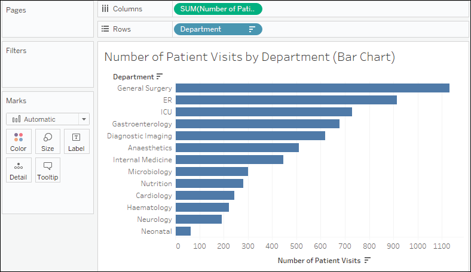

Figure 3.1: A bar chart showing the number of patient visits by
department

This bar chart makes it easy to compare the number of patient visits
between various departments in the hospital. As a
dimension, **Department** slices the data according to each distinct
value, such as **ER**, **ICU**, or **Cardiology**. It creates a header
for these values because it is discrete (blue). As a measure**, Number
of Patient Visits** gives the sum of patient visits for each department.
Because it is a continuous (green) field, it defines an axis, and bars
are rendered to visualize the value.

Notice that the bar chart is sorted by the department having the highest
sum of patient visits at the top and the lowest at the bottom. Sorting a
bar chart often adds a lot of value to the analysis because it makes it
easier to make comparisons and see rank order. For example, it is easy
to see that the **Microbiology** department has had more patient visits
than the **Nutrition** department. If the chart wasn\'t sorted, this may
not have been as obvious.

You can sort a view in multiple ways, as follows:

-   Click one of the sort icons on the toolbar: This results in an
    automatic sort of the dimension based on the measure that defined
    the axis. Changes in data or filtering that result in a new order
    will be reflected in the view:

    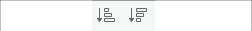

    Figure 3.2: Toolbar sort icons


-   Click the sort icon on the axis: The option icon will become visible
    when you hover over the axis and will then remain in place when you
    enable the sort. This will also result in automatic sorting:

    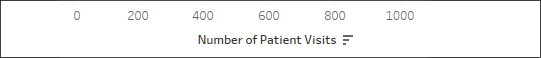

    Figure 3.3: Axis sort icon


-   Use the drop-down on the active dimension field and select **Sort**
    to view and edit the sorting options. You can
    also select **Clear Sort** to remove any sorting:

    

    Figure 3.4: Sorting using the drop-down menu


-   Use the drop-down on the field label for rows and select the desired
    sorting option:

    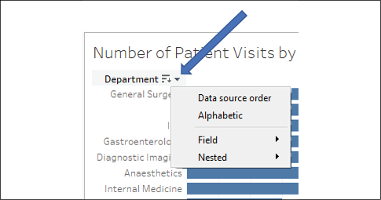

    Figure 3.5: Sorting by field label


-   Drag and drop row headers to manually rearrange them. This results
    in a manual sort that does not get updated
    with data refreshes.

All of these sorting methods are specific to the view and will override
any default sort you defined in the metadata.

Bar chart variations 
--------------------

A basic bar chart can be extended in many ways to
accomplish various objectives. Consider the following variations:

-   Bullet chart to show progress towards a goal, target, or threshold
-   Bar-in-bar chart to show progress toward a target or compare two
    specific values within a category
-   Highlighting categories of interest

### Bullet chart 

A **bullet graph** (sometimes also called a
**bullet chart**) is a great way to visually
compare a measure with a goal, target, or threshold. The bar indicates
the measure value, while the line indicates the target. Tableau also
defaults to shading to indicate **60%** and **80%** of the distance to
the goal or threshold. The line and the shading are reference lines that
can be adjusted (we\'ll explore how in detail in future labs):

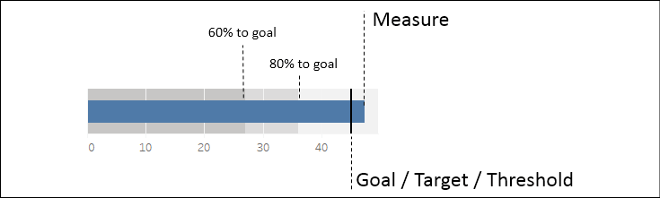

Figure 3.6: Parts of a bullet graph

In this scenario, we\'ll consider how the hospital operated with respect
to revenue goals. Hospital administration set the
following revenue goals for 2019 and now wants to
understand how each department actually performed:

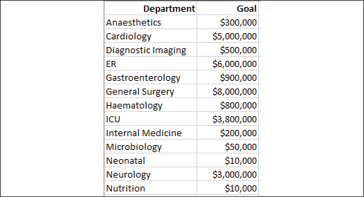

Figure 3.7: Department Goals are stored in a spreadsheet as shown here

**Note:**

The patient visit and revenue data is contained in
`Hospital Visits.csv` and the revenue goals are
in `Hospital Goals.csv`. These two data
connections are related together in a **Data Model** in both the
`Starter` and `Complete`
workbooks. We\'ll look more at the data model in *Lab 13*,
*Understanding the Tableau Data Model, Joins, and Blends.* For now,
simply use the `Hospital Visits & Revenue` data
source to complete the examples in this lab.


We\'ll build a bullet graph using the `Chapter 3`
workbook, which contains the `Hospital Visits`
and the `Hospital Goals` spreadsheet data
sources. We\'ll use these two data sources to visualize the relationship
between actual and target minutes to service as you follow these steps:

1.  Navigate to the **Average Minutes to Service (Bullet Chart)** sheet.

2.  Create a basic bar chart
    of the total **Revenue** per **Department**.

3.  Sort **Department** from highest to lowest.

4.  Filter **Date of Admit** by **Year** and keep only
    `2019` data. At this point, your view should
    look like this:

    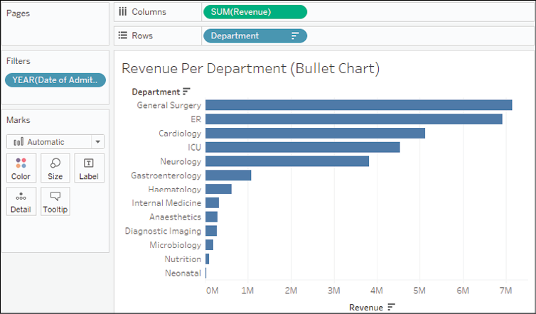

    Figure 3.8: Interim steps in creating the bullet graph

5.  In the **Data** pane, select the **Goal** field under the
    `Hospital Goals.csv` table.

6.  Open **Show Me** and select the bullet graph. At this point, Tableau
    will have created a bullet graph using the fields already in the
    view and the `Goal` field you selected in the
    data pane.

**Tip:**

When you use **Show Me** to create a bullet chart, you may sometimes
find that Tableau uses the fields in reverse order from what you intend
(with the wrong measure defining the axis and bars, and the other
defining the reference line). If this happens,
simply right-click the axis and select **Swap
Reference Line Fields**:

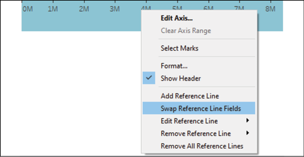

Figure 3.9: The Swap Reference Line Fields option


The completed bullet chart should look like the following:

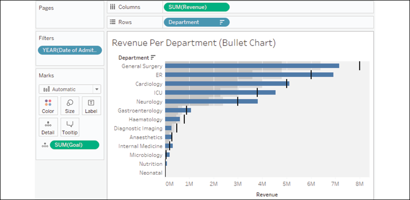

Figure 3.10: The complete bullet graph

The completed bullet graph allows us to see which
departments have met their goals and which are
behind. Next, let\'s consider how we can highlight this even more.

#### Calling out thresholds 

With bullet charts, it can be helpful to visually
call out the bars that fail to meet or exceed the threshold. We\'ll look
at calculations in depth in the next lab, but for now, you can
complete this example with the following steps:

1.  Use the drop-down arrow in the **Data** pane and select **Create
    Calculated Field...**:

    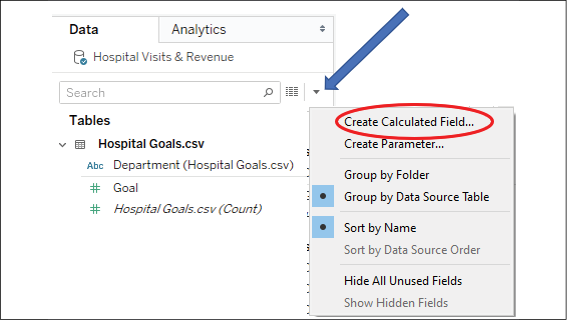

    Figure 3.11: Creating a calculated field

2.  Name the calculated field named `Goal Met?`
    with the following code:


    ```
    SUM([Revenue]) >= SUM([Goal])
    ```

3.  Click **OK** and drag the new
    `Goal Met?` field from the data pane and drop
    it on **Color**.

The calculation returns `true` when the
`Revenue` value for a department is greater than
the goal value, and `false` otherwise. With the
calculated field on **Color**, it becomes very easy to see which
departments have met the 2019 goals:

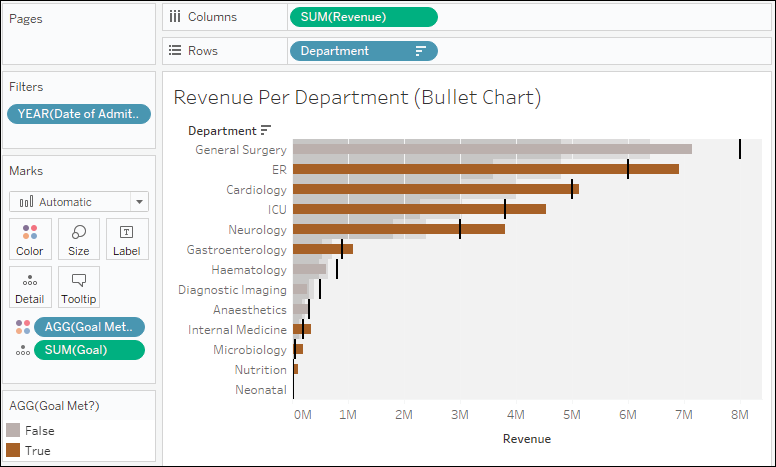

Figure 3.12: Departments that have met their goal are highlighted in
this bullet chart

Color is one of the strongest ways to get
attention with your visualizations. Use color with intent. Decide
whether you want to highlight good or poor performance.

### Bar-in-bar chart 

Another possibility for showing relationships
between two values for each category is a
bar-in-bar chart. Like the bullet chart, the bar-in-bar chart can show
progress toward a goal. It can also be used to compare any two values.
For example, you might compare revenue to a target, or you might compare
the revenue for the current year to the previous year:

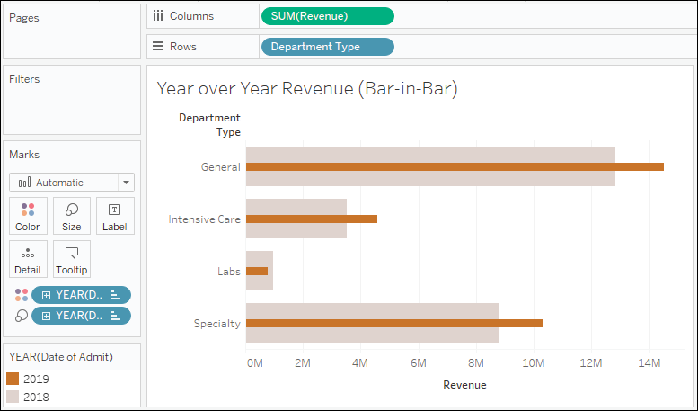

Figure 3.13: Bar-in-bar chart

To create this view, continue in the same workbook
and follow these steps:

1.  Navigate to the **Year over Year Revenue (Bar-in-Bar)** sheet.

2.  Drag and drop **Revenue** onto the horizontal axis in the view
    (which gives the same results as dropping it onto the **Columns**
    shelf).

3.  Drag and drop **Department Type** onto **Rows**.

4.  Drag and drop **Date of Admit** onto **Color**. We\'ll discuss dates
    in more detail in the next section, but you\'ll notice that Tableau
    uses the year of the date to give you a stacked bar chart that looks
    like this:

    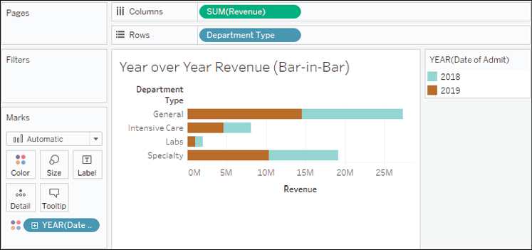

    Figure 3.14: Interim steps in creating the bar-in-bar chart

5.  For a bar-in-bar chart, we do not want the
    marks to be stacked. To turn off stacking, use 
    the main menu to select **Analysis** \| **Stack Marks** \| **Off**.

6.  All the bar segments now begin at `0` and
    some bars may completely obscure others. To see each bar, we\'ll
    need to adjust another visual element. In this case, hold down the
    *Ctrl* key while dragging the **YEAR(Date of Admit)** field that is
    currently on **Color** in the **Marks** card to **Size**.

    **Note:**

    Holding the *Ctrl* key while moving a field from one shelf to
    another creates a copy of the field instead.
    

    After completing the previous step, a size legend should appear. The
    bars will be sized based on the year and we will be able to see all
    of the segments that are available, even if they overlap.

7.  We want **2019** to be in front and **2018** to be in the
    background, so drag and drop **2019** within the **Size** legend to
    reorder the values so that **2018** comes after **2019**:

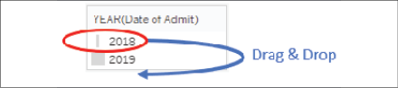

Figure 3.15: You can drag and drop items in legends to reorder them

1.  Double-click the **Color** legend to edit the colors so that
    **2019** is emphasized. A darker orange or blue for **2019** with a
    light gray for **2018** would serve this purpose well (though you
    may find other color combinations that you prefer!).

At this point, your view should look like the
bar-in-bar chart that was shown in *Figure 3.13*
at the beginning of this section. You may wish to further enhance the
visualization by doing the following:

-   Adding a border to the bars. Accomplish this by clicking the
    **Color** shelf and using the **Border** option.

-   Adjusting the size range to reduce the difference between the large
    and small extremes. Accomplish this by double-clicking the **Size**
    legend (or using the caret drop-down and selecting **Edit** from the
    menu).

-   Adjusting the sizing of the view. Accomplish this by hovering over
    the canvas, just over the bottom border, until the mouse cursor
    changes to a sizing cursor, and then click and drag to resize the
    view. You may also want to adjust how the view fills the space. Use
    the drop-down on the toolbar and experiment with the options:

    

    Figure 3.16: This drop-down determines how the current view is sized


-   Hiding the size legend. You may decide that the size legend does not
    add anything to this particular view as size was only used to allow
    overlapping bars to be seen. To hide any legend, use the drop-down
    arrow on the legend and select **Hide Card**:

    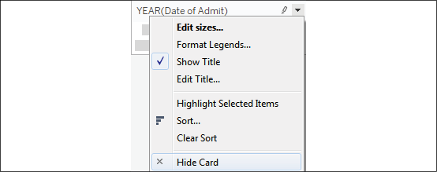

    Figure 3.17: The Hide Card option for legends

The bar-in-bar chart gives you another way to
compare values. Next, we\'ll consider a variation
that allows us to highlight areas of interest.

### Highlighting categories of interest 

Let\'s say one of your primary responsibilities at
the hospital is to monitor the number of patient visits for the **ICU**
and **Neonatal** departments. You don\'t necessarily care about the
details of other departments, but you do want to keep track of how your
two departments compare with others. You might design something like
this:

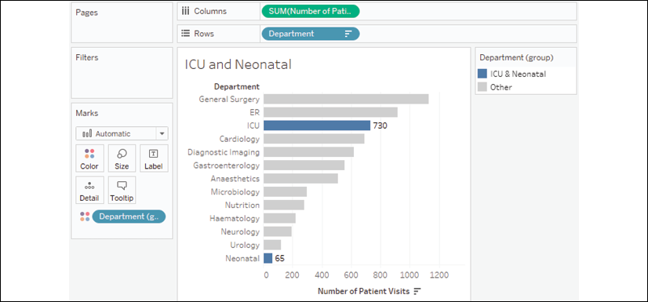

Figure 3.18: A bar chart with two bars highlighted via color

Now, as the data is refreshed over time, you will be able to immediately
see how the two departments of interest to you
compared to other departments. To create this view, follow these steps:

1.  Navigate to the **ICU and Neonatal** sheet.

2.  Place **Department** on **Rows** and **Number of Patient Visits** on
    **Columns**. Sort the bar chart in descending order.

3.  Click on the bar in the view for **ICU** and, while holding down the
    *Ctrl* key, click the bar for **Neonatal**.

4.  Hover the cursor over one of the selected bars for a few seconds
    and, from the menu that appears, click the **Create Group** button
    (which looks like a paperclip):

    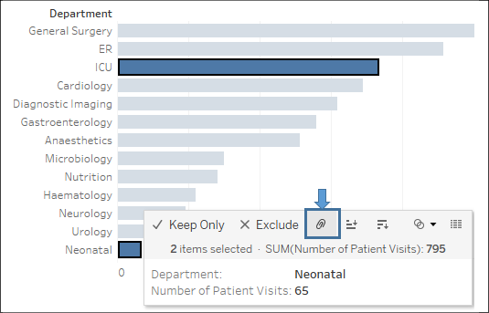

    Figure 3.19: After Ctrl + clicking the two bars, use the paperclip
    icon to group them

    This will create a group, which results in a new dimension, named
    **Department (group)**, in the left-hand data
    pane. Tableau automatically assigns this field to **Color**.

    **Note:**

    Ad hoc groups are powerful in Tableau. You can create groups in the
    view (as you did previously) or by using the menu for a dimension in
    the data pane and selecting **Create** \| **Group**. You can use
    them as you would any other dimension.
    


1.  To add a label only to the bars for those two departments,
    right-click each bar and select **Mark label** \| **Always show**.
    The label for the mark will always be shown, even if other labels
    are turned off for the view or the label overlaps marks or other
    labels.

The color will continue to make monitoring easy. The label will only
show for the two departments you selected and will update with the
changing data.


### Visualizing dates and times

In your analysis, you will often want to
understand when something happened. You\'ll ask questions like the
following:

-   When did we gain the most new customers?
-   Is profit trending up or down?
-   What times of day have the highest call volume?
-   What kinds of seasonal trends do we see in sales?

Fortunately, Tableau makes this kind of visual discovery and analysis
easy. In this section, we\'ll look at how Tableau works with dates and
some various ways you might visualize time.

Date parts, date values, and exact dates 
----------------------------------------

When you are connected to a
flat file, relational, or extracted data source,
Tableau provides a robust built-in date hierarchy for any date field.

**Tip:**

Cubes/OLAP connections do not allow Tableau hierarchies. You will want
to ensure that all date hierarchies and date values you need are defined
in the cube.


To see this in action, continue with the
`Chapter 3` workbook, navigate to the
`Built-in Date Hierarchy` sheet, and create a
view similar to the one that was shown by dragging and dropping **Number
of Patient Visits** to **Rows** and **Date of Admit** to **Columns**.
The **YEAR(Date of Admit)** field on **Columns** will have a plus sign
indicator, like this:

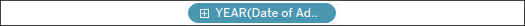

Figure 3.20: The field representing the Year part of the date hierarchy

You\'ll also find a plus or minus indicator as you hover over headers,
like this:


Figure 3.21: A plus icon on the column headers that could be used to
expand the hierarchy

When you click it, the hierarchy expands by adding **QUARTER(Date of
Admit)** to the right of the **YEAR(Date of Admit)** on **Columns**, and
the view is expanded to the new level of the hierarchy:

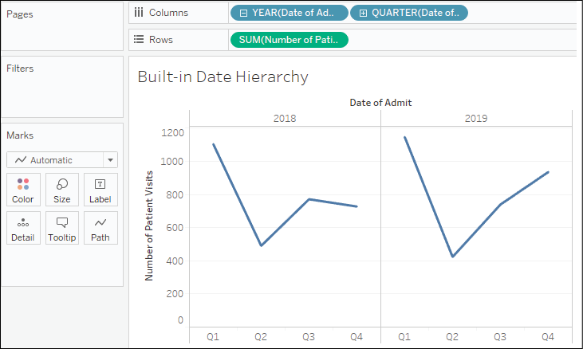

Figure 3.22: The expanded hierarchy with the year and quarter shown

The **YEAR(Date of Admit)** field now has a minus sign indicator that
allows you to collapse the hierarchy
back to the year level. The **QUARTER** field
also has a plus sign, indicating that you can
expand the hierarchy further. Starting with **Year**, the hierarchy
flows as follows: **Year** \| **Quarter** \| **Month** \| **Day**. When
the field is a date and time, you can further drill down into **Hour**
\| **Minute** \| **Second**. Any of the parts of the hierarchy can be
moved within the view or removed from the view completely.

The hierarchy is made up of **Date Parts**, which is one of the three
ways a date field can be used. When you right-click the date field in
the view or by using the drop-down menu, you\'ll see multiple date
options, as follows:

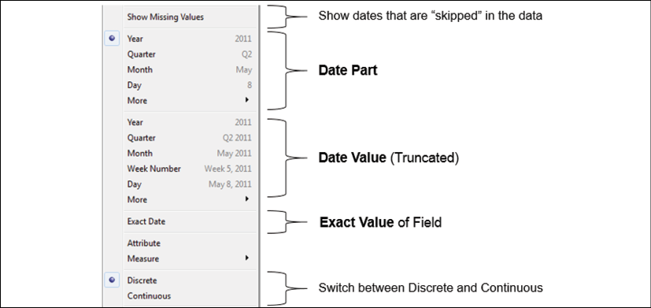

Figure 3.23: The drop-down menu on an active date field demonstrates the
various aspects of dates in Tableau

The three major date types
are evident, though not explicitly labeled, in the
menu:

-   **Date part**: This field will represent a specific part of the
    date, such as the quarter or month. The part of the date is used by
    itself and without reference to any other part of the date. This
    means that a date of November 8, 1980, when used as a month date
    part, is simply **November** in the view. The **November** that\'s
    selected in the view here represents all of the Novembers in the
    dataset, while the number of patient visits is the total for both
    2018 and 2019:

    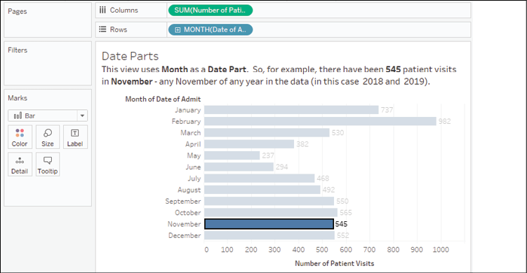

    Figure 3.24: This view uses Month as a date part. The number of
    patient visits is the total for the month, without regard to the
    year


-   **Date value**: This field will represent a
    date value, but rolled up or truncated to the
    level you select. For example, if you select a
    date value of **Month**, then November 8, 2019 gets truncated to the
    month and year, and is **November 2019**. You\'ll notice that
    **November 2018** and **November 2019** each have a separate value
    in the header and a distinct bar:

    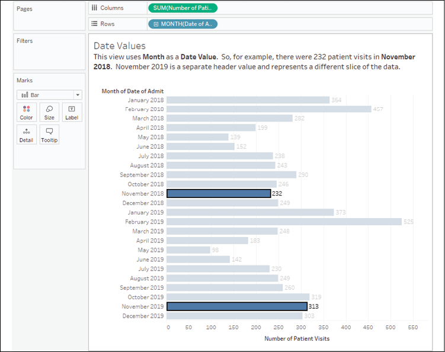

    Figure 3.25: This view uses Month as a date value. The number of
    patient visits is the total for the month with regard to the year


-   **Exact date**: This field represents the exact date value
    (including time, if applicable) in the data. This means that
    November 8, 1980, 2:01 am is treated as distinct from November 8,
    1980, 3:08 pm.

It is important to note that nearly any of these
options can be used as discrete or continuous
fields. Date parts are discrete by default. Date
values and exact dates are continuous by default.
However, you can switch between discrete and continuous as required to
allow flexibility in the visualization.

For example, you must have an axis (requiring a continuous field) to
create a reference line. Also, Tableau will only connect lines at the
lowest level of row or column headers. Using a continuous date value
instead of multiple discrete date parts will allow you to connect lines
across multiple years, quarters, and months.

**Tip:**

As a shortcut, you can right-click and then drag and drop a date field
into the view to get a menu of options for how the date field should be
used prior to the view being drawn.


Let\'s next consider some
various ways we might visualize dates and times.

Variations of date and time visualizations 
------------------------------------------

The ability to use various parts and values of
dates and even mix and match them gives you a lot of flexibility in
creating unique and useful visualizations.

For example, using the month date part for columns and the year date
part for color gives a time series that makes a visual year-over-year
comparison quite easy. The year date part has been copied to the label
so that the lines can be labeled:

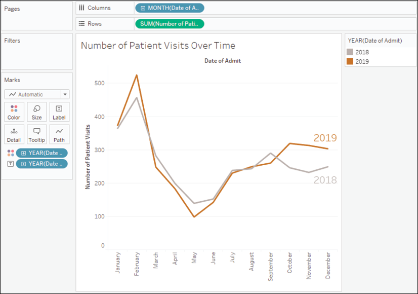

Figure 3.26: The comparison of two years, month-by-month

This kind of view allows for easy year-over-year comparison.

**Tip:**

Clicking on any of the shelves on the **Marks** card will give you a
menu of options. Here, **Label** has been clicked, and the label was
adjusted to show only at the end of each line.


The following heat map is another example of using date parts on
different shelves to achieve useful analysis. This kind of visualization
can be quite useful when looking at patterns across
different parts of time, such as hours in a day,
or weeks in a month. Here, we are looking at how many patients were
admitted by month and day:


Figure 3.27: A heat map showing the intensity of patient visits by day
and month

The year has not been included in the view, so this is an analysis of
all years in the data and allows us to see whether there are any
seasonal patterns or hotspots. We might notice patterns related to
epidemics, doctors\' schedules, or the timing of insurance benefits.
Perhaps the increased intensity of patient admissions in February
corresponds to the flu season.

Observe that placing a continuous field on the **Color** shelf resulted
in Tableau completely filling each intersection of **Row** and
**Column** with the shade of color that encoded the sum of patient
visits. Clicking on the **Color** shelf gives us some fine-tuning
options, including the option to add borders to marks. In this view, a
black border has been added to help distinguish
each cell.

Gantt charts 
------------

Gantt charts can be incredibly useful for
understanding any series of events with a duration, especially if those
events have some kind of relationship. Visually, they are very useful
for determining whether certain events overlap, have dependency, or take
more or less time than other events.

As an example (not included in the workbook), the following Gantt chart
shows a series of processes that run when an application is started.
Some of these processes run in parallel, and some are clearly dependent
on others. The Gantt chart makes these dependencies clear:

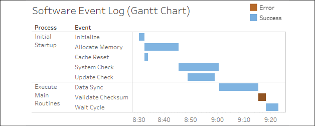

Figure 3.28: A Gantt chart showing the time each process started and how
long each took

Gantt charts use the **Gantt mark** type on the **Marks** card
drop-down. A Gantt bar mark starts at the value that was specified by
the field on **Rows** that defines the axis. The length of the Gantt bar
is then determined by the field on the size card, with positive values
stretching to the right and negative values to the left.

At the hospital, you might want to see each patient visit to the **ER**
in 2019 and understand how long each visit lasted, whether any patients
returned to the hospital, and how much time there was between visits.
The following steps give an example of how you might create a Gantt
chart with steps like these:

1.  Place **Department** on **Filters** and keep only **ER**.

2.  Place **Date of Admit** on **Filters**, select **Years** as the
    option for filtering, and keep only **2019**.

3.  Place **Date of Admit** on **Columns** as a continuous **Exact
    Date** or as a **Day** value (not **Day part**). Notice that
    Tableau\'s automatic default for the mark type is Gantt bars:

    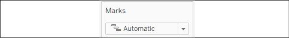

    Figure 3.29: In this case, Gantt bars are the automatic mark type.

4.  Place **Doctor** and **Patient Name** on **Rows**. The result is a
    row for each patient grouped by each doctor. A Gantt bar represents
    a stay in the hospital.
    **Tip:**

    In most cases, we\'d also want to add a unique identifier to the
    view, such as Patient ID, to ensure that
    patients who happen to share the same name are distinguished in the
    visualization. This is not necessary with this dataset, as all names
    happen to be unique, but it may be vitally important when you work
    with your data.
    

5.  The length of the Gantt bar is set by placing a field with a value
    of duration on the **Size** shelf. There is no such field in this
    dataset. However, we have the **Date of Discharge**, and we can
    create a calculated field for the duration. We\'ll cover
    calculations in more detail in the next lab. For now, select
    **Analysis** from the menu and click **Create Calculated
    Field\...**. Name the field **Days in the Hospital** and enter the
    following code:
    ``` 
    DATEDIFF('day', [Date of Admit], [Date of Discharge]) 
    ```
    


1.  The new calculated field will appear under **Measures** in the data
    pane. Drag and drop the field onto the **Size** shelf. You now have
    a Gantt chart showing when patients were admitted and how long each
    visit lasted.

**Tip:**

Consider sorting the **Patient Name** dimension in the view. For
example, sorting by field and selecting **Date of Admit** as minimum
would enable you to see patients who were admitted earlier towards the
top and patients who were admitted later towards the bottom. It is based
on the earliest (minimum) date of admission for the patient, even if
they were admitted multiple times. Sorting can be a very useful
technique for seeing patterns in the Gantt chart.


Your final view should look something like this:

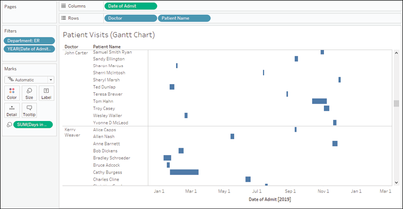

Figure 3.30: The final Gantt chart, showing each patient, when they were
admitted, how long they stayed, and whether they ever returned

This type of chart can be very useful in seeing
patterns and relationships between entities over time.

**Tip:**

When plotted on a date axis, the field defining the length of Gantt bars
always needs to be in terms of days. If you want to visualize events
with durations that are measured in hours or seconds, avoid using the
`day` argument for
`DATEDIFF` because it computes whole days and
loses precision in terms of hours and seconds.

Instead, calculate the difference in hours or seconds and then convert
back to days. The following code converts the number of seconds between
a start and end date, and then divides by 86,400 to convert the result
into days, including fractional parts of the day:
`DATEDIFF('second', [Start Date], [End Date]) / 86400`.


With a good understanding of how Tableau works with dates and times,
we\'ve considered some different options for
visualization. Let\'s turn next to focus on how to visualize
parts-to-whole relationships.


### Relating parts of the data to the whole


As you explore and analyze data, you\'ll often want to understand how
various parts add up to a whole. For example,
you\'ll ask questions such as the following:

-   How much does each electric generation method (wind, solar, coal,
    and nuclear) contribute to the total amount of energy produced?
-   What percentage of total profit is made in each state?
-   How much space does each file, subdirectory, and directory occupy on
    my hard disk?

These types of questions are asking about the relationship between the
part (production method, state, file/directory) and the whole (total
energy, national sales, and hard disk). There are several types of
visualizations and variations that can aid you in your analysis.

Let\'s now look at some visualization examples that will aid us as we
consider how to show part-to-whole relationships.

Stacked bars 
------------


Here, we are using stacked bars to visualize the makeup of the whole. We
are less concerned with visually comparing across categories and more
concerned with seeing the parts that make up a category.

For example, at the hospital, we might want to know what the patient
population looks like within each type of department. Perhaps each
patient was assigned a risk profile on admission.

We can visualize the number of visits broken down by risk profile as a
stacked bar, like this:

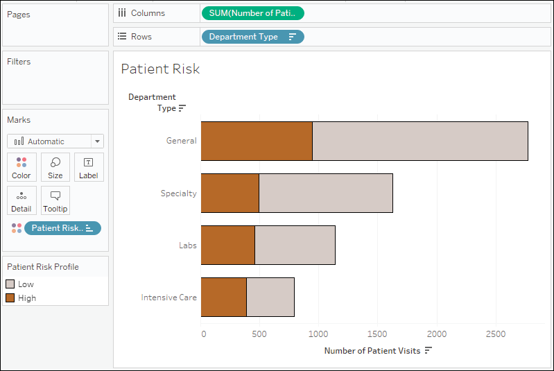

Figure 3.31: A stacked bar chart showing the total number of patients
per department and the breakdown of low and high risk

This gives a decent view of the visits for each department type. We can
tell that more people visit the general
departments and that the number of high-risk
patients for both **Specialty** and **Labs** are about the same.
**Intensive Care** sees fewer high-risk patients and fewer patients
overall. But this is only part of the story.

Consider a stacked bar that doesn\'t give the absolute value, but gives
percentages for each type of department:

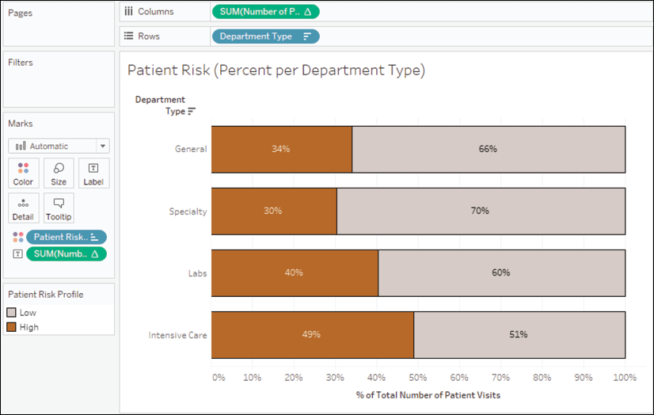

Figure 3.32: A stacked bar chart showing the relative number of
high-risk and low-risk patients per department

Compare the previous two stacked bar charts. The
fact that nearly 50% of patients in **Intensive
Care** are considered **High** risk is evident in both charts. However,
the second chart makes this immediately obvious.

None of the data has changed between the two charts, but the bars in the
second chart represent the percent of the total for each type of
department. You can no longer compare the absolute values but comparing
the relative breakdown of each department type has been made much
easier. Although there are fewer patients in **Intensive Care**, a much
higher percentage of them are in a high-risk category.

Let\'s consider how the preceding charts can be created and even
combined into a single visualization in Tableau. We\'ll use a quick
table calculation. We\'ll cover table calculations much more in *Lab
6*, *Diving Deep with Table Calculations*. Here, simply follow these
steps:

1.  Create a stacked bar chart by placing **Department Type** on
    **Rows**, **Number of Patient Visits** on **Columns**, and **Patient
    Risk Profile** on **Color**. You\'ll now have a single stacked bar
    chart.

2.  Sort the bar chart in
    descending order.

3.  Duplicate the **Number of Patient Visits** field on **Columns** by
    holding down *Ctrl* while dragging the **Number of Patient Visits**
    field in the view to a new spot on **Columns**, immediately to the
    right of its current location. Alternatively, you can drag and drop
    the field from the data pane to **Columns**. At this point, you have
    two **Number of Patient Visits** axes which, in effect, duplicate
    the stacked bar chart:

    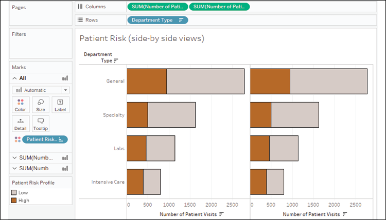

    Figure 3.33: An interim step in creating the stacked bars

4.  Using the drop-down menu of the second **Number of Patient Visits**
    field, select **Quick Table Calculation** \| **Percent of Total**.
    This table calculation runs a secondary calculation on the values
    that were returned from the data source to compute a percentage of
    the total. Here, you will need to further specify how that total
    should be computed.

5.  Using the same drop-down menu, select **Compute Using** \| **Patient
    Risk Profile**. This tells Tableau to calculate the percent of each
    **Patient Risk Profile** within a given department. This means that
    the values will add up to 100% for each department.

6.  Turn on labels by clicking the **T** button on the top toolbar. This
    turns on default labels for each mark:

    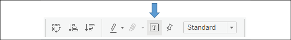

    Figure 3.34: This toolbar option toggles labels on/off

After following the preceding steps, your
completed stacked bar charts should appear as
follows:


Figure 3.35: The final stacked bar view with absolute and relative
values

Using both the absolute values and percentages in a single view can
reveal significant aspects and details that might
be obscured with only one of the charts.

Treemaps 
--------

Treemaps use a series of nested rectangles to
display parts of the whole, especially within
hierarchical relationships. Treemaps are particularly useful when you
have hierarchies and dimensions with **high cardinality** (a high number
of distinct values).

Here is an example of a treemap that shows the number of days spent in
the hospital by patients. The largest rectangle sections show
**Department Type**. Within those are departments and patients:

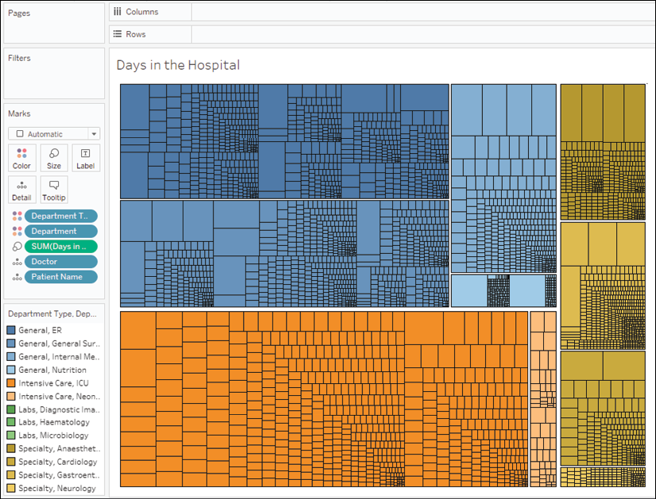

Figure 3.36: A treemap showing part-to-whole relationship of Department
Types / Departments / Doctors / Patients

To create a treemap, you simply need to place a measure on the **Size**
shelf and a dimension on the **Detail** shelf. You can add additional
dimensions to the level of detail to increase the detail of the view.
Tableau will add borders of varying thickness to separate the levels of
detail that are created by multiple dimensions. Note that in the
preceding view, you can easily see the division of department types,
then departments, then doctors, and finally individual patients. You can
adjust the border of the lowest level by clicking the **Color** shelf.

The order of the dimensions on the **Marks** card defines the way the
treemap groups the rectangles. Additionally, you can add dimensions to
rows or columns to slice the treemap into multiple
treemaps. The result is effectively a
bar chart of treemaps:

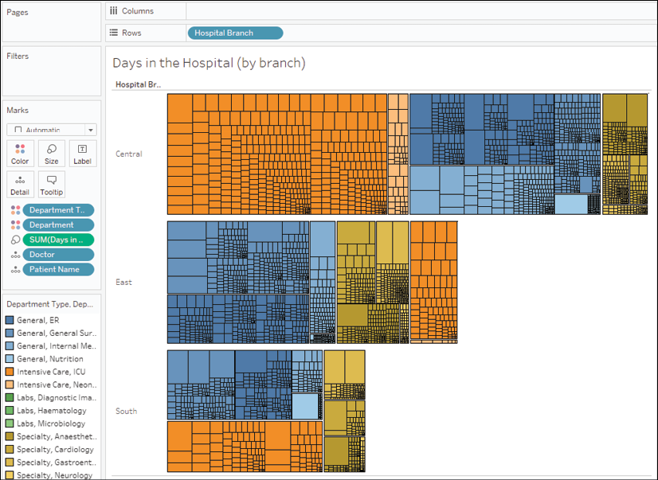

Figure 3.37: Adding a dimension to Rows has effectively made a bar chart
of treemaps

The preceding treemap not only demonstrates the ability to have multiple
rows (or columns) of treemaps---it also demonstrates the technique of
placing multiple fields on the **Color** shelf. This can only be done
with discrete fields. You can assign two or more colors by holding down
the *Shift* key while dropping the second field on color. Alternatively,
the icon or space to the left of each field on the **Marks** card can be
clicked to change which shelf is used for the field:


Figure 3.38: Clicking the icon next to a field on the Marks card allows
you to change which shelf is used

**Note:**

Treemaps, along with packed bubbles, word clouds,
and a few other chart types, are called
**non-Cartesian** chart types. This means that
they are drawn without an *x* or *y* axis, and do not even require row
or column headers. To create any of these chart types, do the following:

-   Make sure that no continuous fields are used on Rows or Columns.
-   Use any field as a measure on **Size**.
-   Change the mark type based on the desired chart type: square for
    treemap, circle for packed bubbles, or text for word cloud (with the
    desired field on **Label**).


Area charts 
-----------

Take a line chart and then fill in the area
beneath the line. If there are multiple lines,
then stack the filled areas on top of each other. That\'s how you might
think of an area chart.

In fact, in Tableau, you may find it easy to create a line chart, like
you\'ve done previously, and then change the mark type on the **Marks**
card to **Area**. Any dimensions on the **Color**, **Label**, or
**Detail** shelves will create slices of area that will be stacked on
top of each other. The **Size** shelf is not applicable to an area
chart.

As an example, consider a visualization of patient visits over time,
segmented by hospital branch:

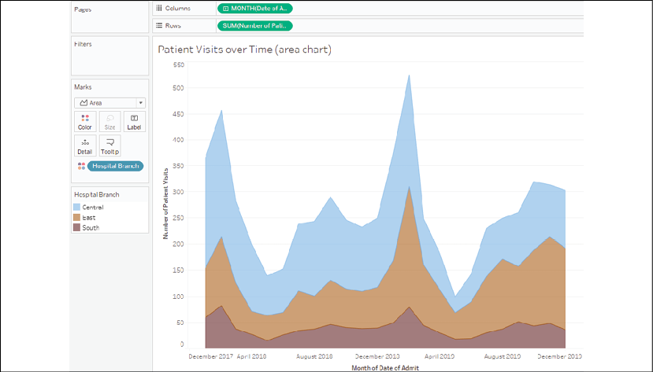

Figure 3.39: An area chart showing patient visits over time by hospital
branch

Each band represents a different hospital branch
location. In many ways, the view is aesthetically
pleasing and it does highlight some patterns in the data. However, it
suffers from some of the same weaknesses as the stacked bar chart. Only
the bottom band (**South**) can be read in terms of the values on the
axis.

The other bands are stacked on top and it becomes very difficult to
compare. For example, it is obvious that there is a spike around
February of each year. But is it at each branch? Or is one of the lower
bands pushing the higher bands up? Which band has the most significant
spike?

Now, consider the following view:

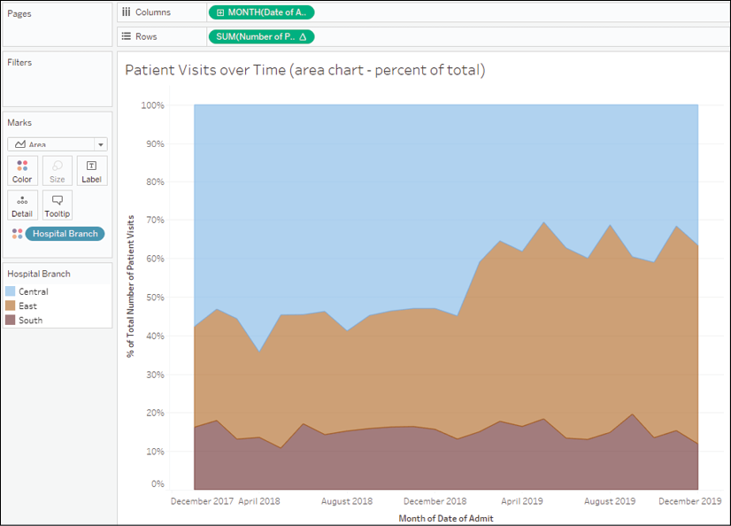

Figure 3.40: An area chart showing percentages instead of absolute
values

This view uses a quick table calculation, like the
stacked bars example. It is no longer possible to
see the spikes, as in the first chart. However, it is much easier to see
that there was a dramatic increase in the percentage of patients seen by
the **East** branch (the middle band) around February 2019, and that the
branch continued to see a significant number of patients through the end
of the year.

It is important to understand what facets of the data story are
emphasized (or hidden) by selecting a different chart type. You might
even experiment in the `Chapter 3` workbook by
changing the first area chart to a line chart. You may notice that you
can see the spikes as well as the absolute increase and decrease in
patient visits per branch. Each chart type contributes to a certain
aspect of the data story.

**Tip:**

You can define the order in which the areas are stacked by changing the
sort order of the dimensions on the shelves of the **Marks** card.
Additionally, you can rearrange them by dragging
and dropping them within **Color Legend** to further
adjust the order.


Pie charts 
----------

Pie charts can also be used to show part-to-whole
relationships. To create a pie chart in Tableau,
change the mark type to **Pie**. This will give you an **Angle** shelf,
which you can use to encode a measure. Whatever dimension(s) you place
on the **Marks** card (typically on the **Color** shelf) will define the
slices of the pie:

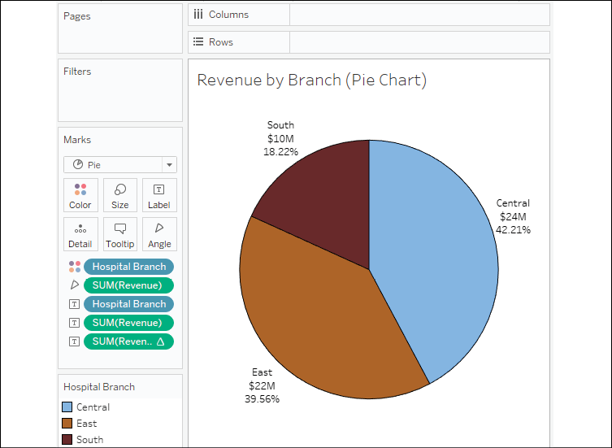

Figure 3.41: A pie chart showing total revenue broken down by branch

Observe that the preceding pie chart uses the sum
of revenue to define the angle of each slice; the
higher the sum, the wider the slice. The **Hospital Branch** dimension
is slicing the measure and defining slices of the pie. This view also
demonstrates the ability to place multiple fields on the **Label**
shelf. The second **SUM(Revenue)** field is the percentage of the total
table calculation you saw previously. This allows you to see the
absolute values of revenue, as well as the percentage of the whole.

**Tip:**

Pie charts can work well with a few slices. In most cases, more than two
or three become very difficult to see and understand. Also, as a good
practice, sort the slices by sorting the dimension that defines the
slices. In the preceding example, the **Hospital Branch** dimension was
sorted by the `SUM` of revenue descending. This
was done by using the drop-down menu option. This causes slices to be
ordered from largest to smallest and
allows anyone reading the chart the ability to
easily see which slices are larger, even when the size and angles are
nearly identical.


With a good understanding of some techniques for visualizing
part-to-whole relationships, let\'s move on to visualizing
distributions.


### Visualizing distributions


Often, simply understanding totals, sums, and even
the breakdown of part-to-whole only gives a piece of the overall
picture. Most of the time, you\'ll want to understand where individual
items fall within a distribution of all similar items.

You might find yourself asking questions such as the following:

-   How much does each customer spend at our stores and how does that
    compare to all other customers?
-   How long do most of our patients stay in the hospital? Which
    patients fall outside the normal range?
-   What\'s the average life expectancy for components in a machine and
    which last more than average? Are there any components with
    extremely long or extremely short lives?
-   How far above or below passing were students\' test scores?

These questions all have similarities. In each case, you seek an
understanding of how individuals (customers, patients, components,
students) relate to the group. In each case, you most likely have a
relatively high number of individuals. In data terms, you have a
dimension (customer, patient, component, and student) representing a
relatively large population of individuals and some measure (amount
spent, length of stay, life expectancy, test score) you\'d like to
compare. Using one or more of the following visualizations might be a
good way to do this.

Circle charts 
-------------

Circle charts are one way to visualize a
distribution. Consider the following view, which
shows how each doctor compares to other doctors
within the same type of department in terms of the average days their
patients stay in the hospital:

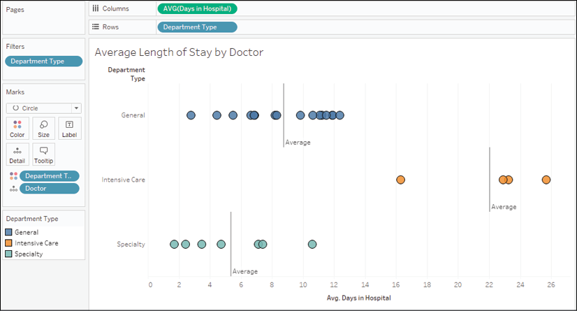

Figure 3.42: A circle chart showing the average length of stay for each
doctor within each department type

Here you can see which doctors have patients that stay in the hospital
longer or shorter on average. It is also interesting to note that
certain types of departments have longer average lengths of stay versus
others. This makes sense as each type of department has patients with
different needs. It\'s probably not surprising that patients in
**Intensive Care** tend to stay longer. Certain departments may have
different goals or requirements. Being able to evaluate doctors within
their type of department makes comparisons far more meaningful.

To create the preceding circle chart, you need to place the fields on
the shelves that are shown and then simply change the mark type from
**Automatic** (which was a bar mark) to **Circle**. **Department Type**
defines the rows, and each circle is drawn at the level of **Doctor**,
which is in the level of **Detail** on the **Marks** card. Finally, to
add the average lines, simply switch to the **Analytics** tab of the
left pane and drag **Average Line** to the view, specifically dropping
it on the **Cell** option:


Figure 3.43: You can add reference lines and more by dragging from the
Analytics tab to the view

You may also click one of the resulting average
lines and select **Edit** to find fine-tuning
options, such as labeling.

### Jittering 

When using views like circle plots or other similar visualization types,
you\'ll often see that marks overlap, which can
lead to obscuring part of the true story. Do you
know for certain, just by looking, how many doctors there are in
**Intensive Care** who are above average? How many are below? Or could
there be two or more circles exactly overlapping? One way of minimizing
this is to click the **Color** shelf and add some transparency and a
border to each circle. Another approach is a technique called
**jittering**.

**Note:**

**Jittering** is a common technique in data visualization that involves
adding a bit of intentional noise to a visualization to avoid overlap
without harming the integrity of what is communicated. Alan Eldridge and
Steve Wexler are among those who pioneered techniques for jittering in
Tableau.

Various jittering techniques, such as using
`Index()` or `Random()`
functions, can be found by searching for *jittering* on the Tableau
forums or *Tableau jittering* using a search engine.


Here is one approach that uses the `Index()`
function, computed along **Doctor**, as a continuous field on **Rows**.
Since **INDEX()** is continuous (green), it defines an axis and causes
the circles to spread out vertically. Now, you can more clearly see each
individual mark and have higher confidence that the overlap is not
obscuring the true picture of the data:

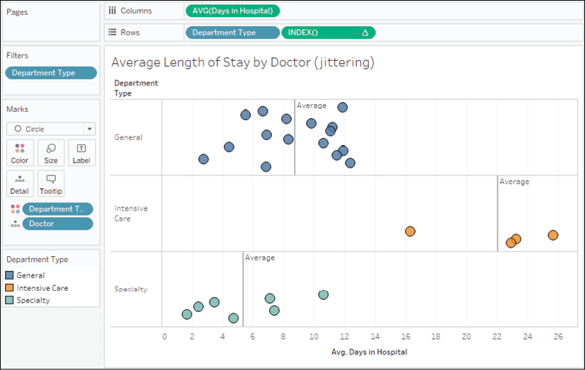

Figure 3.44: Here INDEX() has been added as a continuous field on Rows
(the table calculation is computed along Doctor)

**Tip:**

In the preceding view, the vertical axis that was created by the
**Index** field is hidden. You can hide an axis or
header by using the drop-down menu of the field
defining the axis or header and unchecking **Show Header**.
Alternatively, you can right-click any axis or header in the view and
select the same option.


You can use jittering techniques on many kinds of visualizations that
involve plotting fixed points that could theoretically overlap, such as
dot plots and scatterplots. Next, we will move onto another useful
distribution visualization technique: box and whisker plots.

Box and whisker plots 
---------------------

Box and whisker plots
(sometimes just called **box plots**) add
additional statistical context to distributions.
To understand a box and whisker plot, consider the following diagram:

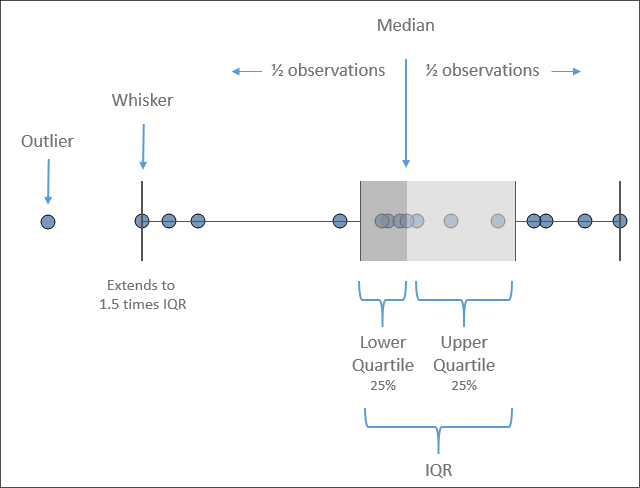

Figure 3.45: Explanation of box and whisker plot

Here, the box plot has been added to a circle graph. The box is divided
by the median, meaning that half of the values are above, and half are
below. The box also indicates the lower and upper quartiles, which each
contain a quarter of the values. The span of the box makes up what is
known as the **Interquartile Range** (**IQR**).
The whiskers extend to 1.5 times the IQR value (or the maximum extent of
the data). Any marks beyond the whiskers are outliers.

To add box and whisker plots, use the **Analytics** tab on the left
sidebar and drag **Box Plot** to the view. Doing this to the circle
chart we considered in *Figure 3.42* yields the following chart:

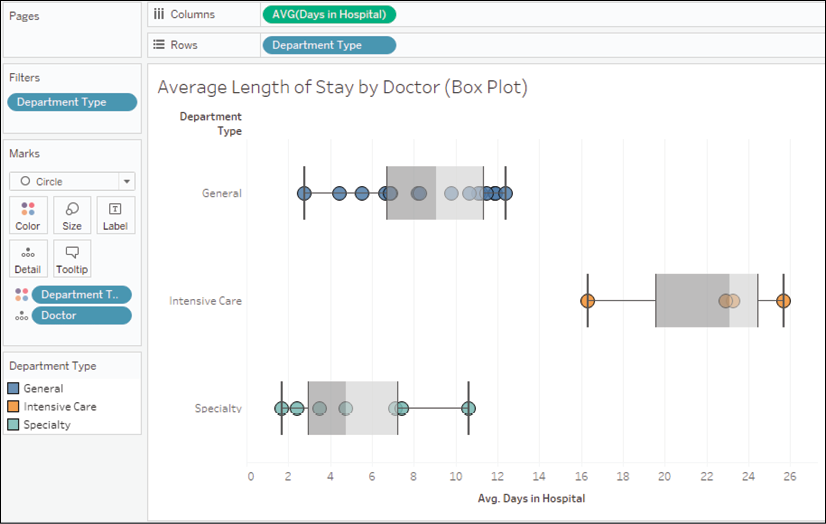

Figure 3.46: A box plot applied to the previous circle chart

The box plots help us to see and compare the
medians, the ranges of data, the concentration
of values, and any outliers. You may edit box
plots by clicking or right-clicking the box or
whisker and selecting **Edit**. This will reveal multiple options,
including how whiskers should be drawn, whether only outliers should be
displayed, and other formatting possibilities.

Histograms 
----------

Another possibility for showing distributions is
to use a histogram. A histogram looks similar to a
bar chart, but the bars show a count of occurrences of a value. For
example, standardized test auditors looking for evidence of grade
tampering might construct a histogram of student test scores. Typically,
a distribution might look like the following example (not included in
the workbook):


Figure 3.47: A histogram of test scores

The test scores are shown on the *x* axis and the
height of each bar shows the number of students
that made that particular score. A typical
distribution often has a recognizable bell curve. In this case, some
students are doing poorly and some are doing extremely well, but most
have scores somewhere in the middle.

What if auditors saw something like this?

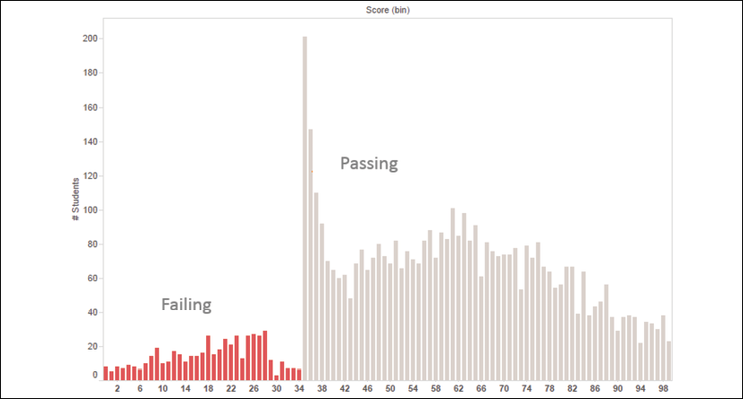

Figure 3.48: A histogram that does not have a typical bell curve,
raising some questions

Something is clearly wrong. Perhaps graders have bumped up students who
were just shy of passing to barely passing. It\'s also possible this may
indicate bias in subjective grading instead of blatant tampering. We
shouldn\'t jump to conclusions, but the pattern is not normal and
requires investigation. Histograms are very useful in catching anomalies
like this.

Now that we\'ve seen an 
example of histograms, let\'s shift our focus back to the hospital data
and work through an example. What if you want to visualize the time it
takes to begin patient treatment so that you can observe the patterns
for different patient populations. You might start with a blank view
follow steps like these:

1.  Click to select the **Minutes to Service** field under **Measures**
    in the data pane.
2.  Expand **Show Me** if necessary and select the histogram.

Upon selecting the histogram, Tableau builds the chart by creating a new
dimension, **Minutes to Service (bin)**, which is used in the view,
along with a `COUNT` of **Minutes to Service** to
render the view:

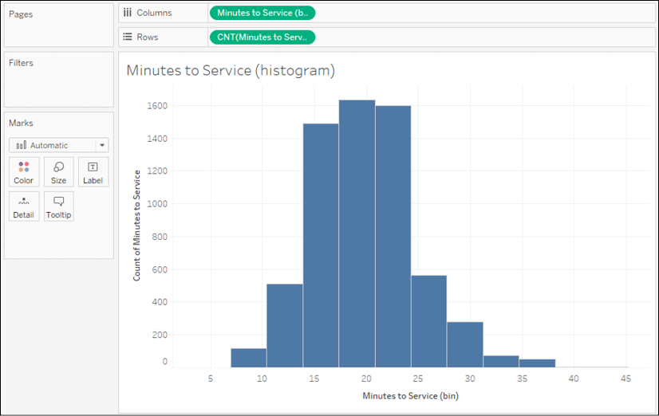

Figure 3.49: A histogram showing the distribution of patients according
to minutes to service

**Note:**

**Bins** are ranges of measure values that can be used as dimensions to
slice the data. You can think of bins as buckets. For example, you might
look at test scores by 0-5%, 5-10%, and so on, or people\'s ages by
0-10, 10-20, and so on. You can set the size, or range, of the bin when
it is created and edit it at any point. Tableau will also suggest a size
for the bin based on an algorithm that looks at the values that are
present in the data. Tableau will use uniform bin sizes for all bins.


For this view, Tableau
automatically set the bin
size to **3.47** minutes, which is not very intuitive. Experiment with
different values by right-clicking or using the drop-down on the
**Minutes to Service (bin)**` `field in the data
pane and selecting **Edit**. The resulting window gives some information
and allows you to adjust the size of the bins:

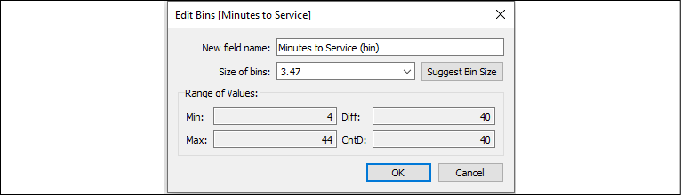

Figure 3.50: Options for editing a bin

Here, for example, is the
same histogram with each bin sized to 2 minutes:

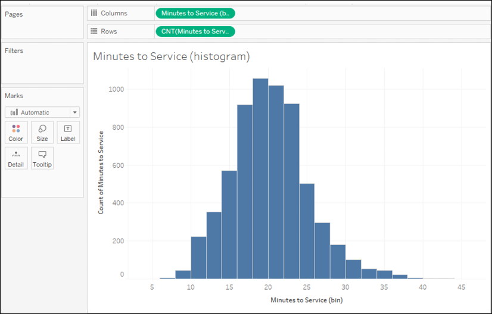

Figure 3.51: A histogram with a bin size of 2

You can see the curve, which peaks at just under **20** minutes and then
tapers off with a few patients having to wait as long as **40** minutes.
You might pursue additional analysis, such as seeing
how wait times vary for the majority of patients
based on their risk profile, such as in this view:

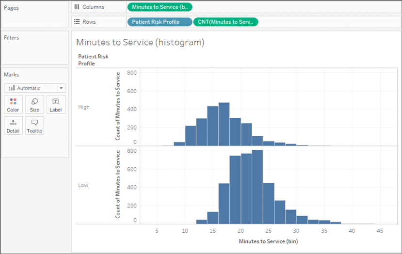

Figure 3.52: Patient risk profile creates two rows of histograms,
showing that most high-risk patients receive faster care (as we would
hope)

**Tip:**

You can create new bins on your own by right-clicking a numeric field
and selecting **Create** \| **Bins**. You may edit the size of bins by
selecting the **Edit** option for the bin field.


You\'ll also want to consider what you want to count for each bin and
place that on **Rows**. When you used **Show Me**, Tableau placed the
`COUNT` of **Minutes to Service** on **Rows**,
which is just a count of every record where the value was not null. In
this case, that\'s equivalent to a count of patient visits because the
data set contains one record per visit. However, if you wanted to count
the number of unique patients, you might consider replacing the field in
the view with `COUNTD([Patient ID])`.

**Note:**

Just like dates, when the bin field in the view is discrete, the
drop-down menu includes an option for **Show Missing Values**. If you
use a discrete bin field, you may wish to use this option to avoid
distorting the visualization and to identify what values don\'t occur in
the data.


We\'ve seen how to visualize
distributions with circle plots, histograms, and box plots. Let\'s turn
our attention to using multiple axes to compare different measures.


### Visualizing multiple axes to compare different measures

Often, you\'ll need to use more than one axis to
compare different measures, understand correlation, or analyze the same
measure at different levels of detail. In these cases, you\'ll use
visualizations with more than one axis.

Scatterplot 
-----------

A scatterplot is an essential visualization type
for understanding the relationship between two measures. Consider a
scatterplot when you find yourself asking questions like the following:

-   Does how much I spend on marketing really make a difference on
    sales?
-   How much does power consumption go up with each degree of
    heating/cooling?
-   Is there any correlation between hours of study and test
    performance?

Each of these questions seeks to understand the correlation (if any)
between two measures. Scatterplots help you understand these
relationships and see any outliers.

Consider the following scatterplot, which looks for a relationship
between the total revenue for a department and the number of patient
visits:

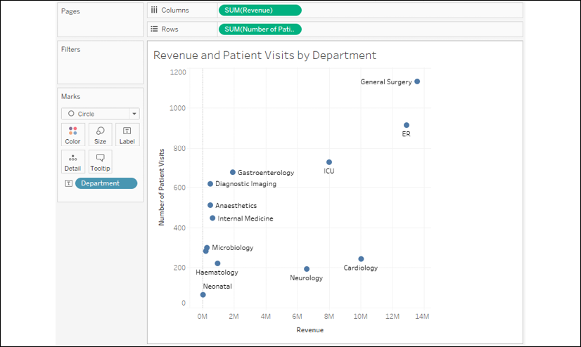

Figure 3.53: A scatterplot showing the correlation between Revenue and
Number of Patient Visits

The **Department** dimension is on **Text** and
defines the view level of detail. Each mark in the view represents the
total **Revenue** and total **Number of Patient Visits** for the
department.

As you would expect, most departments have higher revenue with a higher
volume of patients. **Neurology** and **Cardiology** stand out as having
high revenue despite a lower volume of patients.

**Tip:**

Look for ways to use **Size** and **Color** to encode additional data in
scatterplots. For example, we might add **Department Type** to **Color**
to see if departments of the same type show similar correlations. We
might encode **Size** with average length of stay to see if higher
revenues can also be explained by patients who stay longer.


Let\'s consider a few other types of charts that use multiple axes.

Dual-axis and combination charts 
--------------------------------

One very important feature
in Tableau is the ability to use a dual axis.
Scatterplots use two axes, but they are *X* and *Y*. You also observed
in the stacked bar example that placing multiple continuous (green)
fields next to each other on **Rows** or **Columns** results in multiple
side-by-side axes. Dual axis, on the other hand, means that a view is
using two axes that are opposite each other with a common pane.

Here is an example (not included in the workbook) using a dual axis for
**Sales** and **Profit**:

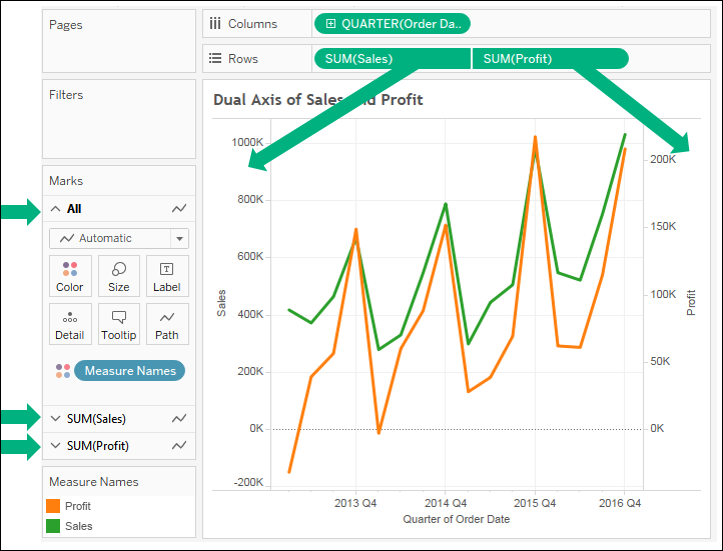

Figure 3.54: A dual-axis chart with an indication of which field defines
which axis

There are several key features of the view, which are as follows:

-   The **Sales** and **Profit** fields on **Rows** indicate that they
    have a dual axis by sharing a flattened side.
-   The axes defined by **Sales** and **Profit** are on opposing sides
    of the view. Also, note that they are not synchronized, which, in
    many cases, can give a distorted view of the data. It would be great
    if profit was that close to total sales! But it\'s not. To
    synchronize the axes, right-click the right axis and select
    **Synchronize Axis**. If that option is grayed out, it is likely
    that one of the values is a whole number type and the other is a
    decimal type. You can change the data type of one of the fields by
    right-clicking it in the data pane and selecting **Change Data
    Type** \| **Number (Whole)** or **Number (Decimal)**.
-   The **Marks** card is now an accordion-like control with an **All**
    section and a section for **Sales** and **Profit**. You can use this
    to customize marks for all measures or specifically customize marks
    for either **Sales** or **Profit**.

To create a dual axis, drag and
drop two continuous (green) fields next to each
other on **Rows** or **Columns**, then use the drop-down menu on the
second, and select **Dual Axis**. Alternatively, you can drop the second
field onto the canvas, opposite the existing axis.

**Tip:**

Dual axes can be used with any continuous field that defines an axis.
This includes numeric fields, date fields, and latitude or longitude
fields that define a geographic visualization. In the case of latitude
or longitude, simply copy one of the fields and place it immediately
next to itself on the **Rows** or **Columns** shelf. Then, select **Dual
Axis** by using the drop-down menu.


A **combination chart** extends the use of dual axes to overlay
different mark types. This is possible because the **Marks** card will
give options for editing all marks or customizing marks for each
individual axis.

**Tip:**

Multiple mark types are available any time two or more continuous fields
are located beside each other on **Rows** or **Columns**.


As an example of a **combination chart**, consider the following
visualization:

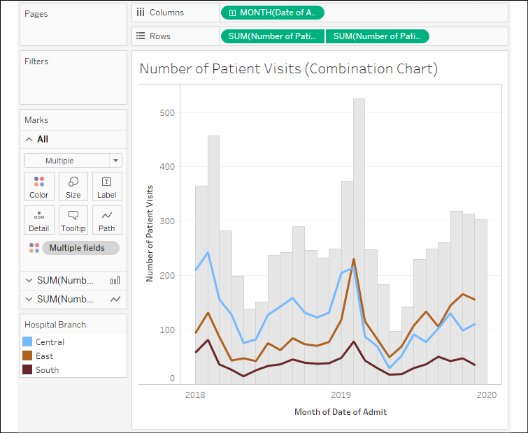


This chart uses a 
combination of bars and lines to show the total number of patient visits
over time (the bars) and the breakdown of patient visits by hospital
branch over time (the lines). This kind of visualization can be quite
effective at giving additional context to detail.

There are several things to note about this view:

-   The field on the **Color** shelf is listed as **Multiple Fields**
    and is gray on the **Marks** card. This indicates that different
    fields have been used for **Color** for each axis on **Marks**.
-   The view demonstrates the ability to mix levels of detail in the
    same view. The bars are drawn at the highest level (patient visits
    for each month), while the lines have been drawn at a lower level
    (patient visits for each branch for each month).
-   The view demonstrates the ability to use the same field (**Patient
    Visits**, in this case) multiple times on the same shelf (**Rows**,
    in this case).
-   The second axis (the **Patient
    Visits**` `field on the right) has the header
    hidden to remove redundancy from the view. You can do this by
    unchecking **Show Header** from the drop-down menu on the field in
    the view or right-clicking the axis or header you wish to hide.

Dual axis and combination charts open a wide range
of possibilities for mixing mark types and levels of
detail and are very useful for generating unique
insights. We\'ll see a few more examples of these throughout the rest of
this book. Be sure to experiment with this feature and let your
imagination run wild with all that can be done.

### Summary

We\'ve covered quite a bit of ground in this lab! You should now
have a good grasp of when to use certain types of visualizations. The
types of questions you ask about data will often lead you to a certain
type of view. You\'ve explored how to create these various types and how
to extend basic visualizations using a variety of advanced techniques,
such as calculated fields, jittering, multiple mark types, and dual
axis. Along the way, we\'ve also covered some details on how dates work
in Tableau.
