Lab 4. Starting an Adventure with Calculations and Parameters 
======================================================


We have already seen what amazing discovery, analysis, and data
storytelling is possible in Tableau by simply connecting to data and
dragging and dropping fields. Now, we\'ll set off on an adventure with
calculations.

Calculations significantly extend the possibilities for analysis,
design, and interactivity in Tableau. In this lab, we\'ll see how
calculations can be used in a wide variety of ways. We\'ll see how
calculations can be used to address common issues with data, extend data
by adding new dimensions and measures, and provide additional
flexibility in interactivity.

At the same time, while calculations provide incredible power and
flexibility, they introduce a level of complexity and sophistication. As
you work through this lab, try to understand the key concepts behind
how calculations work in Tableau. As usual, follow along with the
examples, but feel free to explore and experiment. The goal is not to
merely have a list of calculations you can copy, but to gain knowledge
of how calculations can be used to solve problems and add creative
functionality to your visualizations and dashboards.

The first half of this lab focuses on laying a foundation, while the
second half provides quite a few practical examples. The topics we will
study here are as follows:

-   Overview of the four main types of calculations
-   Creating and editing calculations
-   Row-level calculation examples
-   Aggregate calculation examples
-   Parameters
-   Practical examples
-   Performance considerations

We\'ll start with an introduction to the types of calculations in
Tableau and then delve into some examples.


### Introduction to calculations


A calculation is often
referred to as a
**Calculated Field** in Tableau because, in most cases, when you create
a calculation, it will show up as either a new measure or dimension in
the data pane. Calculations consist of code that\'s made up of
functions, operations, and references to other fields, parameters,
constants, groups, or sets. This code returns a value. Sometimes, this
result is per row of data, and sometimes it is done at an aggregate
level. We\'ll consider the difference between Tableau\'s major
calculation types next.

The four main types of calculations 
-----------------------------------

The most fundamental way to understand calculations in Tableau is to
think of four major types of calculations:

-   **Row-level calculations**: These
    calculations are
    performed for every row
    of underlying data.
-   **Aggregate calculations**:
    These calculations are
    performed at an
    aggregate level, which
    is usually defined by the dimensions used in the view.
-   **Level of detail calculations**: These special
    calculations are
    aggregations that are performed at a specified level of detail, with
    the results available at the row level.
-   **Table calculations**: These
    calculations are
    performed on the table of aggregate data that has been returned by
    the data source to Tableau.

Understanding and recognizing the four main types of calculations will
enable you to leverage the power and potential of calculations in
Tableau.

In this lab, we\'ll take a close look at two of the four main types
of calculations in Tableau: row-level and aggregate calculations. We\'ll
consider the final two types in *Chapter 5*, *Leveraging Level of Detail
Calculations*, and *Chapter 6*, *Diving Deep with Table Calculations*.

**Tip:**

As you think through using a calculation to solve a problem, always
consider the type of calculation you might need. Look for tips
throughout this lab and the next two that will help you consider
*why* a certain type of calculation was used.


Now we have examined the major calculation types in Tableau, we will see
how they are created and edited.

Creating and editing calculations 
---------------------------------

There are multiple ways to create a
calculated field in Tableau:

1.  Select **Analysis** \| **Create Calculated Field\...** from the
    menu.

2.  Use the drop-down menu next to **Dimensions** in the **Data** pane:

    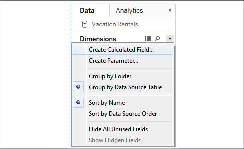

    Figure 4.1: The Create Calculated Field... option

3.  Right-click an empty area in the **Data** pane and select **Create
    Calculated Field\...**.

4.  Use the drop-down menu on a field, set, or parameter in the data
    pane and select **Create** \| **Calculated Field\...**. The
    calculation will begin as a reference to the field you selected.

5.  Double-click an empty
    area on the **Rows**, **Columns**, or **Measure Values** shelves, or
    in the empty area on the **Marks** card to create an ad hoc
    calculation (though this will not show the full calculation editor).

6.  When you create a
    calculated field, it
    will be part of the data source that is currently selected at the
    time you create it. You can edit an existing calculated field in the
    data pane by using the drop-down menu and selecting **Edit\...**.

The interface for creating and editing calculations looks like this:

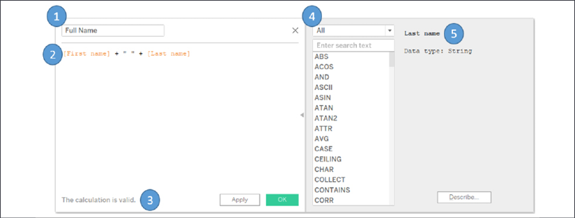

Figure 4.2: The creating and editing calculations interface

This window has several key features:

-   **Calculated field name**: Enter the
    name of the calculated
    field here. Once created, the calculated field will show up as a
    field in the data pane with the name you entered in this text box.
-   **Code editor**: Enter code in this text area to perform the
    calculation. The editor includes autocomplete for recognized fields
    and functions. Additionally, you may drag and drop fields and text
    snippets to and from the code editor and the data pane and view.
-   An **indicator** at the
    bottom of the editor will alert you to errors in your code.
    Additionally, if the calculation is used in views or other
    calculated fields, you will see a drop-down indicator that will let
    you see the dependencies. Click the **Apply** button to apply
    changes to the calculation throughout the workbook while leaving the
    calculation editor open. The **OK** button will save the code
    changes and close the editor. If you wish to discard any changes
    you\'ve made, click the **X** button in the upper-right corner to
    cancel the changes.
-   The **functions list** contains all the functions that you can use
    in your code. Many of these functions will be used in examples or
    discussed in this lab. Tableau groups various functions
    according to their overall use:
    -   **Number**: Mathematical functions, such as
        rounding, absolute
        value, trig functions, square roots, and exponents.
    -   **String**: Functions that are useful for
        string manipulation,
        such as getting a substring, finding a match within a string,
        replacing parts of a string, and converting a string value to
        uppercase or lowercase.
    -   **Date**: Functions that
        are useful for
        working with dates, such as finding the difference between two
        dates, adding an interval to a date, getting the current date,
        and transforming strings with non-standard formats into dates.
    -   **Type Conversion**: Functions
        that are useful for
        converting one type of field to another, such as converting
        strings into integers, integers into floating-point decimals, or
        strings into dates. We\'ll cover the major Tableau data types in
        the next section.
    -   **Logical**: Decision-making functions, such
        as
        `if` `then`
        `else` logic or
        `case` statements.
    -   **Aggregate**: Functions that are used for aggregating such as
        summing, getting the minimum or maximum values, or calculating
        standard deviations or variances.
    -   **Pass Through** (only available when
        connected live to
        certain databases, such as SQL Server): These functions allow
        you to pass through raw SQL code to the underlying database and
        retrieve a returned value at either a row level or aggregate
        level.
    -   **User**: Functions 
        that are used to obtain usernames and check whether the current
        user is a member of a group. These functions are often used in
        combination with logical functions to customize the user\'s
        experience or to implement user-based security when publishing
        to Tableau Server or Tableau Online.
    -   **Table calculation**: These functions
        are different from
        the others. They operate on the aggregated data *after* it is
        returned from the underlying data source and just prior to the
        rendering of the view.
    -   **Spatial**: These
        functions allow you
        to perform calculations with spatial data.
-   Selecting a function in
    the list or clicking a field, parameter, or function in the code
    will reveal details about the selection on the right. This is
    helpful when nesting other calculated fields in your code, when you
    want to see the code for that particular calculated field, or when
    you want to understand the syntax for a function.

With a good understanding of the interface, let\'s briefly look at some
foundational concepts for calculations.

Data types 
----------

Fundamental to the concept
of calculations are **data types**, which describe the kind of
information stored by a field, parameter, or returned by a function.
Tableau distinguishes six types of data:

-   **Number (decimal)**: These are numeric
    values that include
    places after the decimal. Values such as
    `0.02`,` 100.377`,
    or` 3.14159` are decimal values.
-   **Number (whole)**: These are integer or
    whole numbers with no
    fractional values or places after the decimal. Values such as
    `5`, `157`, and
    `1,455,982` are whole numbers.
-   **Date and Time**: These are
    dates along with times.
    Values such as `November 8`,
    `1980 12:04:33 PM` are date and time types.
-   **Date**: These are dates without times. Values such as
    `July 17, 1979` are date types.
-   **String**: These are a series of characters. A
    string may consist of a
    mixture of alphabetic characters, numeric characters, symbols, or
    special characters. They may even be blank (empty). Values such as
    `Hello World`,
    `password123`,
    and` %$@*!` are all strings. In code, strings
    will be surrounded by single or double quotes.
-   **Boolean**: This is a true or
    false value. The values
    `TRUE`, `FALSE`, and
    the expressions `1=1` (which evaluates as
    true) and` 1=2` (which evaluates as false)
    are all Boolean types.
-   **Spatial:** A complex value that describes a location, line or
    shape as it relates to a spatial area.

Every field in Tableau has one of these data types and every function in
Tableau returns one of these data types. Some functions expect input
that matches some of these types and you\'ll receive errors if you try
to pass in the wrong type.

Some types can be converted to other types. For example, using some of
the type conversion functions mentioned above, you could convert the
string `"2.81"` to the decimal value
`2.81`. You could convert that decimal value to a
whole number, but in that case, you\'d lose the places after the decimal
value and the whole number would simply be `2`.

A data type is different from the format displayed. For example, you may
choose to format a decimal as a percentage (for example,
`0.2` could be shown as
`20%`), as currency (for example,
`144.56` could be formatted as
`$144.56`), or even as a number with 0 decimals
(for example, `2.81` would be rounded to
`3`).

Pay attention to the data types of fields and functions as we continue.

Additional functions and operators 
----------------------------------

Tableau supports numerous 
functions and operators. In addition to the functions that are listed on
the calculation screen,
Tableau supports the
following operators, keywords, and syntax conventions:

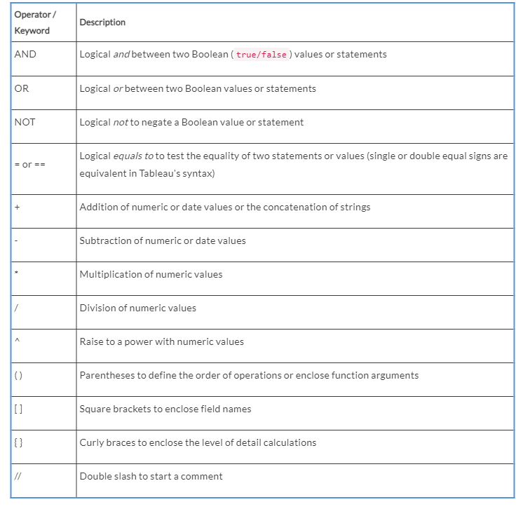

**Note:**

Field names that are a single word may optionally be enclosed in
brackets when used in calculations. Field names with spaces, special
characters, or from secondary data sources must be enclosed in brackets.


You\'ll see these operators 
and functions throughout the next few labs, so familiarize yourself
with their uses. Now, let\'s consider the data that will guide us
through some practical examples.

Example data 
------------

Before we get started with
some examples, let\'s consider a sample dataset that will be used for
the examples in this lab. It\'s simple and small, which means we
will be able to easily see how the calculations are being done.

This dataset is included as
`Vacation Rentals.csv` in the
`tableau-2020\Lab 04` directory of this
book\'s resources, and is also included in the
`Chapter 4` workbook as a data source named
`Vacation Rentals`:

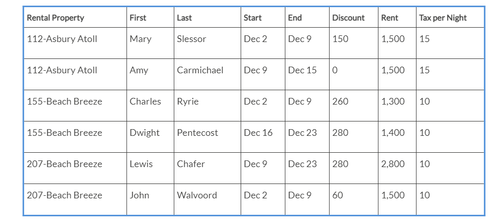

The dataset describes 
several vacation rental properties, the renters, the start and end dates
of the rental period, the discount, rent, and tax per night. We\'ll use
it throughout the rest of the lab as we see some examples of
calculations. Let\'s start with row-level calculations.


#### Row-level calculations

We\'ll walk through several examples of row-level calculations in this
section. You\'ll find the completed calculations in the
`Complete` workbook, but you might prefer to
start from scratch in the `Starter` workbook. We
won\'t necessarily cover creating a visualization for every example, but
try building some of your own as you work through the examples.

Simple example 
--------------

We\'ll start with a very simple example and then build up in complexity.
In the `Chapter 04` workbook, create a new
calculated field called `Full Name` with the
following code:

```
[First] + " " + [Last] 
```

This code concatenates the strings of `First` and
`Last` with a space in-between them. Your
calculation editor should look something like the following:

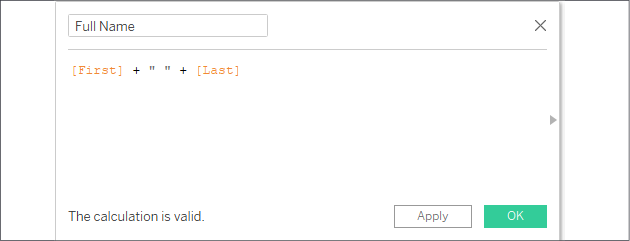

Figure 4.3: Creating the Full Name calculation in the editor

After clicking **OK**, you should notice a new **Full Name** field in
the data pane. The value for that field is calculated per row of data.
That is, every row of data contains the full name of the renter.

More complex examples 
---------------------

Note that the `Rental Property` field contains
values such as `112-Asbury Atoll` or
`207-Beach Breeze`. Let\'s assume that the naming
convention of the rental unit in the vacation rental data gives us the
room number and the name of the building separated by a dash. For
example, the unit named `207-Beach Breeze` is
room 207 of the Beach Breeze building.

Name the first `Room` with the following code:

```
SPLIT([Rental Property], "-", 1) 
```

Then, create another calculated field named
`Building` with the following code:

```
SPLIT([Rental Property], "-", 2) 
```

Both of these functions use the `Split()`
function, which splits a string into multiple values and keeps one of
those values. This function takes three arguments: the **string**, the
**delimiter** (a character or set of characters that separate values),
and the **token number** (which value to keep from the split, that is,
first, second, third, and so on.) Using the `-`
(dash) as the delimiter, `Room` is the first
value and `Building` is the second.

Using the two calculated fields, create a bar chart of **Rent per
Building & Room**, like this:

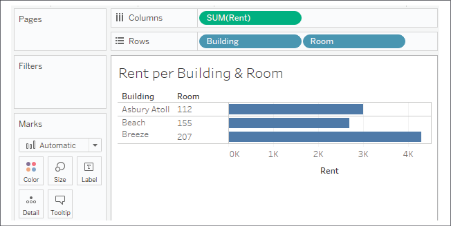

Figure 4.4: Using your calculated fields to build a view

The **Building** and **Room** fields show up in the data pane as
dimensions. The calculated dimensions can be used just like any other
dimension. They can slice the data, define the level of detail, and
group measures.

Row-level calculations are calculated at the row level, but you can
choose to aggregate the results. For example, you could aggregate to
find the highest **Room** number `(MAX)` or count
the distinct number of **Buildings**` (COUNTD)`.
In fact, if the result of a row-level calculation is numeric, Tableau
will often place the resulting field as a measure by default. But as
we\'ve seen, you can use a row-level field as either a dimension or
measure in the view.

Note that Tableau adds a small equals sign to the icon of the fields in
the data pane to indicate that they are calculated fields:

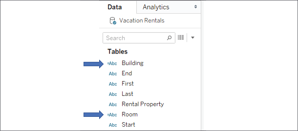

Figure 4.5: The small = sign indicates a field is a calculation

The code for both calculated fields is executed for every row of data
and returns a row-level value. We can verify that the code is operating
on the row level by examining the source data. Simply click on the
**View Data** icon next to dimensions to see the row-level detail (it\'s
next to the magnifying glass icon in the preceding screenshot). Here,
the new fields of **Building** and **Unit**, along with the row-level
values, can be clearly seen:

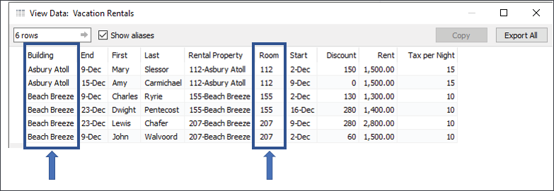

Figure 4.6: Viewing the underlying data shows us the calculation is done
per row of data

**Tip:**

Tableau provides a shortcut for splitting a field. You can use the
drop-down menu on a field in the data pane and select **Transform** \|
**Split** or **Transform** \| **Custom Split** (if you have a
non-standard delimiter). The results are calculated fields similar to
those you created previously, but with some additional logic around
determining data types. Transform functionality, such as split, is also
available for fields in the **Preview** or **Metadata** views on the
**Data** source screen.


Extending the example 
---------------------

We\'ll extend the example a bit more and assume you know that the floor
of a room is indicated by its number. Rooms 100 through 199 are on the
first floor, and 200 through 299 are on the second. You\'d like to have
that information available for analysis.

We could potentially add this attribute to the source data, but there
are times when this may not be an option or may not be feasible. You may
not have permission to change the source data or the source might be a
spreadsheet that is automatically generated every day, and any changes
would be overwritten.

Instead, you can create a row-level calculation in Tableau to extend the
data. To do so, create a calculated field named
`Floor` with the following code:

```
IF LEFT([Room], 1) = "1"
THEN "First Floor" 
ELSEIF LEFT([Room], 1) = "2" 
THEN "Second Floor" 
END 
```

This code uses the `LEFT()` function to return
the leftmost character of the room. Thus, `112`
gives a result of `1`;
`207` gives a result of
`2`. The `IF THEN END`
logic allows us to assign a result (either
`First Floor` or
`Second Floor`), depending on which case is true.
Notice that you used the `Room` field in the
calculation, which, in turn, was another calculation.

**Note:**

Using a reference to a
calculated field within
another calculation is referred to as **nesting.** The calculations that
use other calculated fields are called **nested**
**calculations**. There\'s
no theoretical limit to how many levels of nesting you can use, but it
may become hard to untangle the logic if you use too many levels of
nesting.


Planning for data variations 
----------------------------

As you write calculations,
consider whether your
calculation covers variations in the data that are not currently
present.

**Tip:**

A few good questions to ask yourself whenever you write a calculation in
Tableau are: *What happens if the data changes?* *Does the calculation
handle unexpected or invalid values?* *Have I covered every case?*


For example, the preceding floor calculation only works if all the rooms
are either 100- or 200-level rooms. What if there is a room, 306, on the
third floor, or a room, 822, on the eighth floor?

To account for additional cases, we might simplify our calculation to
the following:

```
LEFT([Room], 1) 
```

This code simply returns the leftmost character of the room number.
We\'ll get `3` for `306`
and `8` for `822`. But
what if we have room numbers such as 1056 on the tenth floor, and 1617
on the sixteenth? We\'d have to consider other options, such as the
following:

```
MID([Room], 0, LEN([Room]) - 2) 
```

Although this is more complicated, the string functions return a
substring that starts at the beginning of the string and ends just
before the last two characters. That gives us floor
`10` for `1025`, and floor
`18` for `1856`.

We\'ve now considered some row-level calculation examples. Let\'s move
on to the next major type of calculation in Tableau: aggregate-level
calculations.


#### Aggregate calculations

We\'ve already considered 
aggregations such as `sum`,
`min`, and `max` in
Tableau. Often, you\'ll use fields as simple aggregations in the view.
But sometimes, you\'ll want to use aggregations in more complex
calculations.

For example, you might be curious to explore the percentage of the rent
that was discounted. There is no such field in the data. It could not
really be stored in the source, because the value changes based on the
level of detail present in the view (for example, the percent discounted
for an individual unit will be different to the percent discounted per
floor or per building). Rather, it must be calculated as an aggregate
and recalculated as the level of detail changes.

Let\'s create a calculation named `Discount %`
with the following code:

```
SUM([Discount]) / SUM([Rent]) 
```

This code indicates that the
sum of
`Discount` should be divided by the sum of
`Rent`. This means that all the values of
`Discount` will be added, and all the values of
`Rent` will be added. Only after the sums are
calculated will the division occur.

**Note:**

Once you\'ve created the calculation, you\'ll notice that Tableau treats
the new field as a **Measure** in the data pane. Tableau will treat any
calculation with a numeric result as a measure by default, but you can
change *row-level calculations* to dimensions if desired. In this case,
though, you are not even able to redefine the new field as a dimension.
The reason for this is that Tableau will treat every *aggregate
calculation* as a measure, no matter what data type is returned. This is
because an aggregate calculation depends on dimensions to define the
level of detail at which the calculation is performed. So, an aggregate
calculation cannot be a dimension itself.


As the value of your calculation is a percentage, you will also likely
want to define the format as a percentage. To do this, right-click the
`Discount %` field, select **Default Properties**
\| **Number Format**, and select **Percentage**. You may adjust the
number of decimal places that are displayed if desired.

Now, create a couple of views to see how the calculation returns
different results, depending on the level of detail in the view. First,
we\'ll build a view to look at each individual rental period:

1.  Place **Building**, **Room**, **Full Name**, **Start**, and **End**
    on **Rows**.

2.  In the data pane, under **Measures**, double-click each of the
    following fields: **Rent**, **Discount**, and **Discount %**.
    Tableau will place each of these measures in the view by using
    **Measure Names** and **Measure Values**.

3.  Rearrange the fields on the **Measure Values** shelf so that the
    order is **Rent**, **Discount**, and **Discount %**:

    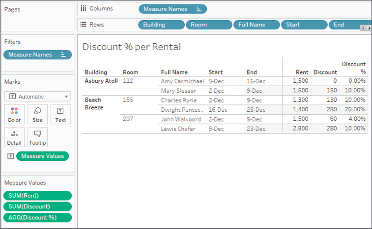

    Figure 4.7: Illustrates the Discount % calculated at the level of
    Building, Room, Full Name, Start, and End

You can see the percentage
given by way of discount for each rental period. However, notice how the
values change when you remove all fields except **Building** and
**Room**:

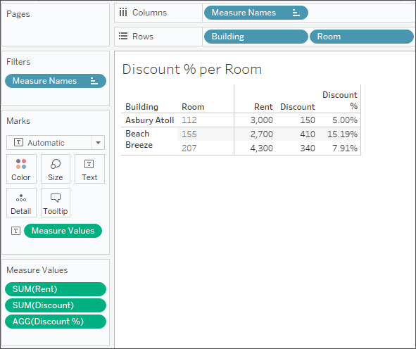

Figure 4.8: Illustrates the Discount % calculated at the level of
Building and Room

Why did the values change? Because
aggregations depend on what
dimensions are defining the level of detail of the view. In the first
case, **Building** and **Room**, **Full Name**, **Start**, and **End**
defined the level of detail in the view. So, the calculation added up
all the rent for each rental period and all the discounts for the rental
period and then divided them. In the second case, **Building** and
**Room** redefine the level of detail. So, the calculation added up all
the prices for each building and room and all the discounts for each
building and room and then divided them.

**Note:**

You may have noticed that as you double-clicked each measure, it was
added to the pane of the view in a special way. **Measure Names** and
**Measure Values** are special fields that appear in every data
connection (toward the bottom of the **Data** pane). These serve as
placeholders for multiple measures that share the same space in the
view.

In the view you just created, for example, three measures all shared
space in the pane. **Measure Values** on **Text** indicated that all
values of measures on the **Measure Values** shelf should be displayed
as text. The **Measure Names** field on **Columns** created a column for
each measure, with the value of the name of that measure.


Notice that the values
change again, as expected, if you look at the overall dataset without
slicing by any dimensions:

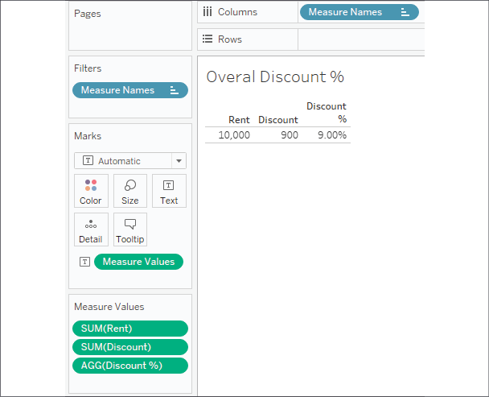

Figure 4.9: Illustrates the Discount % calculated at the highest
possible level: the entire dataset

**Tip:**

An easy way to get Tableau to implement **Measure Names** / **Measure
Values** is to remember that they are used whenever you want to use *two
or more measures in the same space* in a view. So, if you want to use
two or more measures in the pane, drag the first to the pane and then
the second. If you want to use two or more measures on the same axis,
drag the first to the axis, and then drag and drop the second on the
same spot.


Now that you have a basic understanding of row-level and aggregate
calculations, let\'s consider why the distinction is important.

Why the row level versus aggregate difference matters 
-----------------------------------------------------

Let\'s say you created a `Discount % (row level)`
calculation with the
following code:

```
[Discount]/[Rent] 
```

The code differs from the aggregate calculation you created previously,
which had the following code:

```
SUM([Discount])/SUM([Rent]) 
```

Here is the dramatic difference in results:

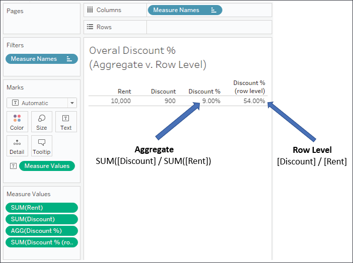

Figure 4.10: Illustrates the Discount % calculated as a row-level value
and as an aggregate

Why is there such a difference in the results? It\'s a
result of the way the
calculations were performed.

Notice that `Discount % (row level)` appears on
the **Measure Values** shelf as a `SUM`. That\'s
because the calculation is a row-level calculation, so it gets
calculated row by row and then aggregated as a measure after all
row-level values have been determined. The
`54.00%` value you see is actually a sum of
percentages that were calculated in each record of underlying data.

In fact, the row-level calculation and the final aggregation is
performed like this:

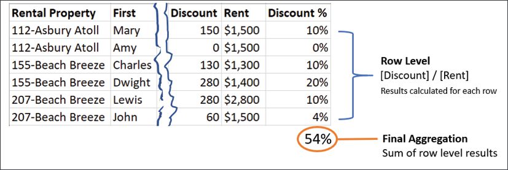

Figure 4.11: If each Discount % result is calculated at a row level and
then aggregated, the result is wrong

Contrast that with the way the aggregate
calculation is performed.
Notice that the aggregation that\'s listed in the active field on the
**Measure Values** shelf in the view is `AGG`,
and not `SUM`. This indicates that you have
defined the aggregation in the calculation. Tableau is not aggregating
the results further. Here is how the aggregate calculation is performed:

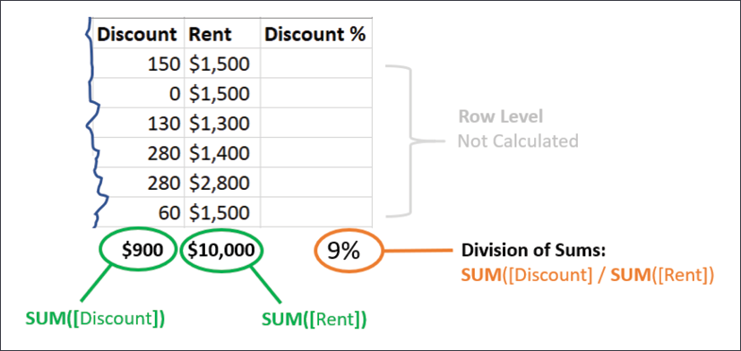

Figure 4.12: If the numerator and denominator are aggregated first, then
the Discount % calculation is correct

It is vital to understand the difference between row-level and aggregate
calculations to ensure you are getting the results you expect and need.
In general, use row-level calculations when you are certain that you
will use either the value as a dimension or that an aggregation of the
row-level values will make sense. Use aggregate calculations if
aggregations must be performed prior to other operations.

One of the most common error messages that\'s encountered while writing
Tableau calculations is *Cannot mix aggregate and non-aggregate
arguments with this function*. When you encounter this message, check
your code to make sure you are not improperly mixing row-level fields
and calculations with 
aggregate fields and calculations. For example, you cannot have
something like `[Discount] / SUM([Rent])`.

This mixture of a row-level value `(Discount)`
and the aggregation (`SUM` of
`Rent`) is invalid.

With the distinction between row-level and aggregate calculations clear,
let\'s take an interlude and discuss parameters before building
additional examples.


### Parameters

Before moving to some additional examples of row-level and aggregate
calculations, let\'s take a little side trip to examine parameters,
given that they can be used in incredible ways in calculations.

A **parameter** in Tableau is a placeholder for a single, global value
such as a number, date, or string. Parameters may be shown as controls
(such as sliders, drop-down lists, or type-in text boxes) to end users
of dashboards or views, giving them the ability to change the current
value of the parameter. Parameter values may even be changed with
actions, as you\'ll see in *Chapter 8*, *Telling a Data Story with
Dashboards*.

The value of a parameter is global so that if the value is changed,
every view and calculation in the workbook that references the parameter
will use the new value. Parameters provide another way to provide rich
interactivity to the end users of your dashboards and visualizations.

Parameters can be used to allow anyone interacting with your view or
dashboard to dynamically do many things, including the following:

-   Alter the results of a calculation
-   Change the size of bins
-   Change the number of top or bottom items in a top *n* filter or top
    *n* set
-   Set the value of a reference line or band
-   Change the size of bins
-   Pass values to a custom SQL statement that\'s used in a data source

Some of these are options we\'ll consider in later labs.

Since parameters can be used in calculations, and since calculated
fields can be used to define any aspect of a visualization (from filters
to colors to rows and columns), the change in a parameter value can have
dramatic results. We\'ll see some examples of this in the following
sections.

Creating parameters 
-------------------

Creating a parameter is similar to creating a calculated field.

There are multiple ways to create a parameter in Tableau:

-   Use the drop-down menu next to **Dimensions** in the data pane and
    select **Create Parameter**.
-   Right-click an empty area in the data pane and select **Create
    Parameter**.
-   Use the drop-down menu on a field, set, or parameter already in the
    data pane and select **Create** \| **Parameter\...**.

In the last case, Tableau will create a parameter with a list of
potential values based on the **domain** (distinct values) of the field.
For fields in the data pane that are **discrete** (blue) by default,
Tableau will create a parameter with a list of values matching the
discrete values of the field. For fields in the data pane that are
**continuous** (green), Tableau will create a parameter with a range set
to the minimum and maximum values of the field that\'s present in the
data.

When you first create a parameter (or subsequently edit an existing
parameter), Tableau will present an interface like this:

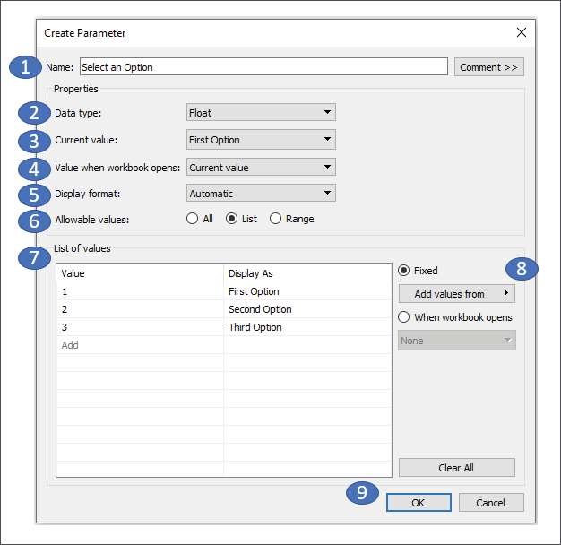

Figure 4.13: The Create Parameter interface numbered with corresponding
descriptions below

The interface contains the following features:

1.  **Name** will show as the default title for parameter controls and
    will also be the reference in calculations. You can also add a
    **Comment** to describe the use of the parameter.
2.  **Data type** defines what type of data is allowed for the value of
    the parameter. Options include integer, float (floating-point
    decimal), string, Boolean, date, or date with time.
3.  **Current value** defines what the initial default value of the
    parameter will be. Changing this value on this screen or on a
    dashboard or visualization where the parameter control is shown will
    change the current value.
4.  **Value when workbook opens** allows you to optionally change the
    default value of the parameter when the workbook opens based on a
    calculated value.
5.  **Display format** defines how the values will be displayed. For
    example, you might want to show an integer value as a dollar amount,
    a decimal as a percentage, or display a date in a specific format.
6.  The **Allowable values** option gives us the ability to restrict the
    scope of values that are permissible. There are three options for
    **Allowable values**:
    -   **All** allows any input from the user that matches the data
        type of the parameter.
    -   **List** allows us to define a list of values from which the
        user must select a single option. The list can be entered
        manually, pasted from the clipboard, or loaded from a dimension
        of the same data type.
    -   **Range** allows us to define a range of possible values,
        including an optional upper and lower limit, as well as a step
        size. This can also be set from a field or another parameter.
7.  In the example of the preceding screenshot, since we\'ve selected
    **List** for **Allowable values**, we are given options to enter the
    list of possible values. In this example, a list of three items has
    been entered. Notice that the value must match the data type, but
    the display value can be any string value. You can drag and drop
    values in the list to reorder the list. If **Range** had been
    selected, the screen would instead show options for setting the
    **Minimum**, **Maximum**, and **Step Size** for the range.
8.  Also specific to **List** are a couple of additional options for
    populating the list:
    -   **Fixed**: You may manually enter the values, paste from the
        clipboard, or set them from the existing values of a field in
        the data. In any case, the list will be a static list and will
        not change even if the data is updated.
    -   **When the workbook opens** allows you to specify a field that
        will dynamically update the list based on the available values
        for that field when the workbook is first opened.

Click **OK** to save changes to the parameter or **Cancel** to revert.

When the parameter is created, it appears in the data pane in the
**Parameters** section. The drop-down menu for a parameter reveals an
option, **Show Parameter Control**, which adds the parameter control to
the view. The little drop-down caret in the upper right of the parameter
control reveals a menu for customizing the appearance and behavior of
the parameter control. Here is the parameter control, shown as a single
value list, for the parameter we created earlier:


Figure 4.14: The parameter control shown as a single select radio button
list

This control can be shown on any sheet or dashboard and allows the end
user to select a single value. When the value is changed, any
calculations, filters, sets, or bins that use the parameter will be
re-evaluated, and any views that are affected will be redrawn.

Next, we\'ll consider some practical examples that use parameters in
calculations.


### Practical examples of calculations and parameters

Let\'s turn our attention to some practical
examples of row-level and
aggregate calculations. The 
goal is to learn and understand some of what is possible with
calculations. You will be able to build on these examples as you embark
on your analysis and visualization journey.

**Note:**

A great place to find help and suggestions for calculations is the
official Tableau forums at
[[https://community.tableau.com/s/explore-forums]{.url}](https://community.tableau.com/s/explore-forums).


Fixing data issues 
------------------

Often, data is not entirely
clean. That is, it has problems that need to be corrected before
meaningful analysis can be accomplished. For example, dates may be
incorrectly formatted, or fields may contain a mix of numeric values and
character codes that need to be separated into multiple fields.
Calculated fields can often be used to fix these kinds of issues.

**Tip:**

We\'ll consider using Tableau Prep---a tool designed to shape and
cleanse data---in *Chapter 14*, *Structuring Messy Data to Work Well in
Tableau*. Tableau Prep\'s calculation syntax is nearly identical, so
many of the examples in this lab will also be applicable in that
context. Knowing how to address data issues in either Tableau Desktop or
Tableau Prep will help you greatly.


We\'ll continue working with the
`Vacation Rentals` data. You\'ll recall that the
start and end dates looked something like this:


Without the year, Tableau does not recognize the
`Start` or `End` fields as
*dates*. Instead, Tableau recognizes them as *strings*. You might try
using the drop-down menu on the fields in the data pane to change the
data type to date, but without the year, Tableau will almost certainly
parse them incorrectly, or at least incompletely. This is a case where
we\'ll need to use a calculation to fix the issue.

Assuming, in this case, that you are confident the year should always be
2020, you might create calculated fields named
`Start Date` and
`End Date`.

Here is the code for getting the start date:

```
DATE([Start] + ", 2020")
```

And here is the code for getting the end date:

```
DATE([End] + ", 2020") 
```

What these calculated fields do is concatenate the month and day with
the year and then use the `DATE()` function to
convert the string into a date value. Indeed, Tableau recognizes the
resulting fields as dates (with all the features of a date field, such
as built-in hierarchies). A quick check in Tableau reveals the expected
results:

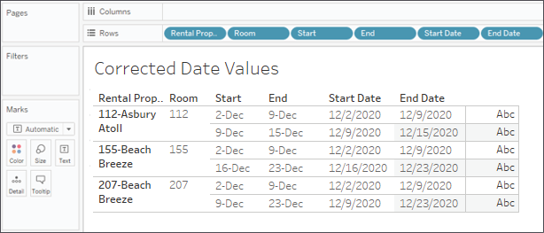

Figure 4.15: The corrected dates appear next to the string versions. All
fields are discrete dimensions on Rows (the dates are exact dates)

Not only are we able to fix
problems in the data, but we can also extend the data and our analysis
using calculations. We\'ll consider this next.

Extending the data 
------------------

Often, there will be 
dimensions or measures you\'d like to have in your data, but which are
not present in the source. Many times, you will be able to extend your
dataset using calculated fields. We already considered an example of
creating a field for the full name of the guest where we only had first
and last name fields.

Another piece of data that might unlock some truly interesting analysis
would be the length of each rental. We have the start and end dates, but
not the length of time between those two dates. Fortunately, this is
easy to calculate.

Create a calculated field named `Nights Rented`
with the following code:

```
DATEDIFF('day', [Start Date], [End Date])
```

**Note:**

Tableau employs intelligent code completion. It will offer suggestions
for functions and field names as you type in the code editor. Pressing
the [Tab] key will autocomplete what you have started
to type based on the current suggestion.

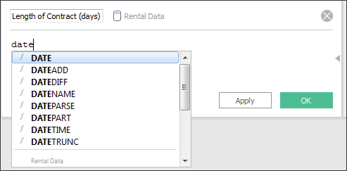

Figure 4.16: The intelligent code completion will suggest possible field
names and functions as you type.


The `DATEDIFF()` function
takes a date part
description, a start and an end date, and returns a numeric value for
the difference between the two dates. We now have a new measure, which
wasn\'t available previously. We can use this new measure in our
visualizations, such as the Gantt chart of rentals, as follows:

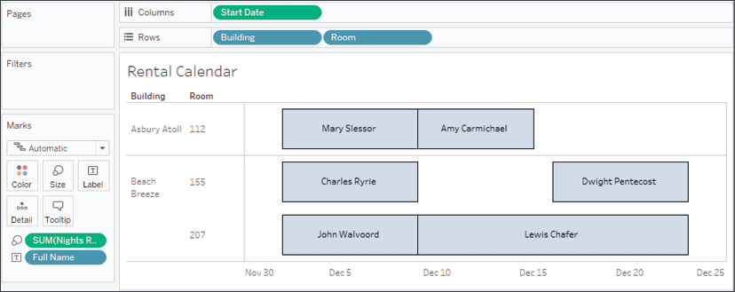

Figure 4.17: The calculated field allows us to create the Gantt chart

You\'ll find many ways to
extend your data with
calculations as you continue your journey in Tableau. And that will
enable you to accomplish some amazing analysis and visualizations.
We\'ll consider some examples next.

Enhancing user experience, analysis, and visualizations 
-------------------------------------------------------

Calculations and parameters
can greatly enhance the user experience,
the analysis, and the
visualizations.

Let\'s say we want to give the vacation condo
manager the ability to do
some what-if analysis. Every year, she offers a free night during the
month of December. She wants to be able to see which renters would have
received the free night, depending on which night she chooses.

To accomplish this, follow these steps:

1.  If you have not done so, create a Gantt chart similar to what was
    shown earlier (following the field placement of the screenshot).

2.  Create a parameter called **Free Night** with a data type of
    **Date** and a starting value of
    `12/12/2020`. This will allow the manager to
    set and adjust the starting date for the promotional month. Show the
    parameter control by selecting **Show Parameter Control** from the
    drop-down menu on the **Free Night** parameter in the data pane.

3.  Now, add a reference
    line to the view to show
    the free night. Do this by switching to the **Analytics** tab in the
    left sidebar. Drag
    **Reference Line** to the view and drop it on **Table**:

    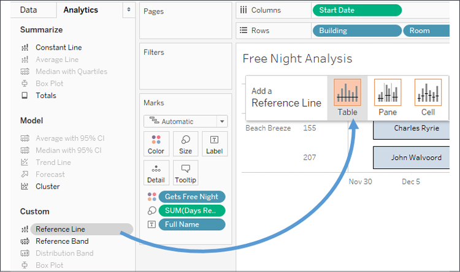

    Figure 4.18: Add a reference line by switching to the Analytics pane
    and dragging the reference line onto the canvas

4.  In the resulting dialog box, set **Line** Value to **Free Night**.
    You may wish to set the **Label** to **None**, or **Custom** with
    the text `Free Night`. You may also wish to
    adjust the formatting of the line:

    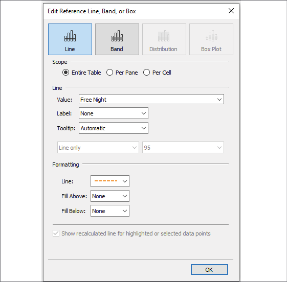

    Figure 4.19: Use the Edit Reference Line dialog to adjust
    formatting, labels, and tooltips

5.  Create a
    calculated 
    field called **Gets Free Night** that returns a
    `true` or `false`
    value, depending on
    whether the free night falls within the rental period:

    ``` 
    [Free Night] >= [Start Date]
    AND
    [Free Night] <= [End Date]
    ```
    


1.  Place this new calculated field on the **Color** shelf.

We now have a view that
allows the apartment manager 
to change the date and see a dynamically
changing view that makes it
obvious which renters would have fallen within a given promotional
period. Experiment by changing the value of the **Free Night** parameter
to see how the view updates:

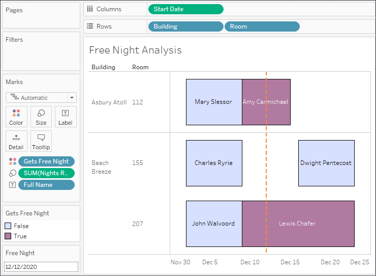

Figure 4.20: The reference line will move, and the affected individuals
will be recalculated every time you change the Free Night parameter
value

The preceding view shows the proposed free night as a dashed line and
highlights which rental periods would receive a free night. The line and
colors will change as the apartment manager adjusts the **Free Night**
parameter value.

In addition to extending your analysis, visualization, and user
experience, you might also use calculations to add required business
logic. We\'ll consider that next.

Meeting business requirements 
-----------------------------

Sometimes, data doesn\'t
exactly match what your organization wants. For example, the measures in
the data may not be the exact metrics required to make key business
decisions. Or dimension values may need to be grouped according to a
certain set of rules. Although this kind of business logic is often
applied as data is transformed or modeled prior to connecting to it with
Tableau, you may find cases where you need to implement business logic
on the fly.

In this example, consider that the measure `Rent`
is simply the base rent and does not include the discount or taxes.
Those are separate fields in the data. If you needed to analyze the
total `Revenue`, you\'d need to calculate it.
That calculation might look something like this:

```
[Rent] - [Discount] + ([Tax per Night] * [Nights Rented])
```

This formula takes the base `Rent`, subtracts the
`Discount`, and then adds the
`Tax per Night` multiplied by the
`Nights Rented`. The parentheses aid readability
but are not required because the multiplication operator,
`*`, has higher precedence and is evaluated
before the addition, `+`.

Up until now, we\'ve created calculated fields that extend the data
source. Sometimes you just need a quick calculation to help in a single
view. We\'ll conclude by looking at these quick ad hoc calculations.

Ad hoc calculations 
-------------------

Ad hoc calculations allow
you to add calculated fields to shelves in a single view without adding
fields to the data pane.

Let\'s say you have a simple view that shows the **Revenue per Guest**,
like this:

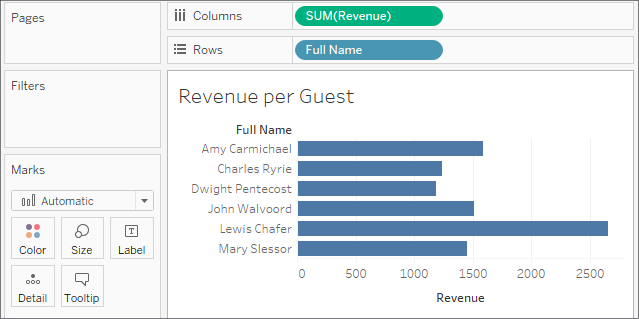

Figure 4.21: The revenue generated from each individual\'s stay

What if you wanted to
quickly highlight any renters who had paid less than \$1,500? One option
would be to create an ad hoc calculation. To do so, simply double-click
on an empty area of the **Columns**, **Rows**, or **Measure Values**
cards, or on the empty space of the **Marks** shelf, and then start
typing the code for a calculation. In this example, we\'ve
double-clicked the empty space on the **Marks** shelf:

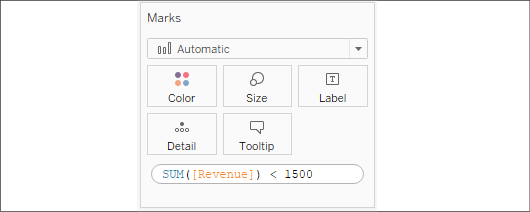

Figure 4.22: Creating an ad hoc calculation on the Marks card

Here, we\'ve entered code 
that will return `True` if the sum of
`Rent` is less than \$1,500 and
`False` otherwise. Pressing *Enter* or clicking
outside the text box will reveal a new ad hoc field that can be dragged
and dropped anywhere within the view. Here, we\'ve moved it to the
**Color** shelf:


Figure 4.23: Using the ad hoc calculation on Color

The ad hoc field is only available within the view and does not show up
in the data pane. You can double-click the field to edit the code.

**Tip:**

Dragging and dropping an ad hoc field into the data pane transforms it
into a regular calculated field that will be available for other views
that are using that data source.


Having seen a number of practical examples, let\'s conclude by
considering some ways to ensure good performance when using
calculations.


### Performance considerations


When working with a small
dataset and an efficient database, you often won\'t notice inefficient
calculations. With larger datasets, the efficiency of your calculations
can start to make a difference to the speed at which a view is rendered.

Here are some tips for making your calculations as efficient as
possible:

-   Boolean and numeric calculations are much faster than string
    calculations. If possible, avoid string manipulation and use
    aliasing or formatting to provide user-friendly labels. For example,
    don\'t write the following code:
    `IF [value] == 1`` THEN "Yes" ELSE "No" END`.
    Instead, simply write `[value] == 1`, and
    then edit the aliases of the field and set
    `True` to `Yes` and
    `False` to `No`.

-   Look for ways to increase the efficiency of a calculation. If you
    find yourself writing a long `IF ELSEIF`
    statement with lots of conditions, see whether there are one or two
    conditions that you can check first to eliminate the checks of all
    the other conditions. For example, let\'s consider simplifying the
    following code:

    ``` 
    //This is potentially less efficient...
    IF [Type] = "Dog" AND [Age] < 1 THEN "Puppy" 
    ELSEIF [Type] = "Cat" AND [Age] < 1 THEN "Kitten" 
    END
    //...than this code:
    IF [Age] < 1 THEN
        IF [Type] = "Dog" THEN "Puppy"
        ELSEIF [Type] = "Cat" THEN "Kitten"
        END
    END 
    ```
    

    Notice how the check of type doesn\'t have to be done for any
    records where the age was less than `1`. That
    could be a very high percentage of records in the dataset.

-   Row-level calculations have to be performed for every row of data.
    Try to minimize the complexity of row-level calculations. However,
    if that is not possible or doesn\'t solve a performance issue,
    consider the final option.

-   When you create a data extract, certain row-level calculations are
    materialized. This means that the calculation is performed once when
    the extract is created, and the results are then stored in the
    extract. This means that the data engine does not have to execute
    the calculation over and over. Instead, the value is simply read
    from the extract. Calculations that use any user functions,
    parameters, or `TODAY()` or
    `NOW()`, will not be materialized in an
    extract as the value necessarily changes according to the current
    user, parameter selection, and system time. Tableau\'s optimizer may
    also determine whether to materialize certain calculations that are
    more efficiently performed in memory rather than
    having to read the
    stored value.

**Tip:**

When you use an extract to materialize row-level calculations, only the
calculations that were created at the time of the extract are
materialized. If you edit calculated fields or create new ones after
creating the extract, you will need to optimize the extract (use the
drop-down menu on the data source or select it from the **Data** menu
and then select **Extract** \| **Optimize** or **Extract** \| **Compute
Calculations Now**).


As you continue to work with calculations, pay special attention to
situations where you notice performance issues, and consider whether you
can optimize your calculations for better results.

## Summary

Calculations open amazing possibilities in Tableau. You are no longer
confined to the fields in the source data. With calculations, you can
extend the data by adding new dimensions and measures, fix bad or poorly
formatted data, and enhance the user experience with parameters for user
input and calculations that enhance the visualizations.

The key to using calculated fields is understanding the four main types
of calculations in Tableau. Row-level calculations are performed for
every row of source data. These calculated fields can be used as
dimensions or they can be aggregated as measures. Aggregate calculations
are performed at the level of detail that\'s defined by the dimensions
that are present in a view. They are especially helpful, and even
necessary, when you must first aggregate components of the calculation
before performing additional operations.

In the next lab, we\'ll explore the third of the four main types of
calculations: **Level of Detail calculations**. This will greatly extend
your ability to work with data and solve all kinds of interesting
problems.
