Lab 5. Viewing Specific Values
==============================


Having considered row-level and aggregate calculations, it\'s time to
turn our attention to the third of the four main types of calculations:
**level of detail calculations**.

**Level of detail calculations** (sometimes referred to as **LOD calcs**
or **LOD expressions**) allow you to perform aggregations at a specified
level of detail, which may be different from the level of detail that is
defined in the view. You can leverage this capability to perform a wide
variety of analyses that would otherwise be quite difficult.

In this lab, we\'ll cover the following:

-   Overview of level of detail
-   Level of detail calculation syntax and variations
-   Examples of `FIXED` level of detail
    calculations
-   Examples of `INCLUDE` level of detail
    calculations
-   Examples of `EXCLUDE` level of detail
    calculations

### Overview of level of detail

What does the term **level
of detail** mean? A lot depends on the context in which the term is
used. Within Tableau, we\'ll distinguish several levels of detail, each
of which is vitally important to understand in order to properly analyze
data:

-   **Data level of detail**: Sometimes referred to as the **grain** of
    the data, this is the level of detail defined by a single record of
    the data set. When you can articulate what one record of the data
    represents (for example, \"Every record represents a single order\"
    or \"There is one record for every customer\"), then you have a good
    understanding of the data level of detail. *Row-level calculations
    operate at this level*.
-   **View level of detail**: We\'ve previously discussed that the
    combination of fields used as dimensions in the view defines the
    view level of detail. Normally in a view, Tableau draws a single
    mark for each distinct combination of values present in the data for
    all the dimensions in the view. For example, if **Customer** and
    **Year** are the two dimensions in your view, Tableau will draw a
    mark (such as a bar or circle) for each **Customer**/**Year**
    combination present in the data (that is not excluded by a filter).
    *Aggregate calculations operate at this level*.
-   **Calculated level of detail**: This is a separate level of detail
    defined by a calculation. As we\'ll see, you
    may use any number of
    dimensions to define the level of detail. *Level of detail
    calculations are used to define this level*.

Consider the following data set, with a **data level of detail** of one
record per customer:

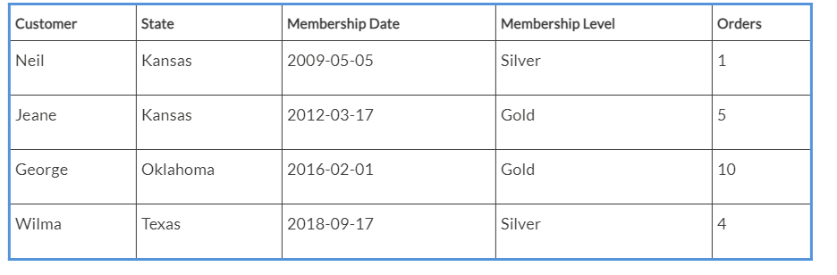

In this case, each record defines a single unique customer. If we were
to perform a row-level calculation, such as
`DATEDIFF('year'`,` [Membership Date]`,` TODAY())`
to determine the number of years each customer has been a member, then
the result would be calculated per record.

Now consider a view created from the data with a **view level of
detail** of state:

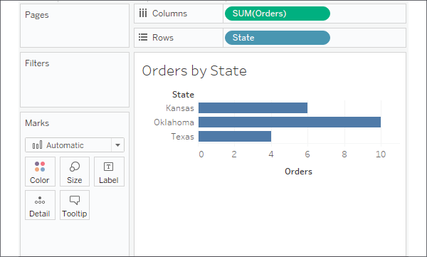

Figure 5.1: The view level of detail of state

As the only dimension in the view, **State** defines the view level of
detail. There is one mark per state, and calculations and fields used as
aggregates, such as **SUM(Orders)**, will be performed per state.

Based on that particular
view, we might want to enhance our understanding by asking additional
questions, such as the following:

-   Which customer was the first member of each state in the view?
-   How does the number of orders per state compare to the average
    number of orders for all states?
-   Which membership level had the highest or lowest number of orders
    per state?

In each case, the question involves a level of detail that is different
from the view (the minimum membership date per state compared to each
individual customer, the average orders overall compared to orders per
state, and the minimum or maximum number of orders per membership level
per state). In some cases, it might make sense to build a new view to
answer these questions. But sometimes we want to supplement an existing
view or compare different levels of detail in the same view. Level of
detail calculations provide
a solution!


### Level of detail calculations


Before getting into
practical examples of using
level of detail calculations, let\'s take a moment to understand the
syntax and types of level of detail calculations.

Level of detail syntax 
----------------------

Level of detail calculations
follow this basic pattern of syntax:

```
{FIXED|INCLUDE|EXCLUDE [Dim 1],[Dim 2] : AGG([Field])}
```

The definitions of the preceding declaration are as follows:

-   `FIXED`, `INCLUDE`,
    and `EXCLUDE` are keywords that indicate the
    type of level of detail calculation. We\'ll consider the differences
    in detail in the following section.
-   `Dim 1`, `Dim 2` (and
    as many dimensions that are needed) is a comma-separated list of
    dimension fields that defines the level of detail at which the
    calculation will be performed.
-   `AGG` is the aggregate function you wish to
    perform (such as `SUM`,
    `AVG`, `MIN`, and
    `MAX`).
-   `Field` is the value that will be aggregated
    as specified by the aggregation you choose.

Level of detail types 
---------------------

Three types of level of
detail calculations are used in Tableau: **FIXED**, **INCLUDE**, and
**EXCLUDE**.

### FIXED 

**Fixed** level of detail
expressions 
work at the level of detail that\'s specified by the list of dimensions
in the code, regardless of what dimensions are in the view. For example,
the following code returns the average orders per state, regardless of
what other dimensions are in the view:

```
{FIXED [State] : AVG([Orders])} 
```

You may include as many dimensions as needed or none at all. The
following code represents a fixed calculation of the average orders for
the entire set of data from the data source:

```
{FIXED : AVG([Orders])} 
```

Alternately, you might write
the calculation in the
following way with identical results:

```
{AVG([Orders])}
```

**Note:**

A fixed level of detail expression with no dimensions specified is
sometimes referred to as a *table-scoped fixed level of detail
expression*, because the aggregation defined in the calculation will be
for the entire table.


### INCLUDE 

**Include** level of
detail 
expressions aggregate at the level of detail that\'s determined by the
dimensions in the view, *along with* the dimensions listed in the code.
For example, the following code calculates the average orders at the
level of detail that\'s defined by dimensions in the view, but includes
the dimension `Membership Level`, even if
`Membership Level` is not in the view:

```
{INCLUDE [Membership Level] : AVG([Orders])} 
```

### EXCLUDE 

**Exclude** level of detail 
expressions aggregate at the
level of detail determined by the dimensions in the view, *excluding*
any listed in the code. For example, the following code calculates the
average number of orders at the level of detail defined in the view, but
does not include the `Customer` dimension as part
of the level of detail, even if `Customer` is in
the view:

```
{EXCLUDE [Customer] : AVG([Orders])}
```

An illustration of the difference level of detail can make 
----------------------------------------------------------

As you analyze data, one
thing you might often wonder is how slices of data relate to the overall
picture. For example, you might wonder how the number of orders for each
state in the view above relates to the overall average number of orders.
One quick and easy option is to add an **Average Line** to the view from
the **Analytics** tab, by dragging and dropping like this:

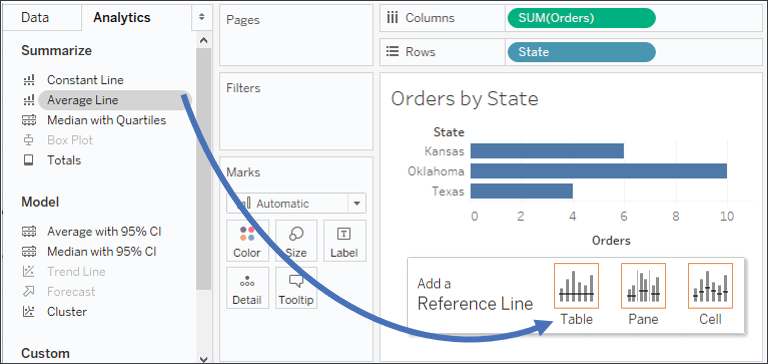

Figure 5.2: Adding an average line to the view

You\'ll end up with an average line that looks like this:


Figure 5.3: The overall average is reported as 6.66667. This is the
average per state

But is `6.66667` truly the average number of
orders overall? It turns out that it\'s not. It\'s actually the average
of the sum of the number of orders for each state:
`(6 + 10 + 4) / 3`. Many times, that average line
(that is, the average of the total number of orders per state) is
exactly what we want to compare when using aggregate numbers.

But sometimes, we might want to calculate the true overall average. To
get the average number of orders present in the entire data set, we
might consider creating a calculation named
`Overall Average Number of Orders` and using a
fixed level of detail
calculation like this:

```
{FIXED : AVG([Orders])} 
```

Adding that calculated field to the **Detail** part of the **Marks**
card and editing the reference line to use that field instead gives us a
different result:

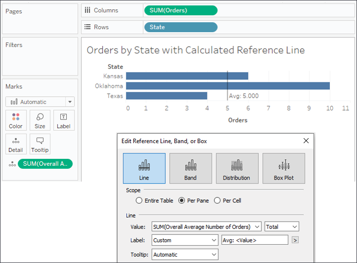

Figure 5.4: The true overall average number of orders per customer is 5

You\'ll recall that the
original data set had four records, and a quick check validates the
result:

```
(1 + 5 + 10 + 4) / 4 = 5
```

Now we have examined how level of detail calculations make a real
difference; let\'s look at some practical examples.


### Examples of fixed level of detail calculations

As we turn our attention to
some practical examples of level of detail calculations, we\'ll use
the` Chapter 05 Loans` data set contained in the
`Chapter 05` workbook. The true data set contains
many more records, but here is an example of the kinds of data it
contains:

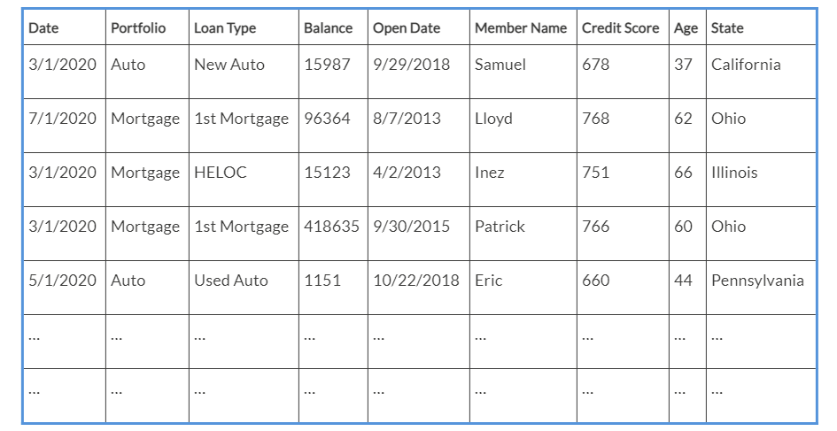

The data set represents historical data for loans for members at a bank,
credit union, or similar financial institution. Each record is a monthly
snapshot of a loan and contains the date of the snapshot along with
fields that describe the loan (**Portfolio**, **Loan Type**,
**Balance**, and **Open Date**) and fields for the member (**Name**,
**Credit Score**, **Age**, and **State**).

As in previous labs, the goal is to understand key concepts and some
key patterns. The following are only a few examples of all the
possibilities presented by level of detail calculations.

Was a member ever at risk? 
--------------------------

Let\'s say branch management has determined that any member who has ever
had a credit score of less than 550 is considered to be at risk and
eligible for special assistance. Consider the history
for the following three
individuals:

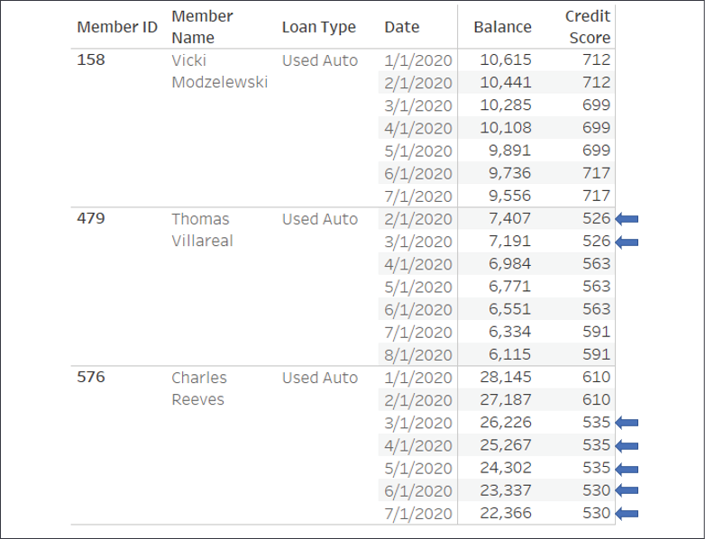

Figure 5.5: Credit scores for three individuals with scores under the
550 threshold indicated via arrows

Every month, a new snapshot of history is recorded. Loan balances often
change along with the member\'s credit score. Some members have never
been at risk. The first member, Vicki, has 699 as her lowest recorded
score and has never been at risk. However, both Charles and Thomas had
periods in the history where their credit scores fell below the
threshold (indicated with arrows in the preceding screenshot).

A simple row-level calculation, such as
`[Credit Score] < 550`, could identify each
record where the monthly snapshot of credit score indicated a risk. But
members whose scores fluctuated *below* and *above* the threshold would
have records that were alternately `TRUE` or
`FALSE`.

We want every record for a given member to be
`TRUE` if *any* of the records for that member
are below the threshold and
`FALSE` if *none* of the records are below the
threshold.

One solution is to use a level of detail calculation, which we\'ll name
`Member Ever at Risk?`, with the code:

```
{FIXED [Member ID] : MIN([Credit Score])} < 550
```

This calculation determines the lowest credit score for each member and
compares it to the risk threshold of 550. The result is the same for
each record for a given member, as you can see here:


Figure 5.6: The Member Ever at Risk? field is True or False for all
records of a given member

Notice that every record
contains the result for the relevant member. This illustrates one key
concept for fixed level of detail calculations: *while the calculation
is an aggregation at a defined level of detail, the results are at the
row level.* That is, the `TRUE` or
`FALSE` value is calculated at the member level,
but the results are available as row-level values for every record for
that member.

This enables all kinds of analysis possibilities, such as:

-   Filtering to include only at-risk members but retaining all records
    for their history. If you instead filtered based on individual
    credit score, you\'d lose all records for parts of the history where
    the credit score was above the threshold. Those records might be
    critical for your analysis.

-   Correctly counting members as either at risk or not while avoiding
    counting them for both cases if the history fluctuated.

-   Comparing members who were or were not at risk at other levels of
    detail. For example, this view shows the number of members who were
    at risk or not at risk
    by portfolio:

    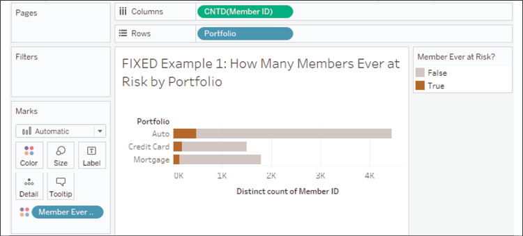

    Figure 5.7: We can implement some brushing to show what proportion
    of members has ever been at risk

**Note:**

Fixed level of detail calculations are context sensitive. That is, they
operate within a context, which is either 1) the entire data set, or 2)
defined by **context filters** (filters where the drop-down **Add to
Context** option has been selected). In this example, that means the
values calculated for each member will not change if you don\'t use
context filters. Consider Thomas, who will always be considered at risk,
even if you applied a normal filter that kept only dates after March
2020. That is because the fixed level of detail calculation would work
across the entire data set and find at-risk values in January and
February. If you were to add such a filter to context, the result could
change. This behavior of fixed level of detail calculations can be
leveraged to aid your analysis but can also cause unexpected behavior if
not understood.


This is a single example of the kinds of analysis made simple with level
of detail calculations.
There\'s so much more we can
do and we\'ll see another example next!

Latest balance for a member 
---------------------------

Many data sets contain a series of events or a history of transactions.
You may find yourself asking questions such as:

-   What diagnoses are
    common for a patient\'s first visit to the hospital?
-   What was the last reported status of each computer on the network?
-   How much did each customer spend on their last order?
-   How much did the first trade of the week make compared to the last?

None of these questions is simply asking when the earliest or latest
event happened. A simple `MIN` or
`MAX` aggregation of the date would provide that
answer. But with these questions, there is the added complexity of
asking for additional detail about what happened on the earliest or
latest dates. For these kinds of questions, level of detail calculations
provide a way to arrive at answers.

Consider the following three members\' data contained in the
`Chapter 05 Loans` data set:

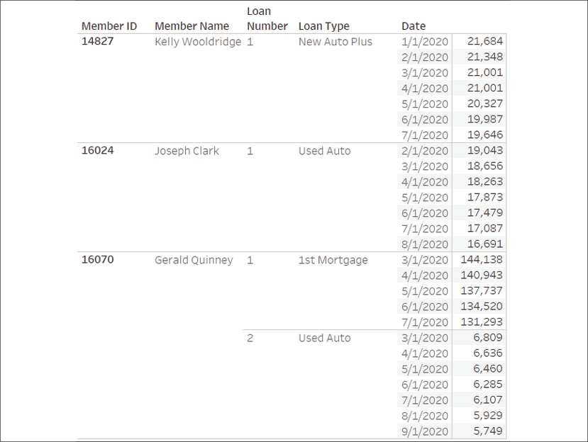

Figure 5.8: The data for three selected members in the Loans data set

Each has a history of
balances for each of their loans. However, the most recent date of
history differs for each loan. Kelly\'s most recent balance is given for
July. Joseph\'s latest balance is for August. Gerald has two loans: the
first has the most recent balance for July and the second has the most
recent balance for September.

What if you want to identify only the records that represent the latest
known balance for a member? You might consider using a fixed level of
detail calculation called
`Latest Date per Member/Loan` with code such as
this:

```
{FIXED [Member ID],[Loan Number] : MAX([Date])} = [Date]
```

This determines the maximum date per member per loan and compares the
result to each row-level date, returning `TRUE`
for matches and `FALSE` otherwise.

**Tip:**

Two dimensions have been used to define the level of detail in the
previous calculation because
a single member can have more than one loan. If you had a truly unique
identifier for each loan, you could alternatively use that as the single
dimension defining the level of detail. You will need to have a good
understanding of your data to accurately leverage level of detail
calculations.


You can see the results of the calculation here:


Figure 5.9: The latest date per loan per person is indicated by a True
value for the calculation

If you had wanted to determine the first record for each loan, you would
have simply changed `MAX` to
`MIN` in the code. You can use the level of
detail calculation\'s row-level `TRUE` /
`FALSE` result as a filter to keep only the
latest records, or even as part of other calculations to accomplish an
analysis, such as comparing, starting, and ending balances.

**Tip:**

The technique demonstrated by this calculation has many applications. In
cases where data *trickles in*, you can identify the most recent
records. In cases where you have duplication of records, you can filter
to keep only the first or last. You can identify a customer\'s first or
last purchase. You can compare historic balances to the original balance
and much, much more!


We\'ve just seen how fixed
level of detail calculations can be leveraged to answer some complex
questions. Let\'s continue by examining include level of detail
expressions.


### Example of include level of detail expressions

Include level of detail 
calculations can be very useful when you need to perform certain
calculations at levels of detail that are lower (more detailed) than the
view level of detail. Let\'s take a look at an example.

Average loans per member 
------------------------

Some members have a single loan. Some have two or three or possibly
more. What if we wanted to see
how many loans the average
member has on a state by state basis? Let\'s consider how we might go
about that.

We\'ll start with a sheet where the view level of detail is **State**:

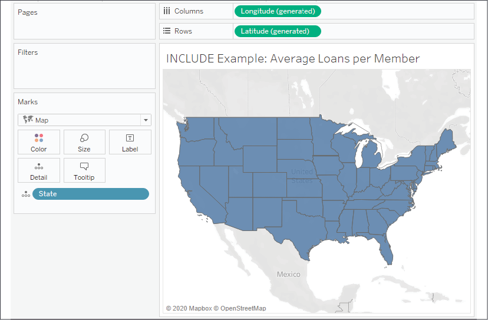

Figure 5.10: The starting place for the example---a filled map by state

It would be relatively easy to visualize the average credit score or
average balance per state. But what if
we want to visualize the
average number of loans per member for each state? While there are
several possible approaches to solving this kind of problem, here we\'ll
consider using the following level of detail expression named
`Number of Loans per Member`:

```
{INCLUDE [Member ID] : COUNTD([Loan Number])}
```

This code returns a distinct count of loan numbers at a level of detail
that includes the member ID along with all dimensions that defined the
view level of detail (state, in this case). When we add the calculation
to the view, we\'ll need to decide how to aggregate it. In this case, we
want the average number of loans per member, so we\'ll select
**Measure** \| **Average** from the dropdown on the field, revealing an
interesting geographic pattern:

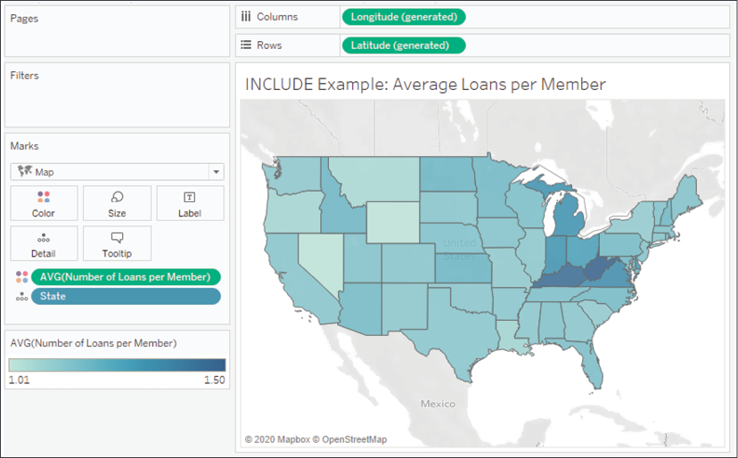

Figure 5.11: Using the Include level of detail calculation to create a
gradient of color to show average loans per member

As you think through how
include level of detail calculations work, you might want to construct a
crosstab at the level of detail:

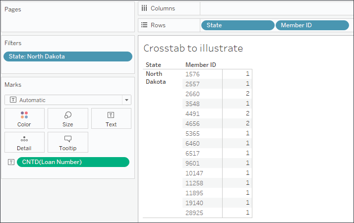

Figure 5.12: A crosstab helps illustrate how the distinct count of loans
can be used as a basis for an average

**State**, the first dimension on **Rows**, comes from the view level of
detail. **Member ID** has been included
in the crosstab to simulate
the dimension included in the level of detail expression.
`COUNTD(Loan Number)` gives the number of loans
per member. Averaging the values for all the members in the state gives
the state average. A quick check for **North Dakota** gives us an
average of 1.2 loans per member, which matches the map visualization
exactly.

In this case, the include level of detail expression gives us a useful
solution. There are some alternative ways to solve and it is helpful to
consider some of these as you think through how you might solve similar
issues. We\'ll consider those next.

### Alternative approaches 

It\'s worth noting that the
above dataset actually allows you to use
`MAX([Loan Number])` instead of
`COUNTD([Loan Number])` as the number simply
increments for each member based on how many loans they have. The
highest number is identical to the number of loans for that member. In a
significantly large data set, the `MAX`
calculation should perform better.

There are also a few other approaches to solving this problem, such as
the calculation. For example, you could write the following code:

```
COUNTD(STR([Member ID]) + "_" + STR([Loan Number])) 
/ 
COUNTD([Member ID])
```

This code takes the distinct count of loans and divides it by the
distinct count of members. In order to count the distinct number of
loans, the code creates a unique key by concatenating a string of a
member ID and a loan number.

**Tip:**

The aggregate calculation alternative has the advantage of working at
any level of detail in your view. You may find either the level of
detail or aggregate calculation to be easier to understand, and you will
need to decide which best helps you to maintain a flow of thought as you
tackle the problem at hand.


Another approach would be to
use a fixed level of detail expression, such as:

```
{FIXED [State],[Member ID] : COUNTD([Loan Number])}
```

This calculation results in the same level of detail as the include
expression and uses the same distinct count of loan number. It turns out
that in this data set, each member belongs to only a single state, so
state wouldn\'t necessarily have to be included in the fixed level of
detail expression. However, if you wanted to change the level of detail
you\'d need to adjust the calculation, whereas, with the include
expression, you\'d only have to add or remove dimensions to the view.

With the include example along with some alternatives in mind, let\'s
turn our attention to an example of exclude level of detail
calculations.


### Example of exclude level of detail calculations

Exclude level of detail
calculations are useful when you want to perform certain calculations at
higher (less detailed) levels than the view level of detail. The
following example will demonstrate how we can leverage this
functionality.

Average credit score per loan type 
----------------------------------

In this example, we\'ll
answer the following
question: how does the average credit score for a given loan type
compare to the overall average for the entire portfolio?

Take the following view, which shows the average credit score per loan
type (where loan types are grouped into portfolios):

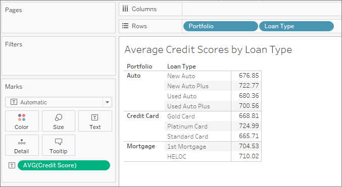

Figure 5.13: This crosstab shows the average credit score per loan type

What if we wanted to compare the average credit score of each loan type
with the overall average credit score for the entire portfolio? We could
accomplish this with an exclude level of detail calculation that looks
like this:

```
{EXCLUDE [Loan Type] : AVG([Credit Score])}
```

This removes **Loan Type** from the level of detail and the average is
calculated only per portfolio. This gives us results like the following:

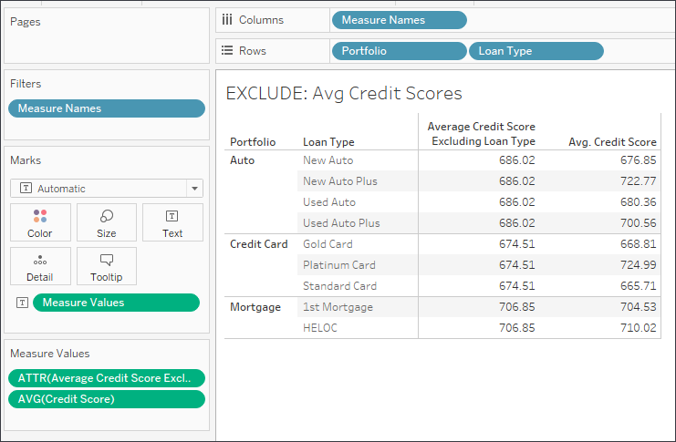

Figure 5.14: The exclude level of detail expression removes Loan Type so
the average is only at the portfolio level

You\'ll notice that the same value for the average excluding loan type
is repeated for each loan type.
This is expected because the
overall average is at the portfolio level and is not affected by the
loan type. As is, this is perhaps not the most useful view. But we can
extend the calculation a bit to give us the difference between the
overall portfolio average and the average of each loan type. The code
would look like this:

```
AVG([Credit Score]) - AVG([Average Credit Score Excluding Loan Type])
```

This takes the average at the view level of detail (loan type and
portfolio) and subtracts the average at the portfolio level to give us
the difference between each loan type average and the overall portfolio
average. We might rearrange the view to see the results visually, like
this:

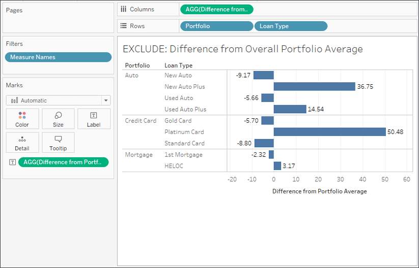

Figure 5.15: The final view shows the difference between the loan type
average credit score and the overall portfolio average

Exclude level of detail
expressions give us the ability to analyze differences between the view
level of detail and higher levels of detail.


### Summary

Level of detail expressions greatly extend what you can accomplish with
calculations. You now have a toolset for working with data at different
levels of detail. With fixed level of detail calculations, you can
identify the first or last event in a series or whether a condition is
ever true across entire subsets of data. With include expressions, you
can work at lower levels of detail and then summarize those results in a
view. With exclude expressions, you can work at higher levels of detail,
greatly expanding analysis possibilities.

In the next lab, we\'ll explore the final main type of calculations:
**table calculations**. These are some of the most powerful calculations
in terms of their ability to solve problems, and they open up incredible
possibilities for in-depth analysis. In practice, they range from very
easy to exceptionally complex.
