Lab 6. Diving Deep with Table Calculations 
===================================


**Table calculations** are one of the most powerful features in Tableau.
They enable solutions that really couldn\'t be achieved any other way
(short of writing a custom application or complex custom SQL scripts!).
The features include the following:

-   They make it possible to use data that isn\'t structured well and
    still get quick results without waiting for someone to fix the data
    at the source.
-   They make it possible to compare and perform calculations on
    aggregate values across rows of the resulting table.
-   They open incredible possibilities for analysis and creative
    approaches to solving problems, highlighting insights, or improving
    the user experience.

Table calculations range in complexity, from incredibly easy to create
(a couple of clicks) to extremely complex (requiring an understanding of
**addressing**, **partitioning**, and **data densification**, for
example). We\'ll start off simple and move toward complexity in this
lab. The goal is to gain a solid foundation in creating and using
table calculations, understanding how they work, and looking at some
examples of how they can be used. We\'ll consider these topics:

-   An overview of table calculations
-   Quick table calculations
-   Scope and direction
-   Addressing and partitioning
-   Custom table calculations
-   Practical examples

The examples in this lab will return to the sample
`Superstore` data that we used in the first
lab. To follow along with the examples, use the
`Chapter 06 Starter.twbx` workbook.


### An overview of table calculations


**Table calculations** are different from all
other calculations in Tableau. Row-level, aggregate calculations, and
LOD expressions, which we explored in the previous labs, are
performed as part of the query to the data source. If you were to
examine the queries sent to the data source by Tableau, you\'d find the
code for your calculations translated into whatever implementation of
SQL the data source used.

Table calculations, on the other hand, are performed after the initial
query. Here\'s a diagram that demonstrates how aggregated results are
stored in Tableau\'s cache:

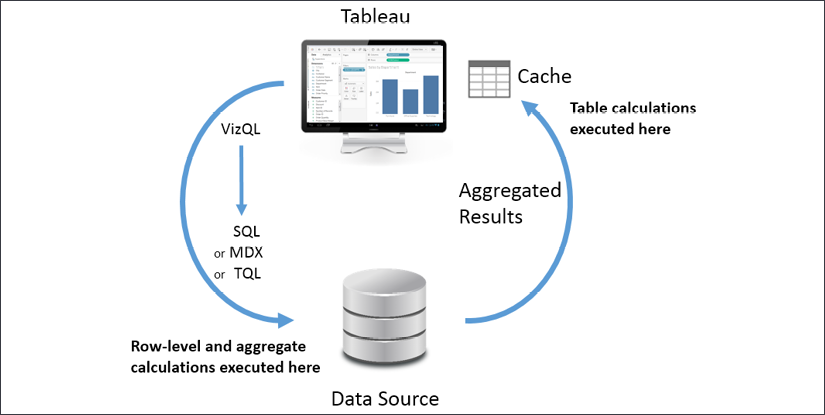

Figure 6.1: Table calculations are computed in Tableau\'s cache of
aggregated data

Table calculations are performed on the aggregate
table of data in Tableau\'s cache right before the data visualization is
rendered. As we\'ll see, this is important to understand for multiple
reasons, including the following:

-   **Aggregation**: Table calculations operate on
    aggregate data. You cannot reference a field in a table calculation
    without referencing the field as an aggregate.
-   **Filtering**: Regular filters will be applied
    before table calculations. This means that table calculations will
    only be applied to data returned from the source to the cache.
    You\'ll need to avoid filtering any data necessary for the table
    calculation.
-   **Table calculation filtering** (sometimes called **late
    filtering**): Table calculations used as filters will be applied
    after the aggregate results are returned from
    the data source. The order is important: row-level and aggregate
    filters are applied first, the aggregate data is returned to the
    cache, and then the table calculation is applied as a filter that
    effectively hides data from the view. This allows some creative
    approaches to solving certain kinds of problems that we\'ll consider
    in some of the examples later in the lab.
-   **Performance**: If you are using a live
    connection to an enterprise database server, then row-level and
    aggregate-level calculations will be taking advantage of
    enterprise-level hardware. Table calculations are performed in the
    cache, which means they will be performed on whatever machine is
    running Tableau. You will not likely need to be concerned if your
    table calculations are operating on a dozen or even hundreds of rows
    of aggregate data, or if you anticipate publishing to a powerful
    Tableau server. However, if you are getting back hundreds of
    thousands of rows of aggregate data on your local machine, then
    you\'ll need to consider the performance of your table calculations.
    At the same time, there are cases where table calculations might be
    used to avoid an expensive filter or calculation at the source.

With this overview of table calculations in mind, let\'s jump into
understanding some options for creating table calculations.

Creating and editing table calculations 
---------------------------------------

There are several ways to create table
calculations in Tableau, including:

-   Using the drop-down menu for any active field
    used as a numeric aggregate in the view, select **Quick Table
    Calculation** and then the desired calculation type.
-   Using the drop-down menu for any active field that is used as a
    numeric aggregate in the view, select **Add Table Calculation**,
    then select the calculation type, and adjust any desired settings.
-   Creating a calculated field and using one or more table calculation
    functions to write your own custom table calculations.

The first two options create a quick table
calculation, which can be edited or removed using the drop-down menu on
the field and selecting **Edit Table Calculation\...** or **Clear Table
Calculation**. The third option creates a calculated field, which can be
edited or deleted like any other calculated field.

A field on a shelf in the view that is using a
table calculation, or which is a calculated field using table
calculation functions, will have a delta symbol icon
([]{.mediaobject}) visible, as follows.

Following is a snippet of an active field without a table calculation:


Figure 6.2: An active field without a table calculation applied

Following is the active field with a table calculation:


Figure 6.3: An active field with a table calculation applied includes
the delta symbol

Most of the examples in this lab will utilize text tables/cross tab
reports as these most closely match the actual aggregate table in the
cache. This makes it easier to see how the table calculations are
working.

**Tip:**

Table calculations can be used in any type of visualization. However,
when building a view that uses table calculations, especially more
complex ones, try using a table with all dimensions on the **Rows**
shelf and then adding table calculations as discrete values on **Rows**
to the right of the dimensions. Once you have all the table calculations
working as desired, you can rearrange the fields in the view to give you
the appropriate visualization.


We\'ll now move from the concept of creating table calculations to some
examples.


### Quick table calculations


**Quick table calculations** are predefined table
calculations that can be applied to fields used as measures in the view.
These calculations include common and useful calculations such as
**Running Total**, **Difference**, **Percent Difference**, **Percent of
Total**, **Rank**, **Percentile**, **Moving Average**, **YTD Total**
(year-to-date total), **Compound Growth Rate**, **Year over Year
Growth**, and **YTD Growth**. You\'ll find applicable options on the
drop-down list on a field used as a measure in the view, as shown in the
following screenshot:

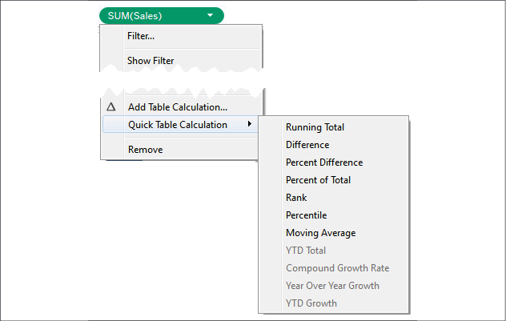

Figure 6.4: Using the dropdown, you can create a quick table calculation
from an aggregate field in the view

Consider the following example using the sample
`Superstore Sales` data:

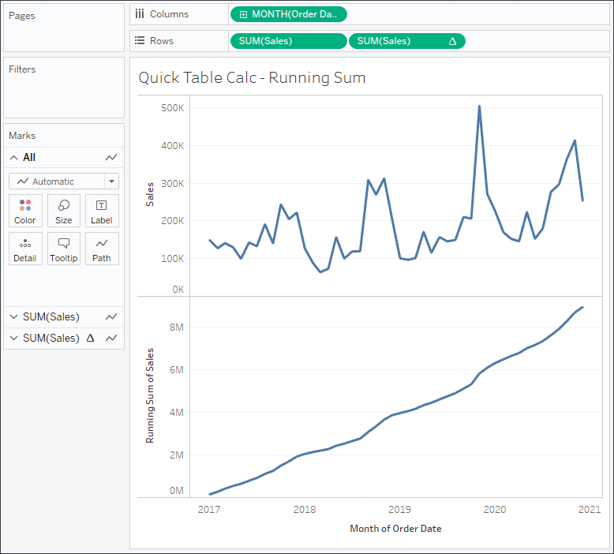

Figure 6.5: The first SUM(Sales) field is a normal aggregate. The second
has a quick table calculation of Running Total applied

Here, **Sales** over time is shown. **Sales** has been placed on the
**Rows** shelf twice and the second **SUM(Sales)** field has had the
**running total** quick table calculation applied. Using the quick table
calculation meant it was unnecessary to write any code.

You can actually see the code that the quick table calculations uses by
double-clicking the table calculation field in the view. This turns it
into an ad hoc calculation. You can also drag an active field with a
quick table calculation applied to the data pane, which will turn it
into a calculated field that can be reused in other views.

The following table demonstrates some of the quick table calculations:

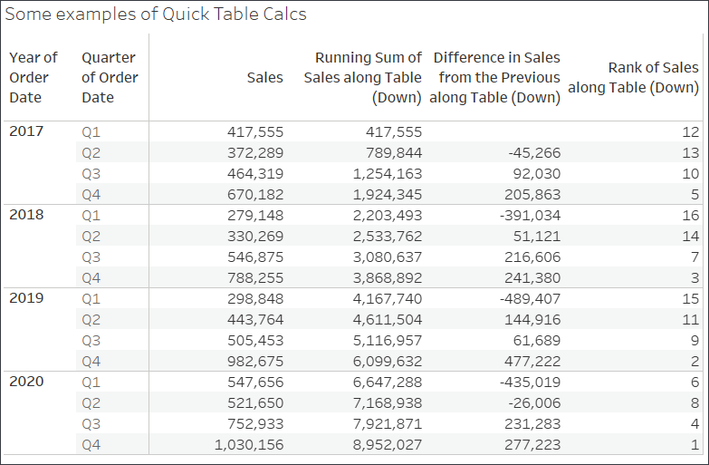

Figure 6.6: Sales in the first column is simply the SUM(Sales). The
three additional columns show various table calculations applied
(Running Sum, Difference, Rank)

Although it is quite easy to create quick table
calculations, it is essential to understand some fundamental concepts.
We\'ll take a look at these next, starting with the difference between
relative and fixed table calculations.


### Relative versus fixed


We\'ll look at the details shortly, but first it
is important to understand that table calculations may be computed in
one of the two following ways:

-   **Relative**: The table calculation will be
    computed relative to the layout of the table. They might move across
    or down the table. Rearranging dimensions in a
    way that changes the table will change the table calculation
    results. As we\'ll see, the key for relative table calculations is
    **scope** and **direction**. When you set a table calculation to use
    a relative computation, it will continue to use the same relative
    scope and direction, even if you rearrange the view. (The term here
    is different from **Relative To** that appears in the UI for some
    quick table calculations.)
-   **Fixed**: The table calculation will be
    computed using one or more dimensions. Rearranging those dimensions
    in the view will not change the computation of the table
    calculation. Here, the scope and direction remain fixed to one or
    more dimensions, no matter where they are moved within the view.
    When we talk about fixed table calculations, we\'ll focus on the
    concepts of **partitioning** and **addressing**.

You can see these concepts in the user interface. The following is the
**Table Calculation** editor that appears when you select **Edit Table
Calculation** from the menu of a table calculation field:

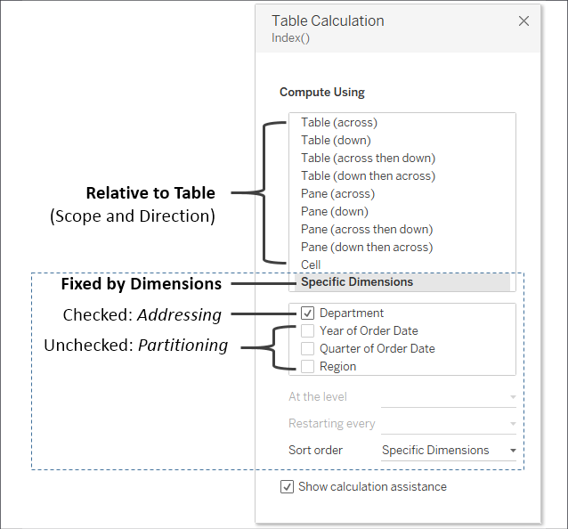

Figure 6.7: The Edit Table Calculation UI demonstrates the difference
between Relative and Fixed table calculations

We\'ll explore the options and terms in more
detail, but for now, notice the options that relate to specifying a
table calculation that is computed relative to rows and columns, and
options that specify a table calculation that is computed fixed to
certain dimensions in the view.

Next, we\'ll look at **scope** and **direction**, which describe how
relative table calculations operate.

Scope and direction 
-------------------

**Scope** and **direction** are terms that describe how a table
calculation is computed relative to the table. Specifically, scope and
direction refer to the following:

-   **Scope**: The scope defines the boundaries
    within which a given table calculation can reference other values.
-   **Direction**: The direction defines how the
    table calculation moves within the scope.

You\'ve already seen table calculations being calculated **Table
(across)** (the running sum of sales over time in *Figure 6.5*) and
**Table (down)** (in *Figure 6.6*). In these cases, the scope was the
entire table and the direction was either across or down. For example,
the running total calculation ran across the entire table, adding
subsequent values as it moved from left to right.

To define scope and direction for a table calculation, use the drop-down
menu for the field in the view and select **Compute Using**. You will
get a list of options that vary slightly depending on the location of
dimensions in the view. The first of the options listed allows you to
define the scope and direction relative to the table. After the option
for cell, you will see a list of dimensions present in the view. We\'ll
look at those in the next section.

The options for scope and direction relative to
the table are as follows:

-   **Scope options**: Table, pane, and cells
-   **Direction options**: Down, across, down then 
    across, across then down

In order to understand these options, consider the following example:

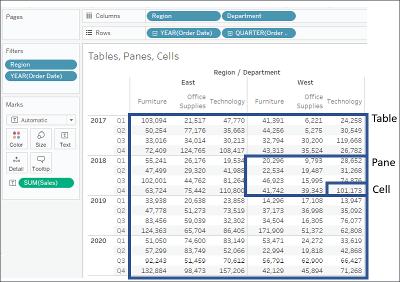

Figure 6.8: The difference between table, pane, and cell in the view

When it comes to the scope of table calculations,
Tableau makes the following distinctions:

-   The **table** is the entire set of aggregate data.
-   The **pane** is a smaller section of the
    entire table. Technically, it is defined by the
    penultimate level of the table; that is, the
    next-to-last dimension on the **Rows** and/or **Columns** shelf
    defines the pane. In the preceding image, you can see that the
    intersection of **Year** on rows and **Region** on columns defines
    the panes (one of eight is highlighted in the view).
-   The **cell** is defined by the lowest level of the table. In this
    view, the intersection of one **Department** within a **Region** and
    one **Quarter** within a **Year** is a single cell (one of 96 is
    highlighted in the view).

The bounded areas in the preceding screenshot are
defined by the scope. Scope (and as we\'ll see, also
partition) defines windows within the data that
contain various table calculations. Window functions, such as
`WINDOW_SUM()` in particular, work within the
scope of these windows.

### Working with scope and direction 

In order to see how scope and direction work
together, let\'s work through a few examples. We\'ll start by creating
our own custom table calculations. Create a new 
calculated field named `Index` with the code
`Index()`.

`Index()` is a table calculation function that
starts with a value of `1` and increments by one
as it moves in a given direction and within a given scope. There are
many practical uses for `Index()`, but we\'ll use
it here because it is easy to see how it is moving for a given scope and
direction.

Create the table as shown in *Figure 6.8*, with **YEAR(Order Date)** and
**QUARTER(Order Date)** on **Rows** and **Region** and **Department** on
**Columns**. Instead of placing **Sales** in the view, add the newly
created **Index** field to the **Text** shelf. Then experiment, using
the drop-down menu on the **Index** field and select **Compute Using**
to cycle through various scope and direction combinations. In the
following examples, we\'ve only kept the **East** and **West** regions
and two years, **2015** and **2016**:

-   **Table (across)**: This is Tableau\'s default when there are
    columns in the table. Notice in the following how **Index**
    increments across the entire table:

    

    Figure 6.9: Table (across)


-   **Table (down)**: When using `table (down)`,
    **Index** increments down the entire table:

    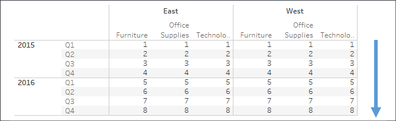

    Figure 6.10: Table (down)


-   **Table (across then down)**: This increments **Index** across the
    table, then steps down, continues to increment across, and repeats
    for the entire table:

    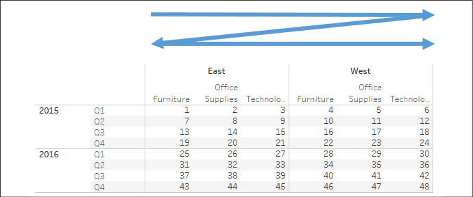

    Figure 6.11: Table (across then down)


-   **Pane (across)**: This defines a boundary for **Index** and causes
    it to increment across until it reaches the pane boundary, at which
    point the indexing restarts:

    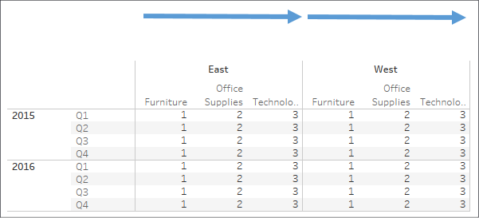

    Figure 6.12: Pane (across)


-   **Pane (down)**: This defines a boundary for **Index** and causes it
    to increment down until it reaches the pane
    boundary, at which point the indexing restarts:

    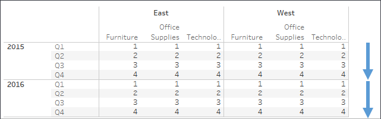

    Figure 6.13: Pane (down)


-   **Pane (across then down)**: This allows **Index** to increment
    across the pane and continue by stepping down. The pane defines the
    boundary here:

    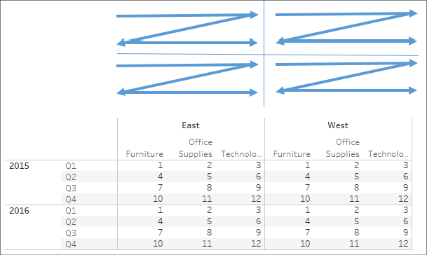

    Figure 6.14: Pane (across then down)

You may use scope and direction with any table calculation. Consider how
a running total or percentage difference would be calculated using the
same movement and boundaries shown here. Keep experimenting with
different options until you feel comfortable with how scope and
direction work.

Scope and direction operate relative to the table,
so you can rearrange fields, and the calculation will continue to work
in the same scope and direction. For example, you could swap **Year of
Order Date** with **Department** and still see **Index** calculated
according to the scope and direction you defined.

Next, we\'ll take a look at the corresponding concept for table
calculations that are fixed to certain dimensions.

Addressing and partitioning 
---------------------------

**Addressing** and **partitioning** are very 
similar to scope and direction but are most often used to describe how
table calculations are computed with absolute reference to
certain fields in the view. With addressing and
partitioning, you define which dimensions in the view define the
addressing (direction) and all others define the partitioning (scope).

Using addressing and partitioning gives you much finer control because
your table calculations are no longer relative to
the table layout, and you have many more options for fine-tuning the
scope, direction, and order of the calculations.

To begin to understand how this works, let\'s
consider a simple example. Using the preceding view, select **Edit table
calculation** from the drop-down menu of the **Index** field on
**Text**. In the resulting dialog box, check **Department** under
**Specific Dimensions**.

The result of selecting **Department** is as follows:

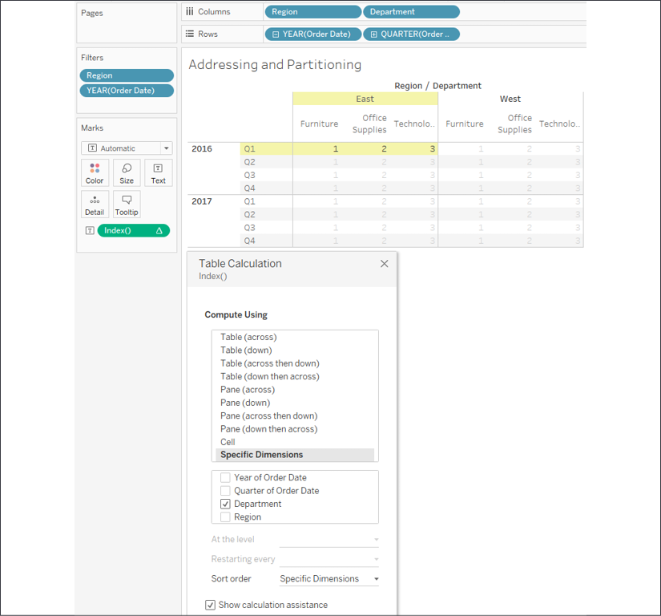

Figure 6.15: Setting the table calculation to Compute Using Specific
Dimensions uses addressing and partitioning

You\'ll notice that Tableau is computing **Index** along (in the
direction of) the checked dimension, **Department**. In other words, you
have used **Department** for addressing, so each new department
increments the index. All other unchecked dimensions in the view are
implicitly used for partitioning; that is, they define the scope or
boundaries at which the index function must restart. As we saw with
scope, these boundaries are sometimes referred to as a window.

The preceding view looks identical to what you would see if you set
**Index** to compute using **Pane (across)**. However, there is a major
difference. When you use **Pane (across)**, **Index** is always computed
across the pane, even if you rearrange the
dimensions in the view, remove some, or add others.

But when you compute using a dimension for addressing, the table
calculation will always compute using that dimension. Removing that
dimension will break the table calculation (the field will turn red with
an exclamation mark) and you\'ll need to edit the table calculation via
the drop-down menu to adjust the settings. If you
rearrange dimensions in the view, **Index** will continue to be computed
along the **Department** dimension.

Here, for example, is the result of clicking the **Swap Rows and
Columns** button in the toolbar:

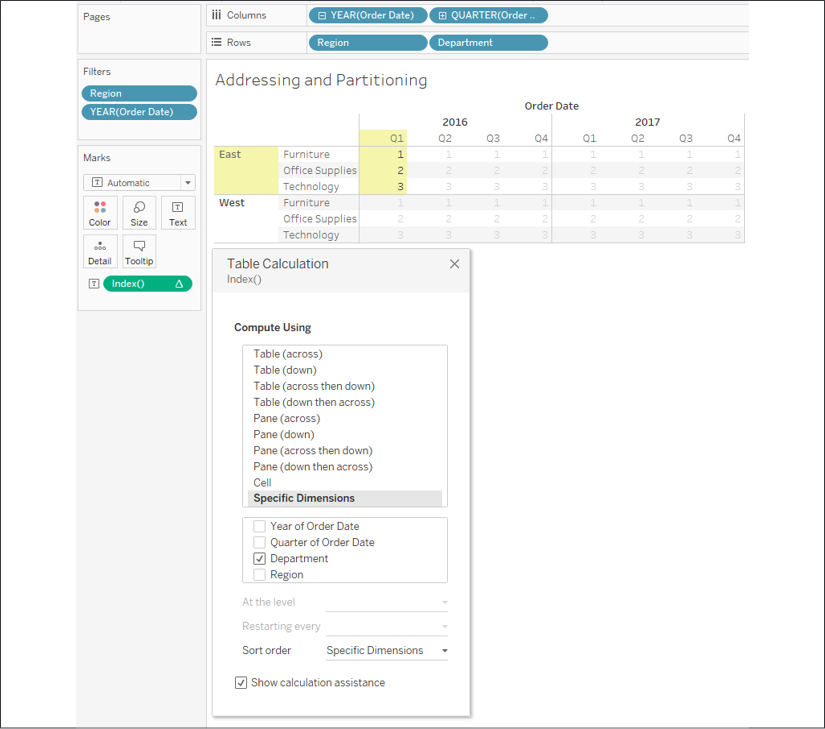

Figure 6.16: Swapping Rows and Columns does not change how this table
calculation was computed as it is fixed to the dimensions rather than
the table layout

Notice that **Index** continues to be computed along **Department** even
though the entire orientation of the table has 
changed. To complete the following examples,
we\'ll undo the swap of rows and columns to return our table to its
original orientation.

### Working with addressing and partitioning 

Let\'s consider a few other examples of what
happens when you add additional dimensions. For example, if you check
**Quarter of Order Date**, you\'ll see Tableau highlight
a partition defined by **Region** and **Year of
Order Date**, with **Index** incrementing by the addressing fields of
**Quarter of Order Date** and then **Department**:

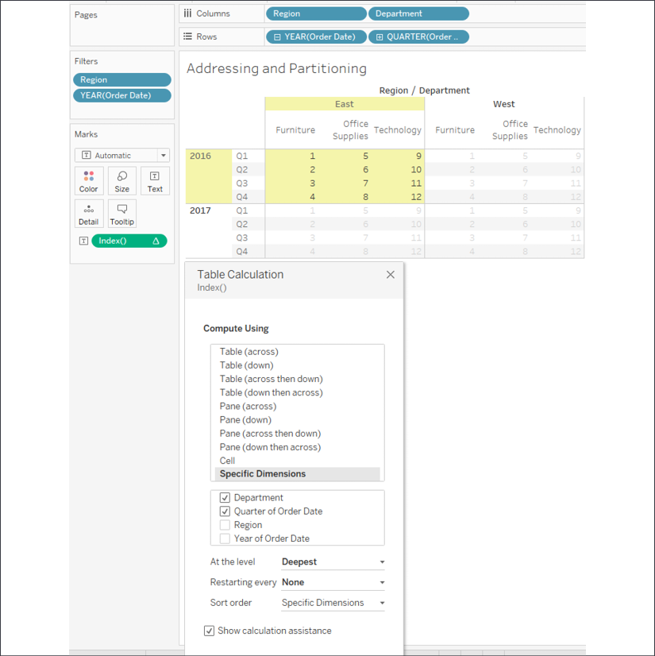

Figure 6.17: Adding dimensions alters the table calculation\'s behavior.
One of the resulting partitions is highlighted

If you were to select **Department** and **Year of
Order Date** as the addressing of **Index**, you\'d see a
single partition defined by **Region** and
**Quarter**, like this:

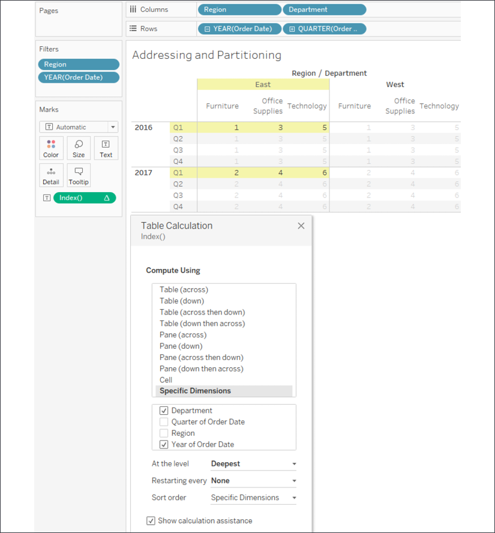

Figure 6.18: Changing the checked dimensions alters the table
calculation\'s behavior. One of the resulting partitions is highlighted

You\'ll notice, in this view, that **Index** increments for every
combination of **Year** and **Department** within the partition of
**Quarter** and **Region**.

These are a few of the other things to consider
when working with addressing and partitioning:

-   You can specify the sort order. For example,
    if you wanted **Index** to increment according to the value of the
    sum of sales, you could use the drop-down list at the bottom of the
    table calculation editor to define a custom sort.
-   The **At the Level** option in the edit table calculation dialog box
    allows you to specify a level at which the table calculations are
    performed. Most of the time, you\'ll leave this set at **Deepest**
    (which is the same as setting it to the bottom-most dimension), but
    occasionally, you might want to set it at a different level if you
    need to keep certain dimensions from defining the partition but need
    the table calculation to be applied at a higher level. You can also
    reorder the dimensions by dragging and dropping within the checkbox
    list of **Specific Dimensions**.
-   The **Restarting Every\...** option effectively makes the selected
    field, and all dimensions in the addressing above that selected
    field, part of the partition, but allows you to maintain the
    fine-tuning of the ordering.
-   Dimensions are the only kinds of fields that can be used in
    addressing; however, a discrete (blue) measure can be used to
    partition table calculations. To enable this, use the drop-down menu
    on the field and uncheck **Ignore in Table Calculations**.

Take some time to experiment with various options and become comfortable
with how addressing and partitioning works. Next, we\'ll look at how to
write our own custom table calculations.


#### Custom table calculations


Before we move on to some practical examples,
let\'s briefly discuss how to write your own table calculations, instead
of using quick table calculations. You can see a list of available table
calculation functions by creating a new calculation and selecting
**Table Calculation** from the drop-down list under **Functions**.

For each of the examples, we\'ll set **Compute Using** \| **Category**.
This means **Department** will be the partition.

You can think of table calculations broken down
into several categories. The following table calculations can be
combined and even nested just like other functions.

Meta table functions 
--------------------

These are the functions that give you information
about the partitioning and addressing. These
functions also include **Index**, **First**, **Last**, and **Size**:

-   **Index** gives an increment as it moves along
    the addressing within the partition.
-   **First** gives the offset from the first row in
    the partition, so the first row in each
    partition is **0**, the next row is **-1**, then **-2**, and so on.
-   **Last** gives the offset to the last row in
    the partition, so the last row in each partition is **0**, the
    next-to-last row is **1**, then **2** and so on.
-   **Size** gives the size of the partition.

The following image illustrates the various functions:

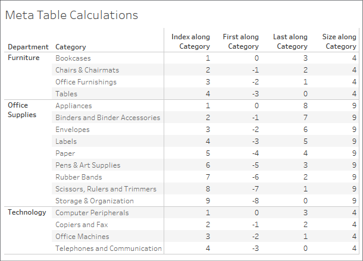

Figure 6.19: Meta table calculations

**Index**, **First**, and **Last** are all affected by
scope/partition and
direction/addressing, while **Size** will give the same result at each
address of the partition, no matter what direction is specified.

Lookup and previous value 
-------------------------

The first of these two functions gives you the
ability to reference values in other rows, while the second gives you
the ability to carry forward values. Notice from
the following screenshot that direction is very important for these two
functions:

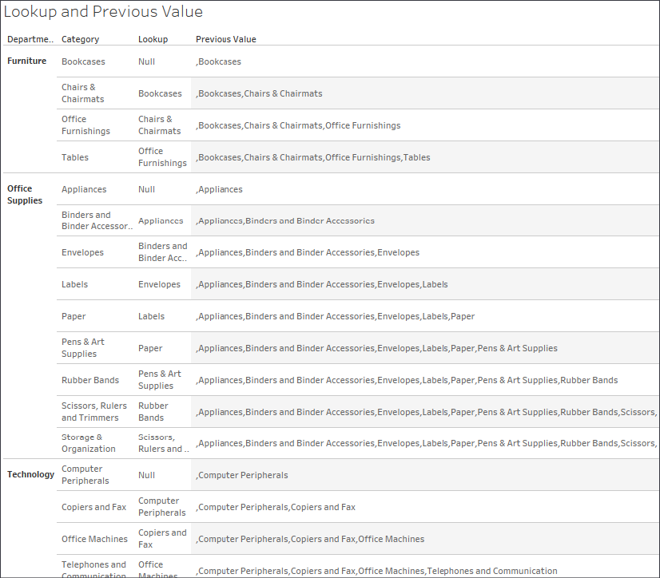

Figure 6.20: Lookup and Previous\_Value functions (though
Previous\_Value includes some additional logic described below)

Both calculations are computed using
an addressing of **Category** (so **Department**
is the partition).

Here, we\'ve used the code
`Lookup(ATTR([Category]), -1)`, which looks up
the value of the category in the row offset by
`-1` from the current one. The first row in each
partition gets a `NULL`
result from the lookup (because there isn\'t a row
before it).

For `Previous_Value`, we used this code:

```
Previous_Value("") + "," + ATTR([Category]) 
```

Notice that in the first row of each partition, there is no previous
value, so `Previous_Value()`
simply returned what we specified as the default:
an empty string. This was then concatenated together with a comma and
the category in that row, giving us the value **Bookcases**.

In the second row, **Bookcases** is the previous value, which gets
concatenated with a comma and the category in that row, giving us the
value **Bookcases, Chairs & Chairmats**, which becomes the previous
value in the next row. The pattern continues throughout the partition
and then restarts in the partition defined by the department **Office
Supplies**.

Running functions 
-----------------

These functions run along direction/addressing
and include
`Running_Avg()`,
`Running_Count()`,
`Running_Sum()`,
`Running_Min()`, and
`Running_Max()`, as follows:


Figure 6.21: Running Functions

Notice that `Running_Sum(SUM[Sales]))` continues
to add the sum of sales to a running total for every row in the
partition. `Running_Min(SUM[Sales]))` keeps the
value of the sum of sales if it is the smallest
value it has encountered so far as it moves along
the rows of the partition.

Window functions 
----------------

These functions operate across all rows in the
partition at once and essentially aggregate the
aggregates. They include `Window_Sum`,
`Window_Avg`,
`Window_Max`,
and `Window_Min`, among others, as shown in the
following screenshot:


Figure 6.22: Examples of Window functions

`Window_Sum(SUM([Sales])` adds up the sums of
sales within the entire window (in this case, for all categories
within the department).
`Window_Max(SUM([Sales])` returns the
maximum sum of sales within the window.

**Tip:**

You may pass optional parameters to window functions to further limit
the scope of the window. The window will always be limited to, at most,
the partition.


Rank functions 
--------------

These functions provide various ways to rank based
on aggregate values. There are multiple variations
of rank, which allow you to decide how to deal with ties and how dense
the ranking should be, as shown in the following screenshot:

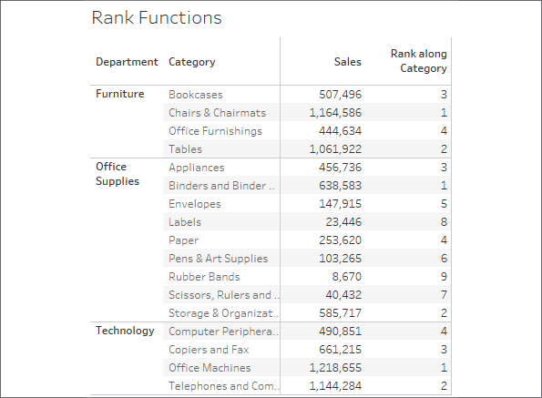

Figure 6.23: Examples of rank functions

The `Rank(SUM([Sales])` calculation returns
the rank of the sum of sales
for categories within the department.

Script functions 
----------------

These functions allow integration with the R
analytics platform or Python, either of which can
incorporate simple or complex scripts for everything from advanced
statistics to predictive modeling. 


**Note:**

Bora Beran, for example, has an excellent post
here:
[[https://www.tableau.com/about/blog/2016/11/leverage-power-python-tableau-tabpy-62077]{.url}](https://www.tableau.com/about/blog/2016/11/leverage-power-python-tableau-tabpy-62077)


The Total function 
------------------

The `Total` function
deserves its own category because it functions a
little differently from the others. Unlike the other functions that work
on the aggregate table in the cache,
`Total` will re-query the underlying source for
all the source data rows that make up a given partition. In most cases,
this will yield the same result as a window function.

For example, `Total(SUM([Sales]))` gives the same
result as `Window_Sum(SUM([Sales]))`, but
`Total(AVG([Sales]))` will possibly give a
different result from `Window_AVG(SUM([Sales]))`
because `Total` is giving you the actual average
of underlying rows, while the `Window` function
is averaging the sums.

In this section, we have looked at a number of table calculation
functions. These will give you the building blocks to solve all kinds of
practical problems and answer a great many questions. From ranking to
year-over-year comparisons, you now have a foundation for success.
Let\'s now move on to some practical examples.

#### Practical examples


Having looked at some of the essential concepts of
table calculations, let\'s consider some practical examples. We\'ll look
at several examples, although the practical use of table calculations is
nearly endless. You can do everything from running sums and analyzing
year-over-year growth to viewing percentage differences between
categories, and much more.

Year over year growth 
---------------------

Often, you may want to compare year over year
values. How much has our customer base grown over the last year? How did
sales in each quarter compare to sales in the same quarter last year?
These types of question can be answered using **Year over Year Growth**.

Tableau exposes **Year over Year Growth** as one option in the quick
table calculations. Here, for example, is a view that demonstrates
**Sales** by **Quarter**, along with the percentage difference in sales
for a quarter compared with the previous year:


Figure 6.24: Year over year growth of Sales

The second **Sum(Sales)** field has had the **Year over Year Growth**
quick table calculation applied (and the **Mark** type changed to bar).
You\'ll notice the **\>4 nulls** indicator in the lower right, alerting
you to the fact that there are at least four null values (which makes
sense as there is no 2016 with which to compare
quarters in 2017).

If you filtered out 2017, the nulls would appear in 2018 as table
calculations can only operate on values present in the aggregated data
in the cache. Any regular filters applied to the data are applied at the
source and the excluded data never makes it to the cache.

As easy as it is to build a view like this example, take care, because
Tableau assumes each year in the view has the same number of quarters.
For example, if the data for **Q1** in 2017 was not present or filtered
out, then the resulting view would not necessarily represent what you
want. Consider the following, for example:

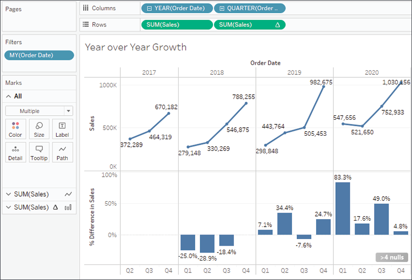

Figure 6.25: Year over year growth of Sales---but it doesn\'t work with
Q1 missing in the first year

The problem here is that Tableau is calculating
the quick table calculation using an addressing of **Year** and
**Quarter** and an *At the Level* of value of **Year of Order Date**.
This works assuming all quarters are present. However, here, the first
quarter in **2018** is matched with the first quarter present in
**2017**, which is really **Q2**. To solve this, you would need to edit
the table calculation to only use **Year** for addressing. **Quarter**
then becomes the partition and thus comparisons are done for the correct
quarter.

An additional issue arises for consideration: what if you don\'t want to
show 2017 in the view? Filtering it out will cause issues for 2018. In
this case, we\'ll look at **table calculation filtering**, or **late
filtering**, later in this section. Another potential way to remove 2017
but keep access to its data values is to right-click the 2017 header in
the view and select **Hide**.

Hide is a special command that simply keeps Tableau from rendering data,
even when it is present in the cache. If you later decide you want to
show 2017 after hiding it, you can use the menu for the **YEAR(Order
Date)** field and select **Show Hidden Data**. Alternately, you can use
the menu to select **Analysis** \| **Reveal Hidden Data**.

You may also wish to hide the null indicator in
the view. You can do this by right-clicking the indicator and selecting
**Hide Indicator**. Clicking the indicator will reveal options to filter
the data or display it as a default value (typically, 0).

Year over year growth (or any period over another) is a common
analytical question which table calculations allow you to answer. Next,
let\'s consider another example of table calculations in practice.

Dynamic titles with totals 
--------------------------

You\'ve likely noticed the titles that are
displayed for every view. There are also captions that are not shown
unless you specifically turn them on (to do this, select **Worksheet**
\| **Show Caption** from the menu).

By default, the title displays the sheet name and captions are hidden,
but you can show and modify them. At times, you might want to display
totals that help your end users understand the broad context or
immediately grasp the magnitude.

Here, for example, is a view that allows the user to select one or more
**Regions** and then see **Sales per State** in each **Region**:

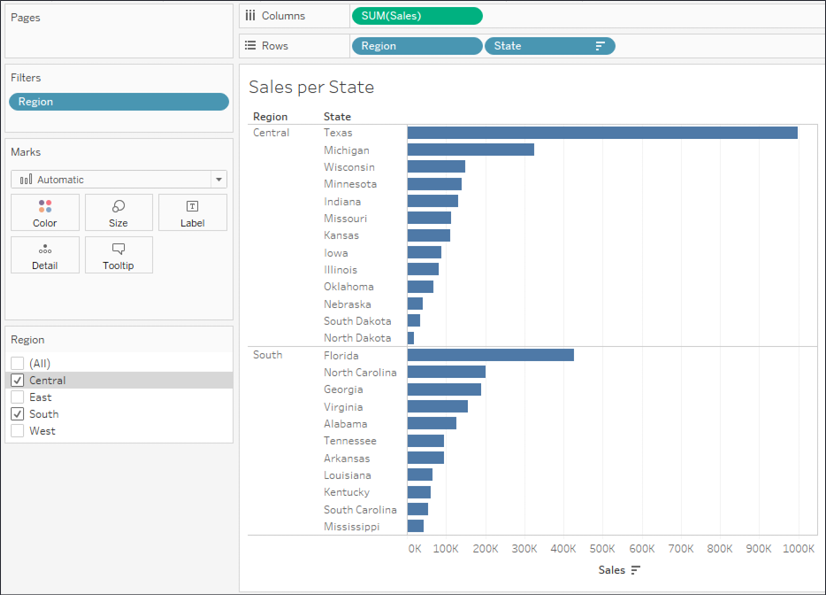

Figure 6.26: Sales per State for two regions

It might be useful to show a changing number of states as the user
selects different regions. You might first think to use an aggregation
on **State**, such as `Count Distinct`. However,
if you try showing that in the title, you will always see the value
`1`. Why? Because the view level of detail is
**State** and the distinct count of states per state is
`1`!

But there are some options with table calculations
that let you further aggregate aggregates. Or, you might think of
determining the number of values in the table based on the size of the
window. In fact, here are several possibilities:

-   To get the total distinct count:
    `TOTAL(COUNTD([State]))`
-   To get the sum within the window:
    `WINDOW_SUM(SUM(1))`
-   To get the size of the window: `SIZE()`

You may recall that a window is defined as the boundaries determined by
scope or partition. Whichever we choose, we want to define the window as
the entire table. Either a relative computation of
`Table (down)` or a fixed computation using all
of the dimensions would accomplish this. Here is a view that illustrates
a dynamic title and all three options in the caption:

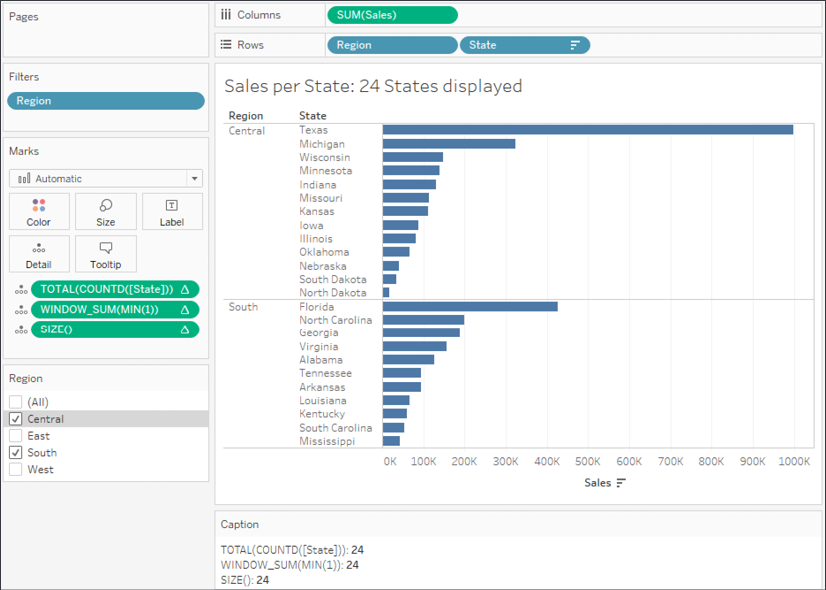

Figure 6.27: Various table calculations could be employed to achieve the
total in the title

This example illustrated how you might use various
table calculations to work at higher levels of detail, specifically
counting all the states in the view. This technique will enable you to
solve various analytical questions as you use Tableau. Let\'s now turn
our attention to another technique that helps solve quite a few
problems.

Table calculation filtering (late filtering) 
--------------------------------------------

Let\'s say you\'ve built a view that allows you to see the percentage of
total sales for each department. You have already
used a quick table calculation on the **Sales** field to give you the
percent of the total. You\'ve also used **Department** as a filter. But
this presents a problem.

Since table calculations are performed after the aggregate data is
returned to the cache, the filter on department has already been
evaluated at the data source and the aggregate rows don\'t include any
departments excluded by the filter. Thus, the percent of the total will
always add up to 100%; that is, it is the percentage of the filtered
total, as shown in the following screenshot:

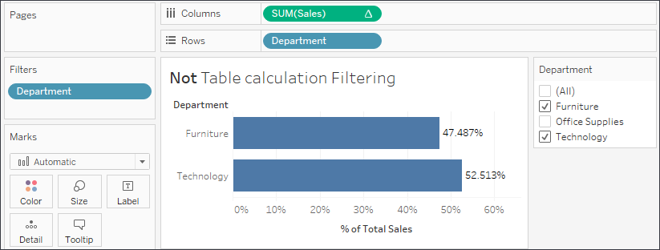

Figure 6.28: When Office Supplies is filtered out, the percentage table
calculation adds up to 100% for the departments remaining in the view

What if you wanted to see the percentage of the total sales for all
departments, even if you want to exclude some from the display? One
option is to use a table calculation as a filter.

You might create a calculated field called
`Department (table calc filter)` with the code
`LOOKUP(ATTR([Department]), 0)`. The
`Lookup()` function makes this a table
calculation, while `ATTR()` treats **Department**
as an aggregation (further explanation is provided at the end of this
section). The second argument, `0`, tells the
lookup function not to look backward or forward. Thus, the calculation
returns all values for **Department**, but as a table calculation
result.

When you place that table calculation on the **Filters** shelf instead
of the **Department** dimension, then the filter is not applied at the
source. Instead, all the aggregate data is still stored in the cache and
the table calculation filter merely *hides* it from the view. Other
table calculations, such as **Percent of Total**, will still operate on
all the data in the cache. In this case, that
allows the percent of total to be calculated for
all departments, even though the table calculation filter is hiding one
or more, as shown in the following screenshot:

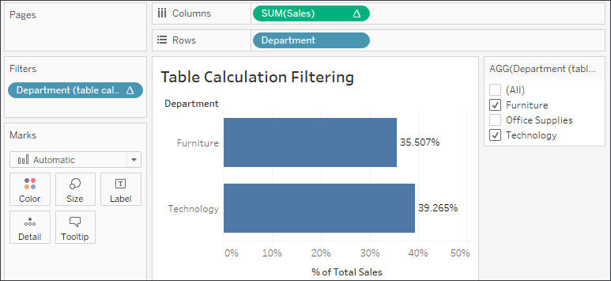

Figure 6.29: When a table calculation filter is used, all the aggregate
data is available in the cache for the % of Total Sales to be calculated
for all departments

You might have noticed the `ATTR` function used.
Remember that table calculations require aggregate arguments.
`ATTR` (which is short for attribute) is a
special aggregation that returns the value of a field if there is only a
single value of that field present for a given level of detail or a
`*` if there is more than one value.

To understand this, experiment with a view having both **Department**
and **Category** on rows. Using the drop-down menu on the active field
in the view, change **Category** to **Attribute**. It will display as
`*` because there is more than one category for
each department. Then, undo and change **Department** to **Attribute**.
It will display the department name because there is only one department
per category.

In this example, we\'ve seen how to effectively use table calculations
as filters when we need other table calculations to
operate on all the data in the cache.


### Summary

We\'ve covered a lot of concepts surrounding table calculations in this
lab. You now have a foundation for using the simplicity of quick
table calculations and leveraging the power of advanced table
calculations. We\'ve looked at the concepts of scope and direction as
they apply to table calculations that operate relative to the row and
column layout of the view. We\'ve also considered the related concepts
of addressing and partitioning as they relate to table calculations that
have computations fixed to certain dimensions.

The practical examples we\'ve covered barely scratch the surface of what
is possible, but should give you an idea of what can be achieved. The
kinds of problems that can be solved and the diversity of questions that
can be answered are almost limitless.

We\'ll turn our attention to some lighter topics in the next couple of
labs, looking at formatting and design, but we\'ll certainly see
another table calculation or two before we\'re finished!
