Making Visualizations That Look Great and Work Well
===================================================


This lab will cover the following topics:

-   Leveraging formatting in Tableau
-   Adding value to visualizations

As you think about why you should adjust a given visualization, there
are several things to consider. We\'ll start with those considerations.


### Leveraging formatting in Tableau

Tableau employs default formatting that includes default fonts, colors,
shading, and alignment. Additionally, there are several levels of
formatting you can customize, as shown in the following diagram:

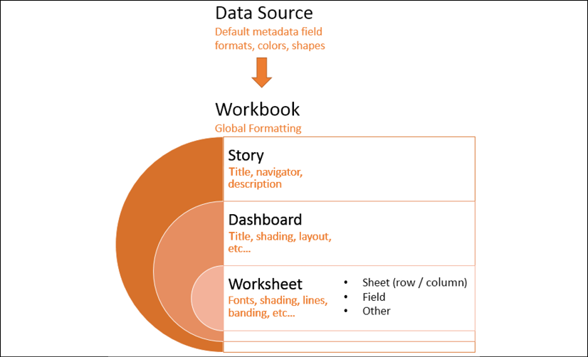

Figure 7.1: Levels of formatting in Tableau

Let\'s go into them in more detail:

-   **Data source level**: We\'ve already seen how
    you can set default formats for numeric and date fields.
    Other defaults, such as colors and shapes, can
    also be set using the **Default Properties** menu on the drop-down
    menu in the data pane.
-   **Workbook level**: Various global formatting
    options may be set. From the menu, select
    **Format** \| **Workbook**.
-   **Story level**: Navigate to a story tab and
    select **Format** \| **Story** (or **Story** \| **Format**) to edit
    formatting for story-specific elements. These include options for
    customizing shading, title, navigator, and description.
-   **Dashboard level**: Dashboard-specific
    elements can be formatted. When viewing a
    dashboard, select **Format** \| **Dashboard** (or **Dashboard** \|
    **Format**) to specify the formatting for dashboard titles,
    subtitles, shading, and text objects.
-   **Worksheet level**: We\'ll consider the various options. The
    following types of formatting are available
    for a worksheet:
    -   **Sheet formatting**: This formatting
        includes font, alignment, shading, borders, and lines. You may
        override the formatting for the entire sheet for row-and
        column-specific formatting.
    -   **Field-level formatting**: This
        formatting includes fonts, alignment,
        shading, and number and date formats. This formatting is
        specific to how a field is displayed in the current view. The
        options you set at the field level override defaults set at a
        worksheet level. Number and date formats will also override the
        default field formatting.
    -   **Additional formatting**: Additional formatting can be
        applied to titles, captions, tooltips,
        labels, annotations, reference lines, field labels, and more.
-   **Rich-text formatting**: Titles, captions, annotations, labels, and
    tooltips all contain text that can be formatted with
    varying fonts, colors, and alignment. This
    formatting is specific to the individual text element.

Let\'s start by examining workbook-level formatting.

Workbook-level formatting
-------------------------

Tableau allows you to set certain formatting
defaults at a workbook level. To view the options and make changes to
the defaults, click **Format** \| **Workbook\....** The left pane will
now show formatting options for the workbook:

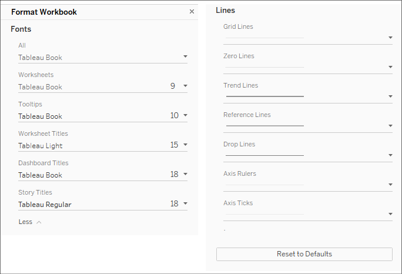

Figure 7.2: Workbook formatting options

The options include the ability to change default **Fonts**, which apply
to various parts of a view or dashboard, and default **Lines**, which
apply to the various types of lines used in visualizations. Notice also
the **Reset to Defaults** button, should you wish to revert to the
default formatting. Any changes here will impact the whole workbook.

At times, you\'ll want to apply formatting
specific to a given sheet, and we\'ll consider that next.

Worksheet-level formatting
--------------------------

You\'ve already seen how to edit  metadata in
previous labs, and we\'ll cover dashboards and stories in detail in
future labs. So, we\'ll shift our attention to worksheet-level
formatting.

Before we look at specifically how to adjust formatting, consider the
following parts of a view related to formatting:

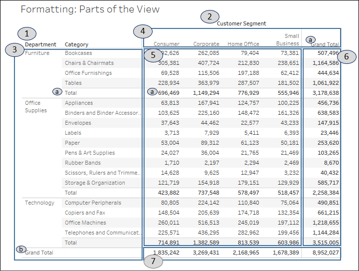

Figure 7.3: Parts of a view that can be formatted using worksheet-level
formatting

This view consists of the following parts, which can be formatted:

1.  **Field labels for rows**: Field labels can be
    formatted from the menu (**Format** \| **Field Labels\...**) or by
    right-clicking them in the view and selecting **Format\....**
    Additionally, you can hide field labels from the menu (**Analysis**
    \| **Table Layout** and then uncheck the option for showing field
    labels) or by right-clicking them in the view and selecting the
    option to hide. You can use the **Analysis** \| **Table Layout**
    option on the top menu to show them again, if needed.
2.  **Field labels for columns**: These have the same options as labels
    for rows, but they may be formatted or shown/hidden independently
    from the row-field labels.
3.  **Row headers**: These will follow the
    formatting of headers in general, unless you specify different
    formatting for headers for rows only. Notice that subtotals and
    grand totals have headers. The subtotal and grand total headers are
    marked **a** and **b** respectively.
4.  **Column headers**: These will follow the formatting of headers in
    general, unless you specify different formatting for headers for the
    columns only. Notice that subtotals and grand totals have headers.
    The grand total header marked in the preceding screenshot is a
    column header.
5.  **Pane**: Many formatting options include the ability to format the
    pane differently than the headers.
6.  **Grand totals (column) pane**: This is the pane for grand totals
    that can be formatted at a sheet or column level.
7.  **Grand totals (row) pane**: This is the pane for grand totals that
    can be formatted at a sheet or row level.

Worksheet-level formatting is accomplished using the format window,
which will appear on the left side, in place of the data pane.

To view the format window, select **Format** from the menu and then
**Font...**, **Alignment...**, **Shading...**, **Borders...**, or
**Lines...**:


Figure 7.4: Formatting options for a worksheet

**Tip:**

You can also right-click nearly any element in the view and select
**Format**. This will open the format window specific to the context of
the element you selected. Just be sure to verify that the title of the
format window matches what you expect. When you make a change, you
should see the view update immediately to reflect your formatting. If
you don\'t, you are likely working in the wrong tab of the formatting
window, or you may have formatted something at a lower level (for
example, **Rows**) that overrides changes made at a higher level (for
example, **Sheet**).


You should now see the format window on the left, in this case, **Format
Font**. It will look like this:

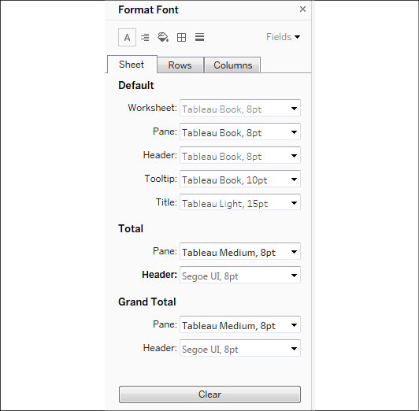

Figure 7.5: The Format Font pane

Notice these key aspects of the formatting window:

-   The title of the window will give you the context for your
    formatting selections.
-   The icons at the top match the selection options of the **Format**
    menu. This allows you to easily navigate through those options
    without returning to the menu each time.
-   The three tabs, **Sheet**, **Rows**, and **Columns**, allow you to
    specify options at a sheet level and then override those options and
    defaults at a row and column level. For example, you could make the
    **Row** grand totals have different pane and header fonts than the
    **Column** grand totals (though this specific choice would likely be
    jarring and is not recommended!).
-   The **Fields** dropdown in the upper-right corner allows you to
    fine-tune formatting at the field level.
-   Any changes that you make will be previewed
    and result in a bold label to indicate that the formatting option
    has been changed from the default (notice how the font for
    **Header** under **Total** has been customized, resulting in the
    label text of **Header** being shown in bold).

**Tip:**

The three options for clearing the format are as follows:

**Clear Single Option**: In the format window, right-click the label or
control of any single option you have changed and select **Clear** from
the pop-up menu.

**Clear All Current Options**: At the bottom of the format window, click
the **Clear** button to clear all visible changes. This applies only to
what you are currently seeing in the format window. For example, if you
are viewing **Shading** on the **Rows** tab and click **Clear**, only
the shading options on the **Rows** tab will be cleared.

**Clear Sheet**: From the menu, select **Worksheet** \| **Clear** \|
**Formatting**. You can also use the dropdown from the **Clear** item on
the toolbar. This clears all custom formatting on the current worksheet.


The other format options (such as alignment and shading) all work very
similarly to the font option. There are only a few subtleties to
mention:

-   **Alignment** includes options for horizontal and vertical
    alignment, text direction, and text wrapping.
-   **Shading** includes an option for row and column banding. The
    banding allows alternating patterns of shading that help to
    differentiate or group rows and columns. Light row banding is
    enabled by default for text tables, but it can be useful in other
    visualization types, such as horizontal bar charts as well. Row
    banding can be set to different levels that correspond to the number
    of discrete (blue) fields present on the **Rows** or **Columns**
    shelves.
-   **Borders** refers to the borders drawn around cells, panes, and
    headers. It includes an option for row and column dividers. You can
    see in the view the dividers between the departments. By default,
    the level of the borders is set based on the next-to-last field in
    the rows or columns.
-   **Lines** refers to lines that are drawn on visualizations using an
    axis. This includes grid lines, reference lines, zero lines, and
    axis rulers. You can access a more complete set of options for
    reference lines and drop lines from the **Format** option of the
    menu.

We\'ve considered how to adjust formatting at the
entire workbook level as well as for a given sheet. Let\'s turn our
attention to formatting at the field level.

Field-level formatting
----------------------

In the upper-right corner of the format window is
a little drop-down menu labeled **Fields**. Selecting this drop-down
menu gives you a list of fields in the current view, and selecting a
field updates the format window with options appropriate for the field.
Here, for example, is the window as it appears for the
`SUM(Sales)` field:

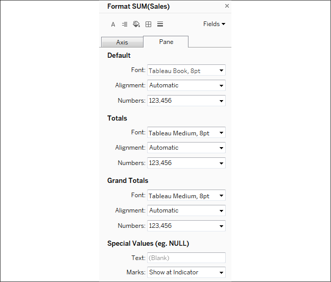

Figure 7.6: Format pane for field-level formatting

**Tip:**

The title of the format window will alert you to
the field you are formatting. Selecting an icon for **Font**,
**Alignment**, and so on from the top-left corner of the window will
switch back to sheet-level formatting. However, you can switch between
the tabs of **Axis** and **Pane**. These two tabs allow you to have
different formatting for a field when it is used in the header or as an
axis label versus how it is formatted in the pane of the view. The
options for fields include **Font**, **Alignment**, **Shading**, and
**Number** and **Date** formats. The last two options will override any
default metadata formats.


You\'ll notice special options for formatting certain types of fields.
Numbers allow a wide range of formatting options
and even include the ability to provide custom
formatting, which we\'ll consider next.

### Custom number formatting

When you alter the format of a number, you can
select from several standard formats, as well as a custom format. The
custom format allows you to enter a format string that Tableau will use
to format the number. Your format string may use combinations of
hash/pound (*\#*), commas, negative signs, and parentheses, along with a
literal string enclosed in quotation marks to indicate how the number
should display.

The format string allows up to three entries, separated by semi-colons
to represent positive, negative, and zero formats.

Here are some examples, assuming the positive number is
`34,331.336` and the negative number is
`-8,156.7777`:

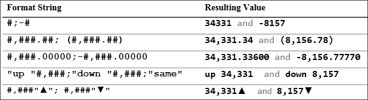

Figure 7.7: Examples of format strings and resulting values

You can replicate these examples and experiment with other format
strings using the **Custom Number Formatting** view in the
`Starter` or `Complete`
workbooks:

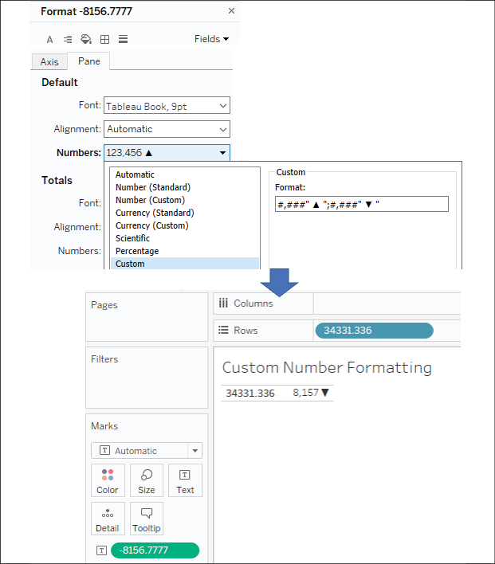

Figure 7.8: Experiment with format strings using the Custom Number
Formatting view in the Chapter 7 workbook

Notice how Tableau rounds the display of the number based on the format
string. Always be aware that numbers you see as text, labels, or headers
may have been rounded due to the format.

Also observe how you can mix format characters such as the pound sign,
commas, and decimal points with strings. The
fourth example shown would provide a label where a
value of zero would normally be displayed.

Finally, notice that the last example uses Unicode characters that give
you a wide range of possibilities, such as displaying degrees or other
units of measure. Unicode characters may be used throughout Tableau in
text boxes, titles, field names and labels, aliases, and more!

**Tip:**

Selecting a predefined format that is close to what you want, and then
switching to custom, will allow you to start with a custom format string
that is close to your desired format.


### Custom date formatting

In a similar way, you can define custom date
formatting using a custom string. The following table illustrates some
possible formatting of the date value of 11/08/2018, 1:30 PM based on
various format strings:

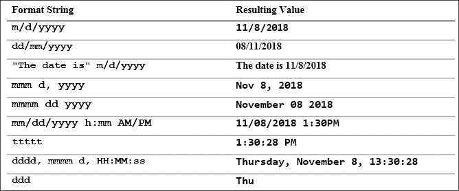

Figure 7.9: Some possible date formatting examples

These are merely examples, and you may include as many literal strings
as you\'d like.

**Note:**

For a complete list of custom date format string
options, check out
[[https://onlinehelp.tableau.com/current/pro/desktop/en-us/dates\_custom\_date\_formats.html]](https://onlinehelp.tableau.com/current/pro/desktop/en-us/dates_custom_date_formats.html).


Notice how applying some custom date formatting
improves the readability of the axis for a small timeline in this
example:

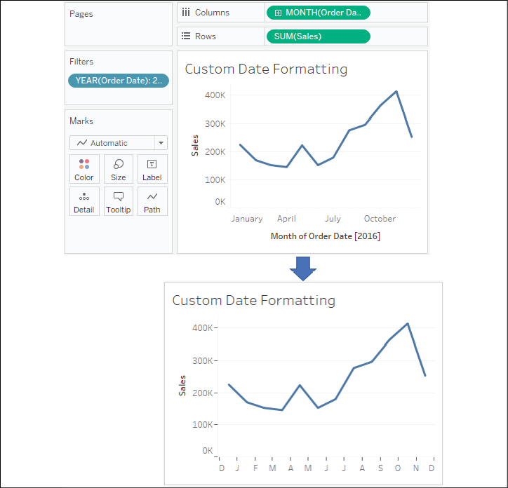

Figure 7.10: The custom format string used here is mmmmm, which results
in a single letter for the month

Custom number and date formats are fine when you have values that need
to be formatted. But what if there is no value? That is, how
can we format `NULL`
values? Let\'s consider that next.

### Null formatting

An additional aspect of formatting a field is
specially formatting **Null** values. When formatting a field, select
the **Pane** tab and locate the **Special Values** section, as shown in
the following screenshot:


Figure 7.11: The Special Values options appear on the Format pane

Enter any text you would like to display in the pane (in the **Text**
field) when the value of the field is null. You can also choose where
marks should be displayed. The **Marks** drop-down menu gives multiple
options that define where and how the marks for null values should be
drawn when an axis is being used. You have the following options:

-   **Show at Indicator** results in a small indicator with the number
    of null values in the lower right of the view. You can click the
    indicator for options to filter the null values or show them at the
    default value. You can right-click the indicator to hide it.
-   **Show at Default Value** displays a mark at the default location
    (usually 0).
-   **Hide (Connect Lines)** does not place a mark for null values but
    does connect lines between all non-null values.
-   **Hide (Break Lines)** causes the line to break where there are gaps
    created by not showing the null values.

You can see these options in the following screenshots, with the
location of two null values indicated by a gray band.

**Show at Indicator** reveals no marks in the gray band with the number
of null values indicated in the lower-right corner:

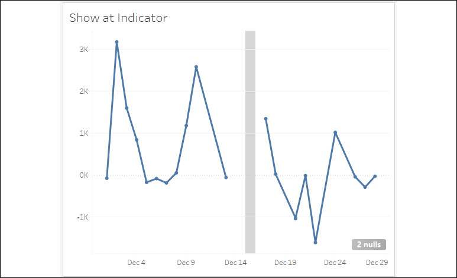

Figure 7.12: Show at Indicator

**Show at Default Value** places marks at `0` and connects the lines:

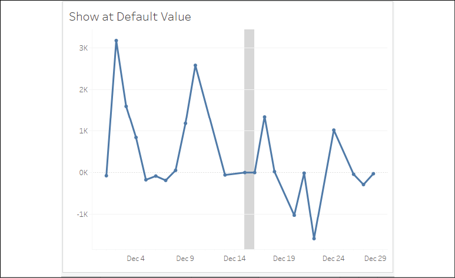

Figure 7.13: Show at Default Value

**Hide (Connect Lines)** removes marks for the missing values, but does
connect the existing marks:

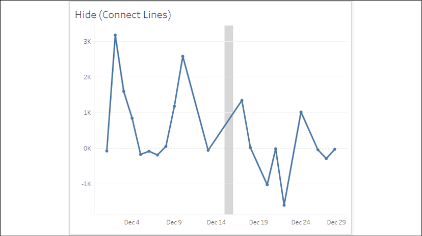

Figure 7.14: Hide (Connect Lines)

**Hide (Break Lines)** removes the marks for the
missing values and does not connect the existing marks:

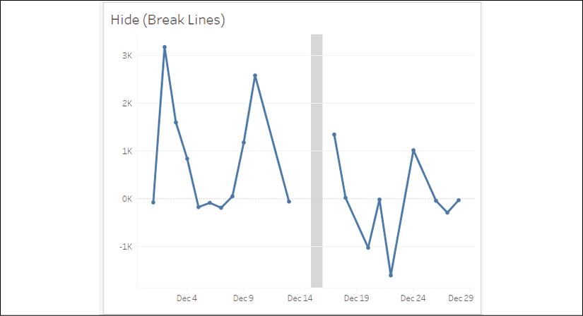

Figure 7.15: Hide (Break Lines)

Any of these options might have a good use but
consider how each communicates the information. Connecting the lines
might help communicate a movement over time but may also minimize the
existence of missing data. Breaking the lines might help highlight
missing values but might take away from the overall message. You\'ll
need to decide which option best meets your goals based on the
considerations mentioned at the beginning of this lab.

**Note:**

You\'ll notice that the preceding line charts have little circle markers
at the location of each mark drawn in the view. When the mark type is a
line, clicking on the color shelf opens a menu that gives options for
the markers. All mark types have standard options, such as color and
transparency. Some mark types support additional options such as border
and/or halo, as shown here:

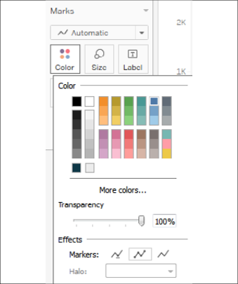

Figure 7.16: Adding Markers to lines


Knowing these options will help you as you think about how to
communicate missing data, but always consider that another visualization
type such as a bar chart might be even more effective in communicating
missing values:

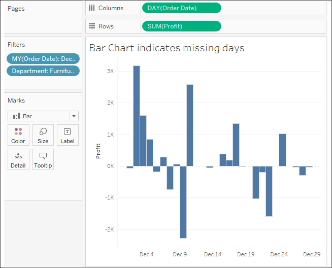

Figure 7.17: Bar charts are sometimes better than line charts for
showing missing values

Knowing how to format null values gives you some
options as you consider how to communicate the data. Let\'s take a look
at a few additional options.

Additional formatting options
-----------------------------

Additional formatting options can also be accessed
from the formatting window. These options include the following:

-   A myriad of options for **Reference Lines**
-   Line and text options for **Drop Lines**
-   Shading and border options for **Titles** and **Captions**
-   Text, box, and line options for **Annotations**
-   Font, shading, alignment, and separator options for **Field** labels
-   Title and body options for **Legends**, **Quick Filters**, and
    **Parameters**
-   **Cell** size and **Workbook** theme options

You\'ll find most of these relatively
straightforward. A few options might not be as
obvious:

-   **Drop Lines**, which appear as lines drawn
    from the mark to the axis, can be enabled by right-clicking any
    blank area in the pane of the view with an axis and selecting **Drop
    Lines** \| **Show Drop Lines**. Additional options can be accessed
    by using the same right-click menu and selecting **Edit Drop
    Lines**. Drop lines are only displayed in Tableau Desktop and Reader
    but are not currently available when a view is published to Tableau
    Server, Online, or Public.
-   **Titles** and **Captions** can be shown or hidden
    for any view by selecting **Worksheet** from
    the menu and then selecting the desired options. In addition to
    standard formatting, which can be applied to titles and captions,
    the text of a title or caption can be edited and specifically
    formatted by double-clicking the title or caption, right-clicking
    the title or caption and selecting **Edit**, or by using the
    drop-down menu of the title or caption (or the drop-down menu of the
    view on a dashboard). The text of titles and captions can
    dynamically include the values of parameters, the values of any
    field in the view, and certain other data and worksheet-specific
    values.
-   **Annotations** can be created by right-clicking a mark or space in
    the view, selecting **Annotate**, and then
    selecting one of the following three types of annotations:
    -   **Mark** annotations are associated with a specific mark in the
        view. If that mark does not show (due to a filter or axis
        range), then neither will the annotation. Mark annotations can
        include a display of the values of any fields that define the
        mark or its location.
    -   **Point** annotations are anchored to a specific point in the
        view. If the point is ever not visible in the view, the
        annotation will disappear. Point annotations can include a
        display of any field values that define the location of the
        point (for example, the coordinates of the axis).
    -   **Area** annotations are contained within a rectangular area.
        The text of all annotations can dynamically include the values
        of parameters, and certain other data and worksheet-specific
        values.

**Tip:**

You can copy formatting from one worksheet to another (within the same
workbook or across workbooks) by selecting **Copy Formatting** from the
**Format** menu while viewing the source worksheet (or selecting the
**Copy Formatting** option from the right-click menu on the source
worksheet tab). Then, select **Paste Formatting** on the **Format** menu
while viewing the target worksheet (or select the option from the
right-click menu on the **Target** worksheet tab).

This option will apply any custom formatting present on the source sheet
to the target. However, specific formatting applied during the editing
of the text of titles, captions, labels, and tooltips is not copied to
the target sheet.


We\'ve now considered a lot of options for
formatting the workbook, individual sheets, fields, numbers, dates, and
null values. Now, let\'s consider how we can leverage some of these
techniques to truly bring better understanding of the data.


#### Adding value to visualizations


Now that we\'ve considered how formatting works in
Tableau, let\'s look at some ways in which formatting can add value to a
visualization.

When you apply custom formatting, always ask yourself what the
formatting adds to the understanding of the data. Is it making the
visualization clearer and easier to understand? Or is it just adding
clutter and noise?

In general, try a minimalistic approach. Remove everything from the
visualization that isn\'t necessary. Emphasize important values, text,
and marks, while de-emphasizing those that are only providing support or
context.

Consider the following visualization, all using default formatting:

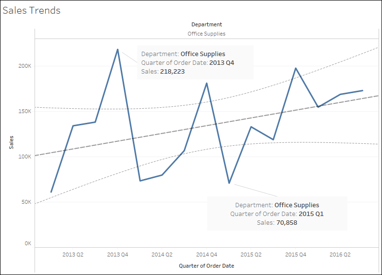

Figure 7.18: The default formatting is often great for data discovery
and quick analysis but may be more cluttered than desired for clearly
communicating and emphasizing the data story to others

The default format works fairly well, but compare that to this
visualization:

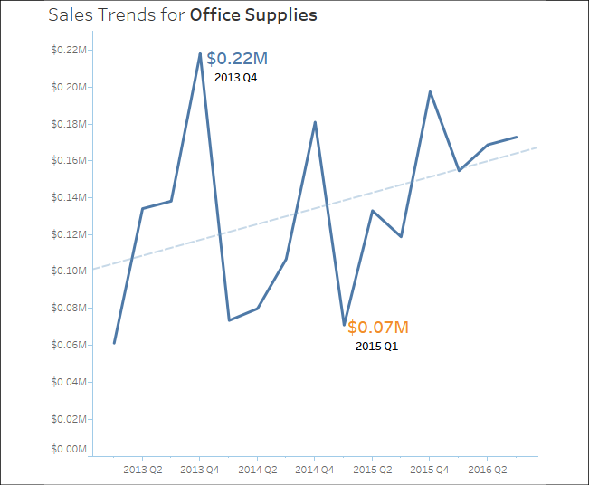

Figure 7.19: Formatting can make a visualization less cluttered and
communicate the data more effectively

Both of the preceding diagrams show sales by the quarter, filtered to
the **Office Supplies** department. The first view uses the default
formatting. The second view has some formatting adjustments, including
the following:

-   **Title** has been adjusted to include the department name.
-   **Sales** has been formatted to be shown using
    a custom currency with two decimal places and units of millions.
    This is true for the axis and the annotations. Often, a high level
    of precision can clutter a visualization. The initial view of the
    data gives us the trend and enough detail to understand the order of
    magnitude. Tooltips or additional views can be used to reveal detail
    and increase precision.
-   The axis labels have been removed by right-clicking the axis,
    selecting **Edit Axis**, and then clearing the text. The title of
    the view clearly indicates that you are looking at
    `Sales`. The values alone reveal the second
    axis to be by the quarter. If there are multiple dates in the data,
    you might need to specify which one is in use. Depending on your
    goals, you might consider hiding the axes completely.
-   The gridlines on **Rows** have been removed. Gridlines can add value
    to a view, especially in views where being able to determine values
    is of high importance. However, they can also clutter and distract.
    You\'ll need to decide, based on the view itself and the story you
    are trying to tell, whether gridlines are helpful.
-   The trend line has been formatted to match the
    color of the line, though it is lighter and thinner, to de-emphasize
    it. Additionally, the confidence bands have been removed. You\'ll
    have to decide whether they add context or clutter based on your
    needs and audience.
-   The lines, shading, and boxes have been removed from the annotations
    to reduce clutter.
-   The size and color of the annotations have been altered to make them
    stand out. If the goal had been to simply highlight the minimum and
    maximum values on the line, labels might have been a better choice,
    as they can be set to display at only **Min**/**Max**. In this case,
    however, the lower number is actually the second-lowest point in the
    view.
-   Axis rulers and ticks have been emphasized and colored to match the
    marks and reference line (axis rulers are available under the
    **Lines** option on the **Format** window).

Formatting can also be used to dramatically alter the appearance of a
visualization. Consider the following chart:

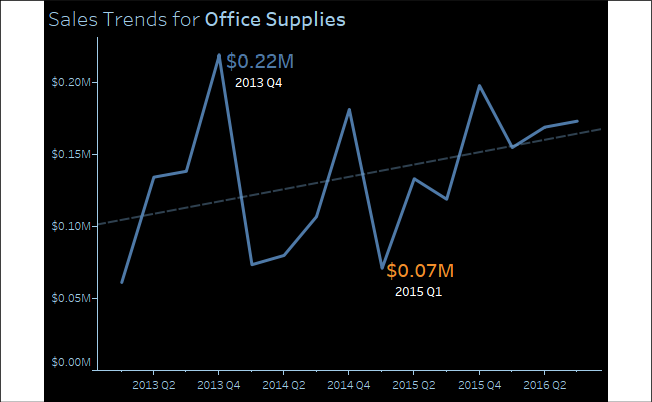

Figure 7.20: A dark background can be set by formatting the shading of a
view

This visualization is nearly identical to the
previous view. However, shading has been applied to the worksheet and
the title. Additionally, fonts were lightened or darkened as needed to
show up well on a dark background. Some find this format more pleasing,
especially on mobile devices. If the view is to be embedded into a
website with a dark theme, this formatting may be very desirable.
However, you may find some text more difficult to read on a dark
background. You\'ll want to consider your audience, the setting, and the
mode of delivery as you consider whether such a format is the best for
your situation.

**Tip:**

Sequential color palettes (a single color gradient based on a continuous
field) should be reversed when using a dark
background. This is because the default of lighter (lower) to darker
(higher) works well on a white background, where darker colors stand out
and lighter colors fade into white. On a black background, lighter
colors stand out more and darker colors fade into black. You\'ll find
the reverse option when you edit a color palette using the drop-down
menu on double-clicking the legend or right-clicking the legend
selecting **Edit Colors\...** and checking **Reversed**.


Tooltips
--------

As they are not always visible, tooltips are an
easily overlooked aspect of visualizations. However, they add a subtle
professionalism. Consider the following default tooltip
that displays when the end user hovers over one of
the marks shown in the preceding screenshot:


Figure 7.21: Default tooltip

Compare it to this tooltip:

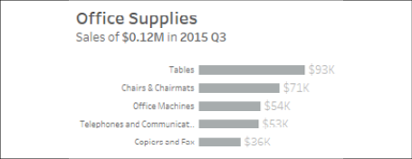

Figure 7.22: Customized tooltip

The tooltip was edited by clicking **Tooltip** on the **Marks** card,
which brought up an editor allowing the rich editing of text in the
tooltip:

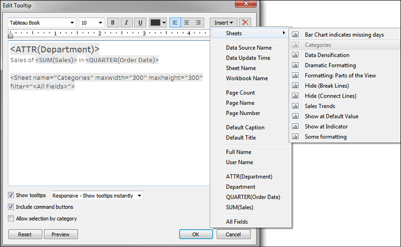

Figure 7.23: Tooltip editor

This editor is similar to those used for editing
the text of labels, titles, captions, and annotations. You can input
text and format it as desired. Additionally, the **Edit Tooltip** dialog
has some additional functionality:

-   The **Insert** drop-down menu in the upper-right corner allows you
    to insert sheets, fields, parameters, and other dynamic values.
    These special or dynamic text objects are enclosed as a tag in the
    text editor (for example, `<SUM(Sales)>`).
    We\'ll consider the special case of sheets in a moment.
-   A checkbox option to **Show tooltips** and a drop-down menu to
    indicate the style of the tooltip (**Responsive - show tooltips
    instantly** or **On Hover**).
-   A checkbox option to **Include command buttons**. This is the
    default, and you can observe the command buttons in the first,
    unedited tooltip in this section. The command buttons include
    options such as **Include**, **Exclude**, **Create Sets**, and so
    on. Many of these options are still available to the end user via a
    right-click, so removing them from the tooltip does not prevent
    the user from accessing them completely.
-   A checkbox option to **Allow selection by category**. When enabled,
    this feature allows users to click the values of dimensions shown in
    the tooltip and thus select all marks associated with that value in
    the view.

**Tip:**

Consider unchecking **Show tooltips** for any view where they do not
significantly and intentionally add value to the user experience.


### Viz in Tooltip

Tableau allows you to embed visualizations in
tooltips that are dynamically filtered as you hover over different
marks. Often referred to as **Viz in Tooltip**, this greatly extends the
interactivity available to end users, the ability
to drill down to the details, and the ability to quickly see data in
different ways.

In the preceding screenshot, the following tag was added to the tooltip
by selecting **Insert** \| **Sheets** \| **Categories**:

``` 
<Sheet name="Categories" maxwidth="300" maxheight="300" filter="<All Fields>">
```


This tag, which you may edit by directly editing the text, tells Tableau
to show the visualization in the `Categories`
sheet as part of the tooltip. The maximum width and height are set to
300 pixels by default. The filter indicates which field(s) act as a
filter from the sheet to the Viz in Tooltip. By default,
`<All Fields>` means that all dimensions in the
view will act as filters. However, you may specify a list of fields to
specifically filter by one or more dimensions that are present in the
view (for example, `<Department>`,
`<Category>`).

Notice the final view with the tooltip:

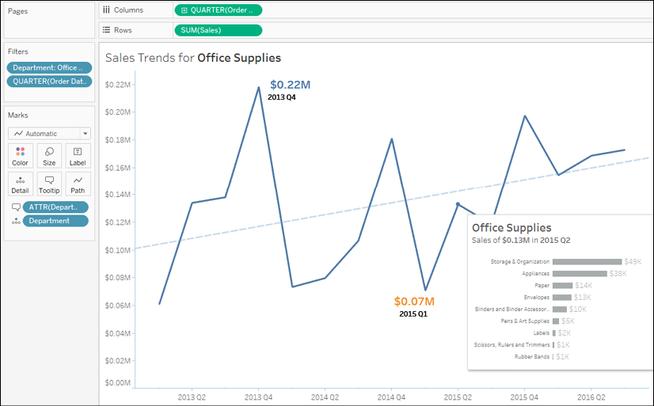

Figure 7.24: Viz in Tooltip

There are many possibilities with Viz in Tooltip.
First, you can leverage the capability to drill down into details
without using extra space on a dashboard and without navigating
to a separate view. Second, you can show different
aspects of the data (for example: geographic location as a tooltip for a
time series). Finally, you might consider how to use Viz in Tooltip to
allow the end user to see parts of the whole within a broader context.

There are a great many more valuable applications of this feature, but
here are a few tips to wrap up our examination of Viz in Tooltip:

-   You may have more than one Viz in a single tooltip.
-   Setting the **Fit** option to **Entire View** for the sheet being
    used in a tooltip fits it to the maximum width and height.
-   You may hide sheets used in tooltips by right-clicking the tab of
    the sheet and selecting **Hide**. To restore them, right-click
    the tab of the sheet being used in the tooltip
    and select **Unhide Sheets**.


#### Summary


The goal of formatting is to increase effective communication of the
data at hand. Always consider the audience, setting, mode, mood, and
consistency as you work through the iterative process of formatting.
Look for formatting that adds value to your visualization and avoid
useless clutter.

We covered quite a few options for formatting -- from fonts, colors,
lines, and more at the workbook level to formatting individual sheets
and fields. We discussed how to customize formatting for numbers, dates,
and null values and how to use these techniques to bring value to your
visualizations.

With an understanding of how formatting works in Tableau, you\'ll have
the ability to refine the visualizations that you created in discovery
and analysis into incredibly effective communication of your data story.

In the next lab, we\'ll look at how this all comes together on
dashboards.
