Telling a Data Story with Dashboards
====================================


This lab will cover the following topics:

-   Introduction to dashboards
-   Designing dashboards in Tableau
-   Designing for different displays and devices
-   Interactivity with actions
-   Stories

For the examples in this lab, we\'ll return to the
`Superstore Sales` sample data we used in the
previous labs. Go ahead and create a new workbook with a connection
to that dataset, and we\'ll begin by introducing the key concepts of
dashboards.


#### Introduction to dashboards


Before diving into some practical examples, let\'s
take some time to understand what a dashboard is and why you might
create one.

Dashboard definition
--------------------

From a Tableau perspective, a **dashboard** is an
arrangement of individual visualizations, along with other components,
such as legends, filters, parameters, text, containers, images,
extensions, buttons, and web objects, that are arranged on a single
canvas. Ideally, the visualizations and components should work together
to tell a complete and compelling data story. Dashboards are usually
(but not always) interactive.

Dashboard objectives
--------------------

The primary objective of a dashboard is to
communicate data to a certain audience with an intended result. Often,
we\'ll talk about *telling the data story*. That is, there is a
narrative (or multiple narratives) contained within the data that can be
communicated to others.

While you can tell a data story with a single visualization or even a
series of complex dashboards, a single Tableau dashboard is the most
common way to communicate a single story. Each dashboard seeks to tell a
story by giving a clear picture of certain information. Before framing
the story, you should understand what story the data tells. How you tell
the story will depend on numerous factors, such as your audience, the
way the audience will access the dashboard, and what response you want
to elicit from your audience.

Stephen Few, one of the leading experts in the field of data
visualization, defines a dashboard as *a visual display of the most
important information that\'s needed to achieve one or more objectives,
consolidated and arranged on a single screen so the information can
be monitored at a glance*.

**Note:**

This definition is drawn from Few\'s paper
*Dashboard Confusion*, which can be read here:
[[https://www.perceptualedge.com/articles/ie/dashboard\_confusion.pdf]](https://www.perceptualedge.com/articles/ie/dashboard_confusion.pdf).


This definition is helpful to consider because it places some key
boundaries around the data story and the way we will seek to tell it in
Tableau. In general, your data story should follow these guidelines:

-   The data story should focus on the most important information.
    Anything that does not communicate or support the main story should
    be excluded. You may wish to include that information in other
    dashboards.
-   The data story that you tell must meet your key objectives. Your
    objectives may range from giving information to providing an
    interface for further exploration, to prompting your audience to act
    or make key decisions. Anything that doesn\'t support your
    objectives should be reserved for other dashboards.
-   The data story should be easily accessible, and the main idea should
    be clear. Depending on your audience, you may wish to explicitly
    state your conclusions from the data, or you may want to guide your
    audience so that they can draw their own.

When you set out to build a dashboard, you\'ll
want to carefully consider your objectives. Your discovery and analysis
should have uncovered various insights into the data and its story. Now,
it\'s your responsibility to package that discovery and analysis into a
meaningful communication of the story to your particular audience in a
way that meets your objectives and their needs.
The way you handle this task is called your **approach**.

Dashboard approaches
--------------------

There are numerous possible approaches to building
dashboards based on your objectives. The following is by no means a
comprehensive list:

-   **Guided analysis**: You\'ve done the analysis, made the
    discoveries, and thus have a deep understanding of the implications
    of the data story. Often, it can be helpful to design a dashboard
    that guides your audience through a similar process of making the
    discoveries for themselves, so the need to act is clear. For
    example, you may have discovered wasteful spending in the marketing
    department, but the team may not be ready to accept your results
    unless they can see how the data led you to that conclusion.
-   **Exploratory**: Many times, you do not know what story the data
    will tell when the data is refreshed in the next hour, next week, or
    next year. What may not be a significant aspect of the story today
    might be a major decision point in the future. In these cases, your
    goal is to provide your audience with an analytical tool that gives
    them the ability to explore and interact with various aspects of the
    data on their own. For example, today, customer satisfaction is high
    across all regions. However, your dashboard needs to give your
    organization the ability to continually track satisfaction over
    time, dynamically filter by product and price, and observe any
    correlations with factors such as quality and delivery time.
-   **Scorecard/Status snapshot**: There may be a
    wide agreement on **Key Performance Indicators** (**KPIs**) or
    metrics that indicate good versus poor performance. You don\'t need
    to guide the audience through discovery or force them to explore.
    They just need a high-level summary and the ability to drill down
    into details to quickly find and fix problems and reward success.
    For example, you may have a dashboard that simply shows how many
    support tickets are still unresolved. The manager can pull up the
    dashboard on a mobile device and immediately take action if
    necessary.
-   **Narrative**: This type of dashboard emphasizes a story. There may
    be aspects of exploration, guided analysis, or performance
    indication, but primarily you are telling a single story from the
    data. For example, you may desire to tell the story of the spread of
    an invasive species of insect, including where it started, how
    quickly it spread, the results, and the efforts to contain it. Your
    dashboard should tell the story, using data, in a visual way.

We\'ll look at several in-depth examples to better
understand a few of these different approaches and incorporate many of
the skills we\'ve covered in previous labs. First, we\'ll introduce
some key aspects of designing dashboards in Tableau.

**Tip:**

Your dashboard may have a hybrid approach. For example, you might have
an exploratory dashboard that prominently displays some KPIs. However,
be careful to not overload a dashboard. Trying to meet more than one or
two objectives with any single dashboard will likely result in an
overwhelming mess.

#### Designing dashboards in Tableau


No matter your objective or approach, the
practical task of designing a dashboard in Tableau
will look similar each time. In this section, we will go through some
fundamental concepts.

Objects
-------

Dashboards are made up of objects that are
arranged on a canvas. You\'ll see a list of objects that can be added to
a dashboard in the left-hand pane of a dashboard:

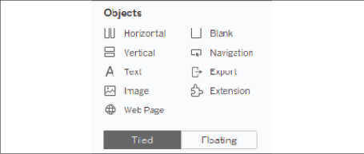

Figure 8.1: Objects available to add to a dashboard

The pane includes these objects:

-   **Horizontal**: A layout container within which other objects will
    be arranged in a single row (horizontally).
-   **Vertical**: A layout container within which other objects will be
    arranged in a single column (vertically).
-   **Text**: An object that allows you to include richly formatted text
    in your dashboard.
-   **Image**: An image (for example, `.gif`,
    `.png`, or `.jpeg`)
    that can be positioned and sized on your dashboard. Optionally, you
    may set a URL for navigation when a user clicks the image.
-   **Web Page**: An object that allows you to embed web content in the
    dashboard. You may set the URL at design time. We\'ll also consider
    how to use actions to dynamically change the URL.
-   **Blank**: A blank object that can be used as a placeholder or to
    provide spacing options.
-   **Navigation**: A navigation button allows you to define user
    navigation to other sheets and dashboards in the workbook.
-   **Export:** An export object allows you to create a link or button
    that gives the user an easy option to export the dashboard as an
    image, PDF, or PowerPoint.
-   **Extension**: One of a growing number of tools developed by Tableau
    and third parties (or maybe even you!) that leverages the extensions
    API to provide extended functionality to dashboards. This could
    allow you to accomplish things such as gathering extensive usage
    data, dynamically updating parameters, incorporating visualizations
    from other platforms (such as D3), and much more.

In addition to the objects that you can add through the sidebar, there
are other objects that may be applicable to a given dashboard:

-   **Filters**: These will appear as controls for
    the end user so that they can select values to filter
-   **Parameters**: Similar to filters, these will show up as controls
    for the end user to select a parameter option
-   **Page controls**: These are controls that give the end user options
    for paging through the data and may be used to animate
    visualizations and dashboards
-   **Legends**: These include color, size, and shape legends to help
    the end user understand various visualizations
-   **Highlighters**: These allow the user to highlight various
    dimension values within views
-   **Dashboard title**: A special text object that displays the name of
    the dashboard sheet by default

### Tiled versus floating

An object is either tiled or floating. If it is a
tiled object, it will snap into the dashboard or layout container where
you drop it. If it is a floating object, it will float over the
dashboard in layers. You can change the order of the layers for a
floating object.

You\'ll notice the **Tiled** or **Floating** buttons directly beneath
the **Objects** pallet in the preceding image. These buttons define the
default setting for objects that you place on the dashboards, but you
can change whether any given object is tiled or floating.

**Tip:**

Hold down the [Shift] key as you drag an object to
quickly change it from tiled to floating, or from floating to tiled.


As you become experienced in designing dashboards, you\'ll likely
develop a preference for designing using a predominately tiled approach
or a predominately floating approach. (You can mix tiled and floating
objects on any dashboard). Many designers find one design method or the
other fits their style. Here are some considerations:

-   **Precision**: Floating objects can be sized and positioned to exact
    pixel-perfection, while tiled objects will depend greatly upon their
    containers for position and size.
-   **Speed**: Many designers find a tiled layout much faster to create
    as they don\'t have to worry about precision or layering.
-   **Dynamic resizing**: Floating objects work well on a fixed-size
    dashboard, but a dashboard that dynamically resizes based on window
    size will shift floating objects, often into
    undesirable locations. Tiled objects move and resize more reliably
    (but not always perfectly!).
-   **Flexibility**: Certain design techniques can be accomplished with
    one approach or the other. For example, transparent visualizations
    can be layered on top of background images using a floating
    technique. However, sheet swapping (which we\'ll consider in
    *Chapter 11*, *Dynamic Dashboards*) is often accomplished with a
    tiled approach.
-   **Maintenance**: Changes to the layout of a floating dashboard might
    be harder and more tedious than doing so for tiled layouts.

Experiment with various design techniques and feel free to develop your
own style!

### Manipulating objects on the dashboard

You may wish to manipulate an object once it is
part of a dashboard. Every object has certain controls that become
visible when you select it:

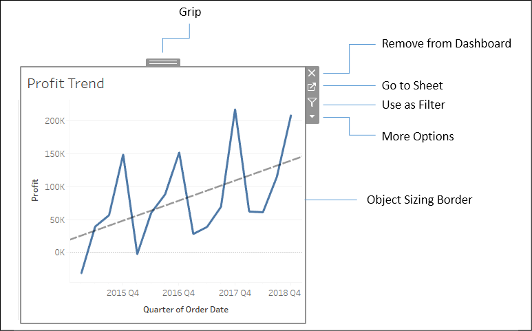

Figure 8.2: Various controls become accessible once you select a
dashboard object

-   **Grip**: Click and drag the grip to move the object.
-   **Remove from Dashboard**: Click this to remove the object from the
    dashboard.
-   **Go to Sheet**: To edit a single visualization on a dashboard, use
    this button to navigate to the individual
    sheet.
-   **Use as Filter**: Clicking here will enable the view to be used as
    a filter. Selecting a mark in the view will now filter other views
    on the dashboard. We\'ll look at the specifics of filter actions
    later in this lab and how you can have finer control over how a
    view can be used as a filter.
-   **More Options**: This drop-down arrow reveals a host of options for
    the object, including control display options for parameters and
    filters; showing or hiding titles or captions on views; adding
    legends, parameters, and filters to the dashboard; formatting,
    layout, and size options; and more.
-   **Object Sizing Border**: Hovering over the border will cause your
    cursor to change to a sizing cursor. You can drag the border to
    adjust the size of the object.

**Tip:**

You may notice different sizing behavior based on what type of container
an object is inside and whether the object is tiled or floating.


In the first sections of this lab, we have introduced the
theoretical fundamentals of dashboards and some
key elements of their design. Now, let\'s apply these concepts with a
practical example.


#### A dashboard to understand profitability


Having covered some conceptual topics as well as
practical matters related to dashboard design, we\'ll dive into an
example.

Let\'s say you\'ve been tasked with helping management find which items
are the least profitable. Management feels that most of the least
profitable items should be eliminated from their inventory. However,
since you\'ve done your analysis, you\'ve discovered that certain items,
while not profitable overall, have made a profit at times in various
locations. Your primary objective is to give management the ability to
quickly see an analysis of the least profitable items to identify
whether an item has always been unprofitable, answering the question,
\"Is the least profitable item always unprofitable?\" This example will
combine aspects of a guided analytics dashboard and an exploratory tool.

Building the views
------------------

Use the `Superstore Sales` dataset
and follow these steps to build the individual
views that will form the basis of the dashboard:

1.  Create a bar chart showing profit by category. Sort the categories
    in descending order by the sum of profit.

2.  Add the **Department** field to **Filters** and show a filter. To
    accomplish this, use the drop-down menu of the **Department** field
    in the data pane and select **Show Filter**.

3.  Name the sheet **Overall Profit by Category**:

    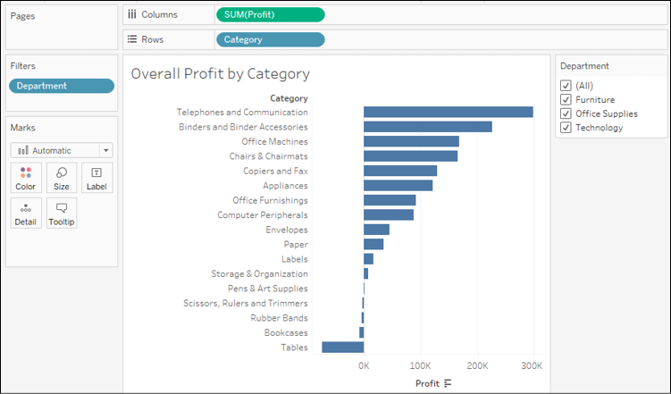

    Figure 8.3: A bar chart showing the sum of profit by category with
    Department as a filter

4.  Create another similar view showing profit by
    item. Sort the items in descending order by the sum of profit.

5.  You\'ll notice that there are too many items to see at once. For
    your objectives on this dashboard, you can limit the items to only
    the top 10 least profitable ones. Add the **Item** field to the
    **Filters** shelf, select the **Top** tab, and adjust the settings
    to filter by field. Specify **Bottom 10** by
    `Sum(Profit)`:

    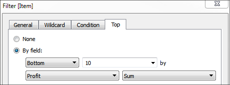

    Figure 8.4: Use the Top tab to set the number of items to display

6.  Rename the sheet **Top 10 Least Profitable Items**:

    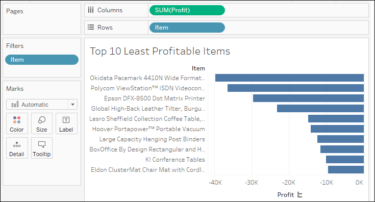

    Figure 8.5: The resulting bar chart shows the top 10 least
    profitable items

7.  Create another sheet that displays a filled
    map of profit by state. You can accomplish this rather quickly by
    double-clicking the **State** field in the data window and then
    dropping **Profit** on the **Color** shelf. (Note: if your regional
    settings are not US, you may need to use the **Edit Locations**
    option to set the country to the United States.)

8.  Rename the sheet to **Profit by State**:

    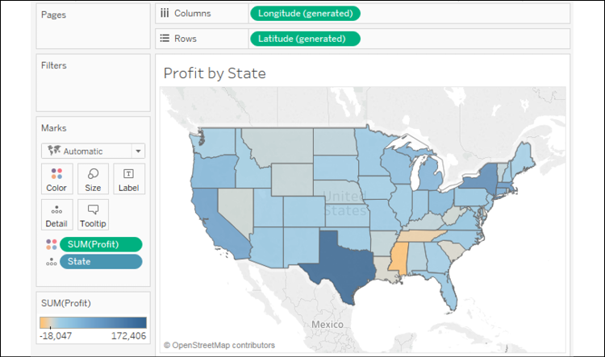

    Figure 8.6: A filled map showing profit by state

9.  Create one final sheet to show when profits
    were made or lost. Ensure that the **Order Date** field has been
    added as the **Quarter** date value and that it is continuous
    (green).

10. Add a linear trend line. To do this, switch to the **Analytics** tab
    of the left sidebar and drag **Trend Line** from **Model** to the
    view. Alternatively, right-click a blank area of the canvas of the
    view and select **Trend Lines** \| **Show Trend Lines**.


1.  Rename the sheet to **Profit Trend**:

    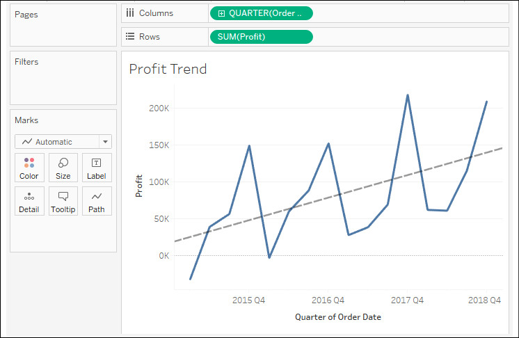

    Figure 8.7: A line chart showing the trend of profit by quarter

Now that you\'ve created the views that will make
up the dashboard, let\'s start to put the dashboard together!

Creating the dashboard framework
--------------------------------

At this point, you have all of the necessary views
to achieve the objectives for your dashboard. Now, all that remains is
to arrange them and enable the interactivity that\'s required to
effectively tell the story:

1.  Create a new dashboard by clicking the **New Dashboard** tab to the
    right of all existing worksheet tabs or by selecting **Dashboard**
    \| **New Dashboard** from the menu.

2.  Rename the new dashboard
    `Is Least Profitable Always Unprofitable?`.

3.  At the bottom of the left sidebar, check **Show dashboard title**.

4.  Add the views to the dashboard by dragging them from the
    **Dashboard** pane of the left sidebar and dropping them into the
    dashboard canvas. Arrange them as follows:

    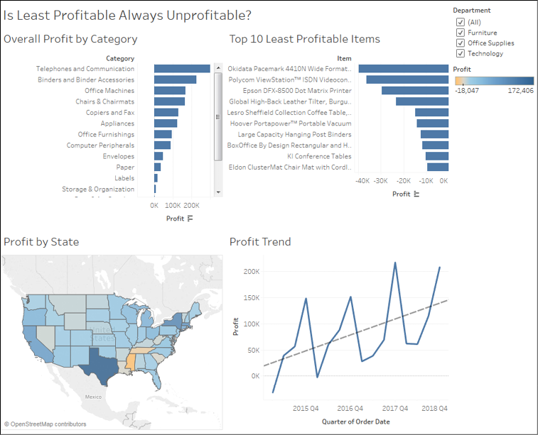

    Figure 8.8: All views are placed on the dashboard

    After adding views to the dashboard, you\'ll
    want to take some time to reposition and resize various elements and
    views.


1.  Use the drop-down menu on the **Department** filter and change the
    control to **Single Value** (drop-down).
2.  You\'ll notice that changing the value of the filter only changes
    the **Overall Profit by Category** view. You can adjust which views
    the filter applies to by using the drop-down menu. Using the
    drop-down menu, select **Apply to Worksheets** \| **All Using This
    Data Source**.

Options for applying filters may be set using the drop-down on the
filter control or on the field on the filters shelf in the view. The
options include the following:

-   **All Using Related Data Sources**: The filter will be applied to
    all data sources where the field used for filtering is related
    between data sources. Relationships may be edited from **Data** \|
    **Edit Relationships** on the main menu.
-   **All Using This Data Source**: The filter will be applied to any
    view using the data source as the primary data source.
-   **Selected Worksheets\...**: The filter will be applied to the
    worksheets you select.
-   **Only This Worksheet**: The filter will be applied only to the
    current worksheet.

Now, let\'s get back to creating our dashboard
framework.

1.  From the left sidebar, drag and drop a text object above **Overall
    Profit by Category** and enter the following instructions:
    a.  **Select a Department from the drop-down**
    b.  **Select a category below**
    c.  **Select an Item below**
2.  Using the grip, move the **Department** filter immediately above the
    **Top 10 Least Profitable Items** view.
3.  Size the text object to align the **Top 10** view with the overall
    view.
4.  Move the **Profit** color legend below the **Profit by State** view.
5.  Use the drop-down menu of **Overall Profit by Category** to **Fit**
    \| **Entire View**. This will ensure that all of the categories are
    visible without the need for a scrollbar.
6.  Additionally, fit **Top 10 Least Profitable Items** to **Entire
    View**.

At this point, your dashboard should look similar to the following:

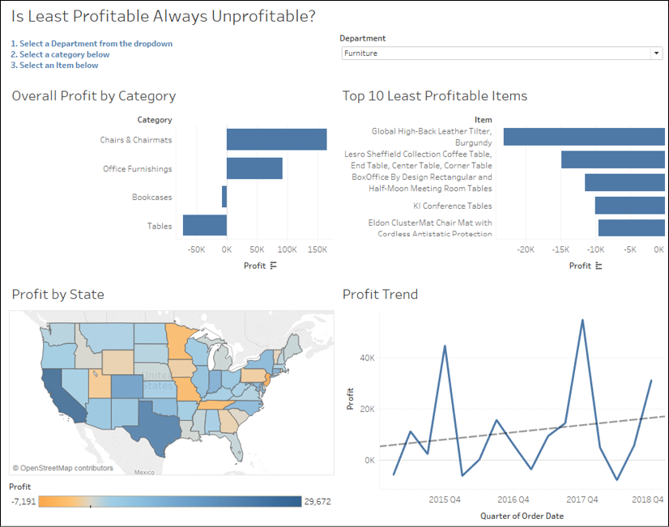

Figure 8.9: The polished dashboard with rearranged and resized objects

We now have a dashboard with all the views we want
to include. As you\'ve seen, it\'s easy to add views and objects and
rearrange them as desired. Let\'s continue by examining how to drive a
story with actions.

Implementing actions to guide the story
---------------------------------------

You now have a framework that will support the
telling of the data story. Your audience will be able to locate the
least profitable items within the context of a selected category. Then,
the selection of an item will answer the question of whether it has
always been unprofitable in every location. To enable this flow and meet
your objectives, you\'ll often need to enable interactivity. In this
case, we\'ll use actions. We\'ll conclude this example with some
specific steps and then unpack the intricacies of actions later in the
lab:

1.  Click the **Use as Filter** button on the **Overall Profit by
    Category** view. This will cause the view to be used as an
    interactive filter for the entire dashboard. That is, when the user
    selects a bar, all other views will be filtered based on the
    selection:

    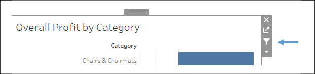

    Figure 8.10: The Use As Filter control on the Profit by Category
    view

2.  From the main menu, select **Dashboard** \|
    **Actions**. You\'ll see a list containing one action named **Filter
    1 (generated)**. This is the action that was created when you
    selected **Use as Filter** previously:

    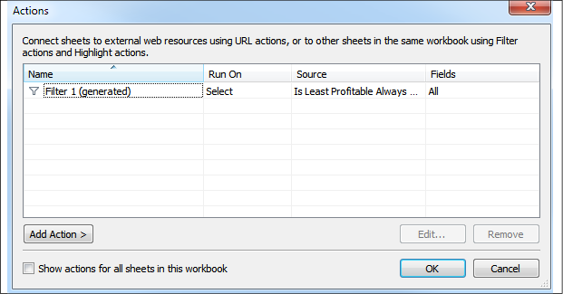

    Figure 8.11: Filter 1 (generated) was created when the filter
    control was clicked

3.  Click the **Add Action \>** button and select **Filter**. The
    resulting dialog gives you options for selecting the source and
    target, as well as additional options for the action.


1.  Here, we want an action that filters
    everything except the **Overall Profit by Category** view when the
    user selects an item. In the **Add Filter Action** dialog, set
    **Source Sheets** to **Top 10 Least Profitable Items**, and **Target
    Sheets** to **Profit by State** and **Profit Trend**. Make sure that
    the action is set to run on **Select**. Name the filter **Filter by
    Item**, and then click **OK** on this dialog. Do the same on the
    **Actions** dialog:

    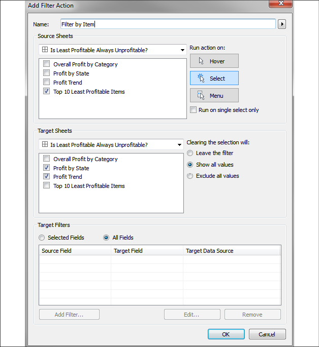

    Figure 8.12: Setting options for the Filter by Item action

You now have three filters (two are actions) that drive the dashboard:

-   Selecting a department from the drop-down will
    filter the entire dashboard (and actually all views in the workbook
    as you set it to filter every view using the data source)
-   Selecting a category (clicking a bar or header) will filter the
    entire dashboard to that selection
-   Selecting an item (clicking a bar or header) will filter the
    **Profit by State** and **Profit Trend** dashboards

**Tip:**

You can clear a selection in a view by clicking a blank area or by
clicking the selected mark one more time. For example, if you click the
bar for **Bookcases** to select it (and thus filter the rest of the
dashboard), you may click the bar one more time to deselect it.


Experiment with the filters and actions to see how
your dashboard functions.

Context filtering
-----------------

You may have noticed that when you use the
drop-down filter to select a single department or select a single
category, you have fewer than 10 items in the Top 10 view. For example,
selecting **Furniture** from the **Department** filter and clicking on
the bar for **Tables** results in only three items being shown. This is
because the **Top Item** filter is evaluated at the same time as the
action filter. There are only three items with the category of
**Tables** that are also in the **Top 10**.

What if you want to see the top 10 items within the category of
**Tables**? You can accomplish this using context filters.

**Note:**

**Context filters** are a special kind of filter
in Tableau that are applied before other filters. Other filters are then
applied within the context of the context filters. Conceptually, context
filters result in a subset of data upon which other filters and
calculations operate. In addition to **Top Filters**, **Computed Sets**
and **Fixed Level of Detail** calculations are also computed within the
context defined by context filters.


In this case, navigate to the **Top 10** sheet and add the
**Department** filter and the newly added action **(Category)** filter
to the context using the drop-down menu of the fields on the **Filters**
shelf. Once added to the context, those fields will be gray on the
filters shelf. Now, you will see the top 10 items within the context of
the selected department and category:

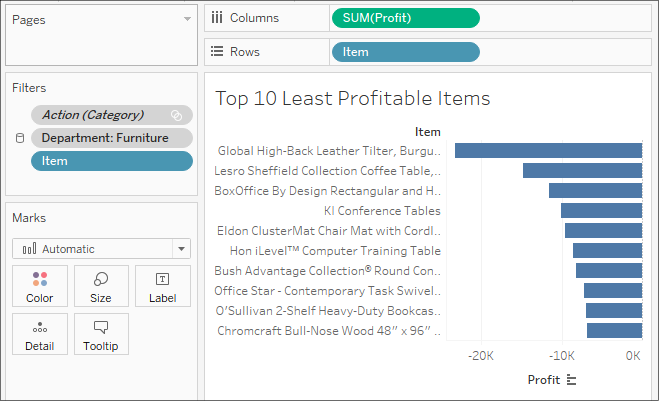

Figure 8.13: The 10 least profitable items will be within the context of
the Action (Category) and Department filters

Notice that adding filters to the context causes
the fields to be color-coded gray on the **Filters** shelf.

**Tip:**

If you edit the action on the dashboard, the filter might be
automatically updated and you may have to re-add it to the context.


Go ahead and step through the actions by selecting a couple of different
categories and a couple of different items. Observe how the final
dashboard meets your objectives by telling a story:


Figure 8.14: The final dashboard with filters triggered by selection

The user has selected **Technology** from the **Department** drop-down,
**Telephones and Communications** from the **Category** list, and then
**Item 10631**, which is the least profitable item
within the category. This reveals the states where
the item was sold (color-coded by profit) and a time series of profit
for the item.

Should management remove item 10631 from the inventory? Not without
first considering that the item only lost profit in one instance and
that the trend is positive toward greater profitability. Granted, the
original loss was a large loss, but this was also a long time ago and
every subsequent sale of the item resulted in a gain. The results of
your findings may lead to further analysis to determine what factors
play a part in the profit and loss for the item and better decision
making by management.

**Tip:**

When you look at the `Chapter 08 Completed`
workbook, you\'ll only see a tab at the bottom for the dashboard. The
individual views have been hidden. Hiding tabs for sheets that are used
in dashboards or stories is a great way to keep your workbook clean and
guide your audience away from looking at sheets that are meant to be
seen in the context of a dashboard or story. To hide a sheet,
right-click the tab and select **Hide Sheet**. To unhide a sheet,
navigate to the dashboard or story using the sheet, right-click the
sheet in the left-hand side pane and uncheck **Hide Sheet**.
Additionally, you can hide or unhide all sheets that are used in a
dashboard by right-clicking the dashboard tab and selecting the
appropriate option. Sheets that are used in tooltips may be hidden or
unhidden in the same way.


You now have a fully interactive dashboard! You
built the views, added them to the dashboard, and then created some
meaningful calculations. Along the way, you learned about **top
filters** and **context filters**. Now, let\'s consider how you might
design dashboards for different displays and devices.


### Designing for different displays and devices


When designing a dashboard, some of the first
questions you\'ll often ask yourself are: *How will my audience view
this dashboard? What kind of device will they use?* With the wide
adoption of mobile devices, this latter question becomes very important
because what looks great on a large flat-screen monitor doesn\'t always
look great on a tablet or phone.

The top of the **Dashboard** tab on the left sidebar reveals a button to
preview the dashboard on various devices, as well as a drop-down for
**Size** options:


Figure 8.15: The Device Preview option allows you to design and preview
your dashboard for other devices

Clicking the **Device Preview** button not only allows you to see how
your dashboard will look with various device types
(and even specific models) but also allows you to add a layout for each
device type, which you can customize:

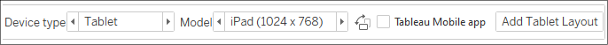

Figure 8.16: Customizable options for devices

You can not only see how your dashboard will appear on various devices
and models but also how it will look based on the orientation of the
device and whether the Tableau Mobile app is used (if available for the
selected device).

Clicking the **Add Layout** button (that is, the **Add Tablet Layout**
button in the preceding screenshot) will add a layout under the
**Dashboard** tab on the left sidebar:

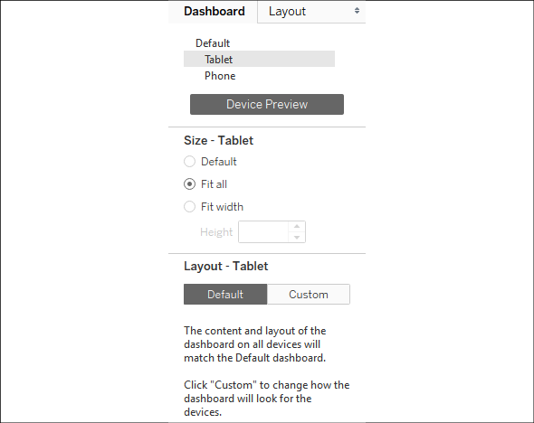

Figure 8.17: Each layout can be configured with various options

Each layout can have its own size and fit options, and the layout
options allow you to switch from **Default** to **Custom**. This gives
you the ability to rearrange the dashboard for any
given layout. You may even remove views and
objects for a certain layout. For example, you might simplify a
dashboard to one or two views for a phone while leaving three or four in
place for a desktop display.

The `Chapter 08 Completed` workbook contains an
example of the profit analysis dashboard and has a couple of layout
options. For example, here is that dashboard formatted for display on a
phone in which the dashboard will fit according to the width of the
phone and allow scrolling up and down:

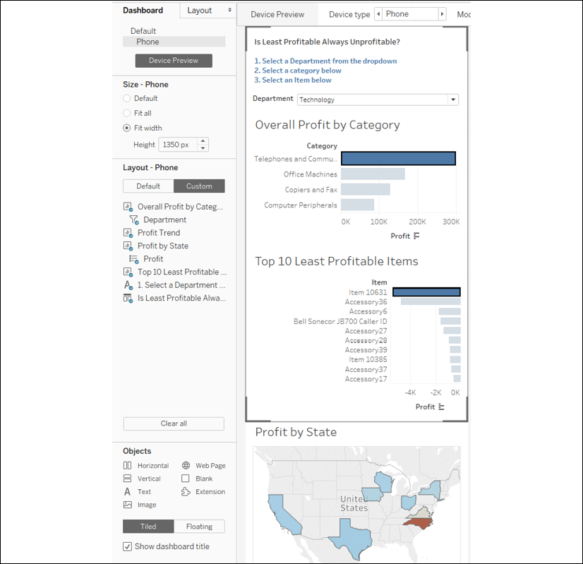

Figure 8.18: The phone layout of the dashboard

As you can see, the arrangement of the dashboard
for the phone means that **Profit by State** and **Profit Trend** do not
appear within the preview boundaries for a phone device. However, they
are only a finger swipe away.


#### Interactivity with actions

In Tableau, an **action** is a user-initiated
event that triggers a response from Tableau. You\'ve seen a few examples
of actions being used in dashboards already. We\'ll now consider some
details of how actions work in Tableau.

Tableau supports six kinds of actions:

-   **Filter actions**: The user\'s action causes one or more filters to
    be applied to one or more views.
-   **Highlight actions**: The user\'s action causes specific marks and
    headers to be highlighted in one or more views.
-   **URL actions**: The user\'s action causes a specific URL to be
    opened (either in a browser, a new tab, or in an embedded web
    object).
-   **Go to Sheet**: The user\'s action causes navigation to a selected
    sheet or dashboard.
-   **Parameter actions**: The user\'s action changes the value of a
    parameter. This allows the user to visually interact with parameters
    in new and exciting ways!
-   **Set actions**: The user\'s action defines a set. Sets may be used
    in calculations, filters, and on shelves to define visual attributes
    of marks. This opens a lot of possibilities to allow complex and
    creative interactions.

Certain actions are automatically generated by Tableau based on
shortcuts. For example, you can select **Use as Filter** from the
drop-down menu of a view on a dashboard, which results in an
automatically generated filter action. Enabling highlighting using the
button on a discrete color legend or from the toolbar will automatically
generate a highlight action:

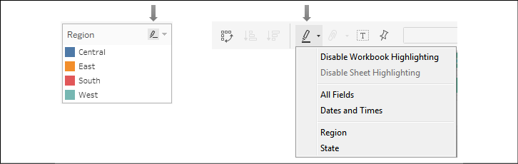

Figure 8.19: Options for enabling highlighting

You can also create or edit dashboard actions by selecting **Dashboard**
\| **Actions** from the menu. Let\'s consider the
details of each type of action.

Filter actions
--------------

**Filter actions** are defined by one or more
source sheets that pass one or more dimensional
values as filters to target sheets upon an action. Remember that every
mark on a sheet is defined by a unique intersection of dimensional
values. When an action occurs involving one or more of those marks, the
dimensional values that comprise the mark(s) can be passed as filters to
one or more target sheets.

When you create or edit a filter action, you will see options like
these:

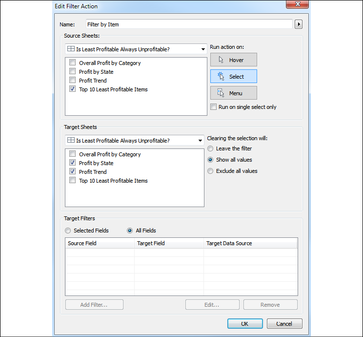

Figure 8.20: Options for filter actions

This screen allows you to do
the following:

-   Name the filter.
-   Choose **Source** and **Target** sheets. The **Source** sheet is
    where the user will initiate the action (hover, selection, menu) and
    the **Target** sheet is where the response will be applied
    (filtering in this example, but also highlighting).
-   Set the action that triggers the filter and whether the selection of
    multiple marks or only a single mark initiates the action.
-   Choose what happens when the selection is cleared.
-   Specify which dimensions are used to pass filter values to the
    **Target** sheet(s).

**Tip:**

Try to name your actions using names that help you differentiate between
multiple actions in the dashboard. Additionally, if your action is set
to run on **Menu**, then the name you use will be shown as a link in the
tooltip. Use the arrow to the right of the name to insert special field
placeholders. These will be dynamically updated with the values of the
fields for a mark when the user sees the menu option in a tooltip.


You may select as many source and target sheets as
you desire. However, if you specify particular
**Target filters** in the bottom section, the fields you select must be
present in the source sheet (for example, on **Rows**, **Columns**, and
**Detail**). You will receive a warning if a field is not available for
one or more **Source** sheets and the action will not be triggered for
those sheets. Most of the time, your source and target will be the same
dashboard. Optionally, you can specify a different target sheet or
dashboard, which will cause the action to navigate to the target
in addition to filtering.

**Note:**

When filter actions are defined at the worksheet level (when viewing a
worksheet, select **Worksheet** \| **Actions** from the menu), a menu
item for that action will appear as menu items for every mark on every
sheet that uses the same data source. You can use this to quickly create
navigation between worksheets and from dashboards to individual
worksheets.


Filter actions can be set to occur on any one of three possible actions:

-   **Hover**: The user moves the mouse cursor over a mark (or taps a
    mark on a mobile device).
-   **Select**: The user clicks or taps a mark, and a
    rectangle/radial/lasso selects multiple marks by clicking and
    dragging a rectangle around them and clicks a header (in which case
    all marks for that header are selected). A user may deselect by
    clicking/tapping the already selected mark, clicking/tapping an
    empty space in the view, or by clicking/tapping the already selected
    header.
-   **Menu**: The user selects the menu option for the action on the
    tooltip.

Consider the following example of a filter action that\'s triggered when
a bar is selected in the source:

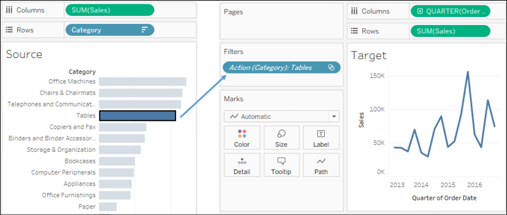

Figure 8.21: Clicking the bar for Tables passes Category as a filter to
the Target sheet

Each bar mark in the source is defined by the
**Category** dimension. When the bar for
**Tables** is selected, a single filter is set on the target.

If the mark is defined by more than one dimension (for example,
**Category** and **Region**), then the target sheet will still have a
single filter with the combination of dimension values that had been
selected.

In this example, the filter contains **Office Machines** and **West**,
matching the dimensions that define the selected square:

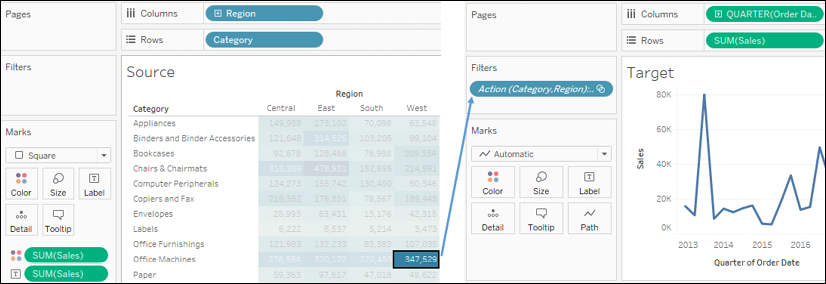

Figure 8.22: Clicking the square for the intersection of Office Machines
and West passes both dimensional values as a single action filter to the
target

By default, all dimensions present in the source view are used in a
filter action. Optionally, you can specify which fields should be used.
You can use the **Selected Fields** option in the **Edit Filter
Actions** dialog to accomplish the following:

-   Filter based on fewer dimensions. For example, if you only selected
    the **Region** field, then selecting the
    preceding square would only pass the West
    region as a filter to the target.
-   Filter a target view using a different data source. The **Selected
    Fields** option allows you to map the source field to a target field
    (even if the target field has a different name, though the values
    must still match). For example, if the target used a data source
    where **East** was a possible value for a field named **Area**, you
    could map **Region** from the source to **Area** in the target.

Filter actions are very useful for narrowing focus, drilling into
detail, and seeing different aspects of a selected dimension. You\'ll
find yourself using them often. Let\'s consider another type of action:
highlight actions.

Highlight actions
-----------------

This type of action does not
filter target sheets. Instead, **highlight
actions** cause marks that are defined, at least in part, by the
selected dimensional value(s) to be highlighted in the target sheets.
The options for highlight actions are very similar to filter actions,
with the same configuration options for source and target sheets, and
which events are able to trigger the action.

Consider a dashboard with three views and a highlight action based on
the **Region** field. When the action is triggered for the **East**
region, all marks defined by **East** are highlighted. The dimension(s)
that are used for the highlight must be present in all views where you
want the highlighting to be applied. Both the
map and scatter plot have **Region** on the
*Detail* part of the *Marks* card:

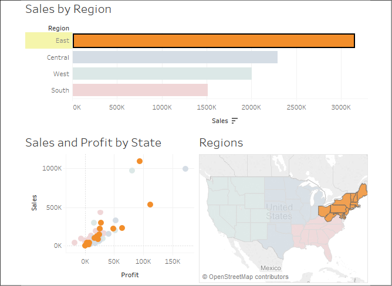

Figure 8.23: Clicking the bar for East has highlighted all other marks
associated with that dimensional value

**Note:**

**Highlighters** (also called **data highlighters**) are shown as user
controls (similar to filters and parameters) that
cause highlighting based on user interaction. They can be applied to one
or more views and will highlight the marks of the views. They do not
create an action. To add highlighters, select any discrete (blue) field
in the view and use the drop-down menu to click **Show Highlighter**.
Alternatively, you can use the menu and select
**Analysis** \| **Highlighters**. On a dashboard, you can add a
highlighter by using a view\'s drop-down menu and
selecting **Highlighters**.


URL actions
-----------

**URL actions** allow you to dynamically generate
a URL based on an action and open it within a web
object in the dashboard or in a new browser window or tab. URL actions
can be triggered by the same hover, menu, and select events as other
actions. The name of the URL action differentiates it and will appear as
the link when used as a menu.

The URL includes any hardcoded values you enter as well as placeholders
that are accessible via the arrow to the right of the URL text box.
These placeholders include fields and parameters. The values will be
dynamically inserted into the URL string when the action is triggered
based on the values for the fields that make up the selected mark(s) and
current values for parameters.

If you have included a web object in the dashboard, the URL action will
automatically use that as the target. Otherwise, the action opens a new
browser window (using your default browser, when the dashboard is viewed
in desktop or reader) or a new tab (when the dashboard is viewed in a
web browser).

**Tip:**

Some web pages have different behaviors when viewed in iframes. The
browser object does not use iframes in Tableau Desktop or Tableau Reader
but does when the dashboard is published to Tableau Server, Tableau
Online, or Tableau Public. You will want to test URL actions based on
how your dashboards will be viewed by your audience.


You may specify a target for the URL action when you create or edit the
URL action:

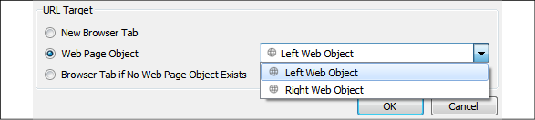

Figure 8.24: Options for a URL action

Options include **New Browser Tab**, **Web Page Object** (you may select
which object if you have more than one on the
dashboard), and **Browser Tab if No Web Page Object Exists**. If you
have more than one web page object on the dashboard, you
may wish to give them meaningful names to make
selection easier.

To accomplish this, switch to the **Layout** tab on the left-hand side
pane and expand **Item hierarchy** until you locate the objects you wish
to rename. Right-click the object and select **Rename Dashboard
Item...**:

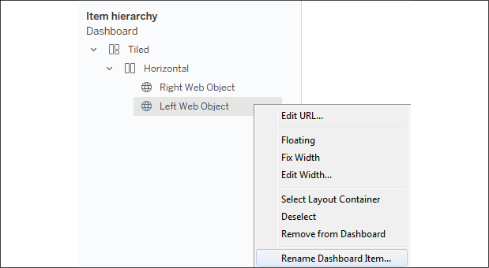

Figure 8.25: Dashboard objects can be renamed using the item hierarchy
and the right-click context menu

After you have renamed the object, you will be able to more readily
identify which one is the target of the URL action.

Next, we\'ll consider another type of action that
accomplishes a specific result: navigation.

Go to Sheet actions
-------------------

**Go to Sheet actions** (also called navigation
actions) allow you to specify navigation to
another dashboard or sheet in the workbook based on user interaction
with one or more views. For example, clicking a bar in a bar chart might
navigate to another dashboard. These are similar to filter actions that
define another sheet as a target, but Go to Sheet actions do not set any
filters.

Parameter actions
-----------------

**Parameter actions** allow
you to set the value of a parameter based on a
user action. When you create a parameter action, you\'ll set options
using a screen like this:

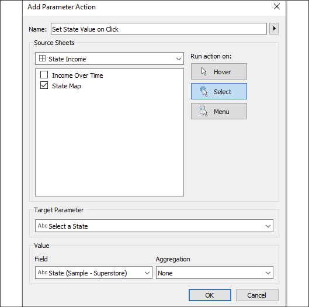

Figure 8.26: Options for a parameter action

As with other actions, you
may select the sheets and user interactions (**Hover**, **Select**,
**Menu**) that trigger the action. Additionally, you will set the target
parameter and specify which field will set the value. You may use any
field in the sheet and may also specify an aggregation for the field.

We saw in *Chapter 4*, *Starting an Adventure with Calculations and
Parameters*, how parameters can be used to
accomplish all kinds of results. You can use them in
calculations, filters, and **Top N** sets, and you
can use them to define reference lines and alter the visual aspects of
any view. This opens a world of possibilities for driving an interactive
experience using views and triggers.

Set actions
-----------

**Set actions** allow you to populate a set with
one or more values for one or more dimensions.
This is very powerful because sets can be used on any shelf to encode
any visual element, can be leveraged in calculations, and can be used as
filters. They can be used in all of these ways---and in different
ways---in different views. This gives you incredible flexibility in what
can be accomplished with set actions. We\'ll first take a moment to
define sets more clearly and then look at an example of a set action.

### Sets

A **set** in Tableau defines a collection of records from the data
source. At a row-level, each record is either in or
out of the set. There are two types of sets:

-   Dynamic sets (sometimes called computed or calculated sets)
-   Fixed sets

A **dynamic set** is computed for a single
dimension based on a conditional calculation you
define. As the data changes, the results of the condition may change and
records may switch between in and out of the set.

For example, if you were to use the drop-down menu on **Customer Name**
in the data pane and select **Create** \| **Set**, then you could
stipulate a condition that defines which records belong to the set:

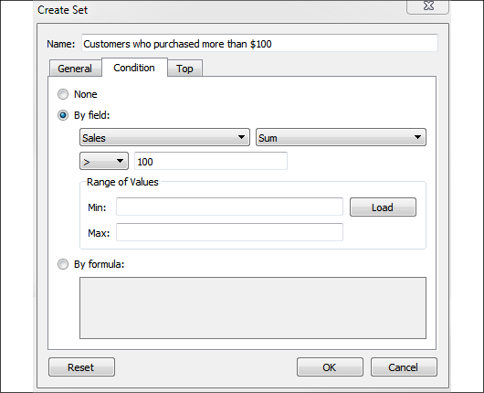

Figure 8.27: A dynamic set based on a condition

In this example, we\'ve created a dynamic set named **Customers who
purchased more than \$100** with a
condition that\'s set by the sum of sales being
greater than **100**. You\'ll notice that there are also options for
computing **By formula** or **Top** N. All of these conditions are going
to be at an aggregate level (across the entire dataset or across the
context if context filters are used) and then each record is evaluated
as to whether it is in or out of the set. In this case, the total sales
for each customer will be computed across the dataset and then each
record will be counted in or out of the set based on whether the
customer for that record has total sales greater than \$100.

A **fixed set** is a list of
values for one or more dimensions. If the values
for a single record match the list defined by the set, then the record
is in the set, and out otherwise. For example, you might create another
set based on the **Customer Name **field, this
time with the **General** tab:


Figure 8.28: A static set based on the selection of members

Here, you can select individual values that will define what is in or
out of the set. Note the option to exclude rather than include values.
In this case, we\'ve created a set named **Customers with first name of
Aaron**. Any records that have a **Customer Name** value that matches
one of the **6** values we selected will be in the set. All others will
be out. Because this is a fixed set, the values
are not ever calculated or recalculated. If
records with a customer named Aaron Burr show up
in the dataset next week, they will still be out of the set.

As we\'ll see in the following example, set actions operate on fixed
sets.

### A set action example

You\'ll find an example of a set action in the
`Chapter 08 Complete.twbx` workbook in the
dashboard named
`Sales by Region and Category (set actions)`,
which looks like this:

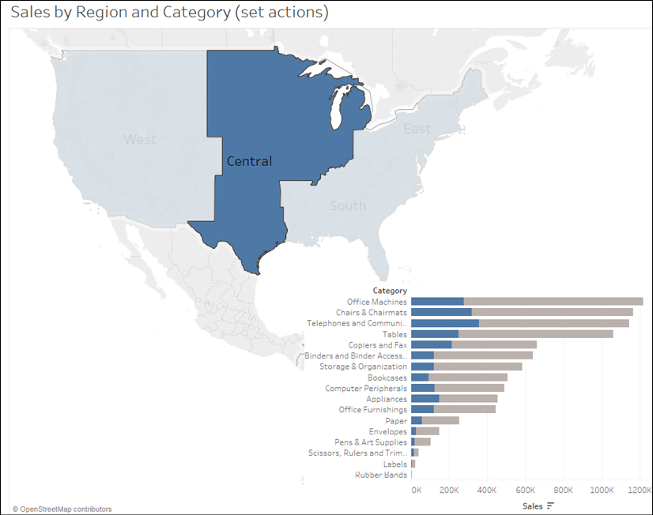

Figure 8.29: The set action allows brushing: highlighting the portion of
the bars that belong to the selection

The dashboard consists of two views: a map and a bar chart. Selecting a
region on the map triggers a set action that
updates the bar chart. A filter action would filter the bar chart,
causing the length of each bar to only show the value for the selected
region. Here, however, the set action is used to show the portion of the
overall bar that belongs to that region while still retaining the full
length of the bar for all regions.

To replicate this interactivity, follow these steps:

1.  Use the drop-down menu on the **Region** field under **Dimensions**
    on the data pane to select **Create** \| **Set**. Name the set
    **Region Set**.

2.  In the resulting **Create Set** dialog, under the **General** tab,
    check one or more values. This creates a fixed set. In this example,
    it does not matter which, if any, values you select because you\'ll
    configure the set action to update the values momentarily.

3.  Create a bar chart of **Sales by Category**.

4.  Drag **Region Set** from **Sets** on the data
    pane and drop it on **Color**:

    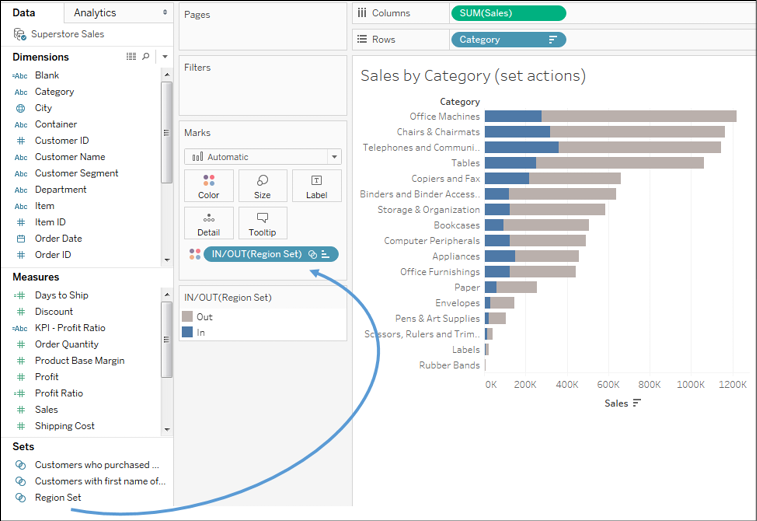

    Figure 8.30: Drag and drop the set on Color to show the difference
    between In and Out of the set

You may use a set on shelves, just as you would any other field. Notice
how the set gives two values, that is, **In** and **Out**, which define
two colors. You may wish to adjust the colors to emphasize **In**.

**Tip:**

You may use sets in calculated fields as well. For example, the code
`[Region Set]` gives a Boolean true/false result
for each record, indicating whether it is in the set.


Conclude the set action example by creating a region map, the dashboard,
and implementing the set action:

1.  Use the drop-down menu on **Region** to select **Geographic Role**
    \| **Create from\...** \| **State**. This tells Tableau to treat
    **Region** as a geographic field based on its relationship with the
    geographic field **State**.
2.  In a new, blank view, double-click the **Region** field to create
    the map view. Now that **Region** is
    recognized as a geographic field, Tableau will generate latitude,
    longitude, and the geometries that are necessary to render the
    shapes.
3.  Add both the map and bar chart views to a single dashboard. You may
    position them however you\'d like.


1.  Add a set action by selecting **Dashboard** \| **Actions** from the
    menu and then **Add Action** \| **Change Set Values\...** in the
    resulting dialog. The resulting dialog has many similar features to
    other action types:

    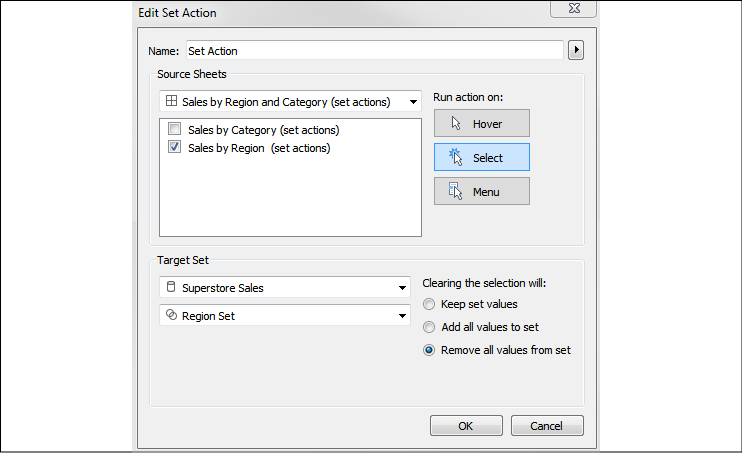

    Figure 8.31: Options for the set action

You\'ll notice options to give the action values
for **Name**; **Run action on:** **Hover**, **Select**, or **Menu**; and
options for **Clearing the selection**. Just like other action types,
you may also specify **Source** sheets that trigger the action. **Target
Set** allows you to specify which data source and which fixed set in
that data source will have values updated based on the action. In this
case, we want to update **Region Set** when a selection is made on the
**Sales by Region (set actions)** view. We\'ll elect to remove all
values from the set when the selection is cleared.

Once you have created the preceding action, your dashboard should
function very similarly to the example that was shown at the beginning
of this section. Selecting a region on the map highlights the portion of
the bars that correspond to that region. This technique
is known as **brushing**, or
**proportional brushing**.

This technique is only one of hundreds of the possible applications of
set actions. Since sets can be used on any shelf and in calculations,
updating the values via set actions opens up
almost limitless possibilities for user
interaction and analytics.

Having looked at the various kinds of actions, let\'s move on to
consider another example of a different kind of dashboard.


#### A regional scorecard dashboard


Now, we\'ll consider another example dashboard that demonstrates
slightly different objectives. Let\'s say everyone
in the organization has agreed upon a KPI of profit ratio. Furthermore,
there is consensus that the cut-off point between an acceptable and poor
profit ratio is 15%, but management would like to have the option of
adjusting the value dynamically to see whether other targets might be
better.

Consider the following dashboard:

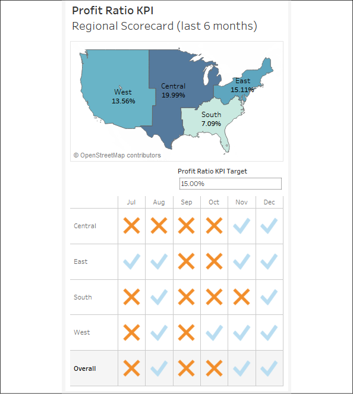

Figure 8.32: A simple profit KPI dashboard

This dashboard allows your audience to very
quickly evaluate the performance of each region over the last six
months. Executive management could very quickly pull this dashboard up
on their mobile devices and take appropriate action as needed.

The dashboard provides interactivity with the KPI target parameter.
Additional drill-down capability into other dashboards or views could be
provided if desired. If this view were published on Tableau Server, it
is not unreasonable to think that regional managers might subscribe to
the view and receive a scheduled email containing an up-to-date image of
this dashboard.

Let\'s consider how to create a similar dashboard:

1.  Create a float type parameter named
    `Profit Ratio KPI Target` set to an initial
    `.15`, formatted as a percentage.

2.  Create a calculation named `Profit Ratio`
    with the code `SUM([Profit]) / SUM([Sales])`.
    This is an aggregate calculation that will divide the profit total
    by the sum of sales at the level of detail defined in the view.

3.  Create a second calculation named
    `KPI - Profit Ratio` with the following code:

    ```
    IF [Profit Ratio] >= [Profit Ratio KPI Target] 
    THEN "Acceptable" 
    ELSE "Poor" 
    END 
    ```


    This code will compare the profit ratio to the parameterized cut-off
    value. Anything equal to or above the cut-off point will get the
    value of `Acceptable`, and everything below
    will get the value of `Poor`.

4.  Create a new sheet named **Region Scorecard**. The view consists of
    `Region` on **Rows**,
    `Order Date` as a discrete date part on
    **Columns**, and the `KPI - Profit Ratio`
    field on both shape and color. You\'ll observe that the shapes have
    been edited to use checkmarks and Xs, and that the color palette is
    using colorblind-safe blue and orange.

5.  Add column grand totals using the **Analytics** pane and format the
    grand totals with a custom label of **Overall**, with bold font and
    light gray shading.

6.  Add **Order Date** as a filter and set it to the top 6 by field
    (**Order Date** as **Min**). This will dynamically filter the view
    to the last six months:

    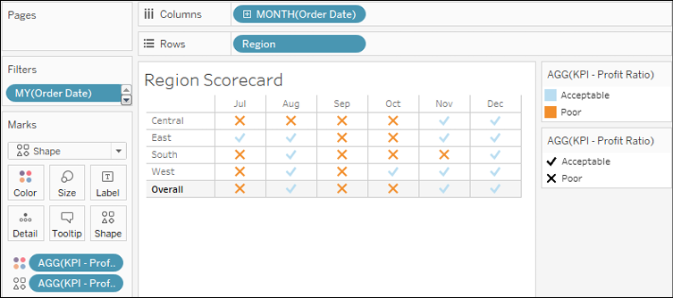

    Figure 8.33: This view defines the Region scorecard showing
    Acceptable versus Poor results per region per month

7.  Create another sheet named **Profit Ratio by Region**.

8.  If you skipped the set actions example, use the drop-down menu on
    `Region` to select **Geographic Role** \|
    **Create from\...** \| **State**. This tells Tableau to treat
    **Region** as a geographic field based on its relationship with the
    geographic field **State**.

9.  Double-click the **Region** field in the data pane. Tableau will
    automatically generate a geographic visualization based on
    **Region**. 

10. Place **Profit Ratio** on **Color** and **Label**. You will also
    want to format **Profit Ratio** as a percentage. You may do so by
    formatting the field in this view specifically, or by setting the
    default number format for the field in the data pane (the latter is
    probably preferred as you will almost always want it to display as a
    percentage).

11. Additionally, add **Region** to **Label**. Rearrange the fields in
    the marks card to reorder the label or click the **Label** shelf to
    edit the label text directly.

12. Apply the same filter to this view as you did to the **Region
    Scorecard** view. You may wish to navigate to the **Region
    Scorecard** sheet and use the drop-down on **Order Date** on the
    **Filters** shelf to apply the existing filter to multiple sheets:

    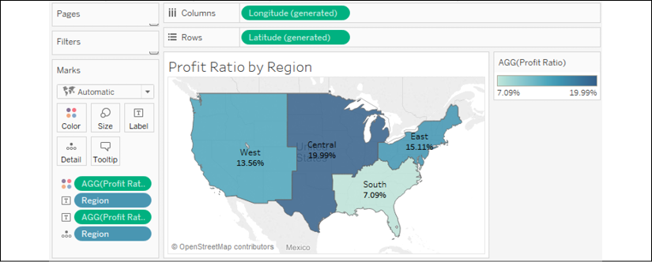

    Figure 8.34: The filled map shows profit by region

Once both views have been created, you can arrange
the views as a dashboard. The example in the
`Chapter 08 Complete` workbook has a phone layout
applied to it as seen here:

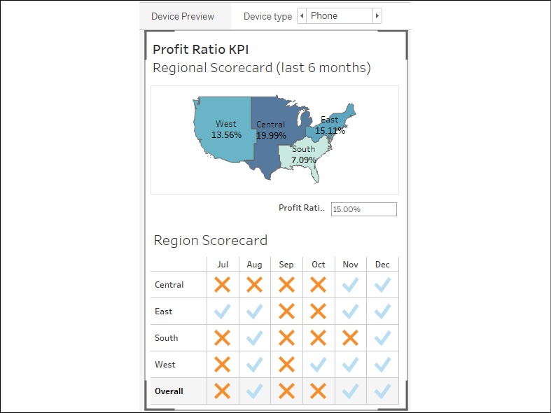

Figure 8.35: A phone layout for the KPI dashboard

Experiment with various layouts and positioning of
the elements.

**Note:**

By default, all objects that are added to the dashboard are tiled.
**Tiled** objects snap in place and appear beneath **floating** objects.
Any object can be added to the dashboard as a floating object by
switching the toggle under **New Objects** in the left window, or by
holding [Shift] while dragging the objects to the
dashboard.

Existing objects can be switched between floating and tiled by holding
[Shift] while moving the object or using the
drop-down caret menu. The drop-down caret menu also gives you options
for adjusting the floating order of objects. Additionally, floating
objects can be resized and positioned with pixel precision by selecting
the floating object and using the positioning and sizing controls in the
lower left.

You can mix tiled and floating elements, but many dashboard authors
prefer to build dashboards that are composed entirely of one or the
other. This ensures consistency between different layouts and sizes of
screens (especially if the dashboard is set to an **Automatic** or
**Range** sizing option).


This example illustrates a dashboard used for quick lookup and rapid
decision making. What if we want to tell a more
complex story and show progression of detail and maybe even present the
data story in a specific order? Let\'s consider how to leverage a
feature of Tableau designed specifically for that purpose.


#### Stories


The **stories** feature allows you to tell a story using interactive
snapshots of dashboards and views. The snapshots
become points in a story. This allows you to
construct a guided narrative or even an entire
presentation.

Let\'s consider an example in which story points might be useful. The
executive managers are pleased with the **Regional Scorecard** dashboard
you developed previously. Now, they want you to make a presentation to
the board and highlight some specific issues for the South region. With
minimal effort, you can take your simple scorecard, add a few additional
views, and tell an entire story:

1.  First, we\'ll build a couple of additional views. Create a simple
    geographic view named
    `ProfitRatio KPI by State`. Make this a
    filled map with the **KPI -- Profit Ratio** field, defining color.

2.  Add **Profit Ratio** to the **Detail** part of the **Marks** card so
    that it is available for later use:

    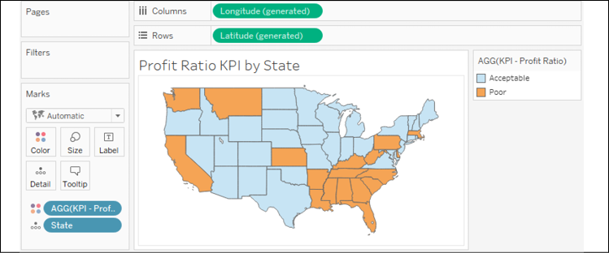

    Figure 8.36: Profit Ratio KPI by State uses color encoding to show
    Acceptable versus Poor

3.  Create one additional view named
    `Profit Ratio by Quarter`. Use **Order Date**
    as a continuous date value on **Columns** and
    **Profit Ratio** on **Rows**.

4.  Set the mark type to bars. Add a reference
    line for the **Profit Ratio KPI Target** parameter value (you can
    right-click the **Profit Ratio** axis and set it to **Add Reference
    Line\...**).

5.  Add **KPI -- Profit Ratio** to **Color**. You may also wish to click
    the **Color** shelf and add a border.

6.  Go ahead and filter the view to the South region and use the
    drop-down menu to apply that filter to the **Profit Ratio KPI by
    State** view as well:

    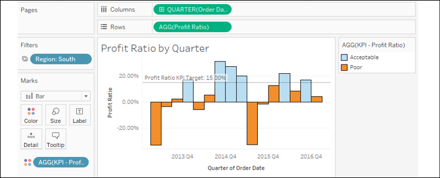

    Figure 8.37: Profit Ratio by Quarter shows whether a given quarter
    was Acceptable or Poor based on the target

7.  Create a new dashboard with the two new
    views arranged in the same way as what\'s
    shown in the following screenshot. Add the **Profit Ratio KPI
    Target** parameter and **Region** filter if they do not show.

8.  Use the drop-down on **Profit Ratio KPI by State** to use that view
    as a filter:

    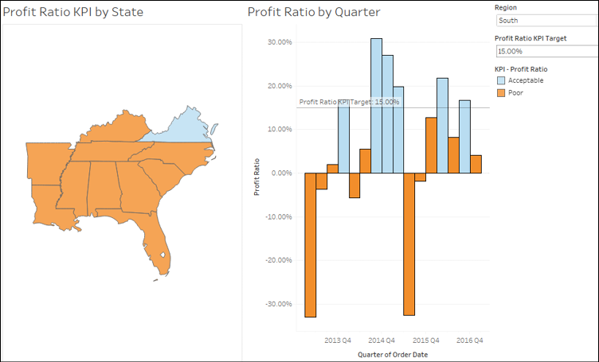

    Figure 8.38: The Profit Ratio KPI by State and by Quarter views on
    the same dashboard

9.  Create a new story by selecting **Story** \| **New Story** from the
    menu, or by using the new story tab at the bottom next to the
    existing sheets:

    **Note:**

    The **Story** interface consists of a sidebar with all visible
    dashboards and views. At the top, you\'ll see the story title, which
    can be edited via a double-click. Each new point in
    the story will appear as a navigation
    box with text that can also be edited.
    Clicking on the box will give you access to the story point, where
    you can then add a single dashboard or view.


    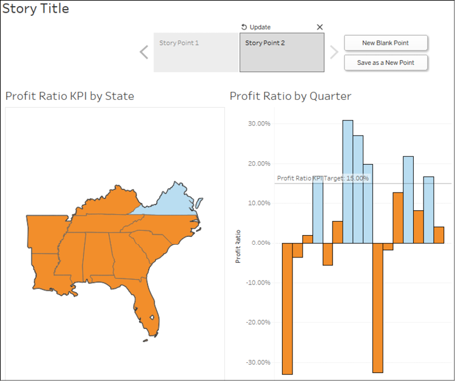

    Figure 8.39: Adding a story point

You can create new story points using the **New
Blank Point** button (for a new story point), the **Duplicate** button
(which will create a duplicate snapshot of the
currently selected story point), or the **Save as New Point** button
(which will capture the current state of the dashboard as a new story
point).

Clicking on a story point navigation box will bring up the snapshot of
the view or dashboard for that story point. You may interact with the
dashboard by doing such things as making selections, changing filters,
changing parameter values, and adding annotations. Changing any aspect
of the dashboard will present you with an option to update the existing
story point to the current state of the dashboard. Alternatively, you
can use the **Revert** button above the navigation box to return to the
original state of the dashboard. Clicking **X** will remove the story
point.

Each story point contains an entirely independent snapshot of a
dashboard. Filter selections, parameter values, selections, and
annotations will be remembered for a particular story point but will
have no impact on other story points or any other sheet in the
dashboard.

You may rearrange story points by dragging and
dropping the navigation boxes.

We\'ll build the story by completing the following steps:

1.  Give the story the title **South Region Analysis**.

2.  Add the **Regional Scorecard** dashboard as the first story point.
    Select the **South** region in the map. Give the story point the
    following text: **The South Region has not performed well the last 6
    months**:

    

    Figure 8.40: The first story point highlights performance in the
    South region

3.  Click the **New Blank Point** button to create a new story point and
    add the **Profit Ratio Analysis** dashboard to the point.

4.  Give this story point a
    caption of **Only one state has met the 15% target overall**.

5.  Right-click **Virginia** on the map and select **Annotate** \|
    **Mark**. Keep the state and profit ratio as part of the annotation:

    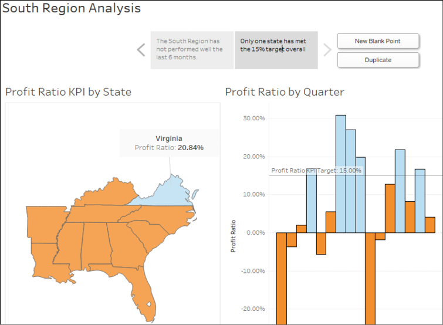

    Figure 8.41: The second story point dives into the details

6.  Click the **Duplicate** button to copy the
    current story point. Give this new story point
    a caption of **3 states would meet a goal of 10%**. Set **Profit
    Ratio KPI Target** to `10.00%` and update the
    point.

7.  Click the **Duplicate** button again and give the newly created
    point a caption of **Certain states have performed well
    historically**.

8.  Right-click the annotation for Virginia, select **Remove** to delete
    it, and then add a similar annotation for **Louisiana**. Then, click
    **Louisiana** to select that state.

9.  Make sure to click the **Update** button to capture the state of the
    dashboard.

In presentation mode, the buttons for adding, duplicating, updating, or
removing story points are not shown. Your final story should look
similar to this:

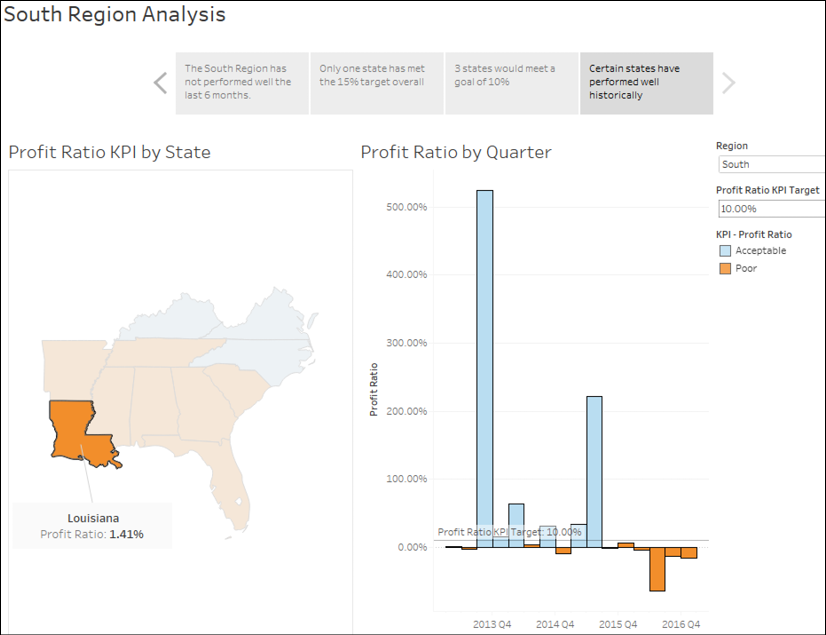

Figure 8.42: This story point highlights quarterly results for a single
state

Take some time to walk through the presentation.
Clicking navigation boxes will show that story
point. You can fully interact with the dashboard in each story point. In
this way, you can answer questions on the fly and dig into details, and
then continue through the story.

**Tip:**

A great way to learn about dashboard techniques (and data visualization
techniques in general) is to subscribe to *Viz of
the Day*
([[http://www.tableau.com/public/community/viz-of-the-day]](http://www.tableau.com/public/community/viz-of-the-day)).
A new visualization, dashboard, or story is featured each day. When you
see a design technique or visualization you want
to understand, you can download the workbook and
explore the various techniques that were used.

#### Summary


When you are ready to share your discovery and analysis, you will likely
use dashboards to relate the story to your audience. The way in which
you tell the story will depend on your objectives, as well as your
audience and the mode of delivery. Using a combination of views,
objects, parameters, filters, and legends, you can create an incredible
framework for telling a data story. Tableau allows you to specifically
design layouts for different devices to ensure that your audience has
the best experience possible. By introducing actions and interactivity,
you can invite your audience to participate in the story. Story points
will allow you to bring together many snapshots of dashboards and views
to craft and present entire narratives.

In the next lab, we\'ll turn our attention to some deeper analysis
involving trends, distributions, forecasting, and clustering.
