Visual Analytics -- Trends, Clustering, Distributions, and Forecasting
======================================================================


This lab will cover the built-in statistical models and analysis,
including the following topics:

-   Trends
-   Clustering
-   Distributions
-   Forecasting

We\'ll look at these concepts in the context of a few examples using
some sample datasets. You can follow and reproduce these examples using
the `Chapter 9` workbook.

When analyzing data that changes over time, understanding the overall
nature of change is vitally important. Seeing and understanding trends
is where we\'ll begin.


#### Trends

`World Population.xlsx` is included in the
`Chapter 09` directory. It contains one record
for each country for each
year from **1960** to **2015**, measuring population. Using this
dataset, let\'s take a look at the historical trends of various
countries. Create a view similar to the one shown in the following
screenshot, which shows the change in population over time for
**Afghanistan** and **Australia**. You\'ll notice that **Country Name**
has been filtered to include only **Afghanistan** and **Australia** and
the field has additionally been added to the **Color** and **Label**
shelves:

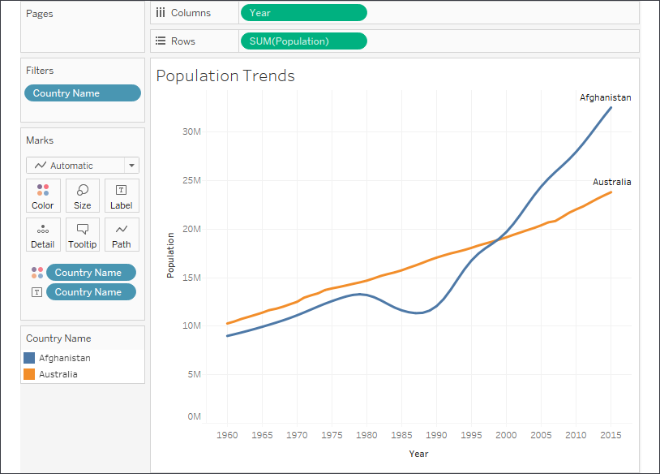

Figure 9.1: Population values for Afghanistan and Australia over time

From this visualization alone, you can make several interesting
observations. The growth of the two countries\' populations was fairly
similar up to **1980**. At that point, the population of Afghanistan
went into decline until **1988**, when it started to increase. At some
point around **1996**, the population of Afghanistan exceeded that of
Australia. The gap has grown wider ever since.

While we have a sense of the two trends, they become even more obvious
when we see the trend lines. Tableau offers several ways of adding trend
lines:

-   From the menu, select **Analysis** \| **Trend Lines** \| **Show
    Trend Lines**.

-   Right-click on an empty area in the pane of the view and select
    **Show Trend Lines**.

-   Click on the **Analytics** tab on the left-hand sidebar to switch to
    the **Analytics** pane. Drag and drop **Trend Line** on the trend
    model of your choice (we\'ll use **Linear** in this
    example and discuss the
    others later in this lab):

    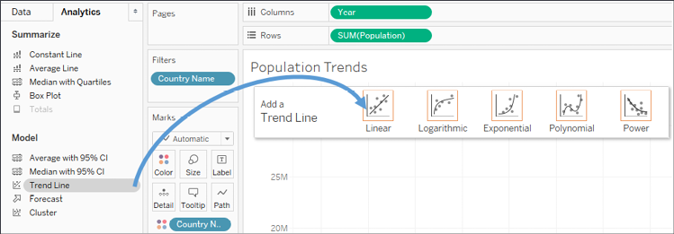

    Figure 9.2: Adding a trend line to a view by dragging and dropping
    from the Analytics pane

Once you\'ve added **Trend Line** to your view, you will see two trend
lines: one for each country. We\'ll look at how we can customize the
display shortly. For now, your view should look like this:


Figure 9.3: Each trend line shows the overall trend for the respective
country

Trends are computed by
Tableau after the query of the data source and are based on various
elements in the view:

-   **The two fields that define X and Y coordinates**: The fields on
    **Rows** and **Columns** that define the *x* and *y* axes describe
    coordinates, allowing Tableau to calculate various trend models. In
    order to show trend lines, you must use a continuous (green) field
    on both **Rows** and **Columns**. The only exception to this rule is
    that you may use a discrete (blue) **date** field. If you use a
    discrete **date** field to define headers, the other field must be a
    continuous field.
-   **Additional fields that create multiple, distinct trend lines**:
    Discrete (blue) fields on the **Rows**, **Columns**, or **Color**
    shelves can be used as factors to split a single trend line into
    multiple, distinct trend lines.
-   **The trend model selected**: We\'ll examine the differences in
    models in the next section, **Trend models**.

Observe in *Figure 9.3* that there are two trend lines. Since **Country
Name** is a discrete (blue) field on **Color**, it defines a trend line
per color by default.

Earlier, we observed that the population of Afghanistan increased and
decreased within various historical periods. Note that the trend lines
are calculated along the entire date range. What if we want to see
different trend lines for those time periods?

One option is to simply select the marks in the view for the time period
of interest. Tableau will, by default, calculate a trend line for the
current selection. Here, for example, the points for Afghanistan from
**1980** to **1988** have been selected and a new trend
is displayed:

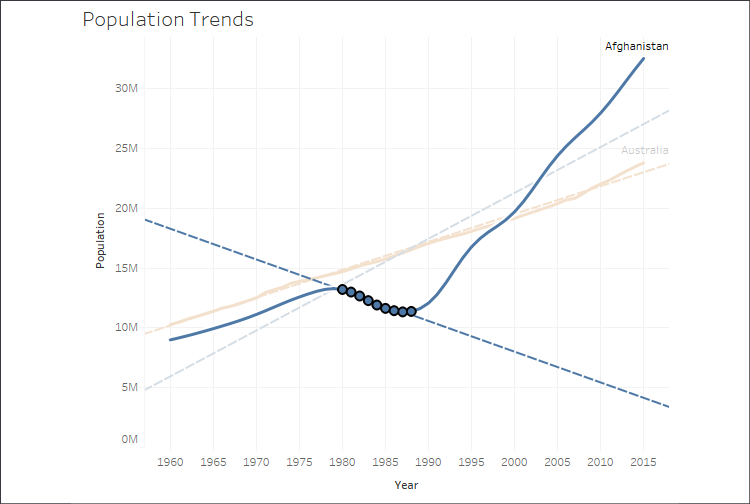

Figure 9.4: The default settings specify that trend lines will be drawn
for selections

Another option is to instruct Tableau to draw distinct trend lines using
a discrete field on **Rows**, **Columns**, or **Color**.

Go ahead and create a calculated field called **Period** that defines
discrete values for the different historical periods using code like
this:

``` 
IF [Year] <= 1979
  THEN "1960 to 1979"
ELSEIF [Year] <= 1988
  THEN "1980 to 1988"
ELSE "1988 to 2015"
END 
```


When you place it on columns, you\'ll get a header for each time period,
which breaks the lines and causes separate trends to be shown for each
time period. You\'ll also observe that Tableau keeps the full date range
in the axis for each period. You can set an independent range by
right-clicking on one of the date axes, selecting **Edit Axis**, and
then checking the option for
**Independent axis range for each row or column**:

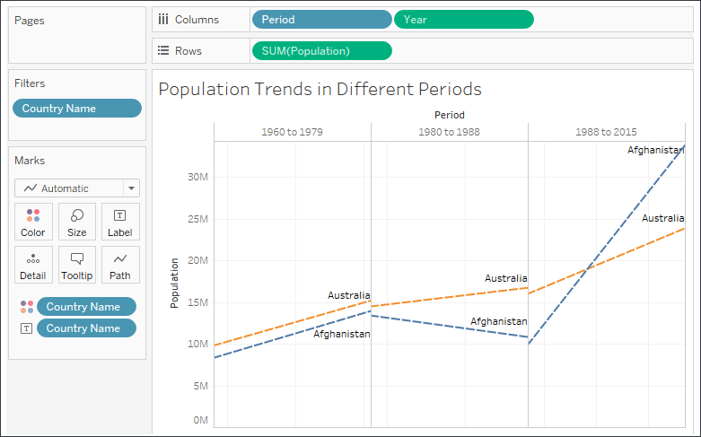

Figure 9.5: Here, the discrete dimension Period creates three separate
time periods and a trend for each one

In this view, transparency has been applied to **Color** to help the
trend lines stand out. Additionally, the axis for **Year** was hidden
(by unchecking the **Show Header** option on the field). Now you can
clearly see the difference in trends for different periods of time.
Australia\'s trends only slightly change in each period. Afghanistan\'s
trends vary considerably.

With an understanding of how to add trend lines to your visualization,
let\'s dive a bit deeper to
understand how to customize the trend lines and model.

Customizing trend lines
-----------------------

Let\'s examine another
example that will allow us to consider various options for trend lines.
Using the **Real Estate** data source, create a view like this one:

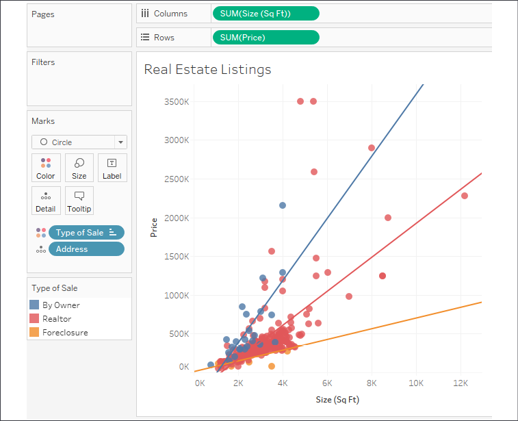

Figure 9.6: Trend lines on a scatterplot are often useful for better
understanding correlation and outliers

Here, we\'ve created a scatterplot with the sum of **Size (Sq Ft)** on
**Columns** to define the *x* axis and the sum of **Price** on **Rows**
to define the *y* axis. **Address** has been added to the **Detail** of
the **Marks** card to define the level of aggregation. So, each mark on
the scatterplot is a distinct address at a location defined by the size
and price. **Type of Sale** has been placed on **Color**. Trend lines
have been shown. As per Tableau\'s default settings, there are three:
one trend line per color. The confidence bands have been hidden.

Assuming a good model, the trend lines demonstrate how much and how
quickly **Price** is expected to rise in correlation with an increase in
**Size** for each type of sale.

**Tip:**

In this dataset, we have two fields, **Address** and **ID**, each of
which defines a unique record. Adding one of those fields to the **Level
of Detail** effectively disaggregates the
data and allows us to plot a
mark for each individual property. Sometimes, you may not have a
dimension in the data that defines uniqueness. In those cases, you can
disaggregate the data by unchecking **Aggregate Measures** from the
**Analysis** menu.

Alternately, you can use the drop-down menu on each of the measure
fields on rows and columns to change them from measures to dimensions
while keeping them continuous. As dimensions, each individual value will
define a mark. Keeping them continuous will retain the axes required for
trend lines.


Let\'s consider some of the options available for trend lines. You can
edit trend lines by using the menu and selecting **Analysis** \| **Trend
Lines** \| **Edit Trend Lines\...** or by right-clicking on a trend line
and then selecting **Edit Trend Lines\...**. When you do, you\'ll see a
dialog box like this:

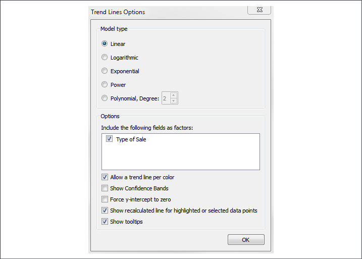

Figure 9.7: Tableau offers many options for configuring trend lines

Here, you have options for
selecting a **Model type**; selecting applicable fields as factors in
the model; allowing discrete colors to define distinct trend lines;
showing **Confidence Bands**; forcing the y-intercept to zero; showing
recalculated trends for selected marks; and showing **tooltips** for the
trend line. We\'ll examine these options in further detail.

**Tip:**

You should only force the y-intercept to zero if you know that it must
be zero. With this data, it is almost certainly not zero (that is, there
are no houses in existence that are 0 square feet that are listed for
\$0).


For now, experiment with the options. Notice how either removing the
**Type of Sale** field as a factor or unchecking the **Allow a trend
line per color** option results in a single trend line.

You can also see the result of excluding a field as a factor in the
following view where **Type of Sale** has been added to **Rows**:

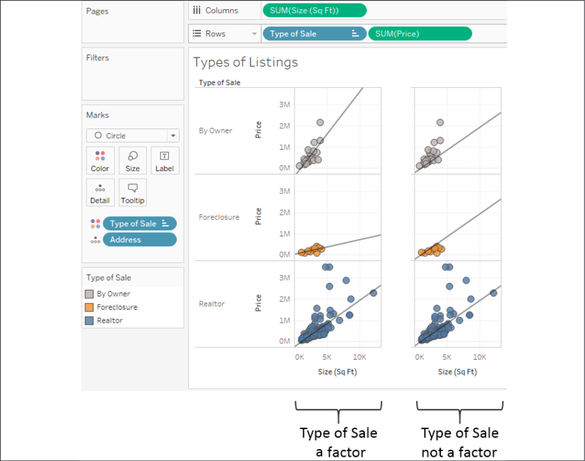

Figure 9.8: Including a field as a factor tells Tableau whether it
contributes to the trend model

As represented in the
left-hand portion of the preceding screenshot, **Type of Sale** is
included as a factor. This results in a distinct trend line for each
type of sale. When **Type of Sale** is excluded as a factor, the same
trend line (which is the overall trend for all types) is drawn three
times. This technique can be quite useful for comparing subsets of data
to the overall trend.

Customizing the trend lines is only one aspect of using trends to
understand the data. Also, of significant
importance is the trend
model itself, which we\'ll consider customizing in the next section.

Trend models
------------

Let\'s return to the original
view and stick with a single
trend line as we consider the trend models that are available in
Tableau. The following models can be selected from the **Trend Line
Options** window.

### Linear

We\'d use a linear model if
we assumed that, as **Size** increases, **Price**
will increase at a constant
rate. No matter how much **Size** increased, we\'d expect **Price** to
increase so that new data points fall close to the straight line:

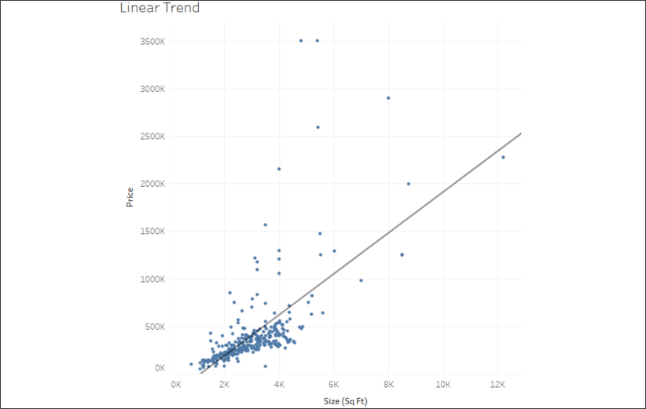

Figure 9.9: Linear trend

### Logarithmic

We\'d employ a logarithmic
model if we expected the
**law of diminishing returns** in effect---that is, the size can only
increase so much before buyers will stop paying much more:

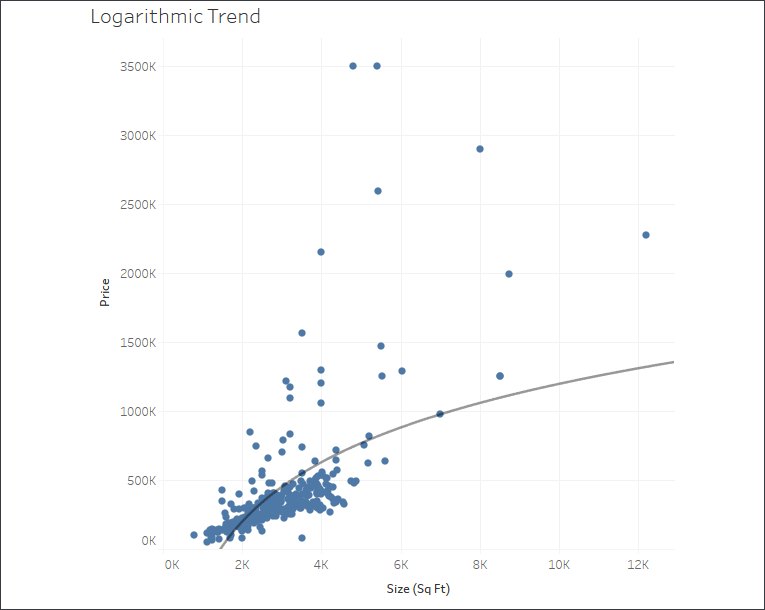

Figure 9.10: Logarithmic trend

### Exponential

We\'d use an exponential
model to test the idea that
each additional increase in
size results in a dramatic (exponential!) increase in price:

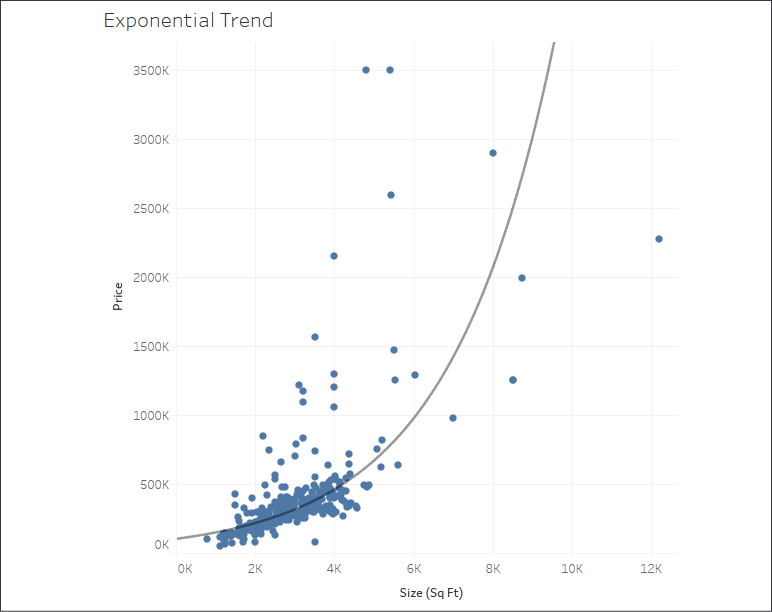

Figure 9.11: Exponential trend

### Power

We\'d employ a power trend
model if we felt the
relationship between size
and price was non-linear and somewhere between a diminishing logarithmic
trend and an explosive exponential trend. The curve would indicate that
the price was a function of the size to a certain power. A power trend
predicts certain events very well, such as the distance covered by the
acceleration of a vehicle:

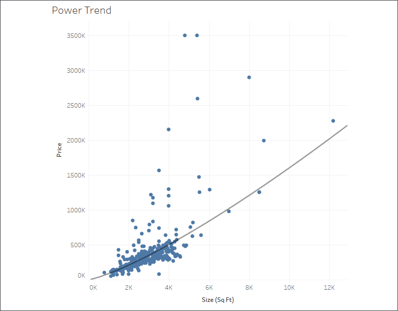

Figure 9.12: Power trend

### Polynomial

We\'d use this model if we
felt the relationship between **Size** and **Price** was
complex and followed more of
an **S**-shaped curve where initially increasing the size dramatically
increased the price but, at some point, the price leveled off. You can
set the degree of the polynomial model anywhere from
`2` to `8`. The trend line
shown here is a 3^rd^ degree polynomial:

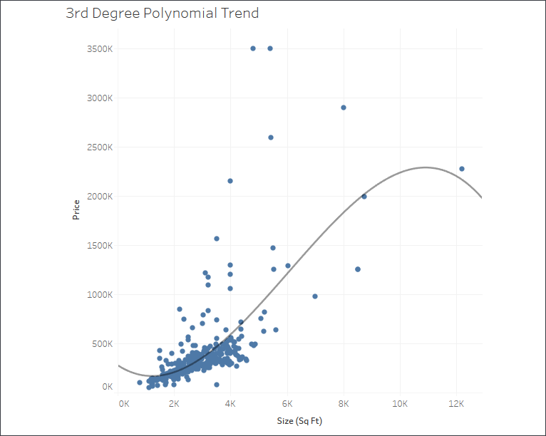

Figure 9.13: 3^rd^ degree polynomial trend

You\'ll want to understand
the basics of the trend models so that you can test and validate your
assumptions of the data. Some of the trend
models are clearly wrong for
our data (though statistically still valid, it is highly unlikely that
prices will exponentially increase). A mixture of common sense along
with an ever-increasing understanding of statistics will help you as you
progress through your journey.

You may also wish to analyze your models for accuracy, and we\'ll turn
there next.

Analyzing trend models
----------------------

It can be useful to observe
trend lines, but often we want to understand whether the trend model
we\'ve selected is statistically meaningful. Fortunately, Tableau gives
us some visibility into the trend models and calculations.

Simply hovering over a single trend line will reveal the formula as well
as the **R-Squared** and **P-value** for that trend line:

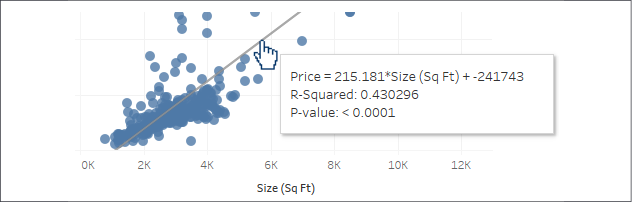

Figure 9.14: Tooltip displayed by hovering over the trend line

**Note:**

A **P-value** is a statistical concept that describes the probability
that the results of assuming no relationship between values (random
chance) are at least as close as the results predicted by the trend
model. A P-value of 5% (.05) would indicate a 5% chance of random chance
describing the relationship between values at least as well as the trend
model. This is why P-values of 5% or less are typically considered to
indicate a significant trend model. A P-value higher than 5% often leads
statisticians to question the correlation described by the trend model.


Additionally, you can see a much more detailed description of the trend
model by selecting **Analysis** \| **Trend Lines** \| **Describe Trend
Model\...** from the menu or by using the similar menu from a
right-click on the view\'s pane. When you view the trend model, you\'ll
see the **Describe Trend Model** window:


Figure 9.15: The Describe Trend Model window

**Tip:**

You can also get a trend model description in the worksheet description,
which is available from the **Worksheet** menu or by pressing *Ctrl* +
*E*. The worksheet description includes quite a bit of other useful
summary information about the current view.


The wealth of statistical
information shown in the window includes a description of the trend
model, the formula, the number of observations, and the **p-value** for
the model as a whole and for each trend line. Note that, in the
screenshot shown previously, the **Type** field was included as a factor
that defined three trend lines. You may find that the p-value is
different for different lines in a visualization (for example, the lines
in *Figure 9.6*). At times, you may even observe that the model is
statistically significant overall even though one or more trend lines
may not be.

**Note:**

Additional summary statistical information can be displayed in Tableau
Desktop for a given view by showing a summary. From the menu, select
**Worksheet** \| **Show Summary**. The information displayed in the
summary can be expanded using the drop-down menu on the **Summary**
card:

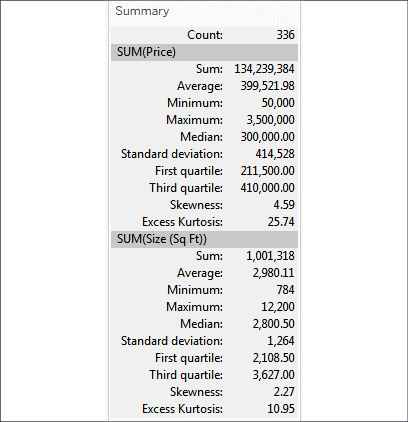

Figure 9.16: Summary information


The wealth of information
available via tooltips and summaries will help you evaluate your trend
models and understand the accuracy and details. But we can even go
further, by exporting and analyzing statistical data for the trend
models. We\'ll consider that next.

### Exporting statistical model details

Tableau also gives
you the ability to export
data, including data related to trend models. This allows you to, more
deeply---and even visually, analyze the trend model itself. Let\'s
analyze the third-degree polynomial trend line of the real estate price
and size scatterplot without any factors. To export data related to the
current view, use the menu to select **Worksheet** \| **Export** \|
**Data**. The data will be exported as a **Microsoft Access Database**
(`.mdb`) file and you\'ll be prompted where to
save the file.

**Note:**

The ability to export data to **Access** is limited to a PC only. If
you\'re using a Mac, you won\'t have the option. You may wish to skim
this section, but don\'t worry that you aren\'t able to replicate the
examples.


On the **Export Data to Access** screen, specify an access table name
and select whether you wish to export data from the entire view or the
current selection. You may also specify that
Tableau should connect to
the data. This will generate the data source and make it
available with the specified
name in the current workbook:

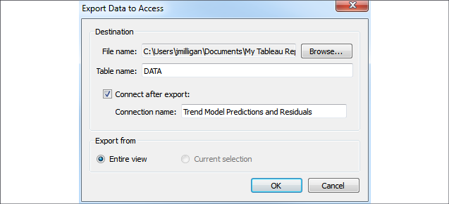

Figure 9.17: The Export Data to Access dialog box

The new data source connection will contain all the fields that were in
the original view as well as additional fields related to the trend
model. This allows us to build a view like the following, using the
residuals and predictions:

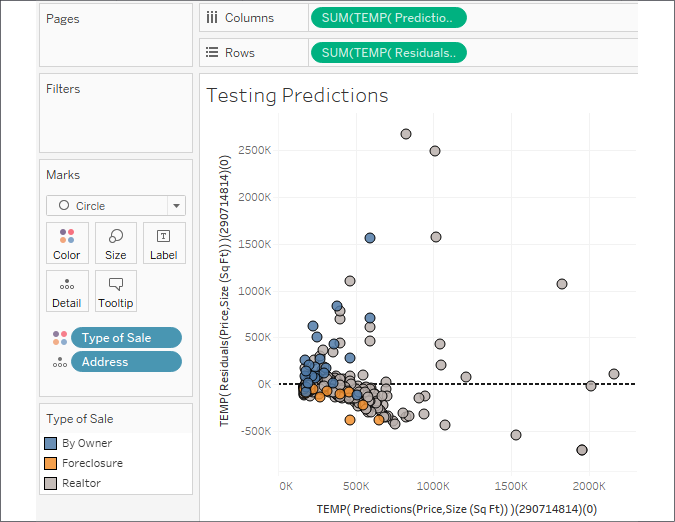

Figure 9.18: A view using residuals and predictions to test the model

A scatterplot of predictions (*x* axis) and residuals (*y* axis) allows
you to visually see how far each mark
was from the location
predicted by the trend line.
It also allows you to see whether residuals are distributed evenly on
either side of zero. An uneven distribution would likely indicate
problems with the trend model.

You can include this new view along with the original on a dashboard to
explore the trend model visually. Use the highlight button on the
toolbar to highlight the **Address** field:

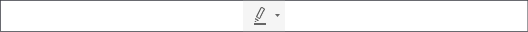

Figure 9.19: The highlight button

With the highlight action defined, selecting marks in one view will
allow you to see them in the other. You could extend this technique to
export multiple trend models and
dashboards to evaluate
several trend models at the
same time:

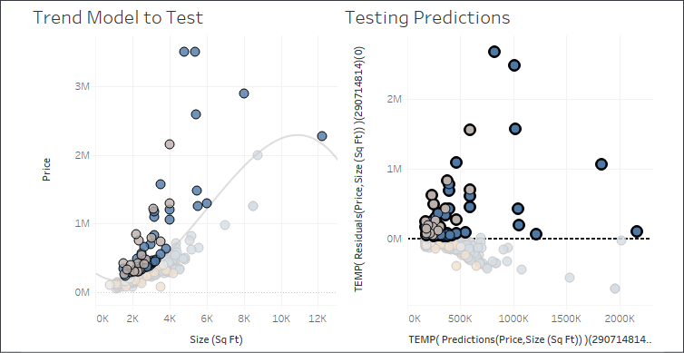

Figure 9.20: Placing the original view alongside the testing view allows
you to see the relationship

### Advanced statistics and more with R and Python

You can achieve even more
sophisticated statistical
analysis leveraging
Tableau\'s ability to
integrate with R or Python.
**R** is an open source
statistical analysis platform and programming
language with which you can
define advanced statistical models. **Python** is a high-level
programming language that has quickly gained a wide following among data
analysts and data scientists for its ease of use. It contains many
capabilities for data cleansing as well as libraries of statistical
functions.

**Note:**

To use R or Python, you\'ll first need to install either an
`R` `server` or
`TabPy` (a
Python API available from
Tableau) and then configure Tableau to use an R server or TabPy. To
learn more about installing and using R Server or TabPy, check out these
resources:

**R**:
[[https://www.tableau.com/solutions/r]](https://www.tableau.com/solutions/r)

**Python**:
[[https://www.tableau.com/about/blog/2017/1/building-advanced-analytics-applications-tabpy-64916]](https://www.tableau.com/about/blog/2017/1/building-advanced-analytics-applications-tabpy-64916)


It\'s beyond the scope of
this book to dive into the
complexities of R and Python, but
having an awareness of the
capability will enable you
to
pursue the topic further.

Next, we\'ll take a look at Tableau\'s capability for identifying
complex relationships within data using clustering.


#### Clustering

Tableau gives you the
ability to quickly perform clustering analysis in your visualizations.
This allows you to find groups, or **clusters**, of individual data
points that are similar based on any number of your choosing. This can
be useful in many different industries and fields of study, as in the
following examples:

-   Marketing may find it useful to determine groups of customers
    related to each other based on spending amounts, frequency of
    purchases, or times and days of orders.
-   Patient care directors in hospitals may benefit from understanding
    groups of patients related to each other based on diagnoses,
    medication, length of stay, and the number of readmissions.
-   Immunologists may search for related strains of bacteria based on
    drug resistance or genetic markers.
-   Renewable energy consultants may like to pinpoint clusters of
    windmills based on energy production and then correlate that with
    geographic location.

**Note:**

Tableau uses a standard **k-means clustering** algorithm that will yield
consistent results every
time the view is rendered. Tableau will automatically assign the number
of clusters (k), but you have the option of adjusting the value as well
as assigning any number of variables.


As we consider clustering, we\'ll turn once again to the real estate
data to see whether we can find groupings of related houses on the
market and then determine whether there\'s any geographic pattern based
on the clusters we find.

Although you can add clusters to any visualization, we\'ll start with a
scatterplot, because it already allows us to see the relationship
between two variables. That will give us some insight into how
clustering works, and then we can add additional variables to see how
the clusters are redefined.

Beginning with the basic scatterplot of **Address** by **Size** and
**Price**, switch to the **Analytics**
pane and drag **Cluster** to
the view:

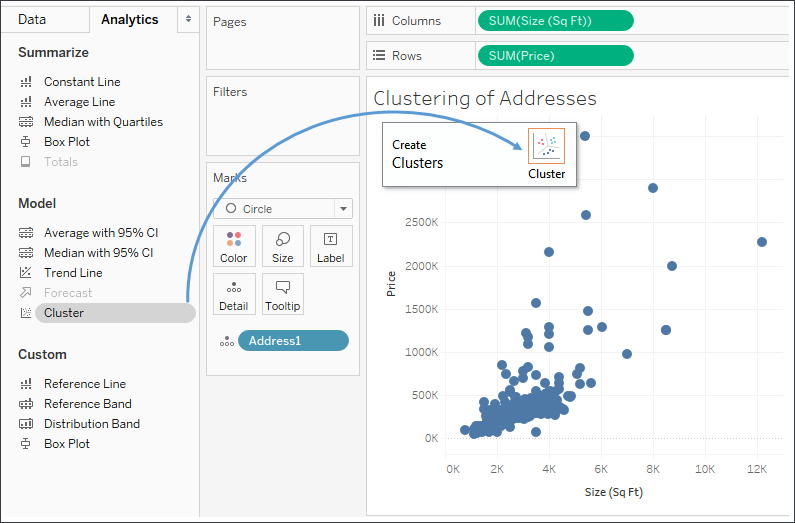

Figure 9.21: Adding clusters by dragging and dropping from the Analytics
pane

When you drop **Cluster** onto the view, Tableau will generate a new
**Clusters** field (automatically placed on **Color** here) and will
display a **Clusters** window containing the fields used as
**Variables** and an option to change the **Number of Clusters**.
**Variables** will contain the measures already in the view by default:

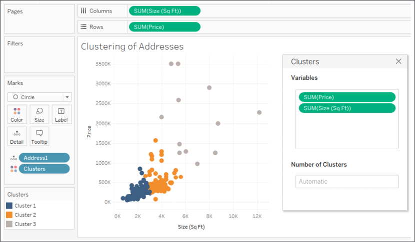

Figure 9.22: Clusters of individual addresses based on Price and Size

**Variables** are all the
factors that the clustering algorithm uses to determine related data
points. **Number of Clusters** determines into how many groups the data
is partitioned. In the preceding view, you\'ll observe three clusters of
houses:

-   Those with a low price and a smaller size (blue)
-   Those with an average price and size (orange)
-   Those with a high price and a large size (gray)

Because the two variables used for the clusters are the same as those
used for the scatterplot, it\'s relatively easy to see the boundaries of
the clusters (you can imagine a couple of diagonal lines partitioning
the data).

You can drag and drop nearly any field into and out of the **Variables**
section (from the data pane or the view) to add and remove variables.
The clusters will automatically update as you do so. Experiment by
adding **Bedrooms** to the **Variables** list and observe that there\'s
now some overlap between **Cluster 1** and **Cluster 2** because some
larger homes only have two or three bedrooms while some smaller homes
might have four or five. The number of bedrooms now helps define the
clusters. Remove **Bedrooms** and note that the clusters are immediately
updated again.

Once you have meaningful clusters, you can materialize the clusters as
groups in the data source by
dragging them from the view and dropping them into the **Data** pane:

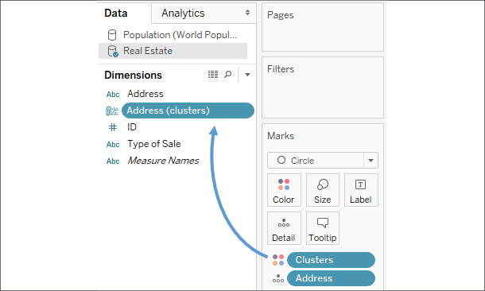

Figure 9.23: Materializing a cluster by dragging the Clusters field from
the view to the Data pane

The cluster group will not be recalculated at render time. To
recalculate the cluster group, use the dropdown on the field in the
**Data** pane and select **Refit**.

Using a cluster group allows you to accomplish a lot, including the
following:

-   Cluster groups can be used across multiple visualizations and can be
    used in actions on dashboards.
-   Cluster groups can be edited, and individual members moved between
    groups if desired.
-   Cluster group names can be aliased, allowing more descriptive names
    than **Cluster 1** and **Cluster 2**.
-   Cluster groups can be used in calculated fields, while clusters
    can\'t.

In the following example, a map of the properties has been color-coded
by the **Address (clusters)** group in the previous view to help us to
see whether there\'s any geographic correlation to the clusters based on
price and size. While the clusters could have been created
directly in this
visualization, the group has some of the advantages mentioned:

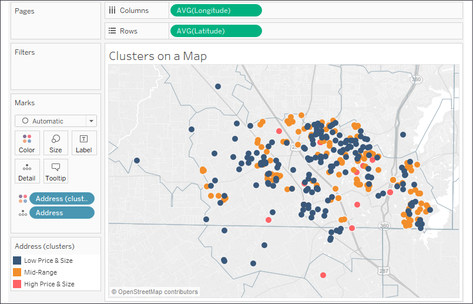

Figure 9.24: This view uses the clusters we identified to additionally
understand any geospatial relationships

In the view here, each original cluster is now a group that has been
aliased to give a better description of the cluster. You can use the
drop-down menu for the group field in the data pane or, alternately,
right-click the item in the color legend to edit aliases.

**Tip:**

There are a lot of options for editing how maps appear. You can adjust
the layers that are shown on maps to help to provide additional context
for the data you are plotting. From the top menu, select **Maps** \|
**Map Layers**. The layer options will show in the left-hand sidebar.
The preceding map has had **Streets**, **Highways**, **County Borders**,
and **Zip Code Borders** enabled to give each address a more precise
context of location. The layers that are available to select will depend
on the zoom level of the map.


In looking at the previous
view, you do indeed find neighborhoods that are almost exclusively **Low
Price & Size** (**Cluster 1**) and others that are almost exclusively
**Mid-Range** (**Cluster 2**). Consider how a real-estate investor might
use such a visualization to look for a low-priced house in a mid-range
neighborhood.


#### Distributions

Analyzing distributions can
be quite useful. We\'ve already seen that certain calculations are
available for determining statistical information such as averages,
percentiles, and standard deviations. Tableau also makes it easy to
quickly visualize various distributions, including confidence intervals,
percentages, percentiles, quantiles, and standard deviations.

You may add any of these visual analytic features using the
**Analytics** pane (alternately, you can right-click an axis and select
**Add Reference Line**). Just like reference lines and bands,
distribution analytics can be applied within the scope of a table, pane,
or cell. When you drag and drop the desired visual analytic, you\'ll
have options for selecting the scope and the axis. In the following
example, we\'ve dragged and dropped **Distribution Band** from the
**Analytics** pane onto the scope of **Pane** for the axis defined by
`Sum(Price)`:

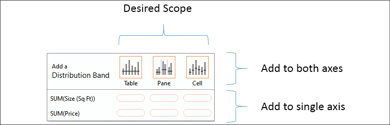

Figure 9.25: Defining the scope and axis as you add reference lines and
distributions from the Analytics pane

Once you\'ve selected the scope and axis, you\'ll be given options to
change settings. You may also edit lines, bands, distributions, and box
plots by right-clicking the analytic feature in the view
or by right-clicking the
axis or the reference lines themselves.

As an example, let\'s take the scatterplot of addresses by price and
size with **Type of Sale** on **Columns** in addition to color:

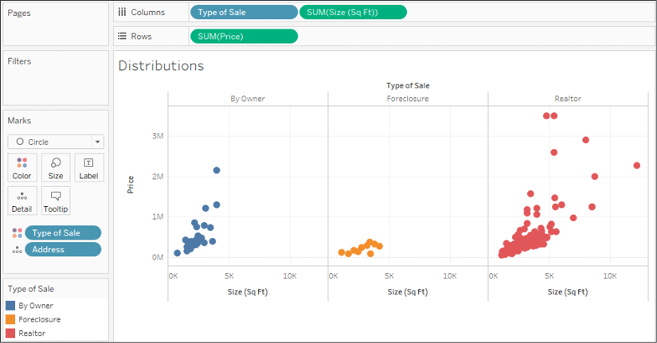

Figure 9.26: A scatterplot divided into three columns

Next, we drag and drop the **Distribution** band from the **Analytics**
pane onto **Pane** only for the axis defined by **Price**. This brings
up a dialog box to set the options:

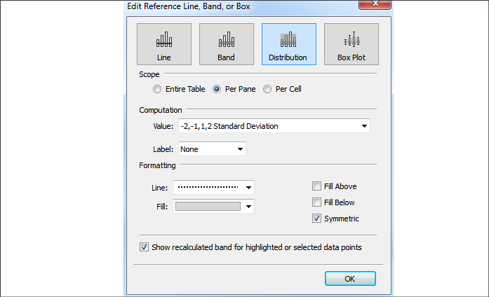

Figure 9.27: The dialog box for adding or editing lines, bands,
distributions, or box plots

Each specific
**Distribution** option specified in the **Value** drop-down menu under
**Computation** has unique settings. **Confidence Interval**, for
example, allows you to
specify a percent value for the interval. **Standard Deviation** allows
you to enter a comma-delimited list of values that describe how many
standard deviations and at what intervals. The preceding settings
reflect specifying standard deviations of **-2**, **-1**, **1**, and
**2**. After adjusting the label and formatting as shown in the
preceding screenshot, you should see results like this:

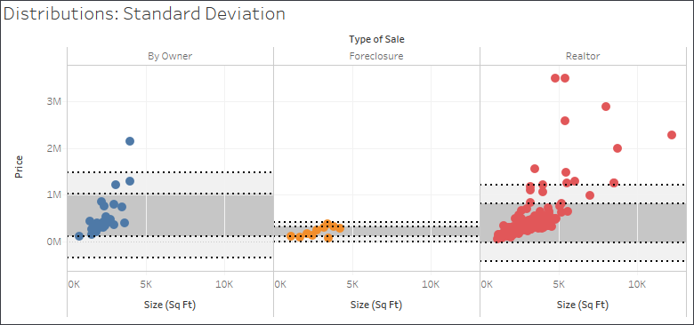

Figure 9.28: Two standard deviations of Price for each Type of Sale

Since you applied the standard deviations per pane, you get different
bands for each type of sale. Each
axis can support multiple
distributions, reference lines, and bands. You could, for example, add
an average line in the preceding view to help a viewer to understand the
center of the standard deviations.

On a scatterplot, using a distribution for each axis can yield a very
useful way to analyze outliers. Showing a single standard deviation for
both **Area** and **Price** allows you to easily see properties that
fall within norms for both, one, or neither (you might consider
purchasing a house that was on the high end of size but within normal
price limits!):

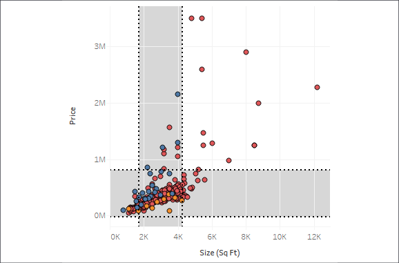

Figure 9.29: One standard deviation for both Price and Size of all
houses


#### Forecasting

As we\'ve seen, trend models
make predictions. Given a good model, you expect additional data to
follow the trend. When the trend is over time, you can get some idea of
where future values may fall. However, predicting future values often
requires a different type of model. Factors such as seasonality can make
a difference not predicted by a trend alone. Tableau includes built-in
forecasting models that can be used to predict and visualize future
values.

To use forecasting, you\'ll need a view that includes a date field or
enough date parts for Tableau to reconstruct a date (for example, a
**Year** and a **Month** field). Tableau also allows forecasting based
on integers instead of dates. You may drag and drop a forecast from the
**Analytics** pane, select **Analytics** \| **Forecast** \| **Show
Forecast** from the menu, or right-click on the view\'s pane and select
the option from the context menu.

Here, for example, is the view of the population growth over time of
Afghanistan and Australia with forecasts shown:

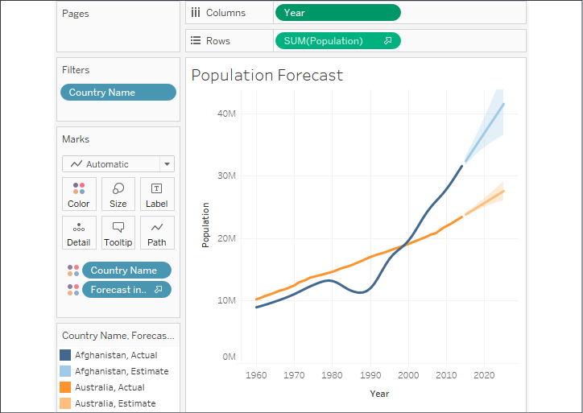

Figure 9.30: A forecast of the population for both Afghanistan and
Australia

Note that, when you show the
forecast, Tableau adds a forecast icon to the
`SUM(Population)` field on **Rows** to indicate
that the measure is being forecast. Additionally, Tableau adds a new
special **Forecast indicator** field to **Color** so that forecast
values are differentiated from actual values in the view.

**Tip:**

You can move the **Forecast indicator** field or even copy it (hold the
*Ctrl* key while dragging and dropping) to other shelves to further
customize your view.


When you edit the forecast by selecting **Analytics** \| **Forecast** \|
**Forecast Options\...** from the menu or use the right-click context
menu on the view, you\'ll be presented with various options for
customizing the trend model, like this:

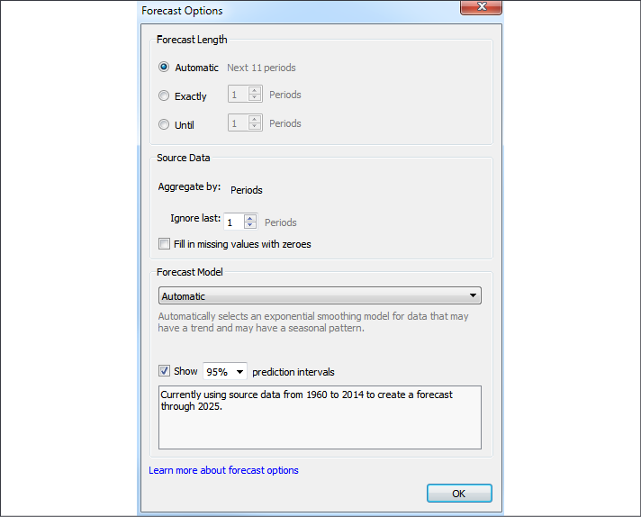

Figure 9.31: The Forecast Options dialog box

Here, you have options to
set the length of the forecast, determine aggregations, customize the
model, and set whether you wish to show prediction intervals. The
forecast length is set to **Automatic** by default, but you can extend
the forecast by a custom value.

The options under **Source Data** allow you to optionally specify a
different grain of data for the model. For example, your view might show
a measure by year, but you could allow Tableau to query the source data
to retrieve values by month and use the finer grain to potentially
achieve better forecasting results.

**Note:**

Tableau\'s ability to separately query the data source to obtain data at
a finer grain for more precise results works well with relational data
sources. However, **Online Analytical Processing** (**OLAP**) data
sources aren\'t compatible with
this approach, which is one
reason why forecasting isn\'t available when working with cubes.


By default, the last value is excluded from the model. This is useful
when you\'re working with data where the most recent time period is
incomplete. For example, when records are added daily, the last
(current) month isn\'t complete until the final records are added on the
last day of the month. Prior to that last day, the incomplete time
period might skew the model if it\'s not ignored.

The model itself can be set to automatic with or without seasonality, or
can be customized to set options for seasonality and trend. To
understand the options, consider the following
view of **Sales** by
**Month** from the `Superstore` sample data:

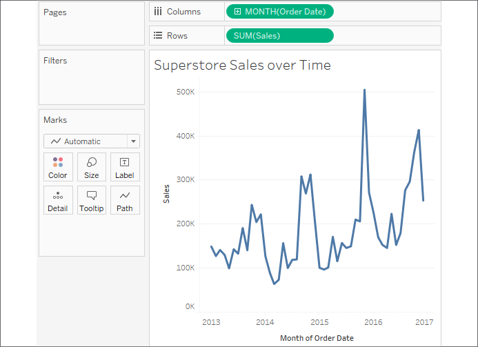

Figure 9.32: This time series shows a cyclical or seasonal pattern

The data displays a distinct cyclical or seasonal pattern. This is very
typical for retail sales and other types of data. The following are the
results of selecting various custom options:

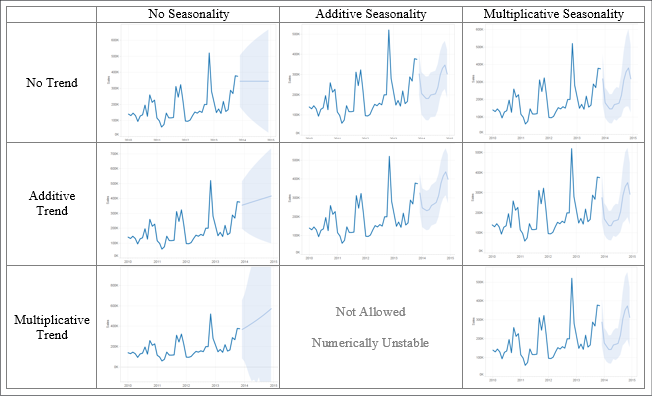

Figure 9.33: Selecting various forecast models will yield different
results

Examining the differences
above will help you understand the differences in the options. For
example, note that no seasonality results in a straight line that does
not fluctuate with seasons. Multiplicative trends result in sharper
inclines and decreases, while multiplicative seasonality results in
sharper variations.

Much like trends, forecast models and summary information can be
accessed using the menu. Selecting **Analytics** \| **Forecast** \|
**Describe Forecast** will display a window with tabs for both the
summary and details concerning the model:

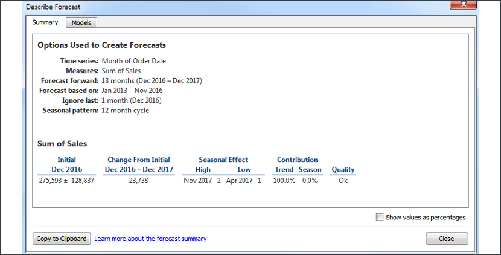

Figure 9.34: Tableau describes the forecast model

Clicking the **Learn more about the forecast summary** link at the
bottom of the window will give
you much more information on
the forecast models used in Tableau.

**Note:**

Forecast models are only enabled given a certain set of conditions. If
the option is disabled, ensure that you\'re connected to a relational
database and not OLAP, that you\'re not using table calculations, and
that you have at least five data points.


#### Summary

Tableau provides an extensive set of features for adding value to your
analysis. Trend lines allow you to more precisely identify outliers,
determine which values fall within the predictions of certain models,
and even make predictions of where measurements are expected. Tableau
gives extensive visibility into the trend models and even allows you to
export data containing trend model predictions and residuals. Clusters
enable you to find groups of related data points based on various
factors. Distributions are useful for understanding a spread of values
across a dataset. Forecasting allows a complex model of trends and
seasonality to predict future results. Having a good understanding of
these tools will give you the ability to clarify and validate your
initial visual analyses.

Next, we\'ll consider some advanced visualization types that will expand
the horizons of what you are able to accomplish with Tableau and the way
in which you communicate data to others!
